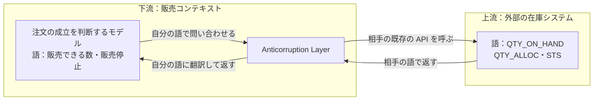
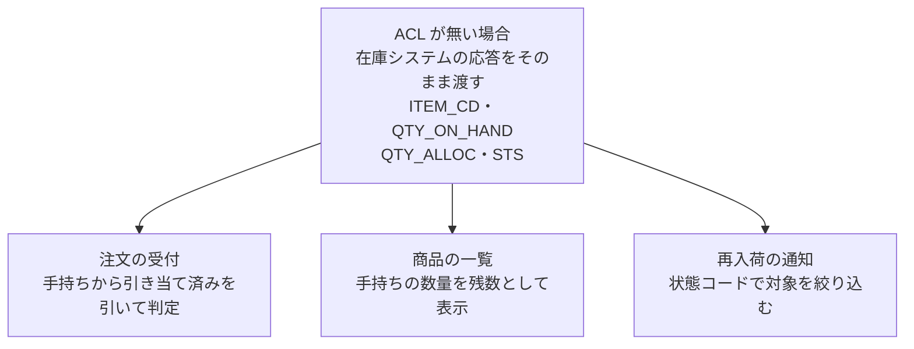
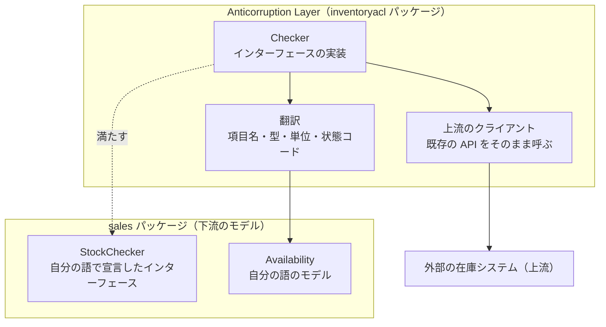

Anticorruption Layer（腐敗防止層。Anti-Corruption Layer とも綴り、ACL と略す）とは、他のシステムを利用する下流が自分の責任で置く隔離層で、相手のモデルを自分のドメインモデルの語に翻訳します。[Evans 氏の DDD Reference](https://www.domainlanguage.com/wp-content/uploads/2016/05/DDD_Reference_2015-03.pdf) は「下流のクライアントとして、上流のシステムの機能を自分自身のドメインモデルの言葉で自分のシステムに提供する隔離層を作れ」と述べ、ACL は相手の既存のインターフェース越しに通信するため、相手のシステムへの変更をほとんど、あるいは全く必要としないとしています。

販売コンテキストが外部の在庫システムを利用する場面では、ACL の位置と語の切り替わりは以下の通りです。



上記の図で相手の語が現れるのは、ACL と在庫システムを結ぶ 2 本の矢印だけです。販売コンテキストのモデルは自分の語だけで問い合わせと応答を受け取り、正常に終わった問い合わせで `QTY_ON_HAND` のような相手の項目名を目にする事はありません。

---

### 前提と説明の範囲

ここでの「語」とは、項目名だけでなく、その仕事の中で通じる言葉の集まりを指します。販売が使う語は「販売できる数」や「販売停止」で、在庫システムが使う語は `QTY_ON_HAND` や `STS` です。同じ在庫を指していても、名前も、数え方も、状態の表し方も違います。

上流と下流は、開発するチームの間の関係を表す語です。DDD Reference は、上流の行動が下流のプロジェクトの成否に影響する一方、下流の行動は上流のプロジェクトに大きくは影響しない関係だと定義しています。相手が [Bounded Context](../bounded-context/)（1 つのモデルとその語が一貫して通用する範囲）として設計されているとは限らず、その区切りを持たないレガシーシステムも上流になります。

Microsoft の [Azure Architecture Center](https://learn.microsoft.com/en-us/azure/architecture/patterns/anti-corruption-layer) では、ACL は「同じ意味論を共有しない異なるサブシステムの間に facade または adapter の層を実装する」パターンとして説明されています。意味論は、同じ名前や値が何を指すのかについて、それぞれのシステムが持っている取り決めです。facade と adapter は書籍『デザインパターン』にも同じ名前のパターンがある語で、[Adapter](../adapter/) のノートで扱うコンテナのパターンとは別の文脈です。

---

### なぜ Anticorruption Layer が必要なのか

外部のシステムを呼ぶだけなら、相手が配布しているクライアントをそのまま使う方法が最も短く済みます。翻訳を書く手間も、間に挟まる処理も増えません。問題は、相手の応答の形が下流のコードのどこまで広がるかです。

例に使う在庫システムの応答には、`ITEM_CD`（商品コード）、`QTY_ON_HAND`（手持ちの数量）、`QTY_ALLOC`（引き当て済みの数量）、`STS`（商品の状態コード）が並んでいます。引き当て済みというのは、既に別の注文に割り当ててあり、手元にあっても他には売れない数量です。この応答の型を下流のコードにそのまま渡した場合は以下の通りです。



上記の図の 3 箇所は、どれも在庫システムの語で書かれています。「販売できる数」という販売の語はどこにも現れず、代わりに手持ちから引き当て済みを引く計算が 3 箇所に複製されます。状態コードの解釈も同じで、どの値が販売停止を意味するのかを 3 箇所が個別に知っている状態になります。

Evans 氏は、上流のシステムとの大きなインターフェースが下流のモデルの意図をやがて完全に圧倒し、その場しのぎの形で相手のモデルに似せてモデルを変更させてしまうと書いています。同じ箇所では、レガシーシステムのモデルは概して弱く、明確に設計されていても今のプロジェクトの必要に合うとは限らないので、上流のモデルに合わせる事は現実的でなくなるとされています。それでも統合が下流にとって大きな価値を持つ事や欠かせない事があり、その時に翻訳を置く選択が残ります。

翻訳の複雑さは、相手との関係で変わります。DDD Reference によれば、設計の良い Bounded Context どうしを協力的なチームの間で繋ぐなら、翻訳層は単純にも優雅にもなり得ます。しかし、Shared Kernel・Partnership・Customer/Supplier（[Bounded Context のノート](../bounded-context/)で並べた、チームどうしが計画や変更を調整する関係）を成り立たせるだけの統制や意思疎通が無いと、翻訳はより複雑になり、より防御的な調子を帯びます。

翻訳を作らない選択もあります。DDD Reference の Conformist は、上流チームのモデルに徹底して従う事で、Bounded Context の間の翻訳の複雑さをなくす選択です。同書は、下流の設計の自由が狭まり、おそらく理想的なモデルにもならない一方で、統合は大きく単純になるとしています。前提に置いているのは、上流に下流の要求に応える動機が無く、下流のチームが無力な状況です。

同書の 2 つの説明を並べると、上流を動かせない下流の選び方は次のように読めます。販売のコードを在庫システムの語で書く窮屈さを受け入れて統合の単純さを取るなら Conformist です。在庫システムのモデルが販売の必要に合わず、合わせる事が現実的でないなら ACL を置きます。同書では、上流が多数の相手に向けて統合用のプロトコルを公開する Open-host Service を選んだ場合も、その利用者のうち、ある者は Conformist になり、ある者は ACL を作るだろうとされています。

---

### ACL の中に何を置くか

ACL の中身は、ここでは 3 つの責任に分けて見ます。下流が宣言したインターフェースを満たす `Checker`、2 つのモデルを翻訳する部分、上流の既存の API（Application Programming Interface）をそのまま呼ぶクライアントです。この 3 分割は説明のための整理で、DDD Reference が規定している構造ではありません。

上に挙げた順で、3 つと下流のモデルの関係は以下の通りです。最初の図では、ACL を下流のチームが持つ部品として販売コンテキストの枠に入れました。コードではドメインモデルの `sales` とは別のパッケージに置くので、この図では枠を分けます。図の矢印は、呼び出しの流れではなく、コードがどちらを参照するかの向きです。



上記の図で在庫システムを知っているのは ACL の枠の中だけで、`sales` から ACL を参照する矢印はありません。この向きは、下流のパッケージが上流の型を import しているかで、ある程度まで確認できます。しかし、import が 1 本も無くても語は入り込みます。次の `Availability` は在庫システムのパッケージを参照していません。

```go
// Package sales の中に、在庫システムの語が残った例です。
package sales

// Availability は在庫の状態を持ちます。
type Availability struct {
	SKU    string
	OnHand int    // QTY_ON_HAND をそのまま持つ
	Status string // STS の値。"1" が通常、"9" が販売停止
}
```

`Status` に入っているのは在庫システムの状態コードで、`"9"` が販売停止だという知識は販売コンテキストの各所に散ります。`OnHand` も同じで、引き当て済みを引く計算が呼び出す場所に残ります。侵入は型ではなく値と概念で起きるため、import の一覧だけでなくモデルの定義も読む事になります。

---

### 下流が語を決める

翻訳の行き先になるモデルは、上流を見ずに決めます。注文の成立を判断するために販売コンテキストが知りたいのは、今すぐ売れる数と、その商品の販売を止めているかどうかの 2 つです。

```go
// Package sales は販売コンテキストで、注文が成立するまでを扱います。
package sales

import "context"

// Availability は、在庫について販売コンテキストが知りたい事の全てです。
type Availability struct {
	SKU       string // Stock Keeping Unit。在庫を数える単位に付けた商品の識別子
	Sellable  int    // 今すぐ売れる数
	Suspended bool   // 販売を止めている商品かどうか
}

// StockChecker は在庫の問い合わせ先です。実装は sales パッケージの外に置きます。
type StockChecker interface {
	Check(ctx context.Context, sku string) (Availability, error)
}
```

`StockChecker` は `sales` が自分の語で宣言したインターフェースで、後で示す `inventoryacl` の `Checker` がこれを実装します。呼び出す `sales` がインターフェースを持つので、参照は `inventoryacl` から `sales` に向き、この向きの変え方を依存性逆転と呼びます。`sales` は在庫システムのパッケージを import せず、後から相手の型に手が伸びる経路も作りにくくなります。言語が禁じるわけではないので、確実に止めたいなら import を制限する lint を入れる事になります。

同じ向きの変え方は [Repository](../repository/) でも使うので、Repository も外部との境界に見えるかもしれません。しかし、Repository が隠すのは自分の [Aggregate](../value-object-entity-aggregate/)（まとめて一貫性を保つオブジェクトの集まり）の永続化で、扱うモデルは最初から自分のものです。ACL は相手のモデルを入口で自分の語に変える所に意味があり、守っている対象が違います。

---

### 翻訳で何をするか

翻訳は、項目名の写し替えだけでは終わりません。例に使った在庫システムの応答について、下流での扱いは以下の通りです。

| 上流の項目 | 型と値 | 下流での扱い |
| --- | --- | --- |
| `ITEM_CD` | 商品コードの文字列 | この例では `SKU` と同じ体系と見なし、要求した `SKU` と突き合わせる。体系が違う場合は対応付けも ACL で行う |
| `QTY_ON_HAND` | 数量を表す文字列 | 数値に変換し、引き当て済みを引いて `Sellable` を求める |
| `QTY_ALLOC` | 数量を表す文字列 | `Sellable` の計算にだけ使い、単独では下流に渡さない |
| `STS` | 状態コードの文字列 | `1` は通常、`9` は `Suspended`。未知の値はエラーにする |

翻訳を Go で書くと次のようになります。

```go
// Package inventoryacl は、外部の在庫システムと販売コンテキストの間の翻訳だけを担当します。
package inventoryacl

import (
	"context"
	"fmt"
	"strconv"

	"example.com/shop/sales"
)

// StockLevelResponse は在庫システムが返す構造です。項目名も型も相手の都合で決まっています。
type StockLevelResponse struct {
	ItemCD    string
	QtyOnHand string
	QtyAlloc  string
	Sts       string
}

// legacyClient は在庫システムの既存の API を呼びます。実装は省略します。
type legacyClient interface {
	GetStockLevel(ctx context.Context, itemCode string) (StockLevelResponse, error)
}

// Checker は sales.StockChecker を満たします。
type Checker struct {
	client legacyClient
}

// NewChecker は Checker を作ります。
func NewChecker(c legacyClient) *Checker {
	return &Checker{client: c}
}

// Check は在庫システムに問い合わせ、応答を販売コンテキストの語に翻訳します。
// エラーを返す時の sales.Availability は意味を持ちません。
func (c *Checker) Check(ctx context.Context, sku string) (sales.Availability, error) {
	res, err := c.client.GetStockLevel(ctx, sku)
	if err != nil {
		return sales.Availability{}, fmt.Errorf("在庫システムへの問い合わせに失敗しました: %w", err)
	}
	if res.ItemCD != sku {
		return sales.Availability{}, fmt.Errorf("要求した商品と違う応答が返りました: %q", res.ItemCD)
	}

	switch res.Sts {
	case "1", "9":
		// 通常と販売停止のどちらも、数量は同じ形で翻訳します。
	default:
		return sales.Availability{}, fmt.Errorf("STS が未知の値です: %q", res.Sts)
	}

	onHand, err := strconv.Atoi(res.QtyOnHand)
	if err != nil {
		return sales.Availability{}, fmt.Errorf("QTY_ON_HAND を数値として読めません: %q: %w", res.QtyOnHand, err)
	}
	alloc, err := strconv.Atoi(res.QtyAlloc)
	if err != nil {
		return sales.Availability{}, fmt.Errorf("QTY_ALLOC を数値として読めません: %q: %w", res.QtyAlloc, err)
	}
	if onHand < 0 || alloc < 0 {
		return sales.Availability{}, fmt.Errorf("数量が負の値です: QTY_ON_HAND=%d QTY_ALLOC=%d", onHand, alloc)
	}

	sellable := onHand - alloc
	if sellable < 0 {
		// 引き当てが手持ちを超える状態は在庫システムでは起こり得ます。
		// 販売コンテキストの Sellable は売れる数なので、負の数を渡しません。
		sellable = 0
	}
	return sales.Availability{
		SKU:       sku,
		Sellable:  sellable,
		Suspended: res.Sts == "9",
	}, nil
}

// 静的な検査。シグネチャがずれた時点でコンパイルを止めます。
var _ sales.StockChecker = (*Checker)(nil)
```

未知の状態コードと負の数量は、下流に渡さずにエラーとして返すので、翻訳を通り抜けた `Availability` は既知の状態だけを表します。ただし、エラーの文面には相手の項目名が残ります。そこまで断ちたいなら、下流で定義したエラーの型に包み直す事になります。

上のコードが `Sellable` を 0 にするのは、在庫システムで引き当て済みの数量が手持ちを超え、`QTY_ON_HAND` から `QTY_ALLOC` を引いた差が負になった時だけです。下流の `Sellable` は今すぐ売れる数として非負に定義してあります。値域と意味の違いを吸収する翻訳なので、ACL の中に置けます。

`Suspended` が true だから `Sellable` も 0 にする、という書き換えは行っていません。停止中の商品を何個持っているかと、それを売って良いかは別の事実で、2 つを結び付けるのは販売コンテキスト固有の業務判断だからです。ACL に置くのは `STS` の `9` を `Suspended` と読むような意味を伴う変換までで、「`Suspended` が true なら注文を断る」のような、翻訳した結果を使う判断は ACL の外に置きます。

ここまでの例は読み取りだけでした。上流に書き込む時も同じ ACL を通します。注文の確定を在庫システムに伝えるなら、販売の語で受け取った要求を ACL の中で `ITEM_CD` と数量に翻訳してから相手の API を呼びます。DDD Reference も、ACL の中の翻訳は 2 つのモデルの間で必要に応じて一方向にも双方向にも行うとしています。

上のコードの `StockLevelResponse` から `Availability` への変換は、DTO（Data Transfer Object、データを受け渡すためのオブジェクト）の変換でもあります。DTO の変換はデータの表現を移す実装の手段で、ACL の中にも現れます。しかし、変換のコードを書いた事が ACL を置いた事にはなりません。ACL と呼べるかは、その変換が上流のモデルから下流のドメインモデルを守る境界に置かれているかで決まります。

---

### 上流が変わった時に止まる場所

ACL があると、上流の変更が下流に届く前に 1 箇所で判定されます。例えば在庫システムが状態コードに新しい値を足すと、上のコードは未知の値としてエラーを返します。

未知の値を既知の値として扱うと、下流は商品の状態を誤って解釈します。新しい値が販売停止を意味していれば、売れる商品として扱う誤りにもなり得ます。エラーで止めれば意味の確定していない状態は下流のモデルに届かず、直す場所も、状態コードを読む全ての箇所ではなく翻訳の 1 箇所で済みます。

ACL を置く経路は、同期の呼び出しに限りません。上流が発行したイベントを受け取る非同期の経路にも同じ ACL を置き、相手の形式のメッセージを自分の [Domain Event](../domain-event/)（ドメインで既に起きた出来事を表すオブジェクト）に翻訳してから下流のハンドラに渡します。

---

### ACL を置く場所

Microsoft のドキュメントは、ACL をアプリケーションの中の部品として実装する方法と、独立したサービスとして実装する方法の 2 つを挙げています。どちらを選んでも翻訳の内容は変わらず、変わるのは運用の単位です。

| | 同じプロセスの中のパッケージ | 独立したサービス |
| --- | --- | --- |
| 呼び出しの遅延 | 関数呼び出しの分だけ | ネットワークの往復が 1 段増える |
| 配布 | 下流と同時に更新する | 下流と別に更新できる |
| 同じ翻訳を複数のプロセスで使う時 | 各プロセスに取り込み、更新のたびに配布し直す | 1 箇所を更新すれば全てのプロセスに届く |
| 運用 | 下流に含まれる | 監視・リリース・設定の対象が 1 つ増える |
| 言語 | 下流と同じ | 上流のクライアントライブラリに合わせて選べる |

下流のアプリケーションが 1 つで、上流のクライアントを同じ言語で書けるなら、パッケージとして置く方が扱いやすいと考えられます。同じ下流コンテキストの複数のプロセスが同じ翻訳を使う場合や、上流のクライアントの言語に合わせたい場合に、独立したサービスを選ぶ理由が出てきます。

独立したサービスにした ACL をアプリケーションのコンテナの隣で別のコンテナとして動かすと、配置だけを見れば [Ambassador](../ambassador/) と重なります。Ambassador は、アプリケーションと同じ単位で配置され、外部との通信を代わりに引き受けるコンテナです。2 つを分けるのは、翻訳の結果が下流のドメインモデルの語になるかどうかです。

注意点として、別の Bounded Context が同じ上流を使っていても、1 つの ACL を共用できるとは限りません。翻訳の行き先は下流ごとのモデルで、必要な語も、落として良い情報も違います。2 つの下流の要求を 1 つの ACL に集めると、どちらの語でもない共通のモデルがその中に育ち、下流を守る境界ではなく統合用の共有サービスに変わります。

段階的な移行のために ACL を置く場合は、レガシーの機能を全て移した後に撤去するのか、恒久的に残すのかを先に決めます（Microsoft のドキュメントも検討事項に挙げている）。撤去する前提の ACL と、外部システムとの境界に置き続ける ACL では、掛けて良いコストが違います。

---

### 利点

- 上流の変更を下流の既存の語に写せる限り、直す箇所が翻訳の 1 箇所に収まる
- 下流のモデルを自分の語だけで書け、相手の項目名や状態コードが混ざらない
- 上流に変更を求めずに統合でき、相手に手を入れられない関係でも使える
- 上流を差し替える時、新しい相手が同じ語を埋められるなら翻訳だけを差し替えられる
- 上流の異常値を ACL で止められ、下流のモデルが取り得る状態を絞れる

---

### 欠点

以下は、下流のモデルを相手の語から守る事を優先した結果として現れる制約です。

- 独立したサービスとして置くと、往復のたびに遅延が加わり、監視・リリース・設定の対象も 1 つ増える
- 統合する相手の数だけ、上流と下流の両方の語を知る翻訳のコードを保守する事になる
- 翻訳で落とした情報が後から必要になった時、ACL とモデルの定義の両方を見直す（例：`QTY_ALLOC` を販売コンテキストが直接見たくなった時）
- 2 つのモデルがずれている箇所の扱いを下流が決め、ACL の中の規則として書く事になる

---

### 適さないケース

- 上流と下流でモデルの語がほぼ一致していて、翻訳が項目名の写し替えだけになる統合
- モデルの違いが業務上の必要から来ておらず、上流の設計の歪みが原因で、しかも上流を直せる関係
- 1 回限りの移行スクリプトや、次の作り直しまでの繋ぎとして書くコード
- 許容できる遅延が小さく、ACL を独立したサービスとして挟む余裕が無い経路

1 番目は、Microsoft のドキュメントが適さない例に挙げている、新旧のシステムに大きな意味論の差が無い場合です。同じ箇所には、この場合は ACL を翻訳の処理に集中させ、業務規則や、複数のシステムの呼び出し順序を組み立てるオーケストレーションを置かないよう書かれています。

2 番目は、上流と下流でモデルが違う事自体を指してはいません。Bounded Context が違えばモデルが違うのは正常で、同じチームが両方を管理しているというだけの理由で、モデルを 1 つに統合する必要はありません。

この項目が指すのは、違いが業務から来ておらず、上流の設計の歪みが原因になっている場合です。ACL を足しても歪みは上流に残るので、直せるなら直す方が根本的な解決になります。ただし、上流に別のチームが居て変更の合意に時間が掛かるなら、下流が自分の判断だけで置ける ACL の方が早く進むと考えられます。
