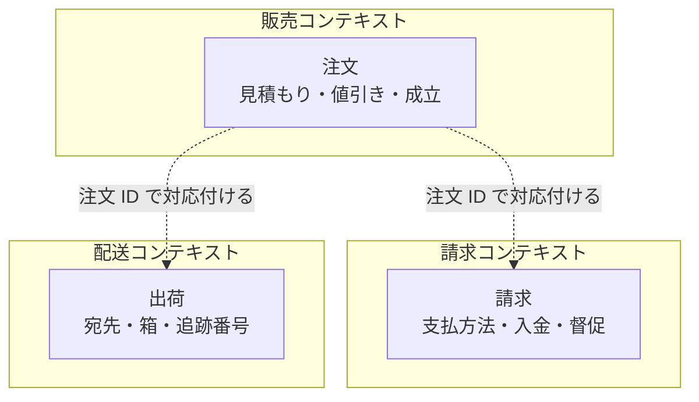
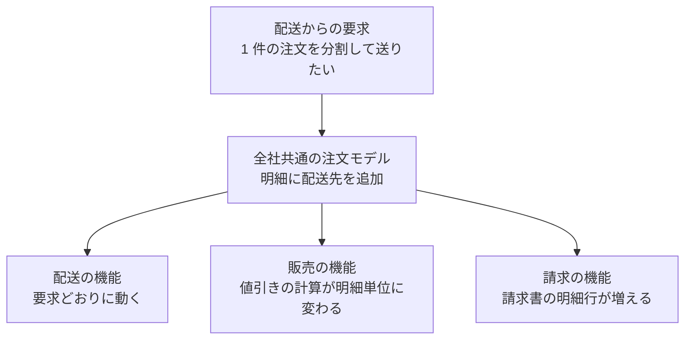
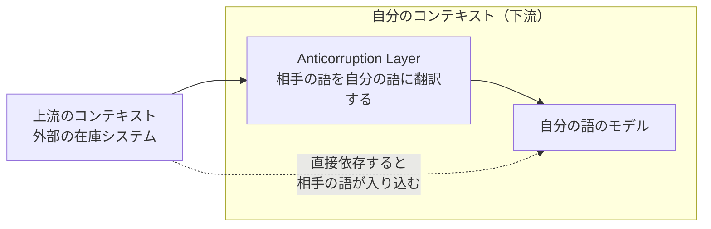

Bounded Context（境界づけられたコンテキスト）とは、あるモデルが定義され、そのまま適用できる範囲を明示した境界です。[Evans 氏の DDD Reference](https://www.domainlanguage.com/wp-content/uploads/2016/05/DDD_Reference_2015-03.pdf) は「特定のモデルが定義され適用される境界の記述であり、多くはサブシステム、または特定のチームの担当範囲となる」と定義しています。ここでのモデルは、業務の概念を表す型と、その概念が守る規則の集まりを指します。境界の中では「注文」という語が 1 つの意味に定まり、境界の外に出た時、同じ語が同じ意味だとは仮定しません。

境界が必要なのは、DDD（Domain-Driven Design、ドメイン駆動設計）を採用しているかどうかとは関係がありません。1 つの語が組織の場所ごとに違う意味を持つ状況は、設計の流儀に関わらず現れます。境界を引かずに 1 つのモデルにまとめると、どの場所の言葉とも一致しないモデルが残ります。ここでは、境界の引き方と、境界をまたぐ時の扱いを整理します。チーム編成や組織構造の設計は範囲外です。

EC（Electronic Commerce）サイトを例に、1 件の買い物を扱う 3 つの境界を以下に示します。



上記の図の 3 つは、どれも 1 件の買い物から始まる業務です。同じ買い物を扱っていても、持つ属性も、状態が変わる条件も違います。この例では対応付けに注文 ID を使い、値引き率や追跡番号のような属性は、それぞれの境界が自分の語で持ちます。境界の間で ID しか渡してはいけないという規則があるわけではありません。

---

### なぜ Bounded Context が必要なのか

会社全体で 1 つの「注文」モデルを作ろうとすると、3 つの業務の要求が 1 つの型に集まります。値引き率と支払方法と追跡番号が同じ構造体に並び、どのフィールドがどの場面で意味を持つのかが型から読み取れなくなります。

読み取れないだけなら、規約で補えます。問題は、変更の理由が 3 つの業務から同時に来る事です。



上記の図の左端にある要求は、配送の業務だけから出ています。それでも、モデルを共有している販売と請求の 2 つが影響を受けます。共有されたモデルに手を入れる限り、変更のたびに 3 つ全部の検証が必要になり、変更を出せる速さは最も慎重な業務に合わせて落ちます。

もう 1 つの症状が用語に出ます。同じ語が場所によって別の物を指す状態を多義語（polyseme）と呼びます。Martin Fowler 氏は [Bounded Context の解説](https://martinfowler.com/bliki/BoundedContext.html)で、電力会社の「メーター」を例に挙げています。送電網と拠点の接続点なのか、送電網と顧客の接続点なのか、故障したら交換できる計器そのものなのかが、部署ごとに違っていました。会話では曖昧なまま流せる違いも、コードでは流せません。

書籍『Domain-Driven Design』（2003 年）の第 14 章には、大規模なシステムでドメインモデルを完全に統一する事は、実現可能でも費用対効果に見合うものでもない、と書かれています。統一を諦める代わりに置くのが境界です。

---

### 境界の引き方

最も強い手がかりは、語の意味が変わる場所です。モデルはユビキタス言語（ubiquitous language）として働きます。ユビキタス言語とは、ドメインモデルを軸に構成された言語で、境界の中の全員が会話・図・コードで同じ語を同じ意味で使います。

Fowler 氏は、境界を決める要因として支配的なのは人間の文化だと説明しています。モデルがユビキタス言語として働く以上、言葉が変われば別のモデルが必要だからです。用語の一覧を作り、同じ語に 2 つ以上の説明が付く場所を探すと、境界の候補が出てきます。

Evans 氏は、境界を引く時に使う言葉として、チームの分け方、アプリケーションのどの部分で使うか、コードベースや DB（データベース）スキーマといった物理的な現れの 3 つを挙げています。組織の形と、コードの置き場所の両方が境界の材料になります。

もう 1 つの手がかりが、変更の理由です。1 つの要求が 1 つの境界の中で完結するなら、その切り方は業務の形と合っています。1 つの要求が毎回 3 箇所に散るなら、境界が業務を横切っています。[Aggregate](../value-object-entity-aggregate/) が 2 つの境界の型を材料にしている場合も同じ徴候で、どちらのユビキタス言語でも表せないモデルができています。

---

### 境界の中で守る事

境界の中では、ユビキタス言語を 1 つに保ちます。用語集を作って語を揃える作業とは向きが逆で、語を変えるとモデルも変わります。Evans 氏の DDD Reference は、境界に名前を付けてその名前をユビキタス言語の一部にする事と、境界の中では継続的インテグレーションによって用語とモデルの概念を厳密に一致させ続ける事を求めています。

コードでは、パッケージ名と型名がそのまま業務の語になります。販売の境界を Go で書くと次のようになります。

```go
// Package sales は販売コンテキストで、注文が成立するまでを扱います。
package sales

// OrderID は販売コンテキストでの注文の同一性です。
type OrderID string

// Order は値引きの交渉と成立を持つ注文です。
type Order struct {
	ID          OrderID
	CustomerID  string
	Lines       []Line
	DiscountPct int
	Placed      bool
}

// Line は注文の 1 明細で、金額の計算に必要な値を持ちます。
// SKU（Stock Keeping Unit）は、在庫を数える単位に付けた商品の識別子です。
type Line struct {
	SKU      string
	Quantity int
	UnitYen  int64
}
```

同じ買い物を配送の境界で書くと、別の型になります。

```go
// Package shipping は配送コンテキストで、荷物を届けるまでを扱います。
package shipping

// OrderRef は販売コンテキストの注文を指す参照です。型は共有しません。
type OrderRef string

// Address は届け先です。定義は省略します。
type Address struct{}

// Shipment は 1 回の配送で運ぶ荷物です。
type Shipment struct {
	Ref      OrderRef
	Address  Address
	Items    []Item
	Tracking string
}

// Item は荷物に入れる 1 品目です。金額は持ちません。
type Item struct {
	SKU      string
	Quantity int
}
```

`shipping` が `sales.OrderID` を使わず、自分で `OrderRef` を定義している点が境界です。参照として渡るのは ID の値だけで、型は共有していません。`shipping` が `sales` を import しないので、後から `sales.Order` に手が伸びる経路も塞がります。

ID の型を共有する選択もあります。後述の Shared Kernel がそれで、共有する部分を小さく保つ事と、相手の同意なしに変えない事が条件になります。同意の仕組みが無いまま共有すると、型を変えるたびに 2 つの境界が同時に動きます。

どちらを選んでも変わらないのは、下流が ID を不透明な値として扱う事です。書式を解析したり自分で採番したりすると、上流の採番規則が下流の実装に染み出します。

値引き率と成立の状態が `Shipment` に無いのも意図した結果です。配送の業務にそれらの語は無く、無い語をモデルに持ち込まないという判断が、ユビキタス言語を境界の中に保ちます。

---

### 境界をまたぐ時

境界をまたぐ経路には、変換を置きます。この例では、2 つの境界が対等なので、変換だけを担当する第三のパッケージを作ります。

```go
// Package adapter は 2 つのコンテキストの間の変換だけを担当します。
package adapter

// ToShipment は販売の注文を配送の荷物に翻訳します。
// 値引きや成立の状態は配送に意味が無いため、ここで捨てます。
func ToShipment(o sales.Order, addr shipping.Address) shipping.Shipment {
	items := make([]shipping.Item, 0, len(o.Lines))
	for _, l := range o.Lines {
		items = append(items, shipping.Item{SKU: l.SKU, Quantity: l.Quantity})
	}
	return shipping.Shipment{
		Ref:     shipping.OrderRef(o.ID),
		Address: addr,
		Items:   items,
	}
}
```

効いているのは依存の向きです。`adapter` は `sales` と `shipping` の両方を import し、`sales` と `shipping` はどちらも `adapter` を知りません。相手を知っているパッケージが 1 つに限られるため、2 つの境界のモデルは相手の語を持たずに済みます。

境界と境界の関係は、変換の有無だけでは決まりません。関係を一覧にした物を Context Map（コンテキストマップ）と呼びます。以下の表で「立場」と書いたのは、モデルを提供する側を上流、それを受け取って使う側を下流とした時に、どちらがそのパターンを選ぶかです。

| 関係 | 立場 | 内容 |
|---|---|---|
| Partnership | 両チーム | 変更の計画と統合を共同で管理し、同じリリースに載せる |
| Shared Kernel | 両チーム | モデルとコードの一部を共有し、変更は合意の上で行う |
| Customer/Supplier Development | 両チーム | 下流の要求を上流の計画に組み込み、優先度を交渉する |
| Conformist | 下流 | 上流のモデルにそのまま従い、変換を作らない |
| [Anticorruption Layer](../anti-corruption-layer/) | 下流 | 変換層を挟み、相手のモデルを自分の語に翻訳する |
| Open-host Service | 上流 | 多数の相手向けにプロトコルを公開する |
| Published Language | 合意 | ドメイン情報を表現できる共有言語を文書化し、相互に翻訳する |
| Separate Ways | 両チーム | 連携せず、それぞれで完結させる |

この 8 つは、DDD Reference が Context Map の後ろに並べているものです。Reference は Big Ball of Mud を加えた 9 つを並べており、Big Ball of Mud は境界どうしの関係ではなく、境界の中が混ざってしまった状態を表します。

選び方は排他ではありません。上流が Open-host Service を出しつつ Published Language を定め、下流の一部は Conformist として従い、残りは Anticorruption Layer を作る、という組み合わせが起こります。下流が選べるのは Conformist と Anticorruption Layer と Separate Ways で、上流を動かせるかどうかが分かれ目になります。

Conformist を選べるのは、上流のモデルが理想的でなくても、自分の設計を歪めない程度に収まっている場合です。歪む場合に置くのが Anticorruption Layer で、下流が自分の語を守るために自分で持ちます。



上記の図の点線が避けたい経路です。相手のモデルを直接使うと、相手の語とデータの形が下流のモデルの内側まで届き、相手の変更に合わせて下流の設計が動く事になります。変換層は、その影響を境界の入口 1 箇所に集めます。

---

### 境界は配置の単位ではない

注意点として、Bounded Context はプロセスやサービスの単位ではありません。1 つのプロセスの中に、複数の境界をパッケージやモジュールとして置けます。1 つの境界を 1 つのサービスにする分け方は選択肢の 1 つで、境界の定義そのものではありません。Fowler 氏も、同じ業務領域の中に複数の境界が現れる例として、メモリ上のモデルと関係 DB 上のモデルの分かれ方を挙げています。

配置と無関係という意味ではありません。Evans 氏が境界を引く言葉にコードベースと DB スキーマを含めている通り、物理的な分かれ方は境界の材料に入ります。決まらないのは、境界とプロセスの数が 1 対 1 に対応するかどうかです。

境界を引く事自体が目的になると、名前だけが増えて用語の一貫性は得られません。効いているかどうかは、境界の中で 1 つの語が 1 つの意味に定まっているか、境界をまたぐ経路に変換が置かれているかで判定できます。名前を配置に合わせて付け替えても、この 2 つは動きません。

---

### 利点

- 境界の中で語の意味が 1 つに定まり、会話とコードの名前が一致する
- 各境界が自分の都合でモデルを変えられ、変更の影響が境界で止まる
- 統合の関係を明示するので、どこに変換が必要かが設計から読み取れる
- 全社で 1 つのモデルに合意するのを待たず、境界ごとに独立して進められる
- 境界が分割の候補になり、後から実行単位を分ける時の切れ目として使える

---

### 欠点

以下は、モデルの一貫性を境界の中だけで保証する事を優先した結果として現れる制約です。

- 同じ実体の情報が複数の境界に分かれ、全体を見る問い合わせが複数箇所にまたがる
- 境界ごとに似た型と、境界の数だけ変換のコードが増える
- 境界を独立したサービスや DB として配置した場合、境界をまたぐ更新を単一のトランザクションにまとめる事が難しくなり、結果整合性（いずれ一致するものの、ある瞬間はずれている状態）を選ぶ事が多い
- 境界の位置を誤ると、1 つの要求のたびに複数の境界を触る事になる
- 境界を引き直す時、コードだけでなく用語と会話も動かす事になる

---

### 適さないケース

- 扱う業務が 1 つで、主要な語の意味が最初から 1 つに定まっているシステム
- 語の意味が場所で変わるかどうかを判断できるだけの知識が、まだ集まっていない段階
- 参照だけの小さなツールや、1 回限りの移行スクリプト
- モデルを長く保守せず、次の作り直しまでの繋ぎとして書くコード

---

### 似た概念との比較

境界という語は複数の層で使われるため、何を区切っているのかで並べます。

| | Bounded Context | Aggregate | パッケージ | サービス |
|---|---|---|---|---|
| 区切る対象 | モデルと用語が通用する範囲 | 不変条件を守る範囲 | モデルの中の概念のまとまり | 実行と配置の単位 |
| 典型的な大きさ | 業務の 1 領域 | 数個のオブジェクト | 1 つの package | 1 つのプロセス |
| 境界を越える時 | 変換して受け渡す | ID で参照する | 公開した API を呼ぶ | ネットワーク越しに呼ぶ |
| 決め手 | 語の意味が変わる所 | 規則がまたがる範囲 | 概念のまとまりと名前 | 運用と拡張の都合 |

パッケージの行は、DDD Reference の Module に合わせています。Reference は、結合度と凝集度を機械的な指標として扱う見方を戒め、モジュールにはシステムの筋書きを語る名前を付け、その名前をユビキタス言語の一部にする事を求めています。技術的な都合だけで切ったパッケージは、ここで言うモジュールとは別の物です。

4 つは一列に並びません。1 つの Bounded Context の中に複数の Aggregate が入り、同じ Bounded Context を 1 つ以上のパッケージで表します。Aggregate とパッケージは、どちらも境界の内側にある別々の切り口です。サービスとの対応はさらに緩く、複数の境界を 1 つのサービスに載せる形も、1 つの境界を複数のサービスで実装する形も起こります。

境界の数と位置は、最初から正しく引けるものではありません。語の食い違いが見つかるたびに引き直す事になるため、引き直しのコストが上がりすぎない範囲で、粗く始める方が扱いやすいと考えられます。
