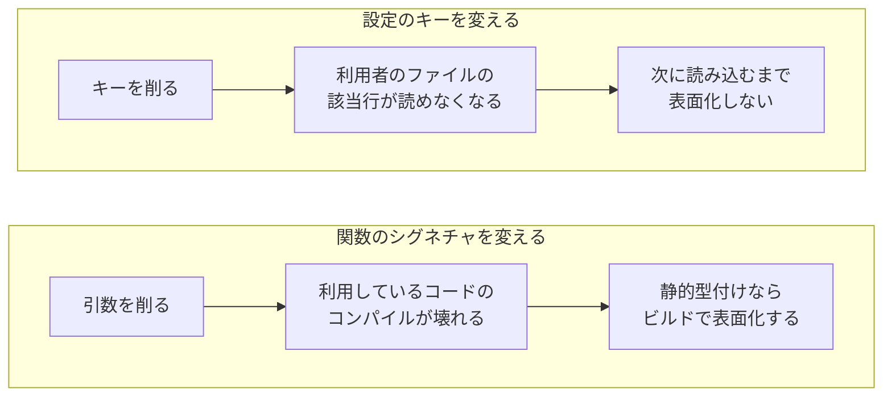
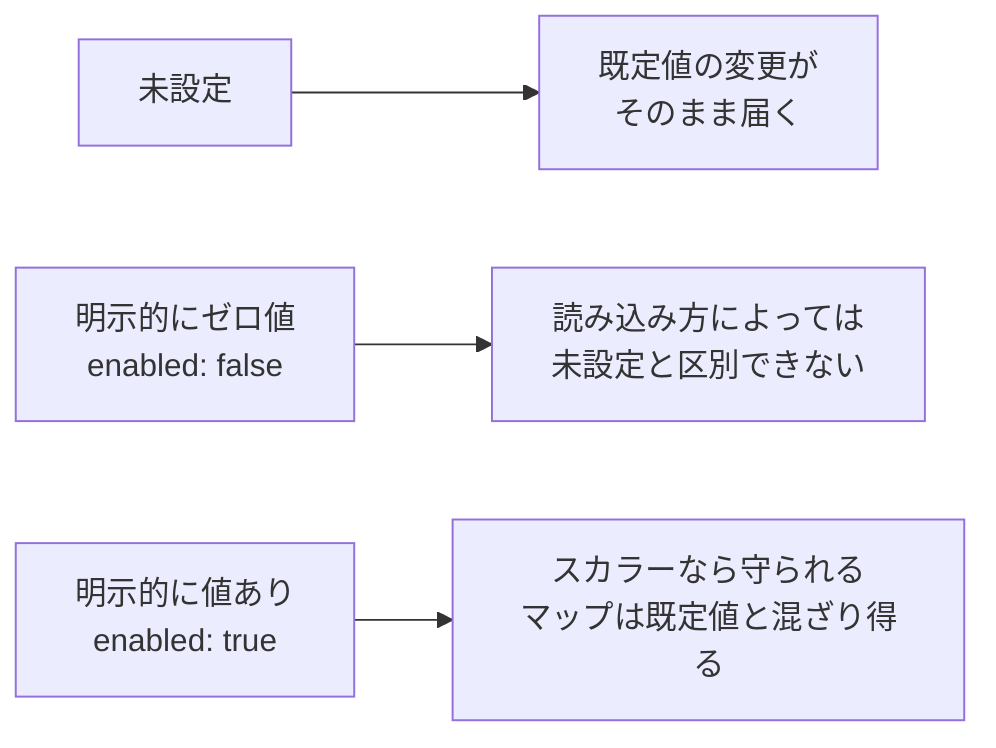
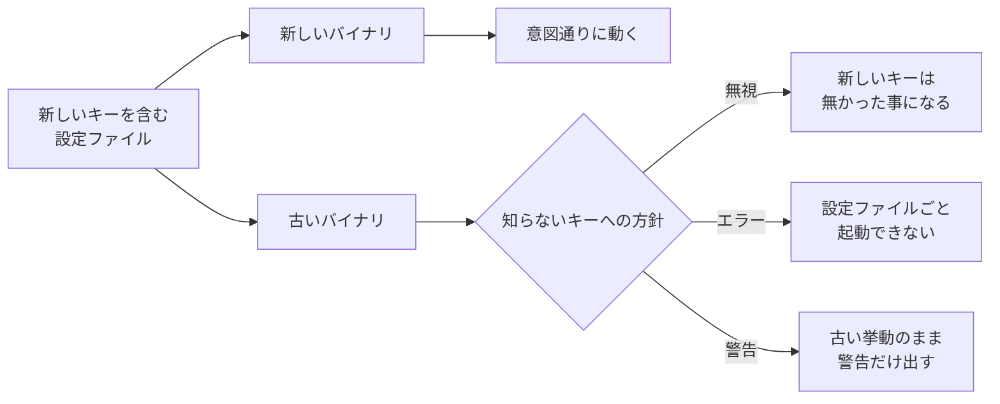
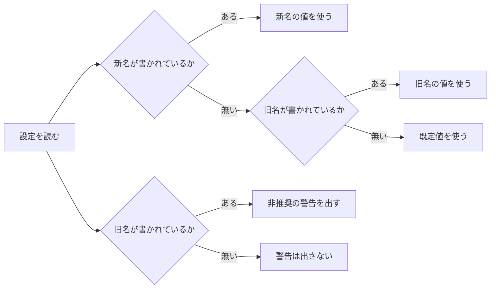
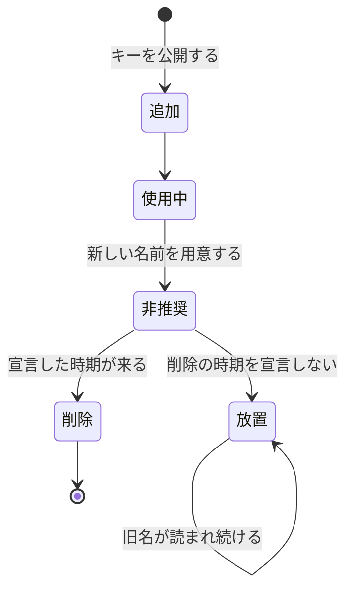

YAML のキー名を `timeout` から `timeout_seconds` へ直すと、旧い名前で書かれた利用者の設定ファイルでは、その行が知らないキーになります。既定値を 30 から 5 へ変えるだけでも、ファイルを 1 文字も書き換えていない利用者の挙動が変わります。

利用者へ配るソフトウェアでは、設定ファイルは公開 API です。ここでの公開 API とは、開発側がこれは約束だと宣言し、一度外へ出すと一存では変えられなくなる物を指します。キーの名前・階層・既定値は、利用者のファイルへ書き写された時点でその約束になります。

この考え方が効くのは、利用者がそれぞれのタイミングでバージョンを上げるソフトウェアを配る開発側です。CLI（Command Line Interface）ツールやセルフホスト型のミドルウェアでは、数年前のファイルが最新のバージョンでも読めなければなりません。

対象になるのは、利用者が手で書き、ツールが書き戻さない設定ファイルです。


開発側が書き換えられるのは読み込みの実装だけで、その手前にあるファイルは利用者の物です。コードの公開 API に使う規則は、そのままこの接点へ持ち込めます。

---

### 公開したキーは戻せない

キーを 1 つ公開すると、利用者はそれぞれの環境の値をファイルへ書き込みます。開発側がそのキーを削除しても、利用者の手元のファイルからは消えません。削除はその行を知らないキーへ変え、意味の変更は読めたまま挙動を変えます。どちらも破壊的変更です。

同じ破壊でも、関数のシグネチャと設定のキーでは、壊れが表に出る時点が違います。



設定ファイルには、これに当たる自動の検査がありません。スキーマ検証や、起動前に設定を検査するサブコマンドを別に用意しない限り、開発側は壊した事に気付けません。

破壊的変更を加えたらメジャーバージョンを上げる、というのが [Semantic Versioning](https://semver.org/) の規約です。同仕様は公開 API を宣言する事も必須としていて、宣言はコード自体でも、ドキュメントの中だけでも構いません。設定の書式を公開 API だと宣言すれば、この規約がそのまま掛かります。

メジャーバージョンを上げる規則が掛かるのは、メジャーバージョンが 1 以上の場合です。メジャーバージョン 0 の間は初期開発の期間として、何がいつ変わってもよいと同仕様は認めています。

「設定は稼働環境ごとに変わりやすく、コードは変わりにくい」という対比は、[The Twelve-Factor App](https://12factor.net/config) が設定とコードの分離を求める所に置かれています。同文書が勧めているのは環境変数で、利用者が長く持ち続けるファイルとは想定が違うので、借りるのはこの対比だけです。

---

### 既定値は仕様である

既定値を変えると、未設定のままにしている利用者の挙動が、ファイルを 1 文字も書き換えずに変わります。原因は手元の設定ファイルの中には無いので、利用者は変更履歴を辿る事になります。

1 つのキーが取り得る状態は主に 3 つあり、既定値の変更が届く先はそのうち 1 つです。



ゼロ値とは、Go の `bool` なら `false`、数値なら `0` のように、値を入れていない変数が持つ既定の値を指します。数値や真偽値のように 1 個の値を持つスカラーでは、守られるかどうかが読み込み方によって変わるのは、明示的にゼロ値を書いた利用者だけです。キーと値の集まりであるマップは、既定値とマージされ得るので、明示的に値を書いた利用者も変わります。

空の構造体へそのまま読み込むと、`timeout: 0` と明示した利用者と、キーを書かなかった利用者が、どちらも 0 として届きます。手は 2 つあり、1 つは既定値を先に詰めた構造体へ読み込む方法です。

```go
// このコードは、未記載のキーを触らない gopkg.in/yaml.v3 の挙動を前提にしている。
// 既定値が残り、enabled: false と書いた利用者の指定も守られる。
cfg := Config{Enabled: true, Timeout: 30}
if err := yaml.Unmarshal(data, &cfg); err != nil {
	return err
}
```

この前提が素直に効くのはスカラーとネストした構造体までです。マップの既定値はマージされて残るので、`labels: {}` と書いた利用者は既定のエントリを消せません。`labels: null` と書けば消えます。

利用者が空にできる必要のあるマップなら、既定値を空にしておくか、`null` で消せる事を書き添えるかを選びます。

もう 1 つの方法は、ポインタで受ける事です。ポインタなら、利用者が明示したかどうかを後から判定できます。ただし `enabled:` と値を省いた書き方や `enabled: null` も nil になるので、キーの有無まで区別するなら、読み込んだノードを見るか、変換処理を自分で書く事になります。

---

### 知らないキーをどう扱うか

そのバージョンが知らないキーへ出会う場面は、代表的には 3 つあります。利用者が古いキーを消し忘れた場合、まだ上げていない古いバイナリが新しいキーを読む場合、そして `tiemout: 30` のような打ち間違いです。

無視・エラー・警告のどれを選ぶかで、古いバイナリが新しい設定ファイルへ出会った時の結末が変わります。



打ち間違いと、古いバイナリが新しいキーを読む場面は、読み込む側から見るとどちらも知らないキーで、区別が付きません。

| 方針 | 打ち間違いに気付けるか | 古いバイナリで新しい設定を読めるか | 代償 |
|---|---|---|---|
| 黙って無視する | 読み込み時点では気付けない | 読める | 利用者は正しく設定したつもりのまま既定値で動く |
| エラーにする | その場で気付ける | 読めない | 配る開発側がバイナリの更新順序まで管理する事になる |
| 警告して続ける | ログを見れば気付ける | 読める | 抑止手段が無いと、移行するまで警告がログを埋める |

エラーを選べるのは、更新の途中で新旧のバイナリが混在しない場合です。混在するなら、古いバイナリが新しい設定を読んで起動に失敗し、更新の展開が途中で止まります。

利用者がそれぞれのタイミングでバージョンを上げる配布形態では、混在しない保証を開発側が持てません。この前提なら、読み込みは無視で通し、`validate` のようなサブコマンドで打ち間違いを拾う組み合わせが収まります。

---

### 名前を変える時と、やめる時の段取り

キーの名前を変えたい時は、いきなり旧名を削除せず、旧名を読み続けたまま新名を優先する期間を置きます。旧名が使われたら警告を出し、利用者へ移行を促します。



優先順位を決めておけば、両方が書かれた設定ファイルでも結果が 1 つに決まります。新名を先に見るのは、新名へ移った利用者の指定が、消し忘れた旧名で上書きされないようにするためです。

警告は、どちらの値を採ったかとは別に、旧名が書かれていれば出します。新名へ移った利用者が旧名を消し忘れていても、そこで気付けます。キーが書かれたかどうかの判定には、既定値の節で挙げたポインタやノードを見る手が要ります。

非推奨にした時点で、いつ削除するかを宣言しておく事も要ります。機能へ削除の期限を先に決めておく考え方は、[Feature Flag](../feature-flag/) の「消す前提で作る」と同じです。宣言の有無で、キーが辿る道は 2 つに分かれます。



放置へ入ると、旧名を読み続けるコードと警告の処理が、消せないまま次のバージョンへ引き継がれます。削除できる時期を書式のバージョンへ結び付けて、放置を選べなくする規則もあります。

設定を YAML で書く基盤である Kubernetes の [API の非推奨化の規則](https://kubernetes.io/docs/reference/using-api/deprecation-policy/)は、設定の構造体も対象にしています。一度あるバージョンへ入れた要素は、そのバージョンからは削除できず、振る舞いも大きく変えられません。

書式にバージョンがある設計なら、削除の手段はキーを消す事ではなくバージョンを上げる事になります。設定ファイル自身に `config_version` のような値を持たせる形がこれにあたり、代償として、バージョンごとの読み込みと、バージョン間で値を移す変換処理を持ち続ける事になります。

バージョンを持たない設定ファイルには、Kubernetes の同じ規則がコマンドラインの要素へ当てている扱いの方が近くなります。非推奨だと告知してから決めた期間は動かし続け、その間は使われるたびに警告を出してから消します。期間は下限として定められ、対象と安定度で分かれます。

---

### 利点

- キーの追加と、旧名を残したままの改名なら、利用者の設定ファイルを壊さずに進められる
- 既定値を詰めた構造体で読むなら、スカラーのキーの既定値変更は、未設定のままにしている利用者だけに影響する
- 削除までの猶予を宣言する事で、利用者に移行の時間を渡せる

---

### 欠点

- 旧名を読み続けるコードと警告の処理が、削除するまで残り続ける
- 未設定とゼロ値を区別するために、既定値の詰め方や型の選び方が制約される
- 知らないキーへの方針を後から厳しくすると、既に配られている設定ファイルが動かなくなる

---

### 適さないケース

- 設定を書く人と配る人が変わらず、ファイルの形式をそのつど作り直せるツール
- ツール自身が設定ファイルを生成して書き戻す設計で、利用者の手元の記述が残らない構成
- 利用者の数が少なく、キーを変えるたびに個別に連絡できる配布形態
