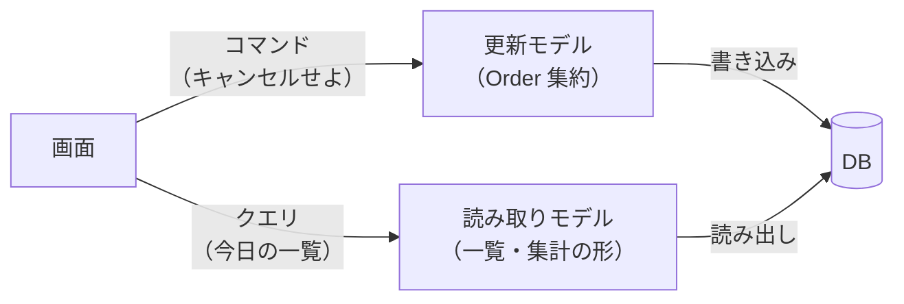
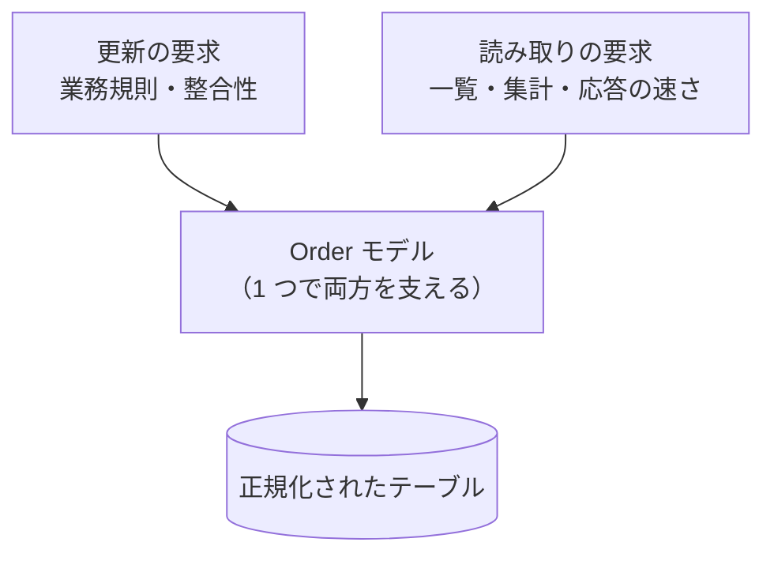
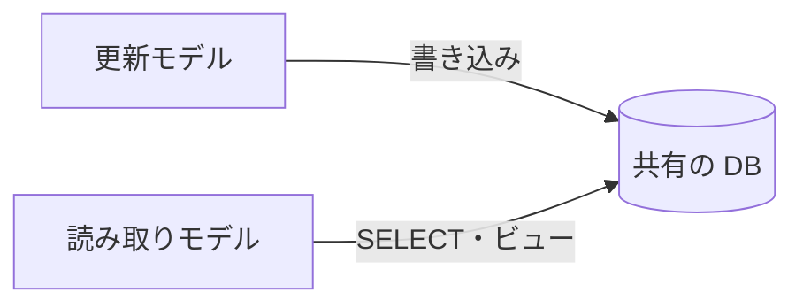
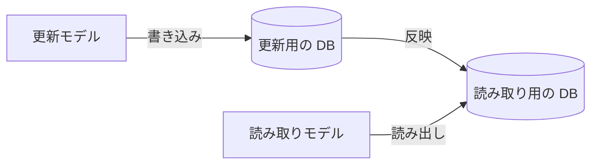

CQRS（Command Query Responsibility Segregation、コマンドとクエリの責務分離）とは、情報の更新に使うモデルと、読み取りに使うモデルを分けられるという考え方です。Martin Fowler 氏の [CQRS](https://martinfowler.com/bliki/CQRS.html) は、Greg Young 氏の説明で初めて知ったパターンとしてこの考え方を紹介し、中心にある発想を「情報の更新には、読み取りに使うモデルとは別のモデルを使える」と要約しています。

名前にあるコマンドとクエリのうち、コマンドは `order.Cancel(...)` のようなメソッド呼び出しで表される状態変更の要求で、クエリは「今日確定した注文の一覧が欲しい」のような読み取りの要求です。例には、[Repository](../repository/) や [Event Sourcing](../event-sourcing/) のノートと同じ注文（`Order` [集約](../value-object-entity-aggregate/)）を使います。名前の由来である Command Query Separation との違いは末尾で整理します。

この分割が必要な場面の代表は、更新と読み取りで求められる形が大きく違うシステムです。例えば EC サイトの注文では、確定やキャンセルは「確定前の注文はキャンセルできない」のような業務規則を守る更新で、明細まで含めた `Order` 集約が担います。同じシステムの管理画面に出すのは「今日確定した注文の一覧」や「注文者ごとの購入金額の合計」で、集約の形とは噛み合わない検索です。

2 つのモデルへ分けた構成を以下に示します。



上図で見てほしいのは、要求の種類で通るモデルが分かれる点です。更新モデルは業務規則の検査に専念し、読み取りモデルは画面や集計に合わせた形を取れます。図の DB は 1 つを共有しても、保存先ごと分けても構いません。その選択は「2 つのモデルをどこまで分けるか」で扱います。

---

### なぜ更新と読み取りのモデルを分けるのか

Fowler 氏は、情報システムとのやり取りの主流を「CRUD データストアとして扱う事」だと書き、「要求が洗練されるにつれて、そのモデルから着実に離れていく」と続けています。CRUD（Create / Read / Update / Delete）の 1 つのモデルで更新と読み取りの両方を支える設計は、出発点としては自然です。

離れていく理由は、2 種類の要求がモデルへ求める性質の違いにあります。対比を以下に示します。

| | 更新（コマンド） | 読み取り（クエリ） |
|---|---|---|
| 扱う単位 | 整合を守る 1 かたまり（ここでは集約） | 問い合わせに必要な単位。複数の集約を横断する場合もある |
| データの形 | 明細まで丸ごと、規則を検査できる形で持つ | 問い合わせに必要な列と形。必要なら結合・集計する |
| 守るもの | 業務規則（不変条件） | 表示の形と応答の速さ |

ここで例にする RDB では、CRUD の 1 つのモデルを正規化（normalization、同じ事実を 1 箇所にだけ持つようにテーブルを分ける設計）したテーブルの上に作る事があります。この構成では読み出す時に結合で組み立て直すため、画面 1 つ分のデータは複数のテーブルへ散らばります。

[Repository](../repository/) で見たとおり、集約を丸ごと復元する作りは、注文番号・合計金額・状態の 3 列を 20 件並べる一覧のためにも、20 個の集約を明細まで構築します。逆に一覧の都合へモデルを寄せ、注文を表示用の数列だけ持つ形にすると、キャンセル可否の判定に要る明細や状態が手元に無くなり、業務規則の検査が画面側の処理へ散らばります。

1 つのモデルが両方を支える構成を以下に示します。



上図のモデルは、どちらの要求からも形を引っ張られます。Fowler 氏が挙げる分割の根拠も、多くの問題では、特に複雑なドメインでは「コマンドとクエリに同じ概念モデルを使うと、どちらもうまくこなせない、より複雑なモデルへ行き着く」という点です。CQRS は、この 1 つのモデルを要求の種類で 2 つに割ります。

---

### コマンドを受ける更新モデル

更新モデルは、コマンドを受けて業務規則を検査し、通った変更だけを保存します。[Domain Event](../domain-event/) や [Event Sourcing](../event-sourcing/) のノートで見てきた `Order` 集約と [Repository](../repository/) の組は、そのまま更新モデルにあたります。

キャンセルのコマンドを処理する例を以下に示します。

```go
// CancelOrder は、注文をキャンセルするコマンドを処理します。
// 業務規則の検査は Order 集約が行います。
func (u *usecase) CancelOrder(ctx context.Context, id OrderID, reason string) error {
	return u.tx.Do(ctx, func(tx Tx) error {
		order, err := u.orders.Find(tx, id)
		if err != nil {
			return err
		}
		if err := order.Cancel(reason, time.Now()); err != nil {
			return err
		}
		return u.orders.Save(tx, order)
	})
}
```

このコードでは、表示用のデータを返さず成否だけを返す設計を採っています（採番した ID など、後続の処理に要る最小限の値を返す実装はある）。表示用のデータを返さない形は、ここで採る規律です。CQRS 自体がコマンドの戻り値を禁止するわけではありません。キャンセル後の画面に出す内容は、クエリで読み取りモデルから取り直します。表示用のデータを大量に返して更新モデルを画面の形へ寄せると、分離の利点が薄れるためです。

なお、コマンドをメソッド呼び出しではなく `CancelOrder` のような命令形の名前を持つオブジェクトで表す実装もあります。[Domain Event](../domain-event/) の比較表で見た、特定の受け手が処理するメッセージとしてのコマンドと同じものです。

更新モデルの保存先は、集約の復元と、競合の検出（同じ注文への同時更新を片方だけ失敗させる仕組み）に向いた形を選べます。正規化したテーブルでも、[Event Sourcing](../event-sourcing/) のイベントストアでも構いません。読み取りの都合を考えなくてよいため、選択の基準が集約の保存だけに絞れます。

---

### クエリに答える読み取りモデル

読み取りモデルは、画面や集計の形に合わせて用意した読み取り専用のデータと、その問い合わせ窓口です。[Repository](../repository/) の末尾で触れた、集約を通らずに表示用の列だけを SELECT する照会サービスは、この窓口の最小の形です。

窓口と返すデータの例を以下に示します。

```go
// OrderSummary は、一覧の 1 行分を表示に必要な列だけで表します。
// 業務規則を持たない、読み取り専用のデータです。
type OrderSummary struct {
	OrderID     string
	Total       int
	Status      string
	ConfirmedAt time.Time
}

// OrderQueryService は、読み取りモデルへの問い合わせ窓口です。
// 集約を復元せず、画面の形に合わせたデータを返します。
type OrderQueryService interface {
	FindConfirmedOn(ctx context.Context, day time.Time) ([]OrderSummary, error)
	TotalByCustomer(ctx context.Context, id CustomerID) (int, error)
}
```

`OrderSummary` は `Order` 集約と違ってメソッドを持たず、この型を通じて注文の状態を変える手段は用意していません。一覧で得た注文の ID をキャンセルのコマンドへ渡すように、読み取りの結果から更新の入力を作る事は問題ありません。避けたいのは、読み取り用のデータを直接 DB へ書き戻す使い方です。集約の業務規則を通らない更新になるため、更新は必ずコマンドとして更新モデルへ送るという規律で防ぎます。

窓口の実装は画面の数だけ増やせます。一覧には一覧用の、集計には集計用の形を返すため、1 つの窓口に全画面の都合を詰め込む必要がありません。画面が消えたら、対応する窓口とデータを消すだけで済みます。

---

### 2 つのモデルをどこまで分けるか

モデルを分ける事と、保存先を分ける事は別の判断です。Fowler 氏も、2 つのモデルは「同じ DB を共有してよく、その場合は DB が 2 つのモデルの間の連絡役になる」とし、「別々の DB を使う事もできる」と続けています。保存先を共有する構成を以下に示します。



上図の読み取りモデルは、更新モデルが書いたテーブルを SELECT やビューで直接読みます。反映の仕組みを別に作る必要がなく、コミットした後の値を同じ書き込み先から直接読むため、別の保存先へ非同期に反映する事で生じる遅れはありません。読み取りの形を大きく変えたい場合は、ビューの定義がその変換を担います。

結果を実体として保存しない通常のビューは、問い合わせのたびに正規化されたテーブルの結合と集計を計算し直します。その負荷は更新と同じ DB に載るため、読み取りが増えるほど更新と資源を取り合います。この形で支えきれなくなった時には、保存先を分ける事も選択肢になります。分けた構成を以下に示します。



上図の反映は、多くの実装で更新の完了とは別のタイミングで走ります。その結果、読み取りは[結果整合](../domain-event/)（いずれ一致するものの、ある瞬間を切り取るとずれを許す性質）になる事が多く、書いた直後のクエリが古い値を返す場合があります。

Fowler 氏は、別々のモデルを持つ事自体が「モデルをどれだけ厳密に一致させ続けるかという問いを生み、結果整合を使う可能性を高める」と書いています。この問いは保存先を分ける前から生まれており、分けた構成はその問いが最も表に出る形です。

コマンドを受ける更新モデルの節で見た「キャンセル後の画面はクエリで取り直す」という形も、この影響を受けます。保存先を共有する構成なら反映の遅れは無く、分けた構成では反映前の古い値が返り得ます。その場合は、受け付け済みと表示して反映を待つなど、遅れを許す画面設計が要ります。

反映の実装には、DB の複製機能や CDC（Change Data Capture、DB の変更を捕捉して外部へ流す仕組み）で変更を転送する形と、[Domain Event](../domain-event/) を配送して受け取った側が読み取り用のデータを更新し続ける形があります。イベントの配送を取りこぼさない仕組み（Transactional Outbox）も Domain Event のノートで扱いました。イベントの並びそのものを一次記録にした場合の投影は、[Event Sourcing](../event-sourcing/) の読み取りモデルへの投影で扱いました。

---

### 利点

- 更新モデルが業務規則の検査に専念でき、読み取りの都合でモデルが崩れない
- 読み取りモデルを画面・集計ごとに最適化でき、集約を丸ごと復元する無駄が消える
- 保存先まで分ける構成では、読み書きで負荷の特性が違う時に読み取り側だけを複製して増やせる
- 読み取り専用の窓口が明示され、集約を通らない更新経路を設計上の逸脱として見分けられる

Fowler 氏が CQRS の使いどころとして挙げるのは、複雑なドメインと、読み書きの負荷を分けて別々にスケールさせたい高性能なアプリケーションの 2 つです。どちらにも当てはまらないなら、分割で得られるものが次の欠点に見合わない可能性が高いと考えられます。

---

### 欠点

以下は、更新と読み取りのそれぞれへモデルを最適化する事を優先した帰結です。

- 同じ情報を 2 つのモデルが別の形で扱うため、変更の内容によっては両方の修正が要る
- 保存先まで分けると、モデルを繋ぐ反映の仕組みが業務と別に増える
- 保存先を分けた構成では読み取りが結果整合になりやすく、書いた直後のクエリが古い値を返す場合がある
- 要求の単純なシステムでは、分割の複雑さに見合う効果が出ない

Fowler 氏は、ほとんどのシステムにとって「CQRS はリスクを伴う複雑さを加える」と注意しています。自身が出会った事例の大半は良い結果になっておらず、CQRS が「ソフトウェアシステムを深刻な困難へ向かわせる大きな要因」と見なされていたとも書いています。導入の前に、上の使いどころへ当てはまるかを確かめる価値があります。

---

### 適さないケース

- 更新も読み取りも単純で、CRUD の 1 つのモデルで両方を支えられているシステム
- 更新と読み取りの形の差も負荷の差も小さく、2 つのモデルの保守が割に合わない業務
- システム全体への一律の適用

最後の項目について、Fowler 氏は「CQRS はシステムの特定の部分（DDD で言う [Bounded Context](../bounded-context/)）だけに使うべきで、システム全体に使うべきではない」と書いています。注文の部分では割に合い、会員情報の部分では CRUD で足りる、という判断を Bounded Context ごとに分けられます。

---

### Command Query Separation・Event Sourcing との関係

CQRS の名前は、Bertrand Meyer が書籍『Object-Oriented Software Construction』で示した [Command Query Separation](https://martinfowler.com/bliki/CommandQuerySeparation.html)（CQS）の語彙に従っています。CQS は、オブジェクトのメソッドをコマンドとクエリの 2 種類へ分ける規律です。コマンドは状態を変えて値を返さず、クエリは結果を返して観測可能な状態を変えません。

CQS がメソッド 1 つずつに掛かるのに対し、CQRS が分けるのはモデルです。CQS を守ったメソッドは 1 つのモデルの上にも並べられます。CQRS はそこからさらに、コマンドを受けるモデルとクエリに答えるモデルを別の構造にします。語彙は共通で、規律の掛かる場所が違います。

[Event Sourcing](../event-sourcing/) のノートは、書き込みがイベントストア、読み取りが投影先（イベントから作り続ける読み取り用のデータ）という構成が CQRS の形になっている事と、Event Sourcing の採用と CQRS の採用が独立した判断である事を整理していました。逆から言い直すと、CQRS の読み取りモデルの元になる記録は、上書きされる状態でもイベントの並びでもよく、イベントの並びを選んだ時に Event Sourcing との組み合わせになります。
