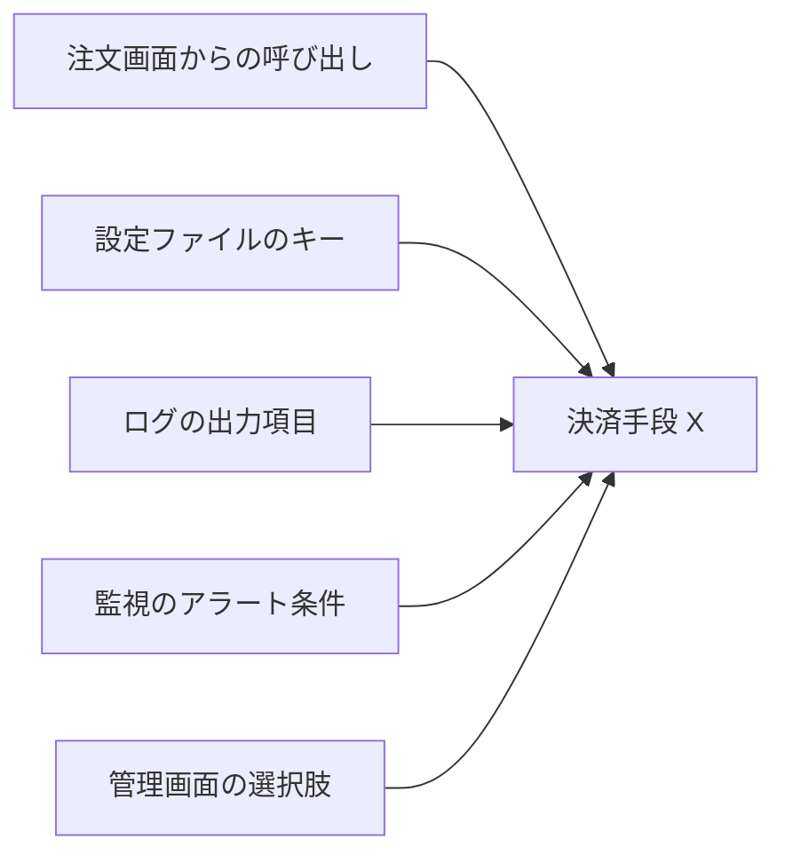
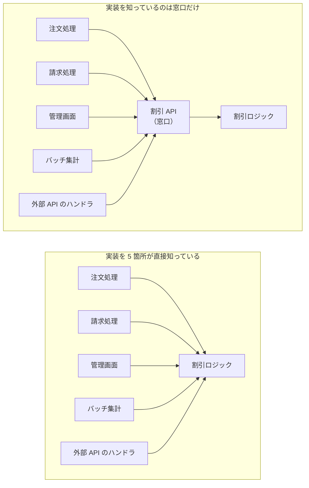
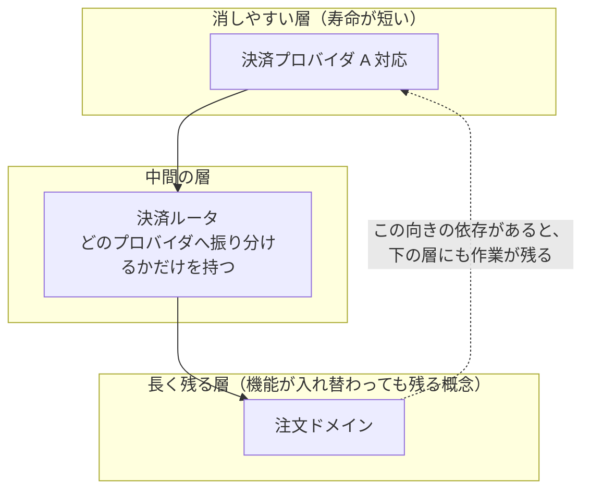
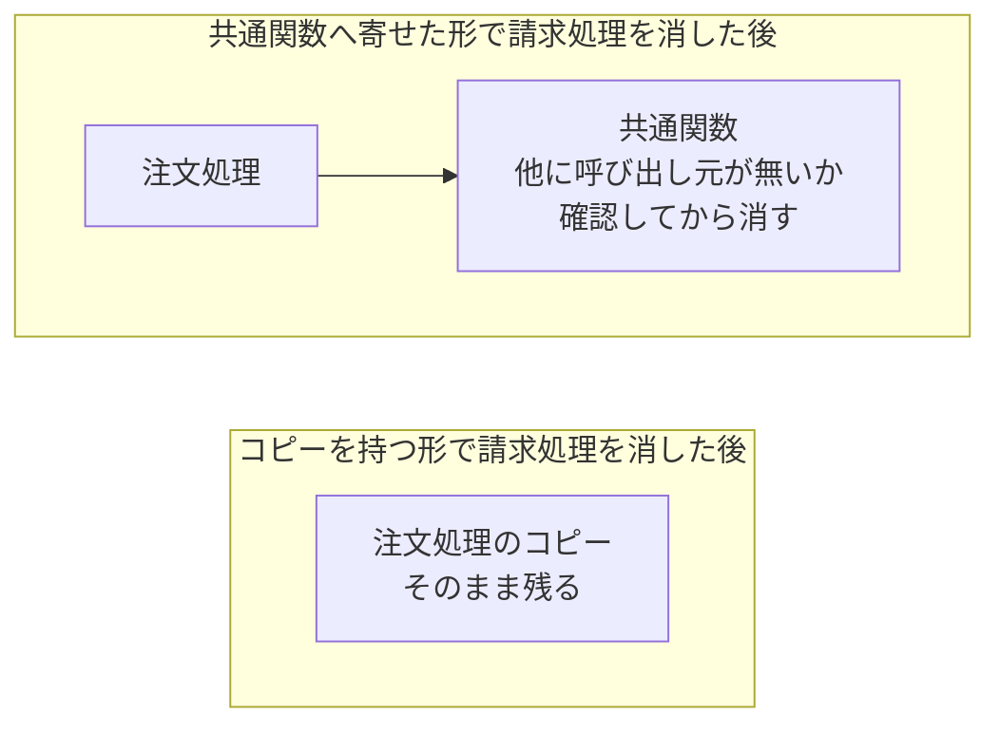
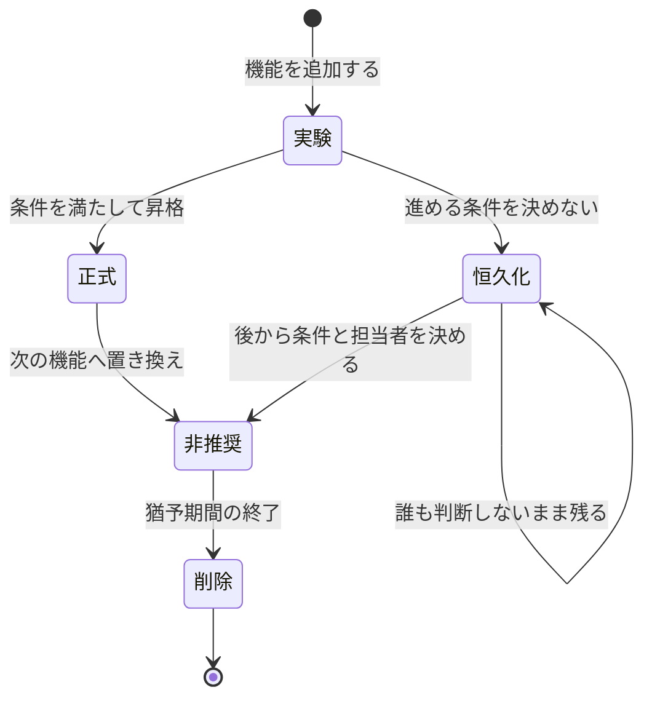
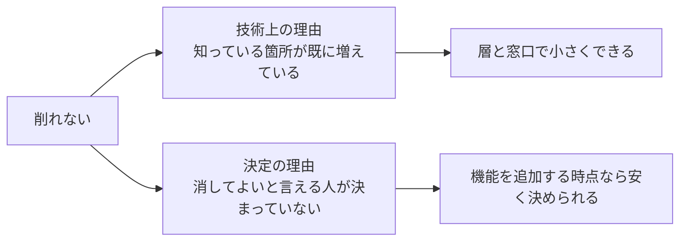

決済手段を 1 つ廃止する事になり、実装のパッケージを削除します。コンパイルエラーを潰し終えても、設定ファイルのキー・ログの項目名・監視のアラート条件・管理画面の選択肢は残ったままです。

Design for Deletion は、消す時の作業量が小さく収まるよう、機能を足す時点で設計を決める考え方です。tef 氏の 2016 年の記事「[Write code that is easy to delete, not easy to extend.](https://programmingisterrible.com/post/139222674273/write-code-that-is-easy-to-delete-not-easy-to)」（拡張しやすいコードではなく、削除しやすいコードを書く）が、この判断軸を題に掲げています。

足す時の目安になるのは、その機能がいくつの箇所に知られるかです。消す作業が途中で止まるのは、消す先が芋づる式に出てくるからです。

矢印の数だけ確認と修正が要ります。1 本でも見落とすと、消したはずの機能の設定やアラートが残り、次に触る人はそれが生きているのか調べる事になります。

判断が効くのは、これから足す機能の設計です。既に絡まったコードの解きほぐしは、依存の向きを事後に変える作業になり、置き場所を決める判断とは別の仕事です。

---

### 消しにくさを左右するのは知っている箇所の数

機能を消す難しさは、呼び出し元の数だけでは測れません。効いてくるのは、その機能の存在を知っている箇所の数です。呼び出し元が 1 箇所しか無くても、戻り値の型や定数の値を複数の箇所が直接参照していれば、消す時に触る範囲は同じだけ広がります。

知っている箇所には、型・定数に加えて、DB のテーブルの列も入ります。ある機能のためだけに追加した列なら、その列を読み書きするクエリが知っている箇所です。列そのものには、コードを直すのとは別に、データの移行という手順が付きます。

数を掴むには、機能の名前や識別子で全文を検索し、当たった箇所を数えます。コードだけでなく、設定ファイル・ダッシュボードの定義・手順書まで含めた数が、見積もりの出発点になります。

知られる範囲は、窓口を 1 つ置くと変わります。ここでの窓口は、使う側が触ってよい入口に絞った関数やパッケージを指し、内部の型や定数は外へ見せません。

窓口が減らすのは、知られる深さです。割引ロジックの実装を別の物へ差し替える時に書き換えるのは窓口の内側だけで、5 箇所は割引の内部の型や定数を知らずに済みます。呼ぶ側の数は、どちらの形でも 5 のままです。

存在を知っている箇所まで減らせるかは、窓口の形で決まります。機能ごとに入口を分けて `適用する割引X()` を並べた形なら、その機能を廃止する時に 5 箇所から呼び出しを消します。窓口が種類を引数で受ける形なら、消えるのは引数に渡していた値だけで、呼び出し自体は残ります。

---

### 消す順番を層で決める

層は、パッケージやディレクトリのように、コードをまとめて置く単位です。上下は依存の向きで、上の層が下の層を参照します。消したい物ほど上へ置けば、消す作業は上から順に進みます。

消しにくい部分を消しやすい部分から遠ざける、という狙いを tef 氏の記事は「[keep the hard-to-delete parts as far away as possible from the easy-to-delete parts](https://programmingisterrible.com/post/139222674273/write-code-that-is-easy-to-delete-not-easy-to)」（消しにくい部分を消しやすい部分からできる限り遠ざける）と書いています。層は、この距離を置き場所で表した形です。

どちらを下に置くかは基準の選び方で変わります。tef 氏のブログ記事は、固有度の低いコード、つまり特定の機能への専用度が低いコードほど消えにくいとしています。ここでは寿命を基準にして、機能が入れ替わっても残る概念を下の層へ置きます。

具体的には、決済プロバイダ A への対応を上へ、注文ドメインを下へ置きます。

矢印が上から下への一方向なら、消しやすい層を消した時に触る範囲は、その層と、機能の名前で上の層と結び付いている箇所に収まります。名前で結び付いているのは、振り分け先を持つ決済ルータ・設定値・永続データで、注文ドメインはそこに入りません。

逆向きの依存に気付く手掛かりの 1 つは、下の層のコードが上の層の型をインポートしている事です。ただし、これだけでは足りません。

import に出ない逆向きの依存もあります。下の層のインターフェースが特定の上位実装 1 つに合わせて形を決めている場合が 1 つで、注文の保存を担う型に `プロバイダA向けに保存()` が生えていれば、プロバイダ A を消しても宣言だけが下の層へ残ります。設定の値でどの実装を使うかを実行時に結び付けている場合も、参照はビルドに出ないまま、消すと起動時に落ちます。

---

### 早すぎる共通化を避ける

使う側が 2 つしか無い段階で共通関数へ寄せると、その関数は 2 つの使い方の最大公約数ではなく、先に来た使い方の形へ寄りやすくなります。2 箇所に似たコードがあるという事実だけでは、その 2 箇所が同じ理由で変わるのかどうかは分かりません。

[tef 氏のブログ記事](https://programmingisterrible.com/post/139222674273/write-code-that-is-easy-to-delete-not-easy-to)は、ライブラリ関数を作るより先にコードを 2 回ほどコピーして、それがどう使われるかを掴んでおく順序を勧めています。掴めたかどうかが判断の分かれ目なので、回数そのものは基準になりません。

共通化が奪うのは、後から考えを変える自由です。1 つの関数へ寄せた時点で、使う側の 1 つだけを別の方向へ変える作業に、分岐を足すか関数を割るかの判断が挟まります。

行数が増える事を歓迎する話ではありません。行数は成果として生み出した物ではなく、支出した物として数えます。同じブログ記事が引く Dijkstra 氏の手稿が「lines produced」ではなく「lines spent」と書いている通りで、増やすなら後から消しやすい方で増やす、という順序になります。

共通化するかコピーのまま残すかは、3 つの材料で見ます。

| 判断材料 | 共通化してよい | コピーのまま残す |
|---|---|---|
| 使い方の固まり方 | 新しい使う側が、既にあるコピーをほぼそのまま使っている | コピーごとに形が違い、使い方がまだ固まっていない |
| 変わり方 | 全ての使う側が同じ理由で変わる | 使う側ごとに変わる理由が違う |
| 後で戻すコスト | 個別のコードへ戻すのが容易だと見込める | 個別のコードへ戻すのに分解し直す事になる |

3 つの行は独立していないので、割れた時にどちらを採るかは題材で変わります。使い方が固まっていても変わる理由が別なら、コピーのまま残す方へ倒します。

差が出るのは、片方の使う側を消す時です。

共通関数へ寄せた形では、呼び出しを消しても関数が残ります。消すには、他に呼び出し元が無い事を確かめる手順が 1 つ増えます。

---

### 機能に寿命を持たせる

機能を追加する時点で、次の段階へ進む条件と、それを判定する担当者を 1 文で決めておきます。決めないまま実装すると、実験として入れた機能が、誰も判断しないまま恒久機能になります。

例えば「一部のユーザへ公開し、次のリリース判定までにエラー率が閾値を超えなければ全体公開へ進める。伸びなければ削除する。判定するのは決済チームのリード」のように、条件と担当者を対にして残します。

恒久化から非推奨へは後から戻せます。ただしその時点では機能を知っている箇所が増えているので、決める作業そのものが重くなります。

機能へ削除の期限を先に決めておく運用は、[Feature Flag](../feature-flag/) のノートでも扱っています。flag を足す時に消す期限を決める事と、機能を足す時に次の段階の条件を決める事は、同じ判断を別の粒度で行っています。

削れない理由は、技術上の理由と決定の理由に分けると、手当ての先が変わります。

2 つに分けたのは説明のためで、削れない理由がこの 2 つで尽きるわけではありません。使われているかを測る計測が無ければ、消してよいと言える人が判断材料を持てず、消してよいという決定そのものが動かなくなります。

---

### 利点

- 実装を知っている箇所が層と窓口の内側に収まり、差し替えの影響範囲を事前に見積もれる
- 共通化を急がない分、片方の使い方だけが変わっても他方を巻き込まない
- 消す条件を追加時に決めるので、恒久化した機能かどうかを後から判定できる

---

### 欠点

- コピーを許す分、初期の行数は共通化した場合より増える
- 層を分ける設計に時間を使う分、最初の実装は早く終わらない
- 段階と削除条件を決める運用そのものに、継続的な合意形成の手間がかかる

---

### 適さないケース

- 消す判断が要らない、短命なプロトタイプや使い捨てのスクリプト
- 層を分けるほどの規模が無い、数十行で完結する処理
- 消す条件を決める運用を続ける体制が無いチーム
