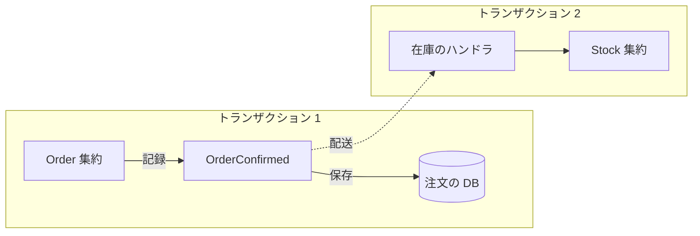
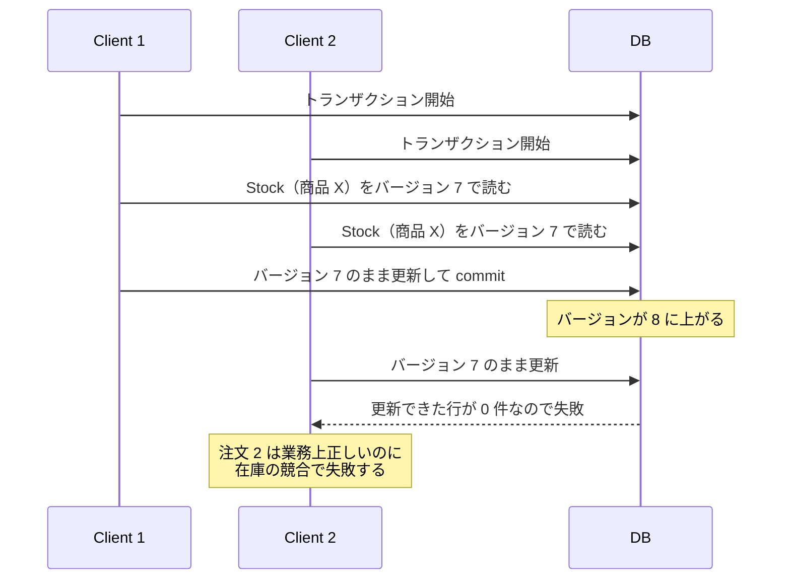

Domain Event とは、ドメインの中で既に起きた出来事を表すオブジェクトです。過去の記録なので通常は不変で、出来事が起きた時刻と、関与したエンティティの識別子を持ちます。ここでは、1 つの [Bounded Context](../bounded-context/) の中で [Aggregate](../value-object-entity-aggregate/) 同士を繋ぐ用途と、Bounded Context をまたいで他のシステムに伝える用途を扱います。

Domain Event は「ドメインエキスパートが関心を持つ何かが起きた」事を表します。DDD（Domain-Driven Design、ドメイン駆動設計）での位置付けは、Eric Evans 氏の [DDD Reference](https://www.domainlanguage.com/wp-content/uploads/2016/05/DDD_Reference_2015-03.pdf) にある「ドメインの活動に関する情報を一つ一つ区切られた出来事の連なりとしてモデル化し、それぞれの出来事をドメインオブジェクトとして表現せよ」という記述です。不変である事と、時刻および識別子を持つ事も、同じ箇所に書かれています。

連なりというのは、業務上意味のある出来事を 1 件ずつ独立したドメインオブジェクトとして明示する形を指します。明示する対象として挙がっているのは、ドメインエキスパートが追跡したい出来事や通知を受けたい出来事、他のモデルオブジェクトの状態変化に結び付く出来事で、関係のない活動は無視して良いとされています。現在の状態を捨ててイベントだけを保存せよという指示ではありません。全ての状態変更をイベントの並びとして記録し、その並びから状態を作り直す方式は [Event Sourcing](../event-sourcing/) で、Domain Event を使う事はその採用を意味しません。

発行から処理までの経路を以下に示します。



上記の図の `Order` を確定させる処理は `Stock` の更新を待たずに完了し、在庫の引き当ては後から別のトランザクションで実行されます。点線の配送は、同じプロセスの中でハンドラを呼ぶか、メッセージブローカーを挟むかのどちらかです。トランザクションを分けた事で、注文の確定は在庫の混雑から切り離され、代わりに 2 つの状態がずれている時間が生まれます。

---

### なぜ Domain Event が必要なのか

Aggregate は、内部の不変条件を常に保つ単位です。Vaughn Vernon 氏が 2011 年に発表した [Effective Aggregate Design Part I](https://dddcommunity.org/wp-content/uploads/files/pdf_articles/Vernon_2011_1.pdf) には、「適切に設計された Bounded Context は、あらゆる場合において 1 トランザクションにつき 1 つの Aggregate インスタンスだけを変更する」と書かれています。同じ論文は、この原則が経験則（rule of thumb）で、ほとんどの場合に目指すべき目標だとも添えています。

原則を外して 2 つの Aggregate を 1 つのトランザクションで更新すると、次のようなコードになります。注文の確定と在庫の引き当てを同時に行う実装です。

```go
// confirmOrder は、注文の確定と在庫の引き当てを 1 つのトランザクションで行います。
func (u *usecase) confirmOrder(ctx context.Context, id OrderID) error {
	return u.tx.Do(ctx, func(tx Tx) error {
		order, err := u.orders.Find(tx, id)
		if err != nil {
			return err
		}
		if err := order.Confirm(time.Now()); err != nil {
			return err
		}
		for _, line := range order.Lines() {
			// SKU（Stock Keeping Unit）は在庫を数える単位で、Stock は別の Aggregate
			stock, err := u.stocks.Find(tx, line.SKU)
			if err != nil {
				return err
			}
			if err := stock.Reserve(line.Quantity); err != nil {
				return err
			}
			if err := u.stocks.Save(tx, stock); err != nil {
				return err
			}
		}
		return u.orders.Save(tx, order)
	})
}
```

このコードは 1 台の DB（データベース）の上では動きます。問題は、同じ商品を含む注文が同時に届いた時に現れます。`Stock` は商品ごとに 1 つしか無いため、その商品を含む全ての注文が同じ行を奪い合います。

人気商品への注文が 2 件同時に届いた場合は以下の通りです。`Stock` をバージョン列で守る楽観的ロックの実装を想定しています。



上記の図の Client 2 は、注文に問題が無いのに失敗しています。`Order` と `Stock` を同じトランザクションに入れた事で、注文の確定が在庫の混雑に巻き込まれたからです。行ロックで待つ実装を選べば失敗はしません。その場合は代わりに、注文の確定が在庫の待ち時間だけ遅くなります。どちらを選んでも、トランザクションが長いほど影響は大きくなり、注文に含まれる商品が増えるほど巻き込まれる相手も増えます。

在庫が別の Bounded Context に移り、DB が分かれた場合はさらに直接的です。1 つのローカルトランザクションで両方を更新する経路が無くなり、上のコードは書けなくなります。複数の DB を 1 つのコミットにまとめる分散トランザクション（[2 相コミット](../../distributed-systems/two-phase-commit/)）を持ち込めば形は保てるものの、参加者の 1 つが停止すると全体が待たされます。

Vernon 氏の [Effective Aggregate Design Part II](https://dddcommunity.org/wp-content/uploads/files/pdf_articles/Vernon_2011_2.pdf) には、この場面での指針が「1 つの Aggregate インスタンスにコマンドを実行した結果、他の 1 つ以上の Aggregate で追加の業務規則を実行する必要があるなら、結果整合性を使え」と書かれています。コマンドは状態を変えてほしいという要求で、ここでは `order.Confirm(...)` のように Aggregate のメソッドを呼ぶ形で表します。

同じ論文は Evans 氏の書籍『Domain-Driven Design』から「Aggregate をまたぐ規則は、常に最新である事を期待されない」という一文も引いています。結果整合性とは、いずれ全体が一致するものの、ある瞬間を切り取ると[ずれている状態を許す](../value-object-entity-aggregate/)考え方です。Domain Event は、この結果整合性を実現する手段になります。

---

### イベントの形と名前

名前は過去形にします。何を載せるかは、受信側が自分の処理を完結できる分を目安にします。

```go
// DomainEvent は、種類名を答えられる物を Domain Event として扱うための
// インターフェースです。配送先には Go の型が無いため、種類は文字列で運びます。
type DomainEvent interface {
	Name() string
}

// OrderConfirmed は、注文が確定したという事実を表します。
// 過去に起きた記録なので、作った後は変更しません。
type OrderConfirmed struct {
	EventID    string      // 二重配送を受信側が判定するための識別子
	OccurredAt time.Time   // 出来事がドメインで起きた時刻
	OrderID    OrderID     // 関与したエンティティの識別子
	Lines      []OrderLine // 受信側が処理に必要とする情報の写し
}

func (e OrderConfirmed) Name() string { return "order.confirmed" }
```

識別子だけを載せて受信側から問い合わせ直させる作りもあります。載せる情報が減る代わりに、受信側が発行元に問い合わせる経路を持つ事になり、問い合わせた時点では既に値が変わっている場合もあります。上の `Lines` は、確定した時点の内容を写して渡す側の選択です。

以降の例では、在庫のハンドラが注文と同じ Bounded Context にあり、`OrderConfirmed` をそのまま受け取るとします。Bounded Context の外に送る場合は、内部のモデルをそのまま出すと受け手が内部の変更に引きずられるので、公開用の形に変換してから送ります（この公開用のイベントを Integration Event と呼んで区別する事もあります）。

過去形の名前は、受け取る相手との関係を決めています。「注文を確定せよ」というコマンドは、メソッド呼び出しで表してもキューに入れるメッセージで送っても、特定の処理が実行される事を期待していて、その成否は発行元にとって意味を持ちます。「注文が確定した」という事実は、同じプロセスの中で同期に配る場合でも起きた事を伝えるだけで、発行元は誰がどう処理したかを知りません。起きた事実は取り消せない一方で、受信側の処理は普通に失敗します。

時刻の扱いにも注意が必要です。Martin Fowler 氏の [Domain Event](https://martinfowler.com/eaaDev/DomainEvent.html) には、「出来事が世界で起きた時刻」と「その出来事に気付いた時刻」の 2 つを区別すべきだと書かれています。どちらを保持しているのかがフィールド名で分かるようにします。

---

### 誰がイベントを作るか

イベントを Aggregate に作らせると扱いやすくなります。状態が変わった事を最もよく知っているのは、その状態を持っている Aggregate だからです。呼び出し側で作ると、状態の変更とイベントの発行が別々の場所に散らばり、片方だけを直した時にずれます。Aggregate の状態変更に対応しないイベントは、呼び出し側で作る事になります。

```go
// Confirm は注文を確定し、確定したという事実をイベントとして記録します。
func (o *Order) Confirm(now time.Time) error {
	if o.status != OrderStatusDraft {
		return errAlreadyConfirmed
	}
	o.status = OrderStatusConfirmed
	o.events = append(o.events, OrderConfirmed{
		EventID:    newEventID(),
		OccurredAt: now,
		OrderID:    o.id,
		Lines:      slices.Clone(o.lines),
	})
	return nil
}

// PullEvents は記録済みのイベントを取り出し、Aggregate の中を空にします。
func (o *Order) PullEvents() []DomainEvent {
	events := o.events
	o.events = nil
	return events
}
```

記録と発行を分けている点が効いています。`Confirm` の時点では、イベントを Aggregate の中に溜めるだけです。`PullEvents` を呼ぶのを [Repository](../repository/) の `Save` だけにする決まりを守れば、保存の前に処理を中断した時に、起きていない事実は配られません。その代わり `PullEvents` が Aggregate の中を空にするので、トランザクションを再試行する構成では、Aggregate を取得し直す必要があります。

イベントを溜めずに、`Confirm` の中から発行の窓口を直接呼ぶ書き方もあります。Effective Aggregate Design Part II の例では、`DomainEventPublisher.instance()` というシングルトンの `publish` を呼びます。この形では、窓口がその場で受信側に届ける実装だと、後の保存が失敗しても配った事実を取り消せません。

---

### 発行と配送

`Save` で取り出したイベントを配る方法には段階があります。最小の構成は、コミットが成功した後に同じプロセスの中でハンドラを呼ぶ形です。弱点は、コミットの直後にプロセスが落ちるとイベントが消える点にあります。逆に、コミットの前にハンドラを呼ぶと、保存に失敗した時に起きていない事実が配られます。この 2 つは、DB とメッセージの 2 箇所に別々に書く限り避けられません。

最小の構成で足りるかは、Bounded Context の境界ではなく、後続処理が消えた時に業務が困るかで決まります。同じ Bounded Context の中でも、決済の後に必ず走らせたい処理があるなら足りません。逆に境界をまたいでいても、通知が 1 通落ちても業務が回るなら、これで済みます。

[Transactional Outbox](https://microservices.io/patterns/data/transactional-outbox.html) は、書き込み先を DB の 1 箇所に寄せて解きます。メッセージを外部に送る代わりに、業務データを更新するのと同じトランザクションの中で outbox（送信箱）テーブルに書き込み、溜まった行を別プロセスの message relay が読んでメッセージブローカーに転送します。

コミットが成立すれば送るべき行が outbox に残り、巻き戻せば業務データと一緒に消えるので、業務データの更新と送信の予約は食い違いません。しかし、relay が止まっている間は送られず、届く回数とタイミングも relay とブローカーの実装で変わります。この保証の範囲は [Transactional Outbox のノート](../../distributed-systems/transactional-outbox/)で扱っています。

outbox テーブルに入るのは、以下のような行です。

| id | event_id | name | payload | occurred_at | sent_at |
|---|---|---|---|---|---|
| 1 | e1 | order.confirmed | `{"order_id":"o-1", ...}` | 2026-08-07T10:00:00Z | 2026-08-07T10:00:03Z |
| 2 | e2 | order.confirmed | `{"order_id":"o-2", ...}` | 2026-08-07T10:00:01Z | NULL |

行を追記するのは Repository の `Save` です。`Order` の状態を書いた後、`PullEvents` で取り出したイベントを 1 件ずつ、同じトランザクションの中で outbox に書きます。`payload` には `EventID` を含むイベントの中身を JSON で入れます。送り先には Go の型が無いからです。outbox は配送を取りこぼさないためのテーブルで、イベントの履歴として設計されたものではありません。

`sent_at` が `NULL` の行が未送信です。relay はその行だけを古い順に拾って送り、送れたら時刻を書き込みます。

```go
// runOnce は、未送信の行を古い順に読み、ブローカーに送って送信済みにします。
// 常駐プロセスが一定間隔でこれを呼びます。
func (r *relay) runOnce(ctx context.Context) error {
	rows, err := r.outbox.FindUnsent(ctx, 100)
	if err != nil {
		return err
	}
	for _, row := range rows {
		if err := r.broker.Publish(ctx, row.Name, row.Payload); err != nil {
			return err // 送れなかった行から、次の周回でやり直す
		}
		// ここで停止すると、送信済みを記録しないまま次の周回で再送する
		if err := r.outbox.MarkSent(ctx, row.ID); err != nil {
			return err
		}
	}
	return nil
}
```

1 周で読む件数を区切っているのは、outbox が溜まった時に 1 回の処理が長くなり過ぎないようにするからです。途中で失敗しても、そこまでに `MarkSent` を終えた行は送信済みとして残るので、次の周回は失敗した行から再開します。その代わり、送れない行が残り続けると、後ろの行も送られません。

---

### 受信側は冪等にする

冪等とは、同じ処理を何回実行しても、1 回実行した時と同じ結果になる性質です。上の relay は、`Publish` の後で停止したり `MarkSent` に失敗したりすると、次の周回で同じ行をもう一度送ります。受信側に何回届くかはブローカーの配送保証にも左右され、少なくとも 1 回は届く代わりに 2 回以上届く事もある配送（at-least-once 配送）になります。そのため、受信側はイベントに付けた `EventID` を処理済みとして記録しておき、同じ値が来たら何もせずに終えます。

```go
// Handle は、注文の確定を受けて在庫を引き当てます。
// processed テーブルの EventID には一意制約を張り、Insert は
// 制約に当たった時に行を挿入せず inserted = false を返す実装にします。
func (h *stockHandler) Handle(ctx context.Context, ev OrderConfirmed) error {
	return h.tx.Do(ctx, func(tx Tx) error {
		// 処理の前に記録を試み、一意制約に弾かれたら処理済みとして抜ける
		inserted, err := h.processed.Insert(tx, ev.EventID)
		if err != nil {
			return err
		}
		if !inserted {
			return nil
		}
		reserved := make([]*Stock, 0, len(ev.Lines))
		for _, line := range ev.Lines {
			stock, err := h.stocks.Find(tx, line.SKU)
			if err != nil {
				return err
			}
			if err := stock.Reserve(line.Quantity); err != nil {
				// 在庫不足なら在庫を 1 件も保存せず、失敗のイベントを残してコミットする
				return h.outbox.Append(tx, newReservationFailed(ev, line))
			}
			reserved = append(reserved, stock)
		}
		// 全明細の引き当てが揃ってから保存する
		for _, stock := range reserved {
			if err := h.stocks.Save(tx, stock); err != nil {
				return err
			}
		}
		return nil
	})
}
```

記録を処理の前に試しているのは、重複した 2 通目が、1 通目の処理が終わる前に届く事もあるからです。存在を確認してから処理する順序だと、2 つのトランザクションが両方とも「まだ処理していない」を読み、両方が引き当てに進みます。先に記録を試みれば、後から来た方が一意制約に弾かれます。

重複を弾くのは一意制約で、処理済みの記録と在庫の更新を同じトランザクションに入れるのは、途中で落ちた時に両方を一緒に巻き戻すからです。記録だけを先にコミットすると、在庫を更新する前に落ちた場合に、引き当てていないのに処理済みの記録が残り、再配送されたイベントは何もせずに捨てられます。

前提が 2 つあります。1 つは、処理の完了をブローカーに伝えるのがコミットの後である事です。コミットの前に伝えると、間で落ちた時にイベントが失われます。もう 1 つは、ハンドラの副作用が全て同じトランザクションに収まる事です。外部への通知やメールの送信が混ざると、処理済みの記録では二重実行を防げません。

保存を明細のループの外に出しているのは、途中で失敗した時に引き当てを 1 件も残さないからです。ループの中で保存すると、3 件目で在庫が足りなかった場合に、1 件目と 2 件目の引き当てだけが残ったままコミットされます。全て引き当てるか、1 件も引き当てないかのどちらかに寄せます。

`Reserve` の失敗をエラーとして返さないのは、ハンドラがエラーを返すとトランザクションが巻き戻り、処理済みの記録も消えて、同じイベントが再び配送されるからです。在庫不足は再試行しても解消しないので、エラーを返すと同じイベントが配送され続けます。エラーを返すのはデッドロックのように再試行で解消する失敗に限り、在庫不足のような業務上の失敗は別のイベントとして残します。

引き当ての失敗を受けて何をするかは、業務として決めます。在庫が足りなくても、注文の確定は既に起きた事実なので取り消せません。注文を取り消す処理を走らせるか、入荷を待って引き当て直すか、ドメインエキスパートと決める事になります。

---

### 利点

- Aggregate を 1 トランザクション 1 つに保てるので、競合の範囲が Aggregate の中に収まる
- 競合がユーザーへの応答から切り離され、失敗しても背後で再試行できる
- 発行元は受け取る相手を知らないため、後から処理を追加しても発行元のコードが変わらない
- 「何が起きたか」がコード上の型として残り、業務の語彙とモデルが一致する
- イベントを履歴として永続化する設計にすれば、後から監査や再処理の材料に使える

2 つ目の項目は、競合が消える事を意味しません。人気商品の `Stock` は変わらず全ての注文から奪い合われ、その商品に対する更新の処理量も変わりません。変わるのは、競合が注文の確定を巻き込まなくなる事と、失敗しても背後で引き当て直せる事です。

---

### 欠点

以下は、Aggregate の境界を守る事と、発行元と受信側の結合を切る事を優先した結果として現れる制約です。

- 処理が複数のトランザクションに分かれ、途中の状態が外から見える時間ができる
- 失敗した時に元に戻す処理は、業務の言葉で自分で設計する事になる
- 受信側を冪等にする実装が全てのハンドラに必要
- 発行元のコードを読んでも、そのイベントで何が起きるのかを追えない
- 配送保証のために Transactional Outbox を採用すると、業務と直接関係のない outbox テーブルと relay の運用が増える

---

### 適さないケース

- 1 つの Aggregate の中だけで処理が完結し、外部に伝えるべき出来事も無い更新。イベントを挟む理由がない
- 更新の直後に結果を画面に返す必要があり、数秒の遅れも許容できない業務
- 業務上、複数の Aggregate が必ず同時に成立しなければならない場合。Aggregate の境界の引き方から見直す
- ハンドラが 1 つしかなく、今後も増える見込みが無い連携。関数を直接呼ぶ方が追いやすい

遅れを許容できるかは、ドメインエキスパートに聞いて決めます。Vernon 氏の Effective Aggregate Design Part II も、ドメインエキスパートは開発者より遅延に寛容な場合が多く、数秒から数日の遅れを許す事があると書いています。
