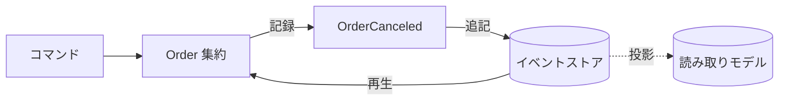
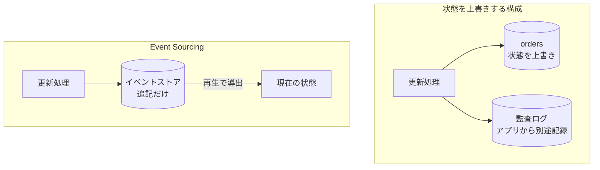
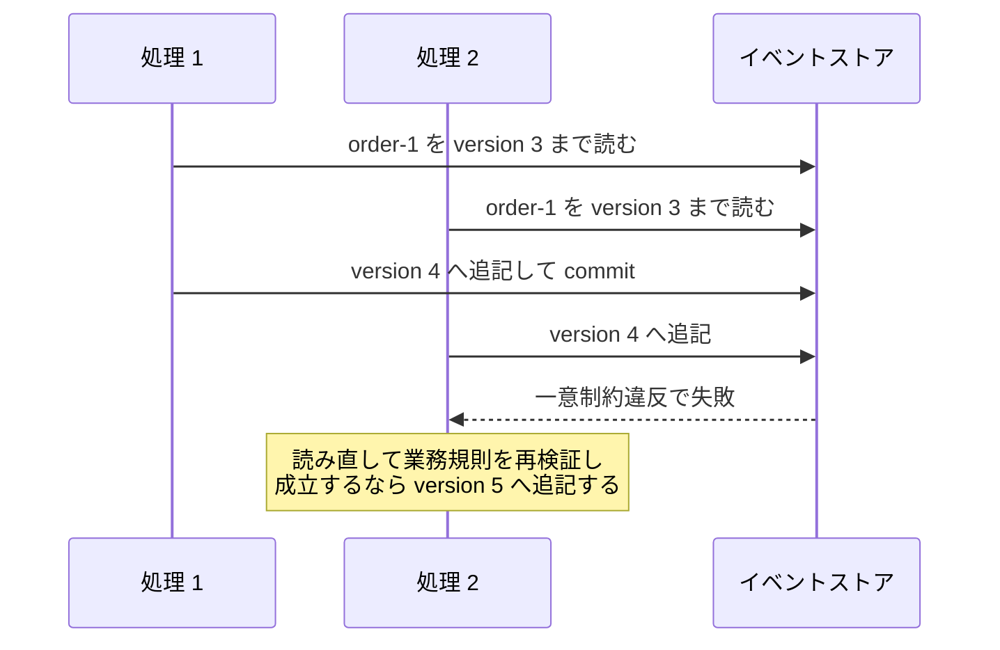
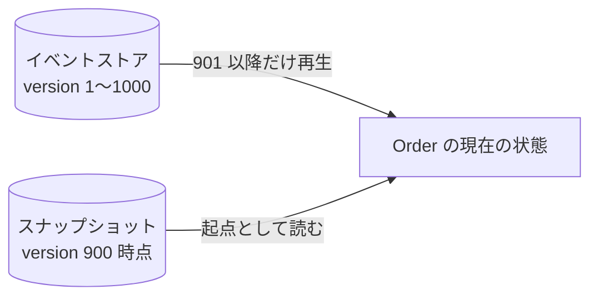
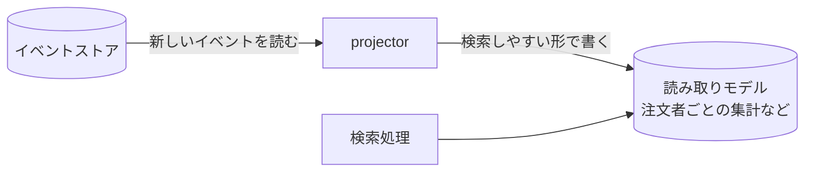

Event Sourcing とは、アプリケーションの現在の状態ではなく、状態を変えた出来事の並びを永続化し、状態はその再生で復元する方式です。Martin Fowler 氏の [Event Sourcing](https://martinfowler.com/eaaDev/EventSourcing.html) は、この方式を「アプリケーションの状態への全ての変更をイベントの列として記録する」と要約しています。

出来事を表すオブジェクトそのものは [Domain Event](../domain-event/) で扱ったので、ここではその並びを一次記録に据える部分を扱います。例には、Domain Event のノートと同じ注文（`Order` [集約](../value-object-entity-aggregate/)）を使います。

イベントを他のシステムへ配送する仕組み（Transactional Outbox など）は [Domain Event](../domain-event/) で説明済みのため繰り返しません。[CQRS](../cqrs/)（Command Query Responsibility Segregation、更新と読み取りでモデルを分ける考え方）の詳細も対象外とし、関係だけを末尾で整理します。

この方式が必要な場面の代表は、「なぜこの状態になったのか」へ後から答える必要がある業務です。例えば、EC サイトのサポート窓口には「この注文はなぜキャンセルされているのか」という問い合わせが届きます。現在の状態だけを保存する作りでは、`orders` テーブルの `status` 列に `canceled` と残っているだけで、いつ・どの操作で・どんな内容からそうなったのかは、上書きの瞬間に消えています。

ここで扱う構成を以下に示します。



上図のコマンドは、`order.Cancel(...)` のようなメソッド呼び出しで表される状態変更の要求です。要求を受けた `Order` 集約がイベントを作り、イベントストアへ追記されます。イベントストアが唯一の一次記録で、`Order` の現在の状態はイベントの再生で、検索用の読み取りモデルはイベントの投影で、どちらも後から導出されます。再生と投影が何をするかは、以下の節で順に見ていきます。

---

### なぜ状態の上書きでは足りないのか

`UPDATE orders SET status = 'canceled'` という書き方は、前の値を消す事で新しい値を作ります。履歴が要るなら監査ログのテーブルを足し、業務データと同じトランザクションで書けば、片方だけ残る事は防げます。それでも、アプリケーションが業務処理の副産物として監査ログを書く構成では、次の 2 つの問題が残り得ます。

1 つは、全ての更新経路がログを書くという前提です。書き忘れた経路の更新は履歴に残らず、DB のトリガーで漏れを塞ぐような仕組みを別に作らない限り気付けません。もう 1 つは、状態を導出できる形でログを設計しない限り、状態とログのどちらも相手から導出できない事です。2 つが食い違った時、どちらが正しいのかを決める根拠がありません。

2 つの構成の違いを以下に示します。



上図の右側では、記録が業務処理の副産物ではなく本体です。イベントに残らなかった更新は状態にも反映されないため、再生で導出される状態については「状態は変わったのに履歴に無い」という食い違いが構造として起きません。Fowler 氏は、イベントログの上に築ける機能の 1 つとして、「アプリケーションの状態を完全に捨てて、空のアプリケーションへイベントログからイベントを再実行する事で再構築できる」事を挙げています。

なお、Fowler 氏は公式な記録（system of record）をイベントログと現在の状態のどちらに置くかは選べるとも書いています。ここでは、イベントログを一次記録に置く構成だけを扱います。

---

### イベントストアへの追記

イベントストア（event store）は、イベントを記録順に追記するだけの保存場所です。ここでは、集約 1 つにつき 1 本のストリーム（stream、イベントの列）を持たせます。ストリームの中の順序は通し番号（version）で固定し、番号の起点は実装ごとの規約で、この例では 1 から始めます。

具体的には、以下のような行が並びます。

| stream_id | version | name | payload | occurred_at |
|---|---|---|---|---|
| order-1 | 1 | order.placed | `{"lines": [...]}` | 2026-08-10T09:00:00Z |
| order-1 | 2 | order.confirmed | `{...}` | 2026-08-10T09:05:00Z |
| order-1 | 3 | order.canceled | `{"reason": "..."}` | 2026-08-10T10:30:00Z |

行の更新も削除も行わず、操作は末尾への INSERT だけです。payload の列には、イベントの中身が JSON で入ります。書き込みの流れは、まずストリームを読んで `Order` を復元し（復元の中身は次の節で見ます）、業務規則を検証してから、新しいイベントを追記する、という順になります。

同じ注文への操作が同時に 2 つ走ると、両方が version 4 への追記を試みます。`(stream_id, version)` に一意制約を張っておき、`Order` を読み込んだ時点の version を期待値として追記すると、後から書いた方だけが失敗します。

```go
// Append は、Order のストリームへ新しいイベントを追記します。
// expected には、Order を読み込んだ時点の最後の version を渡します。
func (s *eventStore) Append(tx Tx, streamID string, expected int, events []DomainEvent) error {
	for i, ev := range events {
		// (stream_id, version) には一意制約があり、同じ番号への
		// 追記が同時に走ると、後から書いた方が制約違反で失敗する
		if err := s.insert(tx, streamID, expected+i+1, ev); err != nil {
			return err
		}
	}
	return nil
}
```

途中の insert が失敗してエラーを返すと、呼び出し側がトランザクションごと巻き戻す前提です（Domain Event のノートの `u.tx.Do` と同じ形）。失敗した側は、新しいトランザクションでストリームを読み直し、業務規則を検査し直してから新しい version でやり直します。読み込み時の値を期待して書き、外れたらやり直すこの形は、[Domain Event](../domain-event/) の在庫の例で見た楽観的ロックと同じです。

競合の流れを以下に示します。



上図の一意制約が防いでいるのは、同じ version への重複した追記です。番号が飛ばない事は、制約ではなく、実際に読んだ末尾の version を expected に渡すという手順が支えています。追記だけの記録から全体を組み立てる発想は [WAL](../../distributed-systems/write-ahead-log/)（Write-Ahead Log、先行書き込みログ）と共通で、WAL が DB 内部の復旧用の記録であるのに対し、イベントストアは業務の語彙で書かれた公式の記録という違いがあります。

---

### 再生による状態の復元

現在の状態は、ストリームを version 順に読み出し、空の `Order` から 1 件ずつ適用すると戻ります。適用の処理と、業務規則の検証は分けて置きます。

```go
// apply は、イベント 1 件を状態へ反映します。イベントは既に起きた
// 事実なので、業務規則の検証は行いません。ただし、解釈できない
// イベントはエラーにして、再生そのものを失敗させます。
func (o *Order) apply(ev DomainEvent) error {
	switch e := ev.(type) {
	case OrderPlaced:
		o.id = e.OrderID
		o.status = OrderStatusDraft
		o.lines = e.Lines
	case OrderConfirmed:
		o.status = OrderStatusConfirmed
	case OrderCanceled:
		o.status = OrderStatusCanceled
	default:
		return fmt.Errorf("unsupported event: %T", ev)
	}

	// version は、反映に成功したイベントの分だけ進める
	o.version++
	return nil
}

// replayOrder は、ストリームの全イベントから Order を復元します。
func replayOrder(events []DomainEvent) (*Order, error) {
	o := &Order{}
	for _, ev := range events {
		if err := o.apply(ev); err != nil {
			return nil, err
		}
	}
	return o, nil
}
```

「確定前の注文はキャンセルできない」のような検証は、イベントを新しく作る側のメソッド（Domain Event のノートの `Confirm` にあたる部分）で行います。`apply` が受け取るのは検証を通って記録された過去の事実なので、業務規則の検証で失敗させる事はしません。失敗はイベントを作る側の責務です。この分離によって、イベントを作った時の業務規則をもう一度検証せずに、記録済みの事実を再生できます。

一方で、`default` でエラーを返す事には理由があります。解釈できないイベントを読み飛ばすと、実際には起きた変化が抜けた状態で `Order` が復元され、その誤った状態を前提に新しい業務処理が走ります。例えば、支払い済みを表す `OrderPaid` を知らない古いコードが再生を続けると、未払いの注文として扱ってしまいます。イベントが一次記録である以上、意味を取り違えた状態で処理を進めるより、再生を失敗させて気付ける方が安全です。

そのため、古い形式のイベントは `apply` へ渡す前に片付けます。ストリームから読み出す段（deserialize）で、現在のコードが解釈できる形へ変換（upcast）してから `apply` に渡す、という置き方です。新旧のイベントが混ざる話は、欠点の節で改めて触れます。

再生には、任意の時点で止められるという性質も付いてきます。Fowler 氏は「空の状態から特定の時刻またはイベントまでを再実行する事で、任意の時点のアプリケーションの状態を決定できる」と述べています。問い合わせ対応で「キャンセル直前の注文内容」が要る時は、version 2 まで再生すれば取り出せます。

イベントが数千件へ伸びると、毎回の再生が長くなります。対策は、一定の件数ごとに状態の写し（スナップショット）を保存し、直近のスナップショットとそれ以降のイベントだけで復元する事です。復元の経路を以下に示します。



上図のスナップショットは再生を速くするための導出物で、一次記録はイベントのままです。壊れても消しても、イベントから作り直せます。

---

### 読み取りモデルへの投影

「注文者ごとの購入金額の合計」のような集計は、ストリーム単位の再生では答えにくい質問です。答えるには、全ストリームを再生して状態を組み立てた上で、集計をやり直す事になります。そこで、イベントを順に読んで検索用のテーブルを作り続けるプロセス（projector）を置き、検索は projector が作ったテーブルへ向けます。このテーブルが読み取りモデルです。

構成を以下に示します。



上図の projector がストリームを横断して読むために、全イベント共通の追記順の連番を version とは別に振る設計がよく使われます。ここでは、projector がイベントの追記とは別のタイミングで読み取りモデルへ反映する構成を扱います。

この構成では、イベントの追記から反映までの間だけ、読み取りモデルは古い値を返します。つまり[結果整合](../domain-event/)（いずれ一致するものの、ある瞬間を切り取るとずれを許す性質）です。その代わり、読み取りモデルはいくつでも持て、検索の形ごとに最適な構造を選べます。後から新しい検索が必要になったら、新しい読み取りモデルを作って過去のイベントを最初から投影し直すだけで済みます。

書いた本人の画面にすら古い値が出るのは困る、と考える方がいるかもしれません。書いた直後に必要なのが、その集約自身の現在の状態だけなら、読み取りモデルを介さず、ストリームを再生して答える手があります。追記と同じ DB を使っていれば、追記した本人は自分の書いたイベントまで含めて読めるためです。ただし、この手が効くのは 1 本のストリームで答えられる範囲に限られ、上の集計のように複数の注文を横断する検索は読み取りモデルに頼る事になります。

---

### 利点

- 「なぜこの状態になったのか」に、記録そのものが答える
- イベントを漏れなく保持している限り、任意の時点の状態を再生で復元できる
- 読み取りモデルを後から何種類でも追加・再構築できる
- 書き込みを追記中心にでき、単純な RDB 実装なら `(stream_id, version)` の一意制約を使って同一ストリームへの競合を検出できる

---

### 欠点

以下は、起きた事実の記録を捨てない事を優先した帰結です。

- イベントの形を後から変えにくく、古い形式のイベントを読み続ける仕組み（バージョン管理）が要る
- 現在の状態を見るだけの操作にも、再生かスナップショットか読み取りモデルの用意が要る
- 読み取りモデルを非同期に投影する構成では結果整合になり、書いた直後の検索が古い値を返す場合がある
- 個人情報の削除要求と、イベントを消さない方針が正面から衝突する

1 番目のバージョン管理を具体的に言うと、過去のイベントは書き換えられないため、payload の形が違う新旧 2 世代のイベントが同じストリームへ混ざります。読み込むコードが古い形式も解釈し続けるか、読み込み時に新しい形式へ変換する層を挟むかは、形を変えるたびに決める事になります。

最後の項目には、イベントには識別子だけを載せて個人情報の本体は消せる別の保存場所に置く、個人ごとの暗号鍵で暗号化しておき鍵を消して読めなくする、といった対処があります。どれもイベントの不変性と削除要求の間の妥協で、設計の初期に決めておく方が安全だと考えられます。

---

### 適さないケース

- 状態の履歴に業務上の価値が無い、CRUD（Create / Read / Update / Delete）中心のシステム
- 一覧や集計の検索が主体で、読み取りモデルの遅れも二重の保守も割に合わない業務
- 出来事の語彙がまだ固まっていない探索段階のプロダクト。イベントの設計ミスが記録として残り続ける

---

### Domain Event・CQRS との関係

Domain Event のノートは「Domain Event を使う事は、Event Sourcing を採用する事を意味しません」と締めていました。ここまでを踏まえると、ここで扱った Event Sourcing は、Domain Event の並びを状態を導出する一次記録に据えた構成だと整理できます。逆に、ここで見てきたように集約が発するイベントをそのまま一次記録にする構成では、保存される記録は全て Domain Event になります。

[CQRS](../cqrs/)（Command Query Responsibility Segregation）は、[Fowler 氏の説明](https://martinfowler.com/bliki/CQRS.html)を借りると「情報の更新に使うモデルと、読み取りに使うモデルを別にできる」という考え方です。読み取りモデルへの投影の節で見た構成は、書き込みがイベントストア、読み取りが投影先という CQRS の形になっています。

ただし、2 つは独立した判断です。CQRS はイベントを保存しなくても成立し、Event Sourcing は読み取りモデルを分けなくても成立します。Fowler 氏も、CQRS はリスクを伴う複雑さを加えるため、システム全体ではなく特定の部分に限って使うべきだと注意しています。相性が良い事と、常にセットで使う事は別だと考えられます。
