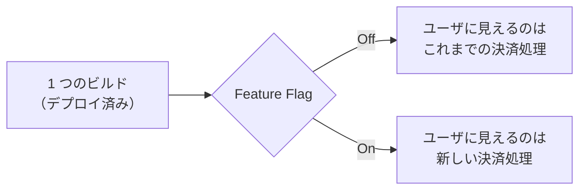
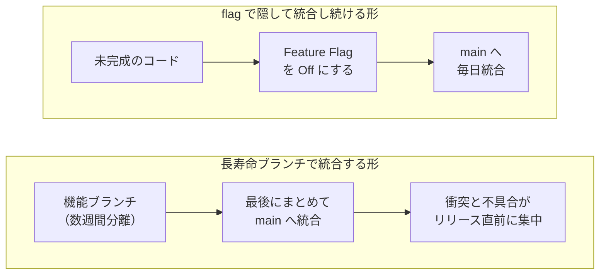
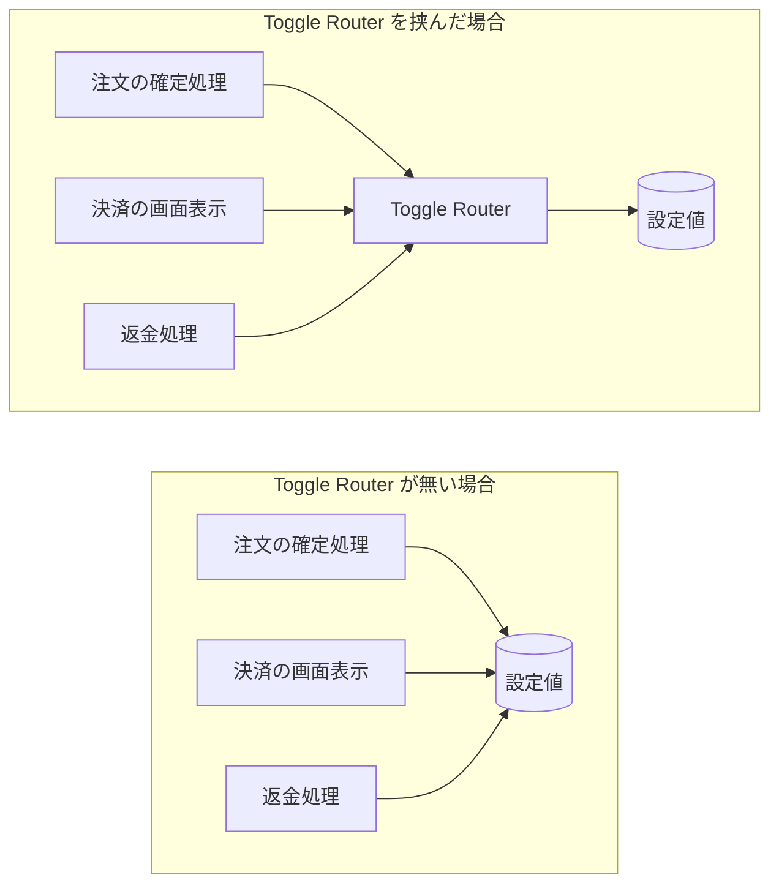
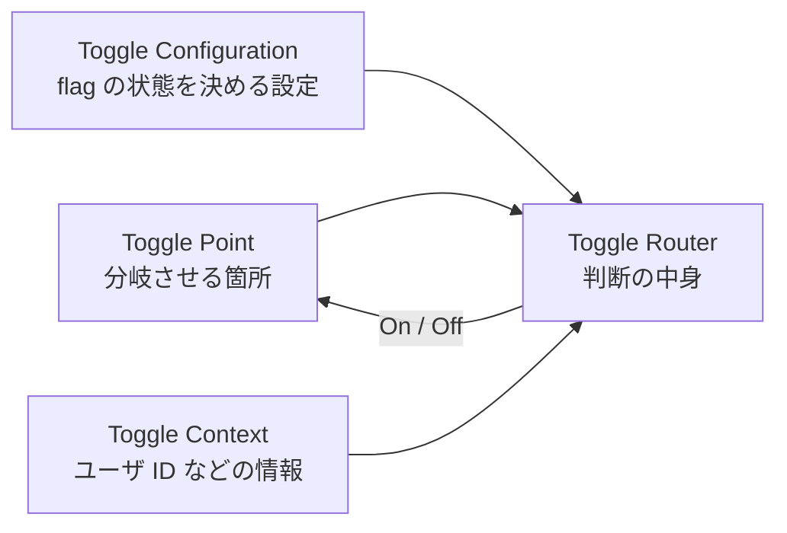
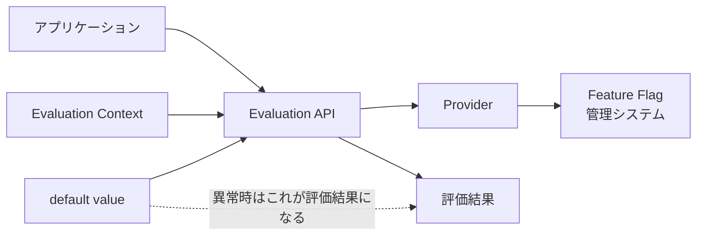
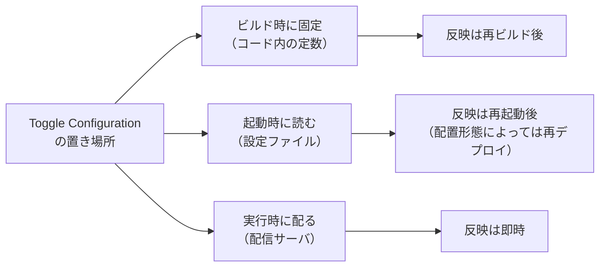

Feature Flag は、デプロイしたコードの振る舞いを設定や実行時の情報によって切り替える仕組みです。この実践を体系的に整理した Pete Hodgson 氏の「[Feature Toggles (aka Feature Flags)](https://martinfowler.com/articles/feature-toggles.html)」は、両者を同義として交換可能に使っています。ここでは Feature Flag で通します。

例えば、`if isNewCheckoutEnabled { ... }` で新機能を出し分ける分岐が、この仕組みの最小の形です。

Feature Flag が効果的なのは、デプロイとリリースを別のタイミングにしたいチームです。コードを本番環境へ置く作業がデプロイ、その機能がユーザへ見え始める事がリリースで、Feature Flag はこの 2 つを切り離します。決済処理を差し替えるなら、Off のまま先にデプロイし、まず社内ユーザだけに有効化し、問題がなければ一般ユーザへ広げられます。

本ノートでは、On と Off の 2 値を返す Boolean Flag を中心に、分岐の設計と削除運用を扱います。Experiment Toggle のように、評価の結果を決めるために利用者の情報を使う flag も出てきます。boolean 以外の値を返す flag と、値を配信する製品の選び方は対象外とします。

1 つのデプロイ済みビルドから、Off と On でユーザに見える物が変わる様子を以下に示します。



Off の分岐へこれまでの実装を置く方針は、Hodgson 氏が勧めています。この方針に揃えておくと、全ての組み合わせではなく、本番で使う予定の構成と、問題が起きたときの切り戻し先を重点的に検証できます。

---

### なぜ Feature Flag が必要なのか

機能ごとに長寿命のブランチを切ると、統合は最後にまとまって発生します。同時に完成へ近づく機能が多いほど、衝突と不具合がリリース直前に集中します。

デプロイとリリースを 1 つの操作として扱う設計も、同じ弱さを抱えます。切り戻しが前のビルドの再デプロイになり、直前まで動いていた別の変更まで巻き戻ります。



上図の右では、未完成のコードを Off の分岐へ閉じ込められる限り、統合を先送りせずに済みます。代わりに、ユーザにはまだ公開していないコードパスも本番環境へ載る事になります。切り戻しの速さは値の置き場所で変わり、Feature Flag の値を外部の設定サービスから取得する構成なら、値の変更だけで切り替えられます。値をリポジトリで管理する構成なら、変更の反映には再デプロイが必要です。

---

### 判断する場所と、判断の中身を分ける

どちらのコードパスを通すかを分岐させる箇所を Toggle Point、その判断を行うロジックを Toggle Router と呼びます。Hodgson 氏は、Toggle Point が設定値を直接読み、判断のロジックまで抱える形を避けるよう勧めています。

例えば、各処理が `new-checkout` という設定値を直接読むと、判断条件を変えるたびに、その設定を参照している箇所をすべて修正する必要があります。Toggle Router を挟めば、各処理は「新しい Checkout を使うか」という判断だけを問い合わせ、flag の名前や評価方法を知らずに済みます。

設定値を直接読む形と、Toggle Router を挟んだ形を以下に示します。



上図の左では、判断のロジックを変えるたびに設定値を読む箇所を全部たどり直す事になり、1 箇所の漏れに気付きにくくなります。

```go
// Before: 業務ロジックが設定パッケージの値を直接読んでいる。
func Checkout(ctx context.Context, cart Cart) error {
	if config.NewCheckout {
		return checkoutV2(ctx, cart)
	}
	return checkoutV1(ctx, cart)
}
```

```go
// After: 判断に名前を付けて渡す。Checkout は Feature Flag を知らない。
type CheckoutDecisions interface {
	UseNewCheckout(ctx context.Context) bool
}

func Checkout(ctx context.Context, cart Cart, d CheckoutDecisions) error {
	if d.UseNewCheckout(ctx) {
		return checkoutV2(ctx, cart)
	}
	return checkoutV1(ctx, cart)
}

// Toggle Router 側。flag の名前はここだけに置く。
// EnabledOrDefault は、評価できない時に第 3 引数へ落ちる実装とする。
// ここで false を選んでいるのは、落ちた時に既存の実装を通すためである。
func (r *Router) UseNewCheckout(ctx context.Context) bool {
	return r.config.EnabledOrDefault(ctx, "new-checkout", false)
}
```

After の Checkout は、`new-checkout` という flag の名前や、その値をどこから取得するかを知りません。知っているのは `UseNewCheckout` という判断だけです。flag の名前や評価方法は Router 側へ閉じ込めています。そのため、設定ファイルから値を読む方式を外部の flag 管理サービスへ変えても、`Checkout` 側の分岐はそのままにできます。

`Checkout` を呼ぶ側は `CheckoutDecisions` の実装を渡す必要があります。Hodgson 氏は、このような依存の組み立てを factory などの一箇所へ集める形を紹介しています。`EnabledOrDefault` の第3引数 false は、flag を評価できなかった場合の fallback です。この例では既存の `Checkout` 処理へ戻すために false を選んでいますが、常に false が安全とは限りません。

Toggle Router が判断に使うのは、flag の状態を決める Toggle Configuration と、ユーザ ID のように判断へ添える Toggle Context です。



上図の Toggle Router は、両方から判断を組み立てます。設定だけで決まる flag なら Toggle Context は空で構いません。

---

### 評価 API は OpenFeature で共通仕様化されている

Hodgson 氏が整理しているのは、Toggle Point・Toggle Router・Toggle Context という設計と運用の概念です。評価をどう呼び出すかという、ベンダーに依存しない共通の API までは定めていません。そこを定めているのが [OpenFeature](https://openfeature.dev/) で、Feature Flag の評価についてベンダー非依存の仕様を置いています。



アプリケーションが呼ぶ入口が Evaluation API、判断へ添える情報が Evaluation Context です。Feature Flag 管理システムとの接続を受け持ち、flag の値を解決する境界が Provider です。

default value は、呼び出す側が Evaluation API へ渡す値です。評価の途中で異常が起きた場合は、その値が評価結果として返ります。Off に決まっているわけではなく、先の `EnabledOrDefault` へ渡した `false` は、この Checkout で既存の実装を通すために選んだ値です。

Toggle Context と Evaluation Context は役割が近いだけで、同じ物ではありません。Toggle Router は判断のロジックを含むので、値を解決する境界である Provider とは対応しません。

---

### 寿命と、判断の動的さで実装を決める

Hodgson 氏は Feature Flag を、どれくらい長く残るかと、実行中にどれくらい動的に判断する必要があるかという 2 つの軸で整理しています。

例えば、Release Toggle は短命で静的な判断でも足ります。一方、Experiment Toggle はユーザごとに異なる結果を返すため、リクエストごとの動的な判断が必要です。

この 2 軸から整理した 4 種類を以下に示します。

| 分類 | 寿命 | 判断の動的さ | 代表的な用途 |
|---|---|---|---|
| Release Toggle | 多くは 1〜2 週間を大きく超えない。公開時期をプロダクト側で決める場合は例外 | 静的でよい | 未完成の機能を隠したまま統合する |
| Experiment Toggle | 同じ設定のまま、有意な結果が出るまで | リクエストごとに分かれる | A/B テストでユーザを振り分ける |
| Ops Toggle | 多くは短命。高負荷時に機能を縮退させる Kill Switch は例外 | 再設定で即座に変える必要がある | 性能影響が読めない機能を運用側から止める |
| Permissioning Toggle | 年単位になる事もある | リクエストごとに分かれる | 有償会員だけに機能を開く |

寿命と動的さでは、設計上見直す場所も異なります。短命な flag なら単純な条件分岐で足りますが、長く残すなら分岐そのものを抽象化した方が扱いやすくなります。一方、運用中に値を切り替える必要があるなら、Toggle Configuration をどこに置くかも考える必要があります。

Toggle Configuration の置き場所は、変更が反映されるまでの単位を決めます。



Hodgson 氏は、flag の性質が許すならソース管理へ置いて再デプロイで変える形を勧めています。リリースごとの Toggle Configuration が固定される分、検証すべき構成が減るためです。即座の再設定が要るのは Ops Toggle のような一部です。

下へ行くほど反映は速くなり、部品も増えます。Experiment Toggle は判断そのものが動的でも、Toggle Configuration は静的なままで構いません。実験の途中で設定を変えると、結果が統計的に無効になりかねません。

---

### 消す前提で作る

Feature Flag は放っておくと増え、コードの分岐も積み上がります。特に Release Toggle は、全体公開が終われば役目も終わります。そこで Hodgson 氏は、flag を追加した時点で削除タスクもバックログへ積む運用を紹介しています。

削除を後回しにすると、すでに使われていない Off 側のコードが残り続け、後から見た開発者には消してよい分岐なのか判断できなくなります。

flag が残っている間は、本番で使う予定の構成だけでなく、問題が起きた時に切り戻す構成も検証しておきます。すべての flag の組み合わせを網羅する必要はありません（[Feature Toggles (aka Feature Flags)](https://martinfowler.com/articles/feature-toggles.html)）。

---

### 利点

- 値を外部の設定サービスから取得する構成なら、公開の取り消しをデプロイと切り離せる
- 未完成のコードを main へ入れ続けられ、長寿命ブランチの統合をやめられる
- ユーザの一部だけへ段階的に公開でき、問題を小さい範囲で検知できる
- A/B テストや権限による出し分けも、同じ Toggle Router の機構で扱える

---

### 欠点

以下は、切り替えを実行時に選べる自由度を優先した結果の制約です。

- 分岐が増えるほど、検証する構成も増える
- flag の値を管理する仕組み自体が新しい依存になる
- 削除を怠ると、Off のまま読まれなくなった分岐でコードが埋まる
- 同じ機構で扱えても、設定の置き場所と管理者は flag の分類が変われば見直す事になる
- Experiment Toggle のようにユーザを cohort へ割り当てる flag は、同じユーザを一貫して同じ cohort へ割り当てる必要がある

---

### 適さないケース

- リリース後に判断が変わらない、恒久的な設定の分岐（環境ごとの接続先の切り替えなど）
- 未完成のコードを隠す必要が無く、機能ごとに短い期間で統合し切れるチーム
- flag を削除する運用を続ける体制が無く、増える一方になりやすいチーム
