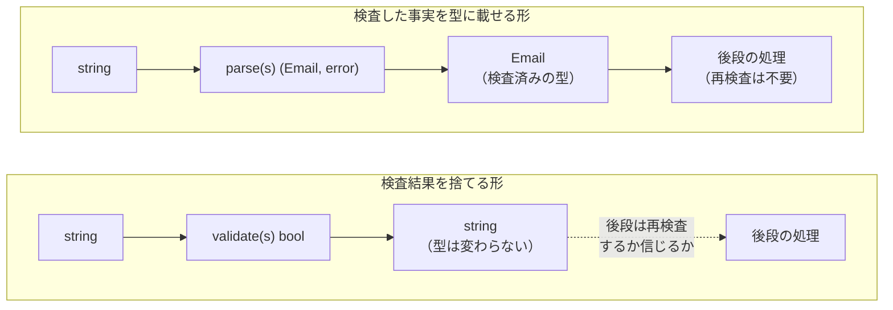
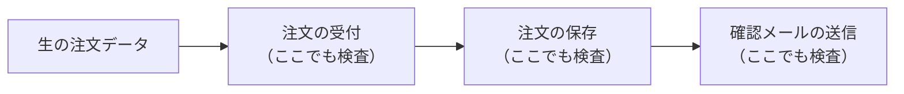
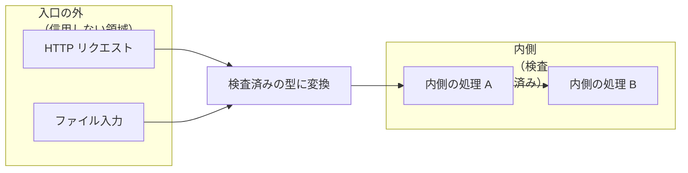
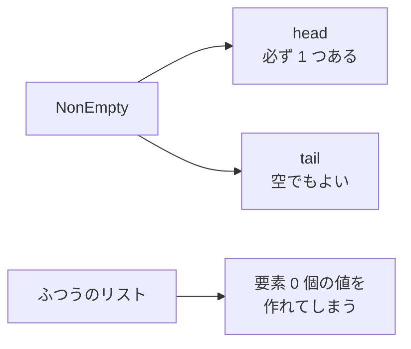
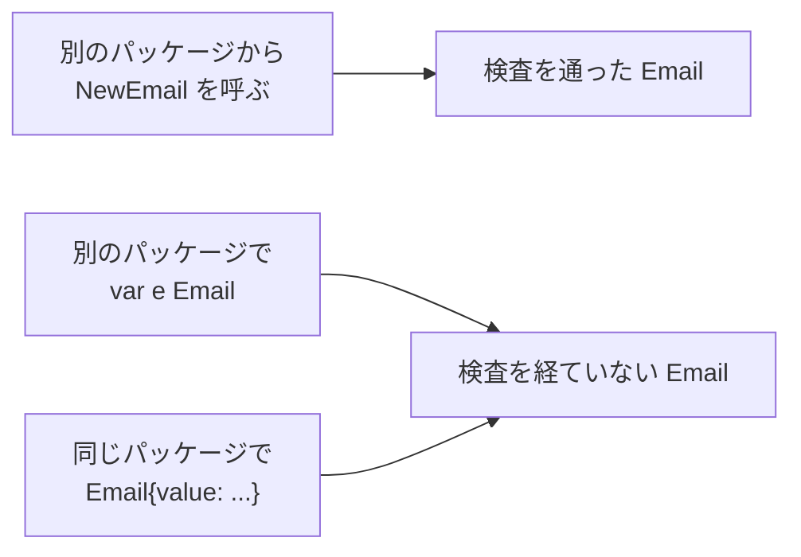
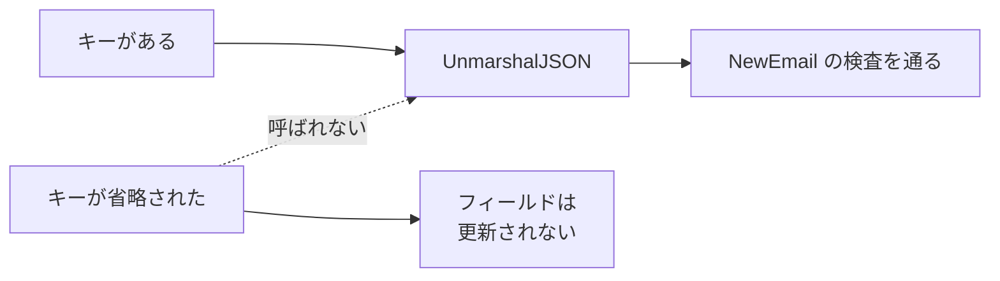

Parse, don't validate は、「外部から来たデータを検査したら、その検査で分かった事実を型として持ち運ぶ」という設計方針です。Alexis King 氏が 2019 年に公開した「[Parse, don't validate](https://lexi-lambda.github.io/blog/2019/11/05/parse-don-t-validate/)」で示しました。

この概念が効果的なのは、外部からの入力を複数の関数に渡しながら処理を進めるコードです。注文データなら、注文 ID・商品コード・数量・メールアドレスがそのまま後段の関数に流れていき、各関数は同じ検査を繰り返すか、検査済みだと暗黙に信じるかのどちらかになります。

ここで扱うのは、入力そのものから判定できる形式・構造・値域などの不変条件です。在庫の有無や権限のように、外部状態に問い合わせなければ決まらない条件は別に扱います。検査した時点の事実を型に載せる事はできます。しかし、その型だけで後の外部状態まで保証はできません。



上記の図の右では、検査で分かった事実を `Email` という型に載せて後段に渡しています。これをどこまで型だけで成立させられるかは言語によって変わり、Go ではゼロ値が例外になります。

---

### validate は検査した事実を捨てる

`validate` という名前の関数は多くの場合、`bool` か `error` を返します。`error` なら失敗の理由や種類まで運べます。ただし、検査対象の型は前後で変わりません。`string` は `string` のままなので、検査によって得た「この値は条件を満たしている」という事実は、後段に型として引き継がれません。値を受け取った関数は、それが検査済みかどうかを型から判断できません。



上記の図では同じ検査が 3 箇所に複製されています。問題になるのは重複そのものよりも、後段で検査が失敗した時には既に前段が入力に作用し終えている点です。

King 氏は、この状態を指す語として 2016 年の論文 The Seven Turrets of Babel の「[Shotgun parsing is a programming antipattern whereby parsing and input-validating code is mixed with and spread across processing code…](https://lexi-lambda.github.io/blog/2019/11/05/parse-don-t-validate/)」（解析と入力検査のコードが処理コードに混ざり、散らばってしまうアンチパターン）を引いています。

---

### 変換は入口に寄せる

生のデータは、必要な精度の型に、できる限り入口で変換します。必要以上に精密にはしません。内側の関数は、受け取った型が検査済みだと前提にでき、同じ検査を書き直さずに済みます。



寄せるのは変換であって、変換の回数を 1 回に固定する話ではありません。多段の解析は認められており、「[Don’t be afraid to parse data in multiple passes.](https://lexi-lambda.github.io/blog/2019/11/05/parse-don-t-validate/)」（データを何段階かに分けて解析する事を恐れなくて良い）と書かれています。

避けるのは、解析を終える前に、その入力に基づく処理を始める事です。分岐が決まってから更に精密な型が必要なら、その時点で追加の解析をして構いません。

---

### 型で不正な値を作れなくする

不正な状態を型で表現できない形にできれば、その不変条件について後段で検査する必要がなくなります。

King 氏が例に使う `NonEmpty` は、先頭の要素をリスト本体とは別のフィールドとして持つ型です。残りの部分が空でも先頭は必ず存在するので、要素 0 個の値を作れません。前述の記事で "really just a tuple" と書かれている通り、これは直和型ではなく直積型であり、Go でも同じ形を書けます。



Go でも `type NonEmpty[T any] struct { head T; tail []T }` として同じ形を書けます。`NonEmpty` のように形だけで不変条件が閉じる型は、そのまま書けます。手段が足りなくなるのは、次の節の `Email` のように値の中身に条件を課す場合です。

型で閉じられない物もあります。通常の値として「A か B のどちらか」を閉じて表現する代数的データ型としての直和型は、Go にはありません。ジェネリクスの type constraint には `A | B` という union type term があります。これは型引数が満たすべき条件を書くための記法で、値がどちらか一方である事を保持する型ではありません。

直和型の代わりには、interface と型スイッチで近い形を組む事になります。interface に未公開のマーカーメソッドを置けば、パッケージ外からそのメソッドを直接実装する事は防げます。ただし既存の実装型を埋め込んだ型は、メソッドが promoted されて interface を満たすため、排除できません。Go の interface を完全な直和型として閉じる事はできず、型スイッチが全ての場合を尽くしているかもコンパイラは保証しません。

---

### コンストラクタで塞げる範囲

King 氏は、不正な状態を型だけで表現できない場合には、内部表現を隠した型とスマートコンストラクタで解析器を模す事を勧めています。Go では型を公開したままフィールドを未公開にし、公開コンストラクタから生成させる形に置き換えられます。別のパッケージからは、未公開フィールドに値を入れた状態で組み立てられません。

```go
package email

// Email はメールアドレスとして扱う文字列を表す。
// ゼロ値は無効で、通常は NewEmail から生成する。
type Email struct{ value string }

func NewEmail(s string) (Email, error) {
	if !strings.Contains(s, "@") {
		return Email{}, errors.New("invalid email format")
	}
	return Email{value: s}, nil
}

func (e Email) String() string { return e.value }
```

`NewEmail` から得た値は、その時点で `NewEmail` の検査条件を満たしています。`Email` という型である事自体が検査を通った事を示す訳ではなく、検査の厳密さも `NewEmail` の実装が決めます。上の実装なら `"@"` という 1 文字も通ります。

この形でも塞げない経路が 2 つあります。Go の変数は宣言しただけで初期化されるので、`var e Email` はコンパイルを通り、空の `Email` が出来上がります。同じパッケージの中なら `Email{value: "bogus"}` も書けます。



未公開フィールドが塞ぐのは、パッケージの外から任意の内部値を直接注入する経路です。ゼロ値の生成は言語仕様なので塞げず、同じパッケージの中では未公開フィールドに直接値を入れられます。

---

### `encoding/json` v1 の入口も同じ境界に含める

デシリアライズも外部入力の入口なので、コンストラクタと同じ検査をそこでも通します。以下は標準ライブラリ `encoding/json`（v1）の挙動で、Go 1.25 で `GOEXPERIMENT` として追加された `encoding/json/v2` は API も既定の挙動も異なります。

v1 の `Unmarshal` は未公開フィールドに書き込まないため、`Email` に `UnmarshalJSON` を実装しなければ、JSON 側がオブジェクトなら未公開フィールドは書かれずゼロ値が残り、文字列なら型が合わずエラーになります。`Email` は未公開フィールドしか持たないので、`json.Marshal` も `{}` を返し、書き出した物を読み戻せません。入口と出口の両方を自分で実装します。

```go
// UnmarshalJSON は e を書き換えるためポインタレシーバになる。
func (e *Email) UnmarshalJSON(data []byte) error {
	var s string
	if err := json.Unmarshal(data, &s); err != nil {
		return err
	}
	parsed, err := NewEmail(s)
	if err != nil {
		return err
	}
	*e = parsed
	return nil
}

// MarshalJSON は値レシーバにして、値のまま渡した時も扱えるようにする。
// ゼロ値は NewEmail を経ていないので、書き出さずエラーにする。
func (e Email) MarshalJSON() ([]byte, error) {
	if e.value == "" {
		return nil, errors.New("invalid email: zero value")
	}
	return json.Marshal(e.value)
}
```

`UnmarshalJSON` を値レシーバで書くと、書き込み先がコピーになるためコンパイルは通ったまま結果が捨てられます。`MarshalJSON` は値レシーバで書き、`NewEmail` を経ていないゼロ値はエラーにします。

`UnmarshalJSON` を実装しても、親オブジェクトからフィールド自体が省略されれば `UnmarshalJSON` は呼ばれず、そのフィールドは更新されません。



必須フィールドの欠落は `UnmarshalJSON` だけでは検知できないので、親の入力型を解析し、後段で使う型に変換する段階で扱います。

| 保ちたい事 | Go にある物 | 無い物 | 代わりに使う手 |
|---|---|---|---|
| 外部から任意の内部値を直接構築できない | 未公開フィールドとコンストラクタ関数の組 | ゼロ値の生成を止める仕組み | 外部入力を受け取る型と後段で使う型を分け、変換の時点でゼロ値を弾く。ゼロ値が有効値と重なる型では区別できない |
| 「A か B」を型で閉じる | interface と未公開のマーカーメソッド | 値としての直和型、網羅性を機械的に確かめる手段 | マーカーメソッドで直接の実装を防ぎ、埋め込みと網羅性は静的解析ツールやレビューで補う |
| デシリアライズも入口に含める | `json.Unmarshaler` と `json.Marshaler` | `Unmarshal` がコンストラクタを通る保証 | 入出力の両方を自分で実装し、入力用の型から後段用の型に変換する際に必須フィールドの欠落も検出する |

値の直接生成については、ゼロ値と同一パッケージ内からの構築を塞げません。値としての直和型が無い事や型スイッチの網羅性は、生成の経路ではなく表現力の話で、静的解析ツールやレビューで補います。

---

### 利点

- 検査した事実を型で運べるため、コンストラクタを通った値については後段の再検査が必要ない
- 不正な状態が生じ得る箇所は、外部入力の変換境界・ゼロ値・同一パッケージ内の直接生成に整理できる
- 検査ロジックが処理コードの各所に散らばらない

---

### 欠点

以下は、検査の一貫性を型に移した結果として現れる制約です。

- 型を増やすたびに、コンストラクタと入出力の実装が定型的に増える
- Go ではゼロ値を止められず、任意の内部値の直接構築を防げるのもパッケージの外に対してだけになる
- 値としての直和型が無いため、型で表現しきる設計を保つには静的解析とレビューによる補強が必要

---

### 適さないケース

- 一度しか使わない使い捨てのスクリプトで、型を増やす手間が検査の手間を上回る場合
- 外部ライブラリの型をそのまま経由する箇所が多く、コンストラクタを強制できない場合
- 検査結果を使い回す前に、値がすぐ使い捨てられる処理
