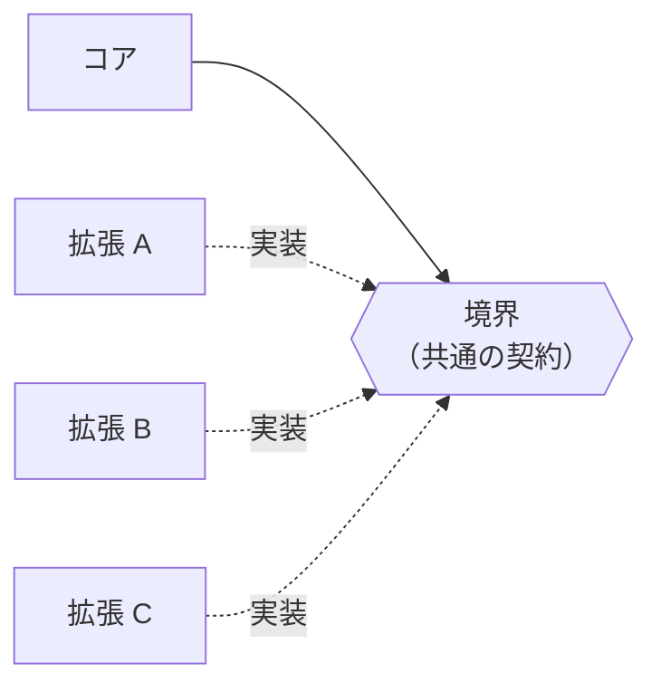
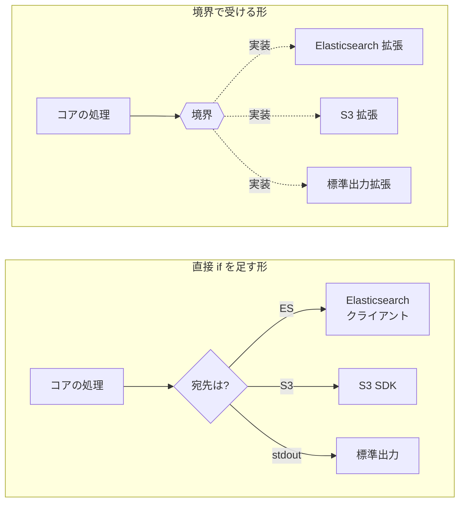
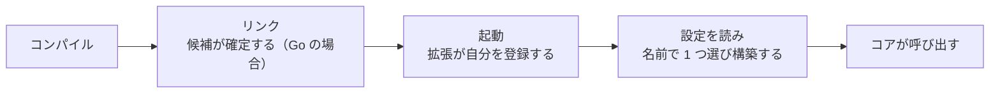
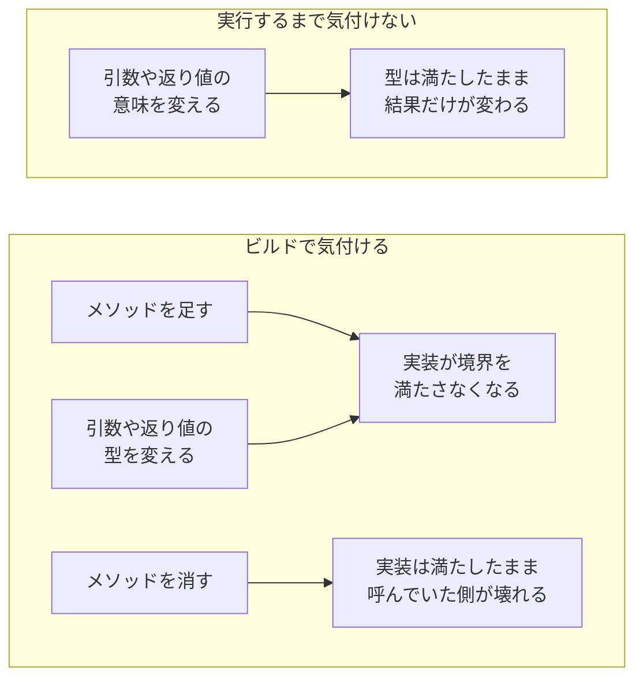
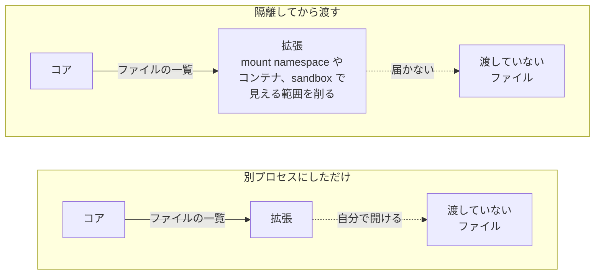
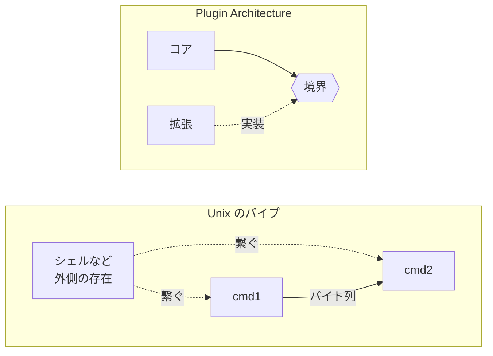

Plugin Architecture は、コア（core、常に動く中心部分）に手を入れずに機能を追加できるようにする設計です。コアが持つのは、処理の入れ物と、拡張が満たすべき境界だけです。エディタに拡張機能を入れると、本体を差し替えずに機能が増えます。Go の `database/sql` がデータベースドライバを `Register` 関数で受け取るのも、同じ形です。

Plugin Architecture が特に効くのは、対応する宛先や形式が増え続けるプログラムです。ログ収集ツールの出力先が 3 つで始まっても、半年後には別の宛先を求められます。

Plugin Architecture では、境界の設計に加えて、拡張を同一プロセスに載せるか（in-process）、別プロセスに分けるか（out-of-process）も設計上の選択になります。



上記の図でコアが依存するのは境界だけで、拡張 A・B・C の実装の中身には依存しません。in-process の Go 実装なら、この境界をインターフェースで表せます。

---

### なぜコアに直接足すと行き詰まるのか

新しい出力先を追加する最も手早い方法は、コアの処理に `if` を足す事です。

問題は、宛先が増えるたびにコアの分岐と依存が両方とも増える点です。Elasticsearch 用のクライアントと S3 用の SDK が同じ関数に並び、使わない宛先の依存まで抱えます。



境界で受ける形なら、宛先を 1 つ足してもコアの処理と依存は変わりません。増えるのは拡張だけです。

---

### plugin の境界をどこに引くか

Go の in-process 実装なら、コアがインターフェースを宣言し、拡張がそれを実装できます。ただし、インターフェースを切っただけでは Plugin Architecture になりません。どの実装を使うかをコアの処理に埋め込まず、設定から選べるようにします。

『Patterns of Enterprise Application Architecture』の David Rice 氏と Matt Foemmel 氏は、Plugin を「[Links classes during configuration rather than compilation.](https://martinfowler.com/eaaCatalog/plugin.html)」（結び付けるのはコンパイル時ではなく設定の時点である）と説明しています。



同書が問題として挙げているのは 2 つで、どの実装を使うかの決定があちこちに散る事と、設定を変えるのに再ビルドや再デプロイが必要な事です。インターフェースを実装とは別のパッケージに置く [Separated Interface](https://martinfowler.com/eaaCatalog/separatedInterface.html) は、前者を解きません。境界と実装を切り離しても、どの実装を選ぶかをファクトリメソッドで書けば、その分岐は呼び出し側に散らばったままです。

同書はこの 2 つを「[Plugin solves both problems by providing centralized, runtime configuration.](https://martinfowler.com/eaaCatalog/plugin.html)」（集中管理された実行時の設定を用意する事で解決する）と書かれています。集中管理の実体は、名前と実装を対応付ける 1 つのレジストリです。選択はそこに集まり、コアは設定から読んだ名前でレジストリを引きます。

レジストリに登録する物は、組み立て済みの実装でも構いません。`database/sql.Register` は `driver.Driver` をそのまま受け取ります。拡張ごとに接続先や認証情報が必要なら、設定を受け取って実装を組み立てる Factory を登録できます。

```go
package export

import (
	"fmt"
	"sync"
)

// Exporter は出力先を表す境界です。
type Exporter interface {
	Export(data []byte) error
}

// Config は設定ファイルなどから読んだ、拡張ごとの設定です。
// S3 なら bucket や region、Elasticsearch なら endpoint が入ります。
type Config map[string]any

// Factory は設定を受け取って Exporter を組み立てます。
type Factory func(Config) (Exporter, error)

var (
	mu        sync.RWMutex
	factories = map[string]Factory{}
)

// Register は拡張の init() から呼ぶ。実行中に呼ばれても壊れないよう保護する。
// nil と二重登録は database/sql と同じく panic させ、黙って上書きしない。
func Register(name string, f Factory) {
	mu.Lock()
	defer mu.Unlock()
	if f == nil {
		panic("export: Register with nil Factory")
	}
	if _, dup := factories[name]; dup {
		panic("export: duplicate Register for " + name)
	}
	factories[name] = f
}

// New は設定から読んだ名前で Factory を 1 つ選び、設定を渡して Exporter を組み立てる。
func New(name string, cfg Config) (Exporter, error) {
	mu.RLock()
	f, ok := factories[name]
	mu.RUnlock()
	if !ok {
		return nil, fmt.Errorf("export: unknown exporter %q", name)
	}
	return f(cfg)
}
```

このコードでは 2 つの事が別々の時点で決まります。

- 候補の集合は、実行バイナリがどの拡張パッケージを import しているかで、ビルドの時点に確定する
- その候補のうちどれを使うかは、`New` に渡す名前として設定から決まり、実行時に切り替わる

`init()` による登録は候補を実行時に増やす仕組みではなく、ビルド時に組み込まれた候補から、使う実装を実行時に選ぶ仕組みです。境界を宣言するパッケージ自身は拡張を import しません。`database/sql` も同じで、ドライバを import するのはアプリケーションです。

そのため、拡張を 1 つ増やすにはバイナリを作り直します。実行時の設定で切り替えられるのは、ビルド時に組み込んだ候補の間だけです。候補そのものをバイナリの外から足すなら、Go の `plugin` や WebAssembly のようにコアが後からコードを読み込むか、別プロセスで動く実装に接続する仕組みが必要です。

---

### 公開した境界は API になる

境界を公開すると、拡張の書き手は自チームの外にも広がります。ここからは、拡張の作者が自分たちの管理下に居ない場合の話です。

既定実装を持てないインターフェース（Go など）で境界を表している限り、メソッドの追加も破壊的変更です。追加したメソッドを持たない既存の実装は、その時点でインターフェースを満たさなくなり、ビルドが落ちます。安全なのは「メソッドを足す事」ではなく「既存のインターフェースを触らない事」です。



厄介なのは実行するまで気付けない側で、型検査もビルドも通るため、誤りが表面化するのは拡張が動いた後になります。メソッドを消した場合は実装が壊れず、そのメソッドを呼んでいたコードだけが落ちます。互換を保ったまま境界を育てる手は、既存のインターフェースを触らず、新しいメソッドを別のインターフェースとして定義する事です。

コアは受け取った拡張がそれを満たすかを実行時に確かめ、満たす拡張にだけ新しい呼び出しを行います。Go の標準ライブラリでは、`http.ResponseWriter` に対する `http.Flusher` や `http.Pusher` がこの形です。

拡張を別プロセスに分けても、公開した境界が API になる点は変わりません。互換を保つ対象が Go のインターフェースではなく、JSON や Protocol Buffers、RPC の呼び出し形式に移るだけです。フィールドを必須にする、意味を変えるといった変更が何を壊すかは、その形式の規約で決まります。

---

### in-process と out-of-process の選び方

境界を挟んで拡張を呼ぶ手段には、同一プロセスに組み込む形と、別プロセスに分ける形があります。

この 2 つの間には、WebAssembly や組み込みスクリプトのように、同一プロセスのまま別のランタイムを挟む形もあります。隔離の度合いは、ホストが何を渡すかで決まります。

| | in-process（直接リンク） | out-of-process |
|---|---|---|
| 呼び出しの速さ | 関数呼び出しと同等 | 通信の往復が挟まる |
| 拡張がクラッシュした時 | プロセスごと落ち得る。メモリ安全でない言語ならコアのメモリも壊し得る | 拡張のプロセスだけを終了させられ、クラッシュがコアを直接巻き込みにくい |
| 拡張がハングした時 | 呼び出した側が返らず、コアから安全に強制終了する手段を持ちにくい | タイムアウトの後にプロセスを kill して回収できる |
| 言語の制約 | コアと ABI を共有できる言語に限る（Go の `plugin` はビルド条件や共通依存まで強く揃える必要がある） | 拡張を別の言語で書ける |
| 直列化の要否 | 不要 | 必要 |

表の in-process は、拡張をコアに直接リンクする形に限った話です。C の ABI を共有する共有ライブラリなら、直接リンクの形でも別の言語で書けます。WebAssembly のランタイムを挟めば、同一プロセスのまま隔離もできます。代わりに、値の受け渡しに変換が必要です。

拡張にできる事を絞る話は、プロセスを分ける話とは別です。`fork` して `exec` しただけの子プロセスは、親と同じ利用者の資格で動くので、渡していないファイルでも自分で開けます。



mount namespace で見えるファイルの木を組み替える、コンテナや sandbox で可視範囲や権限を制限する、といった操作を経てから渡すと、拡張にできる事を渡した物の周辺まで狭められます。namespace にも種類があり、新しい namespace を作る事自体はファイルシステムへのアクセス制限になりません。実行する利用者を分けるだけでも、他人が読めるファイルは開けたままです。

プロセスを分けただけでは sandbox になりません。アクセス範囲を狭めるには、別途 OS の隔離機構や権限制御が必要です。

---

### Unix のパイプとの違い

小さな部品を組み合わせる点は、Unix のパイプも同じです。Unix パイプの考案者 Doug McIlroy 氏の言葉として、Eric S. Raymond 氏は「[Make each program do one thing well.](https://www.catb.org/~esr/writings/taoup/html/ch01s06.html)」（それぞれのプログラムに 1 つの仕事だけをうまくやらせる）を引いています。

違うのは、組み合わせる主体です。



Unix のパイプでプログラムを繋いでいるのはシェルで、`cmd1` は `cmd2` を知りません。Plugin Architecture で組み合わせを決めているのはコアです。

| | Unix のパイプ | Plugin Architecture |
|---|---|---|
| 合成する主体 | シェルなど外側の存在 | コア |
| 部品の形 | 独立したプログラム | 境界を実装するコード、または別プロセス |
| 運ばれる物 | バイト列（テキストで揃えるのは慣習） | 境界で定めた型やメッセージ |
| 部品の間の約束 | 入出力のバイト形式と、読み手が終了した事の伝わり方 | インターフェースや通信プロトコルの形と、エラーの扱い |

---

### 利点

- コアを変えずに機能を追加・削除でき、コアの分岐と依存が増えない
- 拡張の書き手が増えても、コアが依存するのは境界だけで済む
- 別プロセスに分ければ、拡張のクラッシュをコアから分離し、失敗を検知して再起動できる
- 見える範囲を削った環境で拡張を動かせば、拡張にできる事を狭められる

---

### 欠点

以下は、コアを変えずに機能を足せる自由度を優先した結果の制約です。

- 既定実装を持てない言語では、公開した後の境界にメソッドを追加できず、別のインターフェースを足す形になる
- 同一プロセスに直接リンクする場合、ハングした拡張をコア側から安全に強制終了する手段を持ちにくい。`context.Context` のような協調的なキャンセルは拡張が対応していて初めて効くもので、対応しない拡張を外から打ち切る手段にはならない
- 別プロセスに分ける場合、通信と直列化に加えて、ハングを止めるタイムアウトが必要

---

### 適さないケース

- 対応する宛先や形式が固定で、増減する見込みが無いシステム
- 拡張が満たすべき形を 1 つに決められず、境界のインターフェースが定まらない処理
- 拡張を書く相手がコアの開発チームしかおらず、境界を公開する意味が薄い場合
