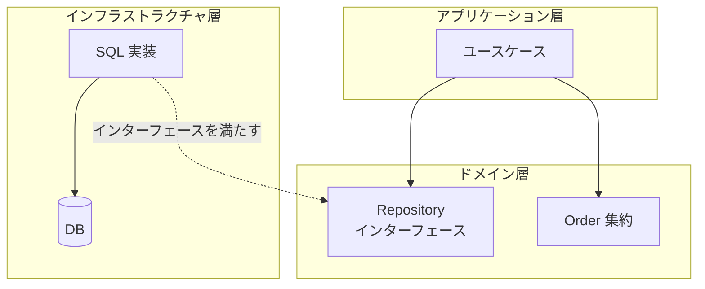
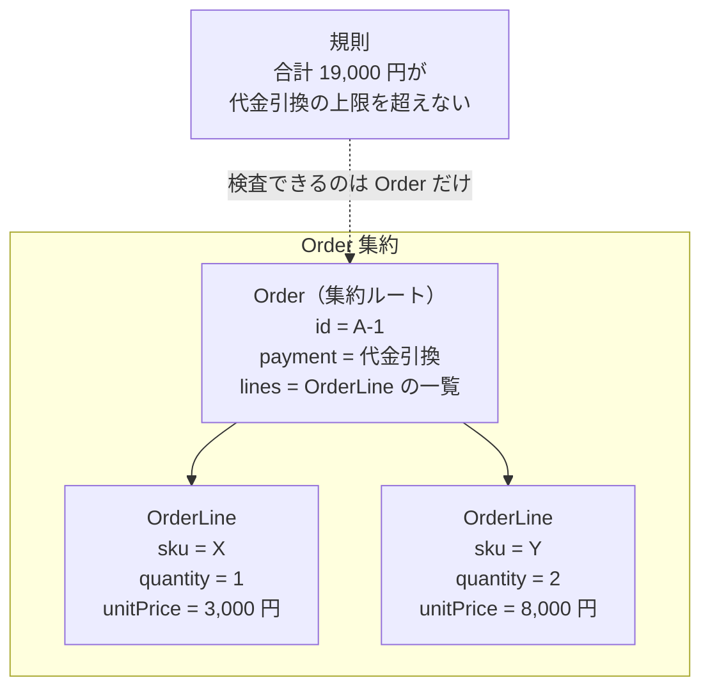
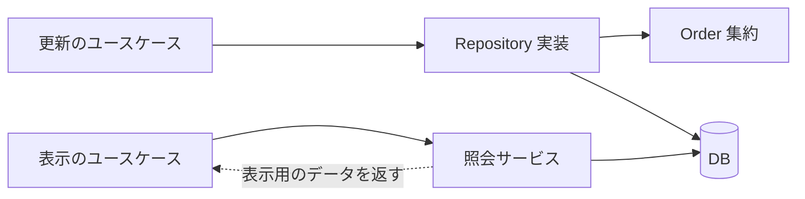

Repository とは、Aggregate（集約）を 1 つの単位として保存・復元する仕組みで、呼び出す側からはメモリ上のコレクションのように見えます。Eric Evans の [DDD Reference](https://www.domainlanguage.com/wp-content/uploads/2016/05/DDD_Reference_2015-03.pdf) は、DDD（Domain-Driven Design、ドメイン駆動設計）の Repository を「ユビキタス言語で表現された、集約への問い合わせ手段」と要約しています。ユビキタス言語とは、[Bounded Context](../bounded-context/) の中の全員が会話・図・コードで同じ意味で使う語彙です。

Martin Fowler の書籍『Patterns of Enterprise Application Architecture』でも、Edward Hieatt と Rob Mee が [Repository](https://martinfowler.com/eaaCatalog/repository.html) を「ドメイン層とデータマッピング層の仲介役で、コレクションのようなインターフェースを通じてドメインオブジェクトへアクセスさせるもの」と定義しています。この定義に集約は現れません。出し入れの単位を集約へ結び付けているのは DDD で、その制約が実装へ何を持ち込むのかが、ここでの主題になります。

O/R マッパ（Object-Relational Mapper、オブジェクトと DB のテーブルを対応付ける仕組み）の選び方や DB（データベース）スキーマの設計は範囲外で、[Value Object・Entity・Aggregate](../value-object-entity-aggregate/) で扱った集約ルートと不変条件の話を前提にします。層は 3 つ出てきます。ドメイン層は業務の規則と、それを表す型を置く場所です。アプリケーション層はユースケースの手順を組み立てる場所で、インフラストラクチャ層は DB やネットワークを実際に触る場所を指します。

例には、注文（`Order`）と、その中にある明細を使います。3 つの層が誰をどちらから参照しているかを以下に示します。



上図の点線が、実装とインターフェースの関係を表しています。インターフェースをドメイン層に置き、実装をインフラストラクチャ層に置くと、層をまたぐ実線はドメイン層へ向かうものだけになります。ドメイン層は DB の存在を知らないまま「注文を保存する」と書け、SQL を書くコードはドメイン層を参照する立場に回ります。

この向きの変え方を依存性逆転と呼びます。呼び出す側でインターフェースを宣言し、呼び出される実装がそれを満たすと、参照は実装からインターフェースへ向き、上位の層が下位の層を参照する関係が消えます。なお、DDD Reference はインターフェースをどの層に置くかを指定していません。上図の配置は依存性逆転を当てはめたもので、Repository の定義そのものではありません。

注意点として、インターフェースの置き場所を変えただけでは依存は消えません。Repository のメソッドが返す型が DB の行をそのまま写した構造体なら、ドメイン層はテーブルの形に縛られたままです。返す型が集約である事まで含めて、この配置が成立します。行そのものが自分の保存方法を知る形は、Fowler が Repository と分けている [Active Record](https://martinfowler.com/eaaCatalog/activeRecord.html) にあたります。

---

### なぜ Repository が必要なのか

Order 集約の中身と、そこへ置かれた規則を以下に示します。



上図の `sku` は SKU（Stock Keeping Unit、在庫管理の最小単位）で、在庫を数える単位ごとに振る番号です。同じ商品でも、色やサイズが違えば別の SKU になります。合計 19,000 円は、`unitPrice` と `quantity` を明細 2 件分だけ掛けて足した値です。

`OrderLine` は自分の `sku` と `quantity` しか知らないため、合計が上限を超えたかどうかを 1 件では判定できません。判定できるのは、`lines` に 2 件とも持っている `Order` です。集約の外から `OrderLine` へ直接届く経路があると、この判定を通らずに `quantity` が変わります。

ユースケースが直接 SQL を書くと、その経路ができます。次の 1 文は `Order` を経由しません。

```sql
UPDATE order_lines SET quantity = 10 WHERE order_id = 'A-1' AND sku = 'X';
```

集約ルートを迂回して明細を書き換える経路は、[Aggregate](../value-object-entity-aggregate/) でも扱いました。オブジェクトの参照ではなく SQL で起きているだけで、壊れ方は変わりません。Evans は、制約のないクエリが 2 通りの壊し方をし得ると書いています。

1 つは、オブジェクトから特定のフィールドだけを引き出してカプセル化を破る事。もう 1 つは、集約の内部にあるオブジェクトだけを単体で構築する事です。明細だけを取り出すと、集約ルートである注文は取り出された事を知らないため、合計金額の上限を検査する機会がありません。規則を検査できるオブジェクトが居なくなると、検査はクエリとアプリケーション層のコードへ移り、Entity と Value Object には規則を持たないフィールドだけが残ります。

この `UPDATE` はエラーを返しません。壊れた状態が表に出るのは、後で誰かが注文を復元して合計を見た時で、原因になった `UPDATE` とは時間も呼び出し元も離れています。Repository は、この経路を塞ぐために出入り口を集約ルートへ一本化します。

一本化するだけなら、ユースケースの中で毎回 `Order` を組み立て直しても達成できます。その場合、注文を読むたびに 2 つのテーブルへの SELECT と集約の組み立てがユースケースへ散り、業務の手順と SQL が同じ関数に並びます。Repository が引き受けるのは、この組み立てと分解を 1 箇所へ集め、ドメイン層の語彙で呼べるインターフェースの裏へ置く事です。

ドメイン層が DB を知らなくなると、テストで実装を差し替えられるようになります。ただ、差し替えられる事は結果であって、Repository を置く理由ではありません。テストのためだけなら、DB のクライアントを引数で渡す形でも同じ事ができます。

---

### 仕組み

#### インターフェースをドメイン層に置く

呼び出す語彙を決めるのはドメイン層で、それをどう満たすかを DB の都合で決めるのがインフラストラクチャ層、という分担にします。Go でこの分担を書くと次のようになります。

```go
// Package order は販売コンテキストの注文集約です。
package order

import "context"

// ID は注文の同一性です。
type ID string

// Repository は Order 集約の出し入れを表します。実装は infrastructure に置きます。
type Repository interface {
	// FindByID は集約全体を復元して返します。
	FindByID(ctx context.Context, id ID) (*Order, error)
	// Save は集約の現在の状態をそのまま書き込みます。
	Save(ctx context.Context, o *Order) error
	// Remove は集約を取り除きます。
	Remove(ctx context.Context, id ID) error
	// FindUnshipped は出荷が済んでいない注文を返します。
	FindUnshipped(ctx context.Context) ([]*Order, error)
}
```

前の 3 つが集約の出し入れで、`FindUnshipped` は業務の語をそのままメソッド名にしたものです。条件が業務の語に収まるうちはメソッドを増やし、収まらなくなった時に別の手を検討します。インターフェースの宣言をドメイン層に置いた事が、依存の向きを決めています。`implements` を書く言語でも、実装がインターフェースを参照する向きは同じで、Go の場合はインターフェースを満たす型に宣言を要求しないため、実装のパッケージへ手を入れずに利用する場所で後から宣言できます。

`FindByID` が返すのは注文 1 件の行ではなく、明細まで含んだ集約全体です。復元の単位が集約になるのは、集約全体にまたがる不変条件を検査できるのが、集約全体を持っている時だけだからです。明細 1 件で閉じる規則の検査に、集約全体は必要ありません。ただし、どちらの規則に触るのかを呼び出す前に判別できないため、常に全体を返す契約にします。

#### 集約単位で出し入れする

Evans は、直接アクセスが実際に必要な集約ルートに対してだけ Repository を用意する事を求めています。テーブルごとに 1 つ作る物ではないので、`OrderLine` のための Repository は作りません。明細は `Order` を通してのみ手に入ります。

テーブルごとに作った方が実装は素直になるのではないか、と考える方がいるかもしれません。確かに実装は素直になります。その代わり、`OrderLine` を単体で保存する経路が開き、上で見た `UPDATE order_lines` と同じ更新をアプリケーションのコードから書けてしまいます。

---

### 実装が引き受ける事

集約を 1 つの単位として扱う契約は、呼び出す側を単純にする代わりに、実装へ 4 つの仕事を押し付けます。集約全体の書き戻し、同時更新の検出、検索条件の翻訳、そしてトランザクションの範囲の管理です。

#### 集約全体を書き戻す

`Save` は集約の現在の状態をそのまま書き込む契約なので、実装は「今ある明細の一覧」を DB へ反映します。どの明細が増えたのかは渡されないため、最も単純な実装は、全ての明細を削除してから書き直します。

```go
// saveLines は明細を全て削除してから、集約が今持っている明細を書き直します。
func saveLines(ctx context.Context, tx *sql.Tx, o *order.Order) error {
	if _, err := tx.ExecContext(ctx,
		"DELETE FROM order_lines WHERE order_id = ?", string(o.Identity())); err != nil {
		return err
	}
	for _, l := range o.Lines() {
		if _, err := tx.ExecContext(ctx,
			"INSERT INTO order_lines (order_id, sku, quantity) VALUES (?, ?, ?)",
			string(o.Identity()), l.SKU, l.Quantity); err != nil {
			return err
		}
	}
	return nil
}
```

`o.Identity()` は集約ルートの ID を返し、`o.Lines()` は明細のコピーを返します。このやり方が使えなくなる条件を以下に示します。

- 明細の行が他のテーブルから外部キーで参照されている。`ON DELETE RESTRICT` では DELETE が失敗し、`ON DELETE CASCADE` では参照元の行まで消える
- 行ごとの更新履歴やバージョン列を持っている。DB から見た記録が 1 回の更新ではなく削除と挿入になり、行の連続性が切れる
- 主キーが `AUTO_INCREMENT` のような DB 生成の値である。挿入し直した行の ID が変わる

差分が必要であれば、方法は 2 つあります。1 つは集約に変更内容を記録させる方法で、集約が自分の変更履歴を持ちます。もう 1 つは、読み込んだ時点の状態を Repository が複製して持っておき、`Save` の時に比較する方法です。

#### 同時更新を弾く

状態をまるごと上書きする契約には、もう 1 つ気を付ける所があります。2 つの処理が同じ注文を読み、それぞれ別の明細を足して `Save` を呼ぶと、後から書いた方の状態が全体を上書きし、先に書いた変更が消えます。集約ルートを通しても、この上書きは防げません。

対処には、集約にバージョン番号を持たせる方法があります。集約ルートのテーブルへ `version` 列を足し、`FindByID` で読んだ値を集約が覚えておいて、`Save` が発行する `UPDATE` の条件へ渡します。上の `saveLines` と同じトランザクションで、次の 1 文を実行します。

```sql
UPDATE orders SET version = 8 WHERE id = 'A-1' AND version = 7;
```

読み込んだ時のバージョンが 7 で、その間に誰も書いていなければ、上の文は 1 行を更新してバージョンを 8 へ上げます。先に別の処理が 8 へ上げていた場合、`WHERE` に合う行が無く、更新された行は 0 件になります。実装は 0 件を競合として扱い、明細の削除と挿入ごとトランザクションを rollback します。バージョンを集約ルートの行にだけ置くのは、明細しか変わっていない場合も同じ番号を上げて、集約全体を 1 つの単位として守るためです。

この対処を入れると、`Save` の契約が変わります。「そのまま書き込む」から「読み込んだ後に他の処理が書き換えていなければ書き込む」になるので、失敗をインターフェースへ出します。

```go
// ErrConflict は、読み込んでから Save までの間に
// 他の処理が同じ集約を書き換えていた場合に返ります。
var ErrConflict = errors.New("order: conflict")
```

呼び出す側は `ErrConflict` を受け取ったら、`FindByID` から読み直して同じ操作をやり直すか、利用者へ知らせるかを選びます。どちらを選ぶかは操作ごとに変わるため、Repository では決めません。集約を守るのは Repository の仕事で、競合した時にどう振る舞うかはユースケースの判断になります。

`Remove` も同じ単位で働き、集約を明細ごと取り除きます。ここまでの制約は、どれも集約を 1 つの単位として出し入れする契約から出ています。差分の計算とバージョンの管理を実装が引き受ける代わりに、集約を更新する正しい経路が 1 つに定まります。

定まるのは正しい経路であって、他の経路を書けなくするわけではありません。同じアプリケーションの中で `db.Exec` へ `UPDATE` を渡すコードは書けてしまうため、塞ぐなら DB 接続を持つ型をインフラストラクチャ層の中へ閉じ込め、外のパッケージから触れなくします。

#### 検索条件をどう渡すか

Evans は、ドメイン専門家にとって意味のある条件でオブジェクトを選ぶメソッドを用意する事を求めています。「出荷が済んでいない注文」は業務で使う語で、`FindUnshipped` はその語をそのままメソッド名にしたものです。一方、`FindByCustomerIDAndStatusAndCreatedAfter` は SQL の `WHERE` 句を写しただけで、業務の語にはなっていません。

条件の組み合わせが増えれば、メソッドも増えます。対処の方向は 3 つあります。

| 方向 | 内容 | 向く場面 |
|---|---|---|
| メソッドを増やす | 業務の語になる条件だけをメソッドにする | 条件の種類が少なく、名前が業務の語に収まる |
| Specification を渡す | 条件そのものをオブジェクトにして組み合わせる | 条件を実行時に組み立てる必要がある |
| 照会の経路を分ける | 表示のための検索を Repository の外へ出す | 検索条件が画面の都合で決まり、更新に使わない |

Specification とは、Evans と Fowler が論文「[Specifications](https://martinfowler.com/apsupp/spec.pdf)」で示したパターンで、候補が条件に合うかを判定する規則そのものをオブジェクトにします。論文が中心の考えとして挙げているのは、合致の判定方法の記述と、判定される候補オブジェクトを分離する事です。条件を `and` や `or` で組み合わせられるため、メソッド名の組み合わせ爆発は起きません。

ただし、この論文が扱っているのは、候補を受け取って真偽を返す `isSatisfiedBy` という判定の抽象で、条件を DB のクエリへ変換する方法は含まれていません。Repository へ Specification を渡す設計では、`WHERE` 句への変換を自分で書く事になります。全件を読み込んでから絞る実装は正しい結果を返すものの、時間とメモリが候補数に比例するため、早い段階で実用に耐えなくなります。条件の種類が少ないうちはメソッドを増やす方が読みやすく、名前が業務の語から外れ始めた時が、他の 2 つを検討する合図になると考えられます。

#### トランザクションの範囲

Evans は、トランザクションと分散（複数のサーバへ分けて置く事）を統べる単位として、集約の境界を使う事を求めています。1 回の操作で 1 つの集約だけを更新するなら、`Save` の中でトランザクションを開いて閉じる形にできます。この形では `FindByID` と `Save` が別のトランザクションになるため、上で書いたバージョン番号による検査が別途必要です。

複数の集約を 1 回の操作で更新したくなった場合、まず境界が業務と合っていない徴候として疑います。2 つの集約が同時に壊れる規則があるなら、その規則を検査できるのは両方を持っている場所だけで、境界の引き直しが解になるためです。境界が正しいと判断した場合の道は 2 つあり、1 つは、別々のトランザクションに分けて結果整合性で追いつかせる方法で、[Aggregate](../value-object-entity-aggregate/) で扱いました。

もう 1 つは、トランザクションを Repository の外で開いて実装へ渡し、1 つのトランザクションへ収める方法です。Go では `context.Context` へ入れて渡す方法と、トランザクションを表す型を引数に足す方法があり、2 つは隠す物が逆になっています。`context.Context` へ入れる方法はインターフェースの形を変えずに済み、その代わり、トランザクションが必要かどうかを呼び出す時に型から読み取れません。引数に足す方法はシグネチャに現れる代わりに、ドメイン層のインターフェースが永続化の語を持つ事になります。

---

### 読み取りと噛み合わない所

Repository は集約全体を復元します。この性質は不変条件を守る時に効き、画面へ一覧を出す時には重くなります。注文の一覧に 20 件を並べ、1 件につき注文番号と合計金額と状態の 3 つだけを表示する場合でも、20 個の集約を明細まで含めて構築する事になります。表示のためだけに集約を丸ごと復元するのは無駄ではないか、と考える方がいるかもしれません。

Evans は、完全に構築された集約であるかのように見せる proxy を返す選択肢も挙げています。明細を触られた時に初めて DB を読む形になるため、一覧の各行で明細を触ると読み込みが件数分だけ走ります。もう 1 つの方向が、照会の経路を Repository から分ける事で、以下ではその方法を扱います。

更新と表示で経路を分けた構成を以下に示します。



上図の実線は全て呼び出しの向きで、下の経路は集約を通らずに DB へ届いています。照会サービスは表示に必要な列だけを SELECT し、集約ではないデータを返すため、明細を構築する処理が発生しません。この分割を明示的な設計として扱い、更新と照会で別のモデルを持つものが CQRS（Command Query Responsibility Segregation）です。ここでは Repository の限界として触れるだけで、CQRS 自体は扱いません。

照会の経路が読み取りだけに閉じている限り、読み取りが集約を通らない事は規則を弱めません。閉じているという条件が付くのは、照会サービスが返したデータをそのまま更新の入力にすると、集約ルートを通らない更新経路が戻ってくるためです。更新は、必ず集約を復元し直してから行います。

---

### 利点

- 集約の出入り口が 1 箇所に定まり、集約ルートを通らない更新が設計上の逸脱として見分けられる
- ドメイン層に SQL が現れず、業務の規則だけを読める状態でモデルを保てる
- 検索の条件が業務の語でメソッド名に現れ、モデルの語彙として読める
- 保存と復元の単位が集約と一致し、トランザクションの範囲が設計から読み取れる
- 副次的な結果として実装を差し替えられ、DB を立てずにドメインの規則を検証できる

---

### 欠点

以下は、集約を 1 つの単位として扱う事を優先した結果として現れる制約です。

- 集約全体を復元するため、一覧表示のように一部の属性しか使わない処理で無駄が出る
- 差分ではなく状態を渡す契約になり、どの行を更新すべきかを実装が自分で決める事になる
- 状態をまるごと上書きするため、同時に保存されると先の更新が消え、バージョン番号による対処が要る
- 条件の組み合わせが増えるとメソッドが増え、Specification のような別の仕組みを用意する事になる
- 複数の集約を 1 つのトランザクションで更新する時、境界の外へトランザクションを持ち出す事になる
- インターフェースと実装が別の層に分かれるため、作成と参照しか無い機能では記述だけが増える

---

### 適さないケース

- テーブルの内容をそのまま入出力し、更新の規則がほとんど無いシステム
- 表示のための読み取りが中心で、集約を復元する必要が薄い機能
- 検索条件が画面の都合で頻繁に変わり、業務の語へ落とせない機能
- 1 回限りの移行スクリプトのような、モデルを長く保守しないコード
