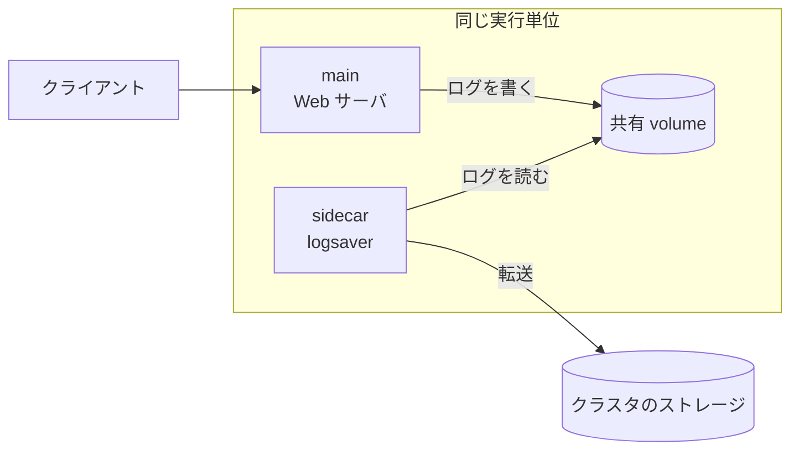
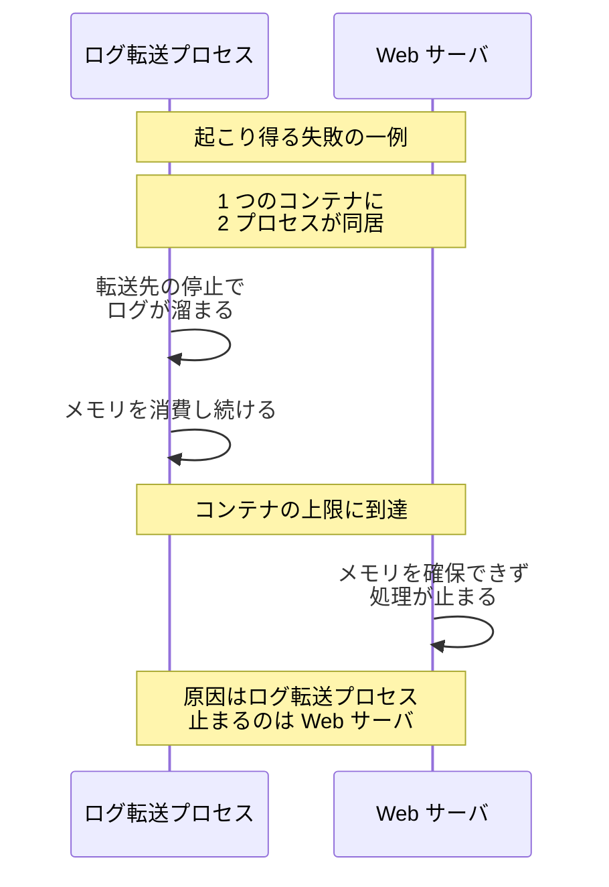
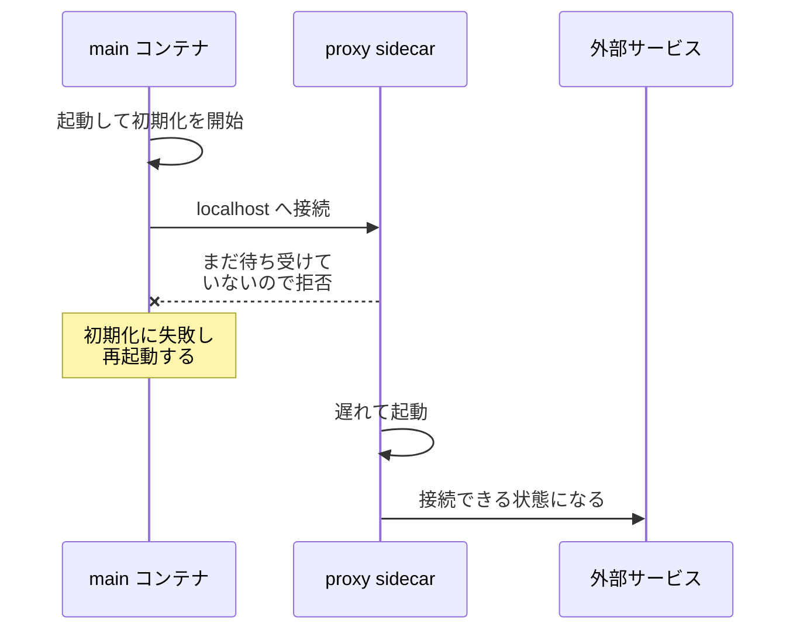
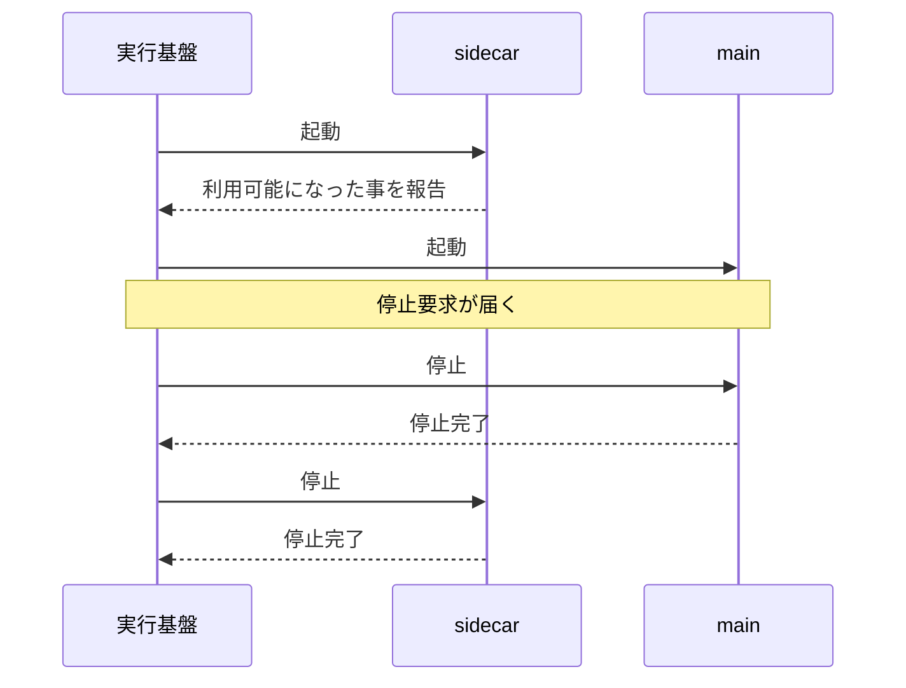

Sidecar とは、主となるアプリケーションのコンテナと同じ実行単位へ一緒に配置し、そのアプリケーションへ機能を足す補助コンテナです。ログの転送・設定の取得・通信の暗号化のような、業務ロジックと直交する処理を担当します。ここで言う実行単位とは、同じマシンへまとめて配置され、まとめて作られ削除されるコンテナの集まりを指します。

中には複数のコンテナを置け、それぞれを独立したコンテナとして設定できます。コンテナの配置とライフサイクルを管理する基盤は、ここでは実行基盤と呼びます。Kubernetes や Amazon ECS がこれにあたります。ここでは 1 台のマシンへ同居させる構成だけを扱い、複数のマシンへまたがる[Leader and Followers](../../distributed-systems/leader-and-followers/)のようなパターンは対象外とします。

この名前は、Brendan Burns が 2015 年 6 月 29 日に公開したブログ「[The Distributed System ToolKit: Patterns for Composite Containers](https://kubernetes.io/blog/2015/06/the-distributed-system-toolkit-patterns/)」で、Ambassador・Adapter と並ぶ 3 つのパターンの 1 つ目として紹介されました。

体系化したのは、Brendan Burns と David Oppenheimer が 2016 年に発表した論文「[Design Patterns for Container-based Distributed Systems](https://www.usenix.org/conference/hotcloud16/workshop-program/presentation/burns)」です。

同論文の 4.1 節は Sidecar を複数コンテナ構成で最も一般的なパターンと位置付け、「Sidecar はメインのコンテナを拡張し、強化する」と説明しています。例として挙がっているのは、Web サーバのログをローカルディスクから読み取り、クラスタのストレージへ流す logsaver コンテナです。

論文の例と同じ構成を以下に示します。

上図の 2 つのコンテナは、共有 volume だけで繋がっています。volume とは、コンテナの外に置かれ、同じ実行単位の複数のコンテナから同じ内容が見えるファイルの置き場です。マウントとは、volume が自分のファイルシステムの一部として見えるように指定する操作です。

双方がマウントして初めて、同じ内容が見えます。Web サーバはログをファイルへ書くだけで、転送先も転送の再試行も知りません。logsaver はログの形式を知っていれば動くので、Web サーバが何語で書かれていても同じコンテナイメージを使い回せます。

---

### なぜ Sidecar が必要なのか

ログの転送のような機能を足す方法は、Sidecar のほかに 2 つあります。1 つはライブラリとしてアプリケーションのコードへ組み込む方法で、もう 1 つはメインのコンテナイメージへ同梱し、1 つのコンテナで 2 つのプロセスを動かす方法です。

ライブラリで足すと、言語ごとに実装が要ります。例えば、Go・Java・Python で書かれたアプリケーションへ、ログの転送・設定の同期・メトリクスの変換・通信の暗号化の 4 つを足す場合、3 言語 × 4 機能で 12 個の実装を保守する事になります。転送先の仕様が変わった時に直す場所も 3 箇所あり、直した後は全てのアプリケーションを再ビルドして配り直す必要があります。業務ロジックと直交する処理がアプリケーションのコードへ入り込む点も、この方法の代償です。

同梱する方法では、実装は 1 つで済みます。代わりに、1 つのコンテナへ入れた 2 つのプロセスは、実行基盤から見ると 1 つの資源の上限を共有します。更新とロールバックの単位も 1 つにまとまり、ログの転送だけを直したい場合でも Web サーバのコンテナイメージを作り直す事になります。

転送先が停止してログが溜まった場合に何が起きうるのかを以下に示します。

上図で処理が止まっているのは、原因を作ったログ転送プロセスではなく Web サーバです。2 つのプロセスが 1 つの上限を分け合っているので、片方が使い切れば、もう片方の使える分が減ります。別のコンテナへ分ければ、それぞれに上限を宣言できます。

Sidecar は、足したい機能を別のコンテナへ出します。論文は、コンテナが資源の計上と割り当て・パッケージング・再利用・障害の封じ込め・デプロイの単位である事を挙げ、分けた時点でこの 5 つが独立すると説明しています。再利用の単位というのは、同じ sidecar のイメージを別のアプリケーションへも付けられる事を指します。何がどこまで分かれるのかは、次の表にまとめます。上の例なら、ログ転送に小さいメモリ上限を与えて Web サーバから切り離せます。

---

### 何を共有し、何を分けるか

Sidecar が成り立つのは、同じ実行単位のコンテナが一部の資源を共有するためです。論文の 4.1 節も「Sidecar が可能なのは、同じマシン上のコンテナがローカルのディスクボリュームを共有できるためである」と書いています。共有される物と分かれる物を以下に示します。

| 対象 | 同じ実行単位の中での扱い |
|---|---|
| ネットワーク | 実行単位で共有する設定なら、互いを localhost の別ポートとして呼べる |
| volume（ファイルの置き場） | 宣言して双方がマウントすれば共有される |
| プロセス間通信の資源 | 実行基盤が用意していれば共有できる |
| コンテナイメージと依存ライブラリ | コンテナごとに分かれる |
| 資源の上限 | コンテナごとに指定できる |
| イメージのバージョン | コンテナごとに分けて管理できる |
| 再起動と障害の波及 | 実行基盤の設定によってコンテナごとに分かれる |

上の表で共有される 3 つが結合の経路で、分かれる 4 つが独立の理由になります。ログの転送のようにファイルを介する用途では volume で繋ぎ、通信を仲介する用途では localhost で繋ぎます。何をどこまで分けられるのかは実行基盤ごとに違い、既定が分離とは限りません。ネットワークを共有しない設定では、sidecar を localhost ではなく別のアドレスで呼ぶ事になります。障害の波及も同じです。

Amazon ECS には、コンテナの停止を実行単位の全体へ波及させるかどうかを決める `essential` という設定があります。[公式ドキュメント](https://docs.aws.amazon.com/AmazonECS/latest/developerguide/task_definition_parameters.html)は、`essential` が true のコンテナが何らかの理由で停止した場合、同じ Task の他のコンテナも全て停止すると書いています。既定は true なので、sidecar の停止をアプリケーションから切り離すには、この値を明示的に false にします。

---

### 起動と停止の順序

Sidecar を通信の経路に置くと、順序が問題になります。メインのコンテナが外部と通信する時に、通信を受け取って転送するプロキシの sidecar を経由させる構成では、sidecar が待ち受けを始める前にメインが通信すると失敗します。2 つのコンテナを同時に起動すると、起動にかかる時間の差で、どちらが先に準備を終えるかが実行のたびに変わります。

順序を制御しない場合に起きる失敗を以下に示します。

上図のメインのコンテナは、外部サービスの障害でも自身の不具合でもなく、同居する sidecar の起動が遅れた事で失敗しています。図の後半で sidecar は問題なく起動し、外部サービスへ繋がっています。待てば動く構成が、起動の一瞬だけ壊れる形になります。停止の順序でも同じ問題が起きます。メインがリクエストを処理している最中に sidecar が先に停止すると、処理の途中で外部への通信が切れます。逆に sidecar が動き続けると、処理を終えたら終了する構成では全体がいつまでも完了しません。

望ましい順序を以下に示します。実行基盤が sidecar のライフサイクルを扱う役目を持ちます。

上図で効いているのは、sidecar の起動と利用可能の報告が別の段になっている点です。プロセスが動き出しただけでは待ち受けは始まっていないので、実行基盤が利用可能かどうかを検査する手段を持たないと、メインのコンテナへ待つ処理を書く事になります。停止では向きが逆になり、メインが完全に止まってから sidecar を止めます。この順序と検査を宣言で表現できる実行基盤を選ぶと、アプリケーションのコードに待ち合わせの処理を持たずに済みます。

main と sidecar を同じ実行単位へ置くには、実行基盤へ渡す設定の中に両方のコンテナを定義します。順序と依存関係の表し方は実行基盤ごとに違い、Kubernetes には Sidecar Containers の仕組みがあり、Amazon ECS では実行単位にあたる Task の中へ補助コンテナを並べます。書き方はそれぞれのドキュメントに譲り、ここでは順序が必要になる理由までを扱います。

---

### 代表的な使い方

用途によって、メインのコンテナとの接点が変わります。

| 用途 | sidecar が担う処理 | 接点 |
|---|---|---|
| ログの転送 | ファイルを読み、収集基盤へ送る | 共有 volume |
| 設定の同期 | git リポジトリなどから内容を取得して置く | 共有 volume |
| 通信の仲介 | 出入りの通信を経由させ、暗号化・再試行・計測を行う | localhost |
| メトリクスの変換 | アプリケーション固有の形式から、収集基盤が読める形式へ変換する | localhost |

3 番目の通信の仲介は、service mesh のデータプレーンとして使われています。service mesh とは、サービス間の通信の制御をアプリケーションのコードから切り離し、独立した層で扱う構成です。データプレーンとは、その層のうち実際に通信を運ぶ部分で、設定を配る部分をコントロールプレーンと呼んで分けます。

service mesh の実装の 1 つである Istio の sidecar mode は、Envoy というプロキシをアプリケーションごとに sidecar として配置し、サービス間の通信を経由させます。

Istio の[アーキテクチャの説明](https://istio.io/latest/docs/ops/deployment/architecture/)は、この配置の利点を「sidecar プロキシのモデルによって、再設計やコードの書き直しを求めずに、既存のデプロイへ Istio の機能を追加できる」と書いています。Envoy が担うのは、例えば宛先の探索・負荷分散・TLS（Transport Layer Security）終端・メトリクスの収集です。

---

### 利点

- 機能を 1 度実装すれば、どの言語で書かれたアプリケーションからも同じイメージを使える
- 業務ロジックと直交する処理がアプリケーションのコードへ入らず、業務ロジックだけが残る
- コンテナごとに資源の上限を指定できるので、補助の処理がアプリケーションへ与える資源面の影響を抑えられる
- 障害の境界をコンテナで切れる構成にでき、起動後に sidecar が停止してもアプリケーションを動かし続けられる
- アプリケーションと sidecar を別のチームが開発し、単独でもまとめてもテストできる
- 配布物をコンテナごとに分けられるので、main と sidecar のバージョンを独立して管理できる

4 番目の項目は、論文が挙げる「Web サーバはログ保存が失敗しても処理を続けられる」に対応しています。効く範囲には条件が 3 つあります。1 つ目は、sidecar が停止してもメインのコンテナが機能を失わない用途である事です。通信を仲介する用途では、sidecar の停止が外部との通信の停止そのものになります。

2 つ目は、sidecar が起動を終えている事です。sidecar が起動に失敗し続ける場合、順序を守る実行基盤ではメインのコンテナがいつまでも起動しません。3 つ目は、sidecar の停止が実行単位の全体へ波及しない設定になっている事です。

---

### 欠点

以下は、機能を独立した資源・障害・更新の単位へ切り出す事を優先した結果として現れる制約です。

- 実行単位ごとに sidecar のコピーが動くため、アプリケーションを 10 台分動かすと sidecar も 10 個動く
- main と sidecar のバージョンの組み合わせが増え、テストで確認すべき数が広がる
- 通信を仲介する用途では経路が 1 段増え、往復のたびに遅延が加わる
- 起動と停止の順序を実行基盤の宣言で表現する必要があり、書き方を誤ると順序が保証されない
- sidecar が起動に失敗すると、順序を守る実行基盤ではメインのコンテナも起動しない
- 共有 volume が資源の面では結合点として残り、片方の書き込みがもう片方を巻き込む
- アプリケーションのプロセスから見えない場所で通信の内容が変わるため、障害の切り分けにコンテナをまたいだ調査が要る

2 番目は論文自身が挙げている代償です。同論文は、複数のコンテナを不可分に更新する事は一般にできず、更新の途中で新旧が混在するため、本番で現れうるバージョンの組み合わせを全てテストの対象に含める必要があると書いています。6 番目については、共有 volume に容量の上限を置ける実行基盤なら、転送が止まった時にディスクを埋め尽くす所までは防げます。1 番目の資源については、実行単位が数千に達する構成で総量が設計の制約になると考えられます。

---

### 分ける利益が小さいケース

- アプリケーションが 1 つの言語だけで書かれ、足したい機能も 1 つしかない構成
- 実行単位の数が多く、sidecar の常駐メモリの総量が無視できない構成
- 許容できる遅延が小さく、プロキシを 1 段挟む余裕が無い通信
- 複数のコンテナを同じマシンへまとめて配置する抽象を持たない実行基盤

1 番目の構成でも、障害の境界・権限の境界・資源の上限・独立した更新のどれかが欲しければ、分ける理由は残ります。求めるものがどれも無いなら、ライブラリとして組み込む方が経路も運用も短く済むと考えられます。2 番目には別の選択肢があり、ログの転送のようにマシン単位でまとめられる処理なら、実行単位ごとではなくマシンごとに 1 つだけ配置する方式を採れます。

Istio の [ambient mode](https://istio.io/latest/docs/overview/dataplane-modes/) は、通信の仲介でこの形を採った構成です。Sidecar が効くのは、同じ機能を複数のアプリケーションへ配る場面と、補助の処理をアプリケーションの資源と障害から切り離したい場面です。

---

### Ambassador・Adapter との違い

論文は、同じマシンへ同居するコンテナのパターンを 3 つ並べています。Sidecar が 1 つ目、Ambassador が 2 つ目、Adapter が 3 つ目で、上下の関係は付いていません。Ambassador は通信の仲介、Adapter は出力の標準化を扱います。

| | Sidecar | Ambassador | Adapter |
|---|---|---|---|
| 論文の節 | 4.1 | 4.2 | 4.3 |
| 論文での役割 | メインのコンテナを拡張し、強化する | メインのコンテナの出入りの通信を仲介する | 出力とインターフェースを標準化する |
| 見せ方の向き | 補助の処理を足す | 外の世界をアプリケーションへ単純化して見せる | アプリケーションを外の世界へ均質な形で見せる |
| 論文が挙げる例 | ログの転送、git からの配信コンテンツの同期 | memcache の分散配置を隠すプロキシ | 監視のインターフェースを揃える変換 |
| 成立の条件 | ローカルの volume を共有できる | localhost のネットワークインターフェースを共有できる | localhost または共有 volume で繋がる |

Ambassador の例は、memcache というメモリ上のキャッシュを複数台へ分散させる構成です。アプリケーションは localhost の 1 台へ話しているつもりで、実際には twemproxy という sidecar がデータの持ち主にあたる 1 台へ振り分けています。Adapter の例は逆向きで、収集基盤が期待する 1 つの形へ、アプリケーションごとに違うメトリクスの出し方を揃えます。

呼び方の上では、3 つの区別は保たれていません。Istio は Envoy を「sidecar プロキシ」と呼んでいます。ただし、通信を仲介する役割は論文の分類では Ambassador にあたります。名前で区別するより、同じ実行単位へ置く事で何を独立させたいのかで判断する方が現実的だと考えられます。

論文は、コンテナを分ける事で独立する 5 つの単位について、以降で述べる全てのコンテナパターンに当てはまると書いています。3 つのパターンは、資源の計上と割り当て・パッケージング・再利用・障害の封じ込め・デプロイを分けるという土台を共有し、その上でメインのコンテナとの関係だけが違います。
