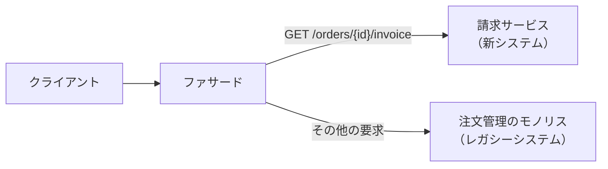
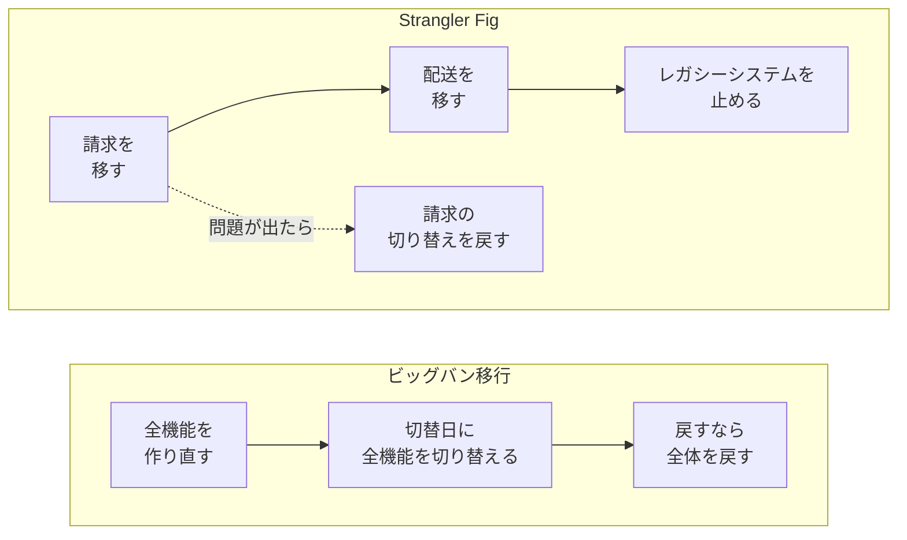
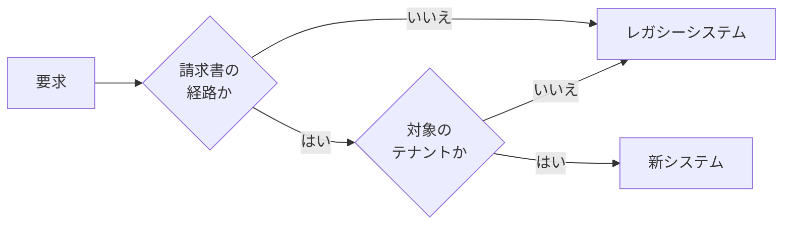
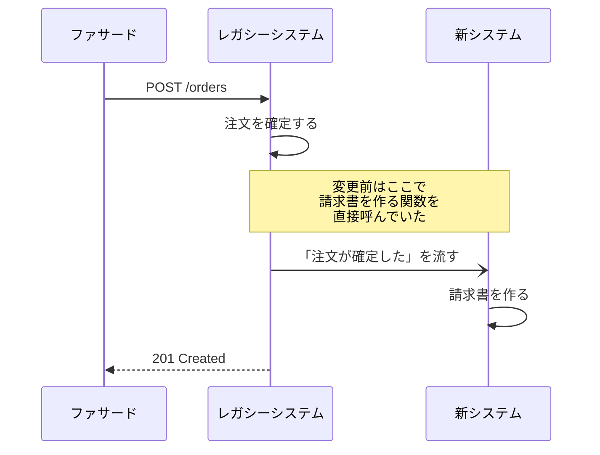
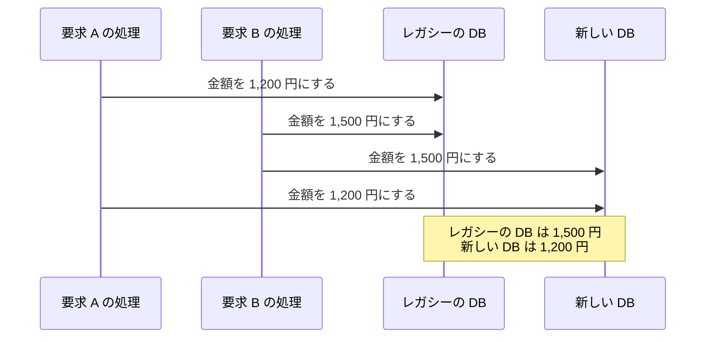
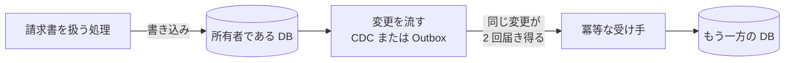
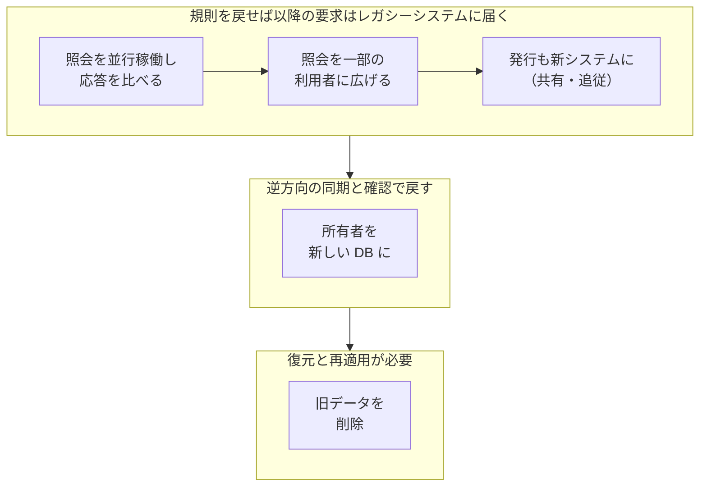

Strangler Fig は、古いシステムの外側に新しいシステムを作り、請求や配送のような業務の機能を 1 つずつ移しながら、最終的に古いシステムを置き換える進め方です。

名前は、宿主の木の上で芽を出し、根を地面まで伸ばして自分で育つようになる絞め殺しの木（strangler fig。イチジクの仲間）から来ています。当初の呼び名だった Strangler Application には暴力的な含みがあるので、Martin Fowler 氏は[ブログ記事](https://martinfowler.com/bliki/StranglerFigApplication.html)で呼び名を Strangler Fig Application に改めています。

例えば、長年動いている注文管理のモノリス（全ての機能を 1 つのプログラムとしてデプロイするシステム）から、請求の機能を新しい請求サービスに移したいチームがあるとします。注文の受付や配送はモノリスで動かし続けます。取引先のシステムはこのチームが改修できないので、URL と応答の形は変えられません。

このチームは最初の一歩として、モノリスの手前に要求を振り分ける入口を置けます。この移行用の入口は、以降ではファサード（façade）と呼びます。

請求サービスは同じ URL と応答の形で答えるので、クライアントからは、どちらのシステムが応答したのかが分かりません。請求の後も同じように機能を移し、モノリス宛ての要求と、ファサードを通らない依存（モノリスの中の関数呼び出しや、モノリスの DB を直接読む他のシステム）が無くなった時点で、モノリスを止められます。

---

### 前提と説明の範囲

本ノートでは、HTTP の要求を受けるバックエンドから、機能を 1 つずつ新システムに移す場合を説明します。以降で使う語は以下の通りです。

| 語 | 意味 | 冒頭の例 |
|---|---|---|
| レガシーシステム | 置き換えて、最終的に止めたい既存のシステム | 注文管理のモノリス |
| 新システム | レガシーシステムの機能を引き継ぐ新しいシステム | 請求サービス |
| 業務の機能 | 請求・配送・在庫のように、業務として提供している機能のまとまり。Strangler Fig で移す基本の単位 | 請求 |
| 経路 | URL のパスと HTTP メソッドの組。ファサードが要求を振り分ける単位 | `GET /orders/{id}/invoice` |
| 振り分けの規則 | どの経路やテナントの要求をどちらのシステムに送るかを決めた、ファサードの設定。変えれば次の要求から送り先が変わる | 請求書の照会は請求サービスへ |
| Transitional Architecture | 移行の間だけ置き、移行が終われば取り除く部品（[Transitional Architecture](https://martinfowler.com/articles/patterns-legacy-displacement/transitional-architecture.html)） | ファサード、DB（データベース）の間の同期 |

ファサードの実装手段には、リバースプロキシ（クライアントの要求を代わりに受け、後ろのサーバに転送するサーバ）や API Gateway（複数のサービスの手前に置き、認証や経路ごとの転送を受け持つ入口）があります。ここでファサードと呼ぶのは実装手段ではなく、移行の間に新旧のシステムに要求を振り分ける役割です。デザインパターンの Facade とは別の物として扱います。

---

### なぜ Strangler Fig が必要なのか

レガシーシステムの機能を新システムで全て作り直し、ある日に一斉に切り替える進め方をビッグバン移行と呼びます。作り直しの間もレガシーシステムは業務で使われるので、税率の変更や不具合の修正が入り続けます。新システムはその変更も取り込み続けなければならず、完成の日が遠ざかります。切替日までは、新システムの成果は利用者に 1 つも届きません。

Strangler Fig でも、新旧が DB を共有していれば、その DB を通じて影響は移した機能の外にも広がり得ます。

段階的に移す分、新旧を並行して運用する期間は長くなり、ファサードや同期のように最後に捨てるコードも書きます。この一時的なコードは無駄に見えても、段階的に進めてリスクを下げ、早くから価値を届けられる利点の方がコストより大きい、というのが Fowler 氏の考え方です。

---

### 移す単位を業務の機能で選ぶ

1 回に移すのは、他の機能への依存ができるだけ少ない業務の機能 1 つです。移す機能は、業務と技術の両面で継ぎ目（seam。システムを分けられる境目）を探し、どの業務を個別に取り出せるかで選びます（[Patterns of Legacy Displacement](https://martinfowler.com/articles/patterns-legacy-displacement/)）。

請求書の URL だけを請求サービスに向けても、モノリスの中に次の結び付きが残っていれば、請求の機能は切り離せていません。

| 確かめる点 | 見る事 | 冒頭の例で残り得る結び付き |
|---|---|---|
| 業務の境界 | 他の業務と規則や用語を共有せずに説明できるか | 請求書の番号・金額・発行状態が、請求の中だけで意味を持つか |
| 内部の呼び出し | モノリスの中の他の処理から直接呼ばれていないか | 注文の確定が、請求書を作る関数を呼んでいる |
| トランザクション | 他の機能のデータと、同じトランザクション（複数の書き込みを全部成功か全部失敗のどちらかにまとめる仕組み）で書かれていないか | 注文の確定と請求書の作成が、1 つのトランザクションに入っている |
| データの所有 | 他の機能がそのデータを直接読み書きしていないか | 配送が、請求書のテーブルを読んでいる |

1 つのトランザクションにまとめていた書き込みは、別々に確定しても業務上困らないかを確かめてから分けます。結び付きの少ない機能から始めると、最初の切り替えで対処する問題を減らせます。

---

### ファサードで要求を振り分ける

ファサードは、届いた要求の中身を見て、送り先をレガシーシステムと新システムから選びます。送り先は、パスとメソッドのほか、ヘッダーやテナント（1 つのシステムを共有して使う顧客の単位。会社など）で決めたり、利用者の一定の割合だけを新システムに送ったりして選べます。

振り分けの規則に書いていない経路は、今まで通りレガシーシステムが受けます。割合で分ける時は、利用者 ID から送り先を計算するなど、同じ利用者が要求ごとに新旧を行き来しない分け方を選びます。行き来すると、同じ請求書の表示が画面を開くたびに変わって見える事があります。

1 つの機能の中では、データを変えない参照の経路から移すと切り戻しやすくなります。請求書の照会（GET）の処理がデータを書かない作りなら、新システムが誤った応答を返しても DB の中身は壊れず、規則を戻せば以降の要求はレガシーシステムが受けます。ただし、既に返した誤った応答を取引先が取り込んでいれば、その影響は残ります。

ファサードが振り分けられるのは、ファサードを通る要求だけです。システムの間を伝わる更新を途中で受け取り、その一部を新しい部品に回すやり方は [Event Interception](https://martinfowler.com/articles/patterns-legacy-displacement/event-interception.html) と呼ばれ、HTTP の要求のほか、メッセージ基盤や CDC（Change Data Capture。DB の変更ログを順に読み、確定した変更を外に流す仕組み）も受け取る場所になります。一方、注文の確定処理が請求書を作る関数を直接呼んでいる場合は、途中で受け取れる場所がありません。この場合は、呼び出し側のコードを変えて、注文が確定した事を外に知らせるようにします。

元の呼び出しを残したままだと、請求書は新旧の両方で作られます。

---

### 振り分けの条件を認証済みの情報から決める

テナントで送り先を変える時は、振り分けに使う情報を信頼できるかが問題になります。クライアントが送った `X-Tenant-Id` ヘッダーの値をそのまま信じると、A 社の利用者が値を B 社に書き換えるだけで、B 社の要求として振り分けられます。新システムが同じヘッダーを所属の根拠にしていれば、B 社の請求書を読める事にもなります。

移行の間は、要求を処理するシステムもデータの置き場所も新旧の 2 つになるので、次の点を確かめます。

| 対象 | 行う事 |
|---|---|
| 振り分けの条件 | テナントは、認証結果とサーバ側の所属情報から確定するか、信頼できる上流が付与した値だけを使う。上流が付与する構成では、外部から届いた同名のヘッダーを上流で取り除き、ファサードや新システムには上流を通った要求だけが届くようにする |
| 新旧の認可 | 同じ利用者と同じ請求書に対して、許可と拒否の判定を新旧のシステムで揃える |
| 新システムに届く本番データ | 要求を送り始める前に、アクセス制御・暗号化・監査の記録を整える。後述の並行稼働で複製した要求のように、利用者に応答を返さない要求でも、新システムには本番のデータが届く |
| 規則の変更と記録 | 規則を変えられる人を限り、変更の履歴を残す。比較や同期のログに、トークンや調査に不要な個人情報を残さない |

---

### 互換 API で呼び出し側を変えない

互換 API は、クライアントから見た契約をレガシーシステムと同じに保った、新システムの API です。契約は、URL、要求と応答の形、状態コードとエラーの意味のように、クライアントが前提にしている取り決めを指します。契約を変えると、古い契約で呼ぶクライアントの改修が終わるまで経路を移せず、冒頭の取引先のように改修できない相手がいれば、移行の日程を相手に合わせる事になります。

| 契約の項目 | レガシーシステムの応答（例） | 新システムでの扱い |
|---|---|---|
| 項目名 | `inv_no`・`amt` | 内部では請求書番号・金額として持ち、応答で元の名前に戻す |
| 金額の表し方 | 文字列の `"1000"` | 内部では整数で持ち、応答で文字列に戻す |
| 存在しない注文 | 404 と `{"error":"NOT_FOUND"}` | 同じ状態コードと本文を返す |

内部までレガシーシステムの項目名や表し方に合わせると、移行が終わった後もその設計が新システムに残ります。そのため、変換は新システムの入口に置きます。相手の表し方を入口で自分の表し方に変換する点で、[Anticorruption Layer](../anti-corruption-layer/) に近い考え方です。

移行の途中は、請求サービスがモノリスに残る注文の明細を問い合わせるように、新旧が互いを呼び出す箇所も残ります。この時は、新システムとモノリスの間に、モノリスが元々期待している呼び方とデータの形でやり取りする変換の部品を挟みます。レガシーシステムに変更を気付かせずにやり取りするこのやり方を [Legacy Mimic](https://martinfowler.com/articles/patterns-legacy-displacement/legacy-mimic.html) と呼び、この部品は相手の機能も移し終えれば Transitional Architecture として取り除けます。

全ての機能を移し終えた後は、ファサードを外してクライアントを新システムに直接繋ぐか、古いクライアントのためのアダプターとしてファサードを残すかを選べます（[Azure Architecture Center](https://learn.microsoft.com/en-us/azure/architecture/patterns/strangler-fig)）。古い契約でしか呼べないクライアントがいれば、互換 API の変換はどちらを選んでも移行後に残ります。

---

### データの所有者を 1 つに保つ

照会の経路は、新システムがレガシーの DB を読むだけなら、データを動かさずに移せます。しかし、新システムが最終的に自分の DB を持つとしても、移行の間はモノリスに残る配送などがレガシーの DB の請求書を読み続けるので、しばらくは両方の DB に値が必要です。そこで、書き込みを受け付け、その値を正しいとして扱う DB を請求書や注文のようなデータの集合ごとに決め、以降はこれを「所有者」と呼びます。1 つの集合に対して、ある時点の所有者は 1 つにします。

素朴には、1 つの要求を処理する中で 2 つの DB に順に書けば済むように見えます。このやり方を二重書き込み（dual write）と呼びます。2 つの書き込みは、通常は 1 つのトランザクションとして確定できません。以下は、同じ請求書の金額を 2 本の要求がほぼ同時に変え、書き込みが割り込んだ場合の一例です。

4 回の書き込みは全て成功するので、突き合わせるまで食い違いに気付けません。2 回目の書き込みの前にプロセスが止まった場合も、片方の DB だけが更新されます。

どちらの値が正しいか分からなくなる状態を避けるには、書き込みを受け付ける所有者を 1 つに定め、もう一方の DB には所有者で確定した変更を後から流します。流す手段には、CDC や、後で送るメッセージを変更と同じトランザクションで書いておく [Transactional Outbox](../../distributed-systems/transactional-outbox/) があります。

受け手は[冪等](../../distributed-systems/idempotency/)（同じ変更を何回適用しても、1 回適用した時と結果が同じになる性質）にしておきます。再送や受け手の並列処理で後の変更が先に届く事もあり、この入れ替わりは冪等にしても防げません。対策の例は、所有者で請求書ごとに更新番号を振り、受け手が最後に適用した番号より古い変更を捨てる方法です。この方法は、変更が「金額を 1,500 円にする」のように変更後の値を運ぶ場合に使えます。「300 円増やす」のような差分を運ぶ変更では、古い変更を捨てると、その差分が失われます。

後から流す方式でも、反映が終わるまでは 2 つの DB の値が一時的に食い違います。所有者を 1 つに定めて避けられるのは、どちらが正しいか分からなくなる事で、値の差そのものではありません。

---

### 所有者を段階的に移す

所有者は、戻しやすい段階から順に移します。Azure Architecture Center の例は、データを 3 段階で移します。新システムがモノリスの DB を読み書きする段階、分離した DB へ同期しながら新システムが新しい DB にも書き込む段階、新しい DB が所有者になる段階です。以下はこの大枠を土台に、請求書の例に合わせて変えた構成例で、データの移し方はシステムごとに違います。

| 段階 | 書き込み先 | 同期の向き | 切り戻しの操作 |
|---|---|---|---|
| 共有（新システムもレガシーの DB を読み書きする） | レガシーの DB | なし | 振り分けの規則を戻す |
| 追従と突き合わせ | レガシーの DB | 旧 → 新 | 振り分けの規則を戻す |
| 新が所有者 | 新しい DB | 新 → 旧 | 同期と確認を済ませてから所有者を戻す |
| 旧データ削除 | 新しい DB | なし | バックアップの復元と、その後の変更の再適用が必要 |

Azure の例との違いは 2 つあります。1 つは、二重書き込みを避けるために、追従の段階の書き込みをレガシーの DB だけで受ける事です。もう 1 つは、切り戻しやすくするために新から旧への逆方向の同期を足した事です。

追従の段階では、既存のデータを新しい DB に一括でコピーした後、レガシーの DB の変更を流し続けます。所有者を切り替える前に、2 つの DB の件数やチェックサム（内容が 1 か所でも違えば高い確率で値が変わる短い値）を比べる突き合わせで食い違いを探します。同期の遅れの分は差として出るので、遅れを見ながら結果を読みます。

所有者を切り替える時は、請求書への書き込みを止め、旧から新への同期が最後の変更まで反映された事を確かめてから、書き込み先を新しい DB にします。止める書き込みには、ファサードを通る要求だけでなく、モノリスの中の呼び出しやバッチ処理も含みます。反映を待たずに新しい DB で書き込みを受けると、後から届いた同期の変更がその書き込みを上書きし得ます。逆方向の同期は、旧から新への同期を止めてから始めます。止めないと、新から旧へ流した変更が拾われて新しい DB に戻ってきます。

切り戻す時は同じ手順を逆向きに進めます。この時は、新から旧への同期が新しい DB の変更を読み終えただけでなく、その変更をレガシーの DB に書き終えた所まで追いついた事を確かめ、突き合わせもやり直します。旧から新への同期を再開する時は、前回止めた位置からではなく、切り戻した時点以降の変更から読みます。前回の位置から読むと、逆方向の同期がレガシーの DB に書いた変更を読み直すからです。

更新番号で順序を守っている場合、所有者を切り替えると番号を振る DB も変わります。新旧が個別に振った番号をそのまま比べると、新しい DB が 1 番から振った変更は、レガシーの DB に残る大きな番号より古いと判定されて捨てられます。所有者を切り替える度に 1 つ増やす番号（epoch）を先に比べるか、切り替えをまたいで 1 つの採番元から番号を振ります。

逆方向の同期があっても、次のような変更は戻せない事があります。

| 戻せない変更 | 冒頭の例 |
|---|---|
| 新旧のスキーマの差 | 新しい DB だけに、分割払いの内訳を持たせた |
| 削除と集約 | 複数の請求書を 1 枚にまとめ、元の請求書を消した |
| 採番 | 新しい DB で振った請求書番号が、レガシーの採番規則と衝突する恐れがある |
| 外部への副作用 | 請求書のメールを送った |

このような変更があるなら、戻すと失われる情報を前もって別に保存し、採番の範囲を新旧で分けておきます。送ったメールのように、それでも戻せない分は業務の手順で扱います。レガシーの DB から請求書のテーブルを消すのは、新システムの検証が済んでから、最後の一歩として行います。

---

### 切り戻しやすい順序で進める

1 つの機能を移す時は、戻す操作が軽い段階から順に進めます。最初に置く並行稼働（Parallel Run）は、新旧に同じ入力を処理させて結果を比べるやり方で、Sam Newman 氏の書籍『モノリスからマイクロサービスへ』にも名前が出てきます。

ファサードが要求を複製して並行稼働する場合、利用者にはレガシーシステムの応答を返し、新システムの応答は比較の記録にだけ使います。更新の経路を複製すると、新システムも請求書を発行し、通知のメールが 2 通出るような副作用が起き得るので、複製するのは主に参照の経路です。ただし GET でも、照会の度に最終アクセス時刻を書き換える、外部の API を呼ぶといった処理は動きます。

| 気を付ける点 | 行う事 |
|---|---|
| 新システム側の副作用 | 複製した要求では、メールの送信・外部のシステムの更新・共有キャッシュへの書き込みを無効にする |
| 意味の無い差 | 生成時刻・要求 ID・JSON の項目の順序のように、正しくても新旧で違う値は、比べる前に揃える |
| 新システムの遅延と障害 | 比較は利用者への応答と切り離して非同期で行い、複製の要求には上限時間を設ける |

段階を進めるか戻すかは、経路ごと・新旧ごとのエラー率と遅延、並行稼働で応答が食い違った割合、同期の遅れ、突き合わせの不一致件数で判断します。エラー率を経路ごと・新旧ごとに分けるのは、合計だけでは移した経路の悪化が他の経路の数字に紛れるからです。レガシーシステムの経路を廃止する前には、ファサードに届く要求数だけでなく、モノリスの中の呼び出しや DB を直接読む他のシステムからのアクセスも数えます。

---

### 利点

- 1 回の切り替えで直接変わる範囲が、移した機能とそのデータに絞られやすい（共有 DB や、振り分けの規則の誤りを通じた影響は残り得る）
- 移し終えた機能から順に、利用者が新システムを使い始められる
- 互換 API で受ければ、クライアントは URL と契約を変えずに呼び続けられる
- 移行の途中で、移す順序や優先度を見直せる

---

### 欠点

- 移行期間中は、新旧のシステム・ファサード・同期処理を並行して運用する
- 全ての要求を 1 つのファサードで受ける構成では、ファサードが止まると全経路が応答できなくなり、ファサードで増えた遅延も全経路に加わる。複数台で動かす、振り分けの判定を軽くするといった対策が必要になる
- ファサード・変換の部品・同期のように、最後に捨てるコードを書く。消し忘れると移行後も運用し続ける
- 新旧の両方が同じ振る舞いを担当している間は、仕様変更や修正を両方に入れなければならない事がある

---

### 適さないケース

Azure Architecture Center は、次の場合にはこのパターンが適さない事がある、としています。

- レガシーシステムへの要求を途中で受け取れない
- レガシーシステムのソースを変更できず、内部の呼び出しを新システムに向けられない
- システムが小さく、全体を一度に置き換える方が簡単
- 元のシステムを急いで完全に廃止する必要がある
