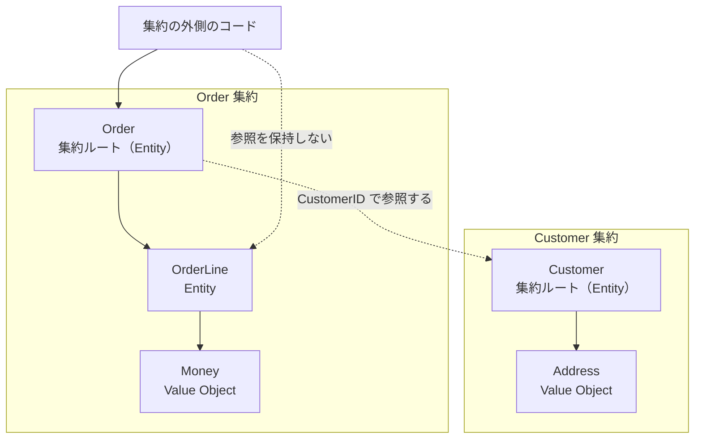
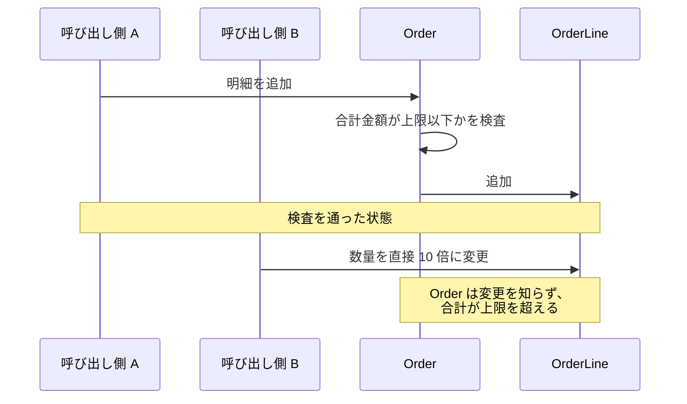
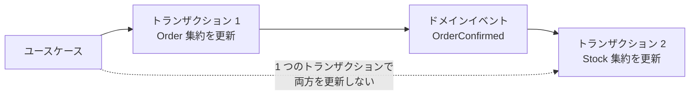

Value Object・Entity・Aggregate（集約）は、DDD（Domain-Driven Design、ドメイン駆動設計）でモデルを組み立てる時の構成要素です。Value Object は属性だけで決まる値、Entity は属性が変わっても同じ物として追跡する対象、Aggregate は不変条件（操作が終わった時点で成り立っていなければならない規則）を守るために、その 2 つをまとめた境界を指します。

3 つは並列に選ぶ選択肢ではありません。まず個々の概念を Value Object と Entity のどちらで表すかを決め、次にそれらを Aggregate という境界でくくります。本ノートでは、この順で 3 つの役割を説明し、Go と Rust の型でそれぞれをどこまで表現できるかを比べます。境界づけられたコンテキスト（[Bounded Context](../bounded-context/)）の切り方のような、モデルより上の設計は扱いません。注文（`Order`）と明細（`OrderLine`）を例に、3 つの関係は以下の通りです。



上記の図の点線が制約を表しています。集約の外側が参照を保持して良いのは、集約ルート（集約の入口になり、集約全体の不変条件を守る Entity）である `Order` だけです。`Customer` 集約に向かう点線はルート同士を結んでおり、Entity は ID を持つので、他の集約からはその ID で指せます。

---

### なぜ 3 つに分けるのか

不変条件とは、そのオブジェクトを外部から観測できる状態と、公開された操作が完了した時点で成り立っていなければならない規則です。実装の内部では、操作の途中で一時的に成り立たない状態を経由する事もあります。例えば、EC サイトの注文には「代金引換で支払う注文は、明細の合計金額が引換の上限額を超えない」という規則が置かれます。「不変」が指すのは規則が成り立ち続ける事で、値が変わらない事ではありません。明細が増えて合計金額が変わっても、上限を超えた状態にしてはいけません。

全てのオブジェクトを可変にして相互に参照させると、不変条件を守る場所が消えます。合計金額の上限という規則があっても、明細を触れる経路が複数あれば、規則を検査していない経路から壊されます。

検査を通る経路と通らない経路が同居した場合に何が起きるかは、以下の通りです。



上記の図の呼び出し側 B は、`Order` を経由せずに `OrderLine` を書き換えています。`OrderLine` にも検査を足せば良いと考える方がいるかもしれません。しかし、明細 1 件は他の明細の金額を知らないため、合計が上限を超えたかどうかを自分では判定できません。複数のオブジェクトにまたがる規則は、まとめて見られる場所でしか守れないので、検査の追加ではなく参照の入口を 1 つに絞る事が解になります。

同一性の判定も同じ問題を持ちます。金額の 100 円と別の 100 円は入れ替えても困りません。しかし、同姓同名で同じ住所に住む顧客 2 人は別人で、入れ替えると注文や請求が別の人に付きます。どちらの規則で等価を判定するかをオブジェクトごとに決めておかないと、比較の実装が呼び出し側ごとにばらつきます。

Value Object と Entity のどちらにするかは、属性が同じ 2 つを入れ替えても困らないかどうかで判断します。困らないなら属性で等価を判定する Value Object、困るなら ID で等価を判定する Entity にします。この判断はモデルの都合で決まり、データの形からは決まりません。

例えば住所は、配送先として値だけを見るなら Value Object です。住所に識別子を与え、同一性や独立したライフサイクルを追跡するなら、Entity として扱う選択肢が生まれます。引っ越しの履歴を残すだけなら、各時点の住所を Value Object のまま保存できます。同じ「住所」という語でも、扱う業務によって分類が変わります。

---

### Value Object

Value Object とは、属性の組み合わせだけで意味が決まり、同一性を持たないオブジェクトです。属性が全て等しければ等価です。[DDD Reference](https://www.domainlanguage.com/wp-content/uploads/2016/05/DDD_Reference_2015-03.pdf)（Eric Evans 氏が DDD のパターンをまとめた文書）に従って不変なものとして扱うので、変更が必要な場合は属性を書き換えずに新しい値を作ります。

Go では、`==` の意味を型ごとに変えられない事、全ての型がゼロ値（宣言しただけで入る初期値）を持つ事、可視性がパッケージ単位である事の 3 つが、Value Object の要求とぶつかります。金額を表す次のコードは、フィールドを非公開にし、検証を通ったものだけを生成する構成です。

```go
package money

import (
	"errors"
	"fmt"
)

// Currency は通貨を表す定義型です。
type Currency string

const (
	JPY Currency = "JPY"
	USD Currency = "USD"
)

// Money は金額と通貨の組で、生成後に値を変えられません。
// amount は通貨の最小単位（JPY なら円、USD ならセント）で保持します。
type Money struct {
	amount   int64
	currency Currency
}

// New は通貨コードを検証してから Money を組み立てます。
func New(amount int64, currency Currency) (Money, error) {
	if currency != JPY && currency != USD {
		return Money{}, fmt.Errorf("money: unknown currency %q", currency)
	}
	return Money{amount: amount, currency: currency}, nil
}

// Add は自分と other を足した新しい Money を返します。
func (m Money) Add(other Money) (Money, error) {
	if m.currency != other.currency {
		return Money{}, errors.New("money: currency mismatch")
	}
	return Money{amount: m.amount + other.amount, currency: m.currency}, nil
}
```

`Add` が値レシーバで新しい `Money` を返すため、呼び出し側から見た不変性は保たれます。これが成立するのは、フィールドが `int64` と文字列だけで参照を含まないからです。スライスやマップやポインタをフィールドに置くと、値レシーバがコピーするのは参照だけで、参照先を書き換えると元の値も変わります。

等価判定も `a == b` で属性の比較になります。ただし、対象は[比較可能な型](https://go.dev/ref/spec#Comparison_operators)だけです。スライスやマップをフィールドに持つ構造体は比較可能でなくなり、`==` を書いた箇所がコンパイルエラーになります。`float64` を持つと `NaN` を入れた値が自分自身と等しくなくなり、ポインタを持つと参照先の値ではなくアドレスの比較になります。`any` を持つと、`==` を評価した時に両辺の動的な型が同じで比較不能（スライスなど）なら、実行時に panic します。

上のコードが金額を `int64` で持つのは、通貨の最小単位で持てば足し引きに誤差が出ないからです。しかし、按分・税率・通貨換算のように除算が入ると十進小数の型が必要になり、その型がポインタを持つと上記のアドレスの比較が起きます。

Go の標準ライブラリに十進小数の型は無く、広く使われている [shopspring/decimal](https://github.com/shopspring/decimal) の `Decimal` は内部に `*big.Int` を持ちます。`amount` をこの型に変えても `==` はコンパイルを通り、中の `*big.Int` のアドレスを比べます。そのため、`decimal.RequireFromString("10.05")` を 2 回呼んで作った同じ金額の 2 つが、エラーも警告も無く等しくないと判定されます。この型を使うなら、`==` を使わず `Equal` を呼ぶ規律を呼び出し側が守る事になります。

生成の入口も塞ぎきれません。`var m money.Money` と書くだけで、`New` を通っていない[ゼロ値](https://go.dev/ref/spec#The_zero_value)の `Money`（金額 0、通貨が空文字列）が手に入ります。`New` 自身もエラー時にゼロ値を返すので、戻り値の `err` を無視した呼び出し側に同じものが渡ります。

可視性も効き方が限られます。`Money` の非公開フィールドは同じパッケージの中からは自由に書き換えられます。Go の可視性はパッケージ単位で、フィールドを「生成時だけ書き込める」と宣言する構文がありません。

ここまでの制約があるので、Go では Value Object を作るたびに非公開フィールド・Getter・`Equal` を手で書く事になります。この定型を減らすために、`New`・Getter・`Equal` を生成する [vogen](/post/ja/2024-12-28-golangvalue-objectを生成するvogenライブラリをお試しで作っ/) を私が作りました。ただし、生成で減らせるのは記述の量だけで、ゼロ値を禁止できない事と `==` の意味を変えられない事は残ります。

同じものを Rust で書くと、生成の経路と取り得る値の範囲を型で絞れます。

```rust
mod money {
    #[derive(Debug, Clone, Copy, PartialEq, Eq)]
    pub enum Currency {
        Jpy,
        Usd,
    }

    #[derive(Debug, Clone, Copy, PartialEq, Eq)]
    pub struct Money {
        amount: i64,
        currency: Currency,
    }

    #[derive(Debug, PartialEq, Eq)]
    pub enum MoneyError {
        Negative,
        Overflow,
        CurrencyMismatch,
    }

    impl Money {
        pub fn new(amount: i64, currency: Currency) -> Result<Money, MoneyError> {
            if amount < 0 {
                return Err(MoneyError::Negative);
            }
            Ok(Money { amount, currency })
        }

        pub fn add(self, other: Money) -> Result<Money, MoneyError> {
            if self.currency != other.currency {
                return Err(MoneyError::CurrencyMismatch);
            }
            let sum = self.amount.checked_add(other.amount).ok_or(MoneyError::Overflow)?;
            Money::new(sum, self.currency)
        }
    }
}
```

Rust には暗黙のゼロ値がありません。加えて、非公開フィールドを持つ構造体は、[そのモジュールとその子孫](https://doc.rust-lang.org/reference/visibility-and-privacy.html)の外から構造体リテラルで作れません。`Money { amount: 0, currency: Currency::Jpy }` をモジュールの外に書くと、コンパイラが `E0451` で拒否します。

構造体リテラルを書けるのがモジュールの中だけになるので、検証が漏れていないかはモジュールの中のメソッドを見れば確かめられます。上の `add` が合計を `checked_add` で求めて `new` に通しているのはそのためです。`add` がリテラルで直接組み立てると、リリースビルドの既定では合計がオーバーフローして負の値になり、`new` が拒否する金額がモジュールの外に渡ります。型が絞るのは生成の経路までで、検証の中身は Go と同じく自分で書きます。

通貨を `enum` にした点も効いています。Go では通貨を定義型にしても `Currency("EUR")` という変換をどこからでも書けるため、取り得る値を型で閉じられません。Rust の `enum` は列挙した変種以外を書けないので、`Currency::Eur` はコンパイルエラーになり、通貨についての実行時の検証が不要になります。

十進小数の型を入れた場合も、Rust では導出したままで済みます。`rust_decimal` の `Decimal` は `PartialEq` を数値の比較として実装しているため、それをフィールドに持つ `Money` に `#[derive(PartialEq)]` を付けると、同じ金額の 2 つが等しくなります。`==` の意味を型ごとに定義できるので、Go のように `Equal` を別に用意する必要がありません。

この `Money` を `add` に渡した後も使えるのは、`Copy` を導出しているからです。`Copy` の無い型で `add(self, ...)` と書くと、渡した時点で元の値が移動して使えなくなります。

`String` を 1 つ持たせただけで `Copy` は導出できなくなるので、作り方によっては `add` を `&self` で受ける形にするか、呼び出し側で `clone` してから渡す事になります。同じく、`Default` を導出リストに足すと `Money::default()` がモジュールの外から呼べるようになり、Go のゼロ値と同じ穴が開きます。

---

### Entity

Entity とは、属性が変化しても同じ物として追跡する対象で、同一性を表す ID を持ちます。顧客・注文・口座のように、状態が時間とともに変わり、変わった後も同じ 1 つの物として指し続ける概念が該当します。何をもって同じと見なすかは、DDD Reference の通りモデルの中で定義します。

Go では、構造体の `==` がフィールドを順に比較します。Entity に対して使うと、同じ ID を持つ 2 つの `Order` が、明細の数だけ違っても等しくないと判定されます。ID だけを見る `Equal` メソッドを書き、`==` を使わない規律を人間が守る事になります。

Rust では逆の性質が働きます。`PartialEq` を実装しない限り `==` 自体が書けないため、規律ではなくコンパイルエラーとして表に出ます。ID だけで `PartialEq` を手で実装する場合は、`Hash` も ID だけで実装します。導出した `Hash` は全フィールドを対象にするため、ID が同じで属性が違う 2 つが別のバケットに入り、`HashSet` の動作が壊れます。

ID の型付けにも差が出ます。Go で `type OrderID string` のような定義型を作っても、`OrderID("free-text")` という変換がどこからでも書けるため、検証済みの ID と生の文字列を型では区別できません。

Rust では ID をタプル構造体（`pub struct OrderId(String)`）にしてフィールドを非公開にすれば、モジュールの外からは生成関数を通す以外に作る手段が無くなります。集約ごとに ID の型を分けておくと、`OrderId` と `CustomerId` の取り違えもコンパイル時に落ちます。

---

### Aggregate

Aggregate とは、1 つの単位として扱う一群のドメインオブジェクトで、その中の 1 つを集約ルートに選びます。[Martin Fowler 氏の説明](https://martinfowler.com/bliki/DDD_Aggregate.html)では、集約の外からの参照は集約ルートに向かい、ルートが集約全体の整合性を保証します。読み書きの単位も集約になります。

集約の外側は、内側の `OrderLine` を `Order` から受け取って 1 回の操作の中で読む事ができます。禁じられているのは、受け取った参照をフィールドに格納したり他のオブジェクトに渡したりして、その操作が終わった後も使える状態にする事です。`Order` から `OrderLine`、`OrderLine` から `Money` への参照にこの制約がかからないのは、集約の内側でオブジェクトがどう繋がっているかが、外側から見えないからです。

境界の決め方は、オブジェクトの近さではなく不変条件です。合計金額の上限という規則が注文と明細にまたがるなら、その 2 つは同じ集約に入ります。規則がまたがらない顧客は別の集約になり、`Order` からは `CustomerID` で参照します。

ID 参照は [Vaughn Vernon 氏の Effective Aggregate Design](https://www.dddcommunity.org/wp-content/uploads/files/pdf_articles/Vernon_2011_2.pdf) が推奨する形で、直接参照が禁止されているわけではありません。DDD Reference も、外部のオブジェクトが集約ルートへの参照を持つ事は認めています。参照を持っても相手が自分の整合性の境界に入らない、という点が要点です。ID だけを持つ集約は相手を直接書き換えられないので、同じトランザクションで 2 つの集約を変更する誤りを減らせます。参照先を読み込まない分、集約も小さくなります。

Go で集約ルートを書くと、内部を隠しきれない所が出ます。

```go
// Lines は明細の一覧を返します。
func (o *Order) Lines() []OrderLine {
	return o.lines
}
```

このメソッドが返すスライスは内部の配列を指しているため、`o.Lines()[0].Quantity = 10000` と書けば集約ルートを経由せずに数量が変わり、`Order` が計算する合計にもその数量が反映されます。防ぐ手段は、要素をコピーして返すか、一覧を返さずに必要な集計値だけを返すかです。Go には読み取り専用のスライス型が無いため、返した後で何をされるかは型に書けません。

Rust では、`&[OrderLine]` という読み取り専用の型で返せます。

```rust
/// 読み取り専用の参照を返す。呼び出し側は要素を書き換えられない。
pub fn lines(&self) -> &[OrderLine] {
    &self.lines
}
```

この戻り値に対して `lines[0].quantity = 10_000` と書くと、コンパイラが `E0594` で拒否します。借用している間は集約ルートを変更できないので、一覧を持ったまま明細を追加する処理も通りません。ただし、何を返すかを決めるのは設計者で、`&mut Vec<OrderLine>` を返すメソッドを書けば内部はそのまま漏れます。

集約をまたぐ更新は、以下のようにトランザクションを分けて扱います。



上記の図のドメインイベントは、集約に何が起きたかを表すデータです。`OrderConfirmed` は「注文が確定した」を意味します。点線が避けたい経路で、2 つの集約を 1 つのトランザクションで更新すると、境界の意味が消え、ロックの範囲も広がります。

トランザクションを分けると、Order 集約の更新が終わってから Stock 集約に反映が届くまでの間、2 つの状態がずれます。いずれ一致するものの、ある瞬間を切り取るとずれている状態を結果整合性と呼びます。

Order 集約の更新だけが確定してイベントが届かない事も起き得るので、配送を保証する仕組みが別途必要です。代表的なのは、集約の更新と同じ DB（データベース）のトランザクションでイベントを保存し、後から配送する方式です。イベントの配送は [Domain Event](../domain-event/) のノートで詳しく見ます。

DDD Reference も、集約の境界の内側では整合性の規則を同期的に適用し、境界をまたぐ更新は非同期に扱うよう求めています。上記の図でトランザクション 2 をイベントの後に分けているのが、この非同期の更新です。

1 つのトランザクションで揃えるか、結果整合性にするかで迷った時の目安として、Vernon 氏はそのデータを整合させるのがユースケースを実行するユーザ自身の仕事かを問います。ユーザ自身の仕事なら、集約の他の規則を守る範囲で 1 つのトランザクションで揃える事を試み、別のユーザやシステムの仕事なら結果整合性を許します。

---

### Go と Rust で表現できる範囲

3 つの構成要素で守りたい性質に対して、Go と Rust の型がどこまで保証するかは以下の通りです。

| 守りたい性質 | Go | Rust |
|---|---|---|
| 検証を通らない生成を防ぐ | ゼロ値が作れるので防げない | リテラルを書けるのはモジュール内だけ |
| 取り得る値を絞る | 定義型と定数で近似する | `enum` でコンパイル時に閉じる |
| 生成後の変更を禁止する | パッケージ内では書き換え可 | モジュール内では書き換え可 |
| 属性で等価を判定する | ポインタを含むとアドレス比較 | `PartialEq` を導出できる |
| ID で等価を判定する | `Equal` を書く規律で守る | `PartialEq` の実装が必要 |
| 内部を読み取り専用で渡す | コピーを返すしかない | `&[T]` で型に書ける |

表の左列は DDD が求める性質で、右の 2 列は言語の優劣ではなく、その性質を型で表せる範囲です。Go ではモデルの制約の多くをパッケージ分割とテストで守る事になり、Rust では同じ制約の多くをコンパイルエラーとして検出できます。とは言え、どちらもモジュールやパッケージの内側では制約が緩むので、境界を小さく切る判断は人間に残ります。

---

### 利点

- 不変条件を守る場所が集約ルート 1 箇所に定まり、検査の重複が消える
- Value Object を分けると、検証済みの値が型として流通し、呼び出し側の検査が減る
- 等価判定の規則がオブジェクトの種類で決まり、比較の実装がばらつかない
- 読み書きの単位が集約になるため、永続化の対象と粒度が設計から読み取れる
- 集約の間を ID 参照にすると、分割の候補がそのまま境界として見える

---

### 欠点

- 集約が大きいと更新の競合が増え、小さいと集約をまたぐ処理が増える
- 集約をまたぐ更新が結果整合性になり、途中状態を扱う実装が必要
- 集約ルート経由の参照だけを許すと、読み取り専用の画面表示に対して遠回りになる
- Value Object を細かく作るほど型と変換のコードが増える
- 言語によっては、決めた制約を型で表現できず、規律として残る

---

### 適さないケース

- ドメインの規則がほとんど無く、入力をそのまま保存して取り出すシステム
- 表示のための読み取りが中心で、更新の不変条件が単純な機能
- 集約の粒度を決めるだけのドメイン知識が、まだチームに集まっていない段階
- 1 回限りの移行スクリプトのような、モデルを長く保守しないコード
