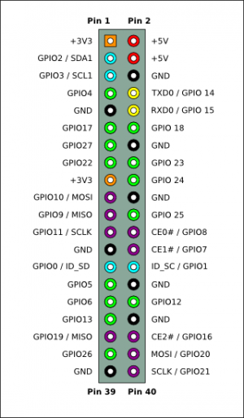
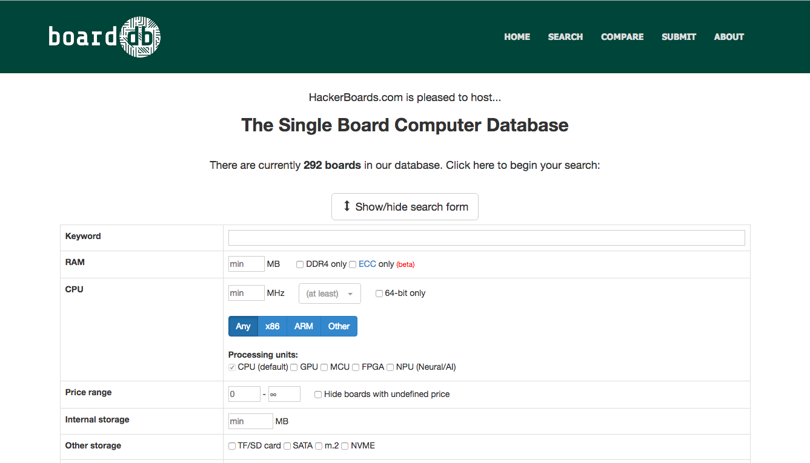

## Raspberry Piとは

Raspberry Piは、[ラズベリーパイ財団(イギリス)](https://en.wikipedia.org/wiki/Raspberry_Pi_Foundation)より提供されているARMプロセッサボード。初期は、教育用を念頭に開発されてきました。現在は、RPi1からRPi3までの間で、HW性能が大幅に向上し、産業用途で使われる事例も増えてきました。

対応OSは、Debianベースの[Raspbian](https://ja.wikipedia.org/wiki/Raspbian)の他に、Ubuntu、CentOS(非公式)、Windows IoT Core、Android(非公式)などに対応しています。安定性および情報量の面では、Raspbianの一択でしょう。

2019年現在、Raspbianは、Linux初心者向けの環境と言い切れます。例えば、各種の初期設定をGUIで促すポップ画面が出たり、各種プログラミング言語(Python、Java、Scratch)環境が初期状態で整っています。

## Raspberry Pi 公式サイト・ツール

| **項目** | URL |
| --- | --- |
| 公式サイト | [https://www.raspberrypi.org](https://www.raspberrypi.org/) |
| 公式Linux OS | [https://www.raspberrypi.org/downloads/raspberry-pi-desktop/](https://www.raspberrypi.org/downloads/raspberry-pi-desktop/) |
| 公式Linux Kernel | [https://github.com/raspberrypi/linux](https://github.com/raspberrypi/linux) |
| 公式Toolchain | [https://github.com/raspberrypi/tools](https://github.com/raspberrypi/tools) |
|   販売サイト(Pimoroni)   | [https://shop.pimoroni.com/](https://shop.pimoroni.com/) |

## Raspberry Pi3 HW仕様

より正確な情報は、公式サイトを参照してください。

| **項目** | **仕様** |
| --- | --- |
| 名称(モデル) | Raspberry Pi3(Model B) |
| SoC | Broadcom BCM2836 |
| CPU(コア数、周波数) | ARM Cortex A53(4コア、1.2GHz) |
| ARMアーキテクチャ | ARMv8(64bit) |
| RAM | 1GB |
| GPU | Broadcom VideoCore Ⅳ |
| 映像入力 | 15ピンMIPIカメラインターフェース(MIPI CSI-2) |
| 映像出力 | コンポジットRCA、HDMI1.3/1.4 |
| 音声入力 | I2S |
| 音声出力 | 3.5mmジャック、HDMI、I2S |
| Network | Broadcom BCM43143、IEEE802.11 b/g/n2.4GHz、Bluetooth4.1、BLE |
| Peripheral Interface | GPIO40ピン(SPI、I2S、UART) |
| ストレージ | microSD |

## Raspberry Pi GPIO40ピンの仕様

出典："RPi Low-level peripherals" (Embedded Linux Wiki) [https://elinux.org/RPi\_Low-level\_peripherals](https://elinux.org/RPi_Low-level_peripherals)

## シングルボード検索サイト

Raspberry Pi以外のシングルボードを勉強したくなった場合は、以下のサイトで様々なシングルボードを検索できます。2019年1月1日現在、292個のボードが登録されています。
