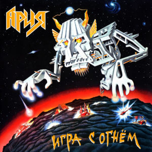

## 収録曲

収録曲

1. Что Вы Сделали с Вашей Мечтой? (★)  
2. Раскачаем этот мир(★)  
3. Раб страха  
4. Искушение  
5\. Игра с огнём  
6. Бой продолжается  
7. Дай жару!  
★: 人気曲 

## 知られざるロシアンメタルの名盤

ロシア大御所メタルバンド「АРИЯ(ARIA、アリア)」が1989年にリリースした4th Album **_"Игра с огнём"_**。80年代後半のHR/HM界隈は、数々の歴史的名盤がリリースされていますが、本作もその中の一つに入るでしょう。しかし、残念ながら、バンド・本作は双方の知名度が低い。私はロシア人と知り合った事で、初めて本作の存在を知りました。

本作のサウンドは、一言で表せば、

**NWOBHM(IRON MAIDEN) + 北欧(ほんのり) = 王道**

ザクザクと刻むリフ、日本人好みの哀愁が漂うメロディ。静かなイントロから激しい曲調に展開するアレンジは、正統派HR/HMが好きな日本人メタラーの心に刺さるのではないだろうか。デス、スラッシュ、Doom、激臭漂うクサメタル好きは、機会があったら聴いてみて！iTunes以外で手に入れるのは難しいよ！

## そもそもАРИЯとは？

АРИЯは、ロシア国内で絶大な人気を誇るメタルバンド。日本ならばX JAPAN、イギリスならばDeep Purpleのようなポジションにいるようだ。2018年現在も、ライブ参戦報告がSNS([ロシアのFacebookであるVK](https://ja.wikipedia.org/wiki/VK_\(SNS\)))に投稿される事から、その人気の高さが伺えます。

語学学習アプリ"[HelloTalk](_wp_link_placeholder)"にすら、АРИЯに関する投稿があるぐらいです。

デビューから本作まで(80年代)のサウンドは、紛れもなくNWOBHMの影響下にあります。身も蓋もない言い方をすれば、Iron Maiden。ボーカルの哀愁漂う歌い回しからScorpionsとも形容されますが、そのサウンドは間違いなくMaidenの影響下にあります。AriaとMaidenの比較動画が作成されるぐらい、似ています。メタルではよくある事（●３●）＜ハッハー！！

<iframe width="560" height="315" src="https://www.youtube.com/embed/7sGIqkbJF5A" allowfullscreen></iframe>

惜しむらくは、その人気の高さゆえに、ロシア国内の活動がメインになってしまった事でしょう。ワールドワイドな活動をしていれば、バンドと本作の知名度も高かったかもしれません。

\[the\_ad id="598"\]

## 好きな一曲

**Раскачаем этот мир**

静かに始まるイントロ、中間部の耳に残るベース、加速するギターソロ、最後のテンポダウン。 名曲(大作)を生み出そうとした事がアレンジから聴き取れる。熱い。

<iframe width="560" height="315" src="https://www.youtube.com/embed/d-bVJSnPFLA" frameborder="0" allowfullscreen="allowfullscreen"></iframe>

<iframe style="width: 120px; height: 240px;" marginwidth="0" marginheight="0" scrolling="no" frameborder="0" src="//rcm-fe.amazon-adsystem.com/e/cm?lt1=_blank&amp;bc1=000000&amp;IS2=1&amp;bg1=FFFFFF&amp;fc1=000000&amp;lc1=0000FF&amp;t=debimate07-22&amp;o=9&amp;p=8&amp;l=as4&amp;m=amazon&amp;f=ifr&amp;ref=as_ss_li_til&amp;asins=B00OZIXB2W&amp;linkId=f0a2aa35771bbcf5082491397cbfa57f"></iframe>
