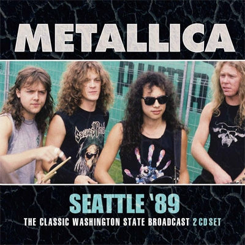
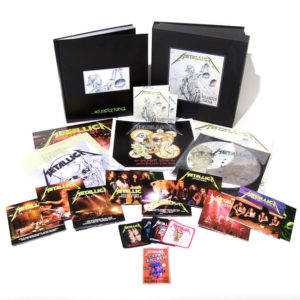

## 収録曲

収録曲

1-1.  The Ecstasy Of Gold  
1-2.  Blackened  
1-3.  For Whom The Bell Tolls  
1-4.  Welcome Home (Sanitarium)  
1-5.  Harvester Of Sorrow  
1-6.  The Four Horsemen  
1-7.  The Thing That Should Not Be  
1-8.  Bass Solo  
1-9.  To Live Is To Die  
1-10. Master Of Puppets  
1-11. Fade To Black  
2-1.   Seek And Destroy  
2-2.   …And Justice For All  
2-3.   One  
2-4.   Creeping Death  
2-5.   Guitar Solo  
2-6.   Battery  
2-7.   The Frayed Ends Of Sanity  
2-8.   Last Caress  
2-9.   Am I Evil  
2-10. Whiplash  
2-11. Breadfan

## 伝説Live。Metallica Top10に入るベストパフォーマンス

**最初に、このLiveを伝説扱いしたのは誰？**

本作は、Metallicaが過去にVHS/DVDでリリースした"[**Live Shit: Binge & Purge**](http://amass.jp/43662/)"から、シアトル公演の音源を抽出したCDです。Live Shitでは"DAMAGED JUSTICE TOUR"(1989年8月29日、シアトル公演)はDVD形式でしたが、本作はその内容を非公式にCD化したブートレグのようです(販売元：[Left Field Media](https://www.discogs.com/label/240121-Leftfield-Media))。

Live自体は、Metallicaファンの間では高く評価されています。その理由は、メンバーの若さ溢れ、鬼気迫る演奏でしょう。1989年は、MetallicaがBlack Album(総売上 約1550万枚!!)をリリースする前、まだスラッシュメタルバンドとして活動していた時期です。時代の流れに伴い、90年代のMetallicaは、グルーブ感や重さを重視したスタイルに変化しました。その時代も悪くはないのですが、この時代の漢臭さ溢れるMetallicaもまた、熱狂的なファンを生み出しました。私もその中の一人です。

本作の魅力は、アルバムで味わえない高速な演奏だけでなく、Liveならではの臨場感が挙げられます。Jasonの咆哮(コーラス)、観客の熱狂がヒシヒシと伝わってきます。私は、演奏の説得力に引き込まれ、何度も本作を聴き返しています。不思議な事に、演奏ミスが気にならない。演奏面は、高速な演奏ゆえに音を飛ばしていたり、ドラムの速さについていけなくてモタつくギタープレイなど、突っ込みどころが多いです。しかし、勢いで押し切り、聴き手を圧倒してくれます。

バンドの絶頂期を切り取ったベストLive。一聴の価値あり。

## まずは聴こう

**観客の男性率の高さ！**

<iframe width="560" height="315" src="https://www.youtube.com/embed/VQzSzCeXpnc" frameborder="0" allowfullscreen="allowfullscreen"></iframe>

## 非公式音源なんて買いたくない！という方へ

4th Albumのデラックス盤に、本作と同じCD(公式版)が含まれます。個人的な印象ですが、ブートレグ版の方が音圧があります。単純に、音が大きいだけかもしれない。

代案

**"...AND JUSTICE FOR ALL (DELUXE BOX SET)"を買えば良い。**

## 好きな一曲

**Whiplash**

Larsの雑なテンポキープ、Jasonの歌唱、頑張るKirk。Jamesの**"Cause we're metallica!"。**全てが良い。

<iframe width="560" height="315" src="https://www.youtube.com/embed/NPvvLkQx1IM" frameborder="0" allowfullscreen="allowfullscreen"></iframe>

<iframe style="width:120px;height:240px;" marginwidth="0" marginheight="0" scrolling="no" frameborder="0" src="//rcm-fe.amazon-adsystem.com/e/cm?lt1=_blank&amp;bc1=000000&amp;IS2=1&amp;bg1=FFFFFF&amp;fc1=000000&amp;lc1=0000FF&amp;t=debimate07-22&amp;language=ja_JP&amp;o=9&amp;p=8&amp;l=as4&amp;m=amazon&amp;f=ifr&amp;ref=as_ss_li_til&amp;asins=B07BF9YJ6R&amp;linkId=c97084877cc3f43a6e36c5b466f3ff3d"></iframe>
