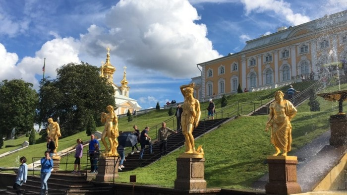

写真は、2018年の夏に撮影した「[ペテルゴフ　夏の宮殿(サンクトペテルブルク)](https://ja.wikipedia.org/wiki/%E3%83%9A%E3%83%86%E3%83%AB%E3%82%B4%E3%83%95)」です。ペテルゴフは、ピョートル大帝(1世)のもとで建設された庭園で、150個を超える噴水がある綺麗な観光地です。過去の私のように、

**今度の海外旅行は、ロシアに旅行しようかな〜。**

と考えている人も居るかもしれません。そんな方々に注意点があります。それは、**ロシア旅行には観光ビザが必須**という事です。個人でのロシア旅行が初めての方は、「えっ、ビザなんて取得した事がない。どうするの！」と困ってしまうと思います。

本記事では、正規の方法での観光ビザ取得方法に触れつつ、ビザ申請代行業者(ロシアビザセンター)を利用した方法を解説します。

## 【正規の方法】観光ビザ取得に必要な書類一覧

正規の方法で、必要な書類は以下の通りです。

正規の方法で必要な書類

- 顔写真(4.5\[cm\]×3.5\[cm\]、カラー)
- パスポート
- 電子査証申請書(EVA)
- バウチャー(旅行日程・宿泊ホテルなどのロシア滞在中の諸情報)

## 【正規の方法】3つのデメリット

**デメリット1：書類作成が面倒**

正規の方法で手続きが面倒なのは、「**電子査証申請書(EVA)**」と「**バウチャー**」です。

電子査証申請書の作成は、[ロシア連邦外務省領事局査証専用サイト](https://visa.kdmid.ru/PetitionChoice.aspx?AspxAutoDetectCookieSupport=1)で決められた内容を淡々と書くだけなので、楽な部類とも言えます。ただし、それ相応の記載量である事、記載項目が英語表記のため、慣れていない人は30分以上かかるかもしれません。

バウチャーは、旅のしおりとも言われる書類です。面倒な理由は、飛行機の往復チケットや宿を予約した後に「バウチャーを発行してください」とお願いする必要がある事です。しかも、予約前にバウチャー発行可否を事前確認しなければなりません。ここでの問い合わせは、当然ロシア語や英語でメールするため、負荷が高い作業です。[空バウチャーを発行する方法](https://pocho.jp/worldinfo/visa/russia/#a02)もありますが、私は試していないのでおススメしません。

**デメリット2：平日に、在日ロシア連\[the\_ad id="598"\]​\_邦大使館・領事館(部)へ書類を持参する事**

以下の大使館・領事館(部)に、観光ビザ申請書類を持参する必要があります。郵送できないため、申請者の住んでいる地域によっては、ちょっとした旅行になってしまいます。しかも、受付が平日のみ(ロシア祝日は除く)という点も、申請を難しくしています。

- [在日ロシア連邦大使館](https://tokyo.mid.ru/web/tokyo-ja/access#Page01)
- [在日ロシア連邦大使館領事部](https://tokyo.mid.ru/web/tokyo-ja/access#Page02)
- [在札幌（北海道）ロシア連邦総領事館](https://tokyo.mid.ru/web/tokyo-ja/access#Page03)
- [在函館総領事館分館](https://tokyo.mid.ru/web/tokyo-ja/access#Page04)
- [在大阪ロシア連邦総領事館](https://tokyo.mid.ru/web/tokyo-ja/access#Page05)
- [在新潟ロシア連邦総領事館](https://tokyo.mid.ru/web/tokyo-ja/access#Page06)

**デメリット3：ビザ申請代行業者に頼むより、高くつく可能性がある事**

前述の大使館・領事館への移動費に加えて、申請料がかかります。申請料は、観光ビザの受領日によって、変動します(4000円〜1万円)。私の場合は、

**「"移動費 + 申請料" > "申請代行業者の利用料(6000円〜1万円)"」**

であったため、業者の利用を即決しました。

## 【ビザ申請代行業者の利用】観光ビザ取得に必要な書類一覧

[ロシアビザセンター](https://visa.d2.r-cms.jp/)を利用する場合、以下の2点だけです。

- 顔写真(4.5\[cm\]×3.5\[cm\]、カラー)
- パスポート

面倒な処理は、全て請け負ってくれる事が公式サイトに記載されています。

> .png)ホテル事前予約不要、航空チケット事前購入不要  
> .png)電子申請書（EVA）はロシアビザセンターが作成します
> 
> .png)ロシアビザセンターが領事館への申請を代行します⇒確実です。
> 
> .png)何日に行くか決まっていない、とりあえず、いつでも行けるようにビザを持っていたい

個人的には、ロシアビザセンターを利用する場合に注意が必要な内容は、パスポートだけだと思っています。注意点は以下の２点です。

1. 見開きで2ページ以上、ビザのための空白のページが残っている事
2. ビザ有効日(ロシア入国日)から数えて、半年以上の有効期間がある事

\[the\_ad id="598"\]

## 【ロシアビザセンターの利用】利用の流れ(3Step)

**Step1：ロシアビザセンター公式サイトで観光ビザ申し込み**

[ロシアビザセンター](https://visa.d2.r-cms.jp/tourism_visa/)の観光ビザ申し込みフォームを記載し、申請します。全項目が日本語であるため、申請で戸惑う事はないと思います。

**Step2：観光ビザの申し込み料金を支払い**

観光ビザの申し込み後、ロシアビザセンターからメールが届きます。料金の支払先は、メールに記載されています。コンビニATMでの支払いもOKでした。なお、公式サイトにも支払先が書いてあります(2019年1月時点)。

> ◆料金のお支払先  
> 三菱UFJ銀行  
> 六本木支店  
> 普通0442987  
> ＲＶＣ株式会社（アールブイシー カブシキガイシャ）

料金は、観光ビザの取得日によって変動します。旅行の２週間以上前に余裕を持って申し込めば、安上がりです。

> 2週間後取得￥７，５００  
> 1週間後取得￥１３，０００  
> 4営業日取得￥１５，０００  
> 翌日取得￥２５，０００

**Step3：ロシアビザセンターにパスポートと写真を送付**

書類の送付先は、ロシアビザセンターから届いたメールに記載されています。先ほど同様、こちらも公式サイトに記載があります。

> ◆パスポート・写真の送付先　  
> 〒107-0052  
> 東京都港区赤坂9-1-7-397  
> ロシアビザセンター  
> TEL:03-6661-0239  
>   
> ◆パスポート＆写真の送付方法  
> 日本郵便レターパックの使用を推奨しています（追跡サービス付・レターパックプラスは速達扱い）

以上で、申請作業は終了です！　ビザが届くのを待ちましょう！

### まとめ

POINT

**【正規の方法】**

- バウチャーの取得で英語・ロシア語を使うため、面倒
- そこまで安上がりではない

**【ロシアビザセンターの利用】**

- 準備する書類がパスポートと写真だけ
- 早期に観光ビザを申し込めば、7500円でビザが取得可能
