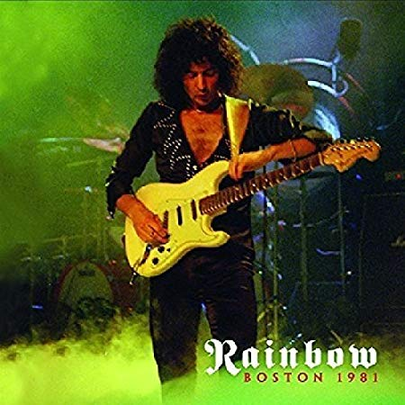

### 収録曲

収録曲

1\. Spotlight Kid  
2\. Love's No Friend  
3\. I Surrender  
4\. Man On The Silver Mountain  
5\. Catch The Rainbow  
6\. Can't Happen Here  
7\. Lost In Hollywood  
8\. Difficult To Cure  
9\. Long Live Rock 'n' Roll  
10\. Smoke On The Water ( Lazy, Women from Tokyo, Smoke On The Water)

---

### Difficult To Cureツアーの良音質な音源

本作は、Joe Lynn Turner加入後にリリースされた"[Difficult To Cure](https://ja.wikipedia.org/wiki/%E3%82%A2%E3%82%A4%E3%83%BB%E3%82%B5%E3%83%AC%E3%83%B3%E3%83%80%E3%83%BC)"公演(1981年5月7日)を収録しています。下地となった音源は、過去に販売されていたBootlegですが、その音質は良い。収録年代およびBootlegという点を踏まえれば、「音の分離感」「アルバムを通した音量バランス」「ノイズ」の全てが、問題ないレベル。しかし、他の方のレビューでは、ギター・キーボードの音量バランスに関して指摘がありました。私も感じたことですが、ギターの音がやや小さめです。

参考として、同公演の音源(YouTube)をどうぞ。

<iframe src="https://www.youtube.com/embed/YChy4SJu6UY" width="560" height="315" frameborder="0" allowfullscreen="allowfullscreen"></iframe>

このように、ストレスフリーでLive音源を楽しめる段階で、音質はかなり高い水準だと思います。前任ボーカリストのGraham Bonnet時代は、"Monsters of Rock"公演ぐらいしか、まともに聴ける音源がありません。そう考えれば、Joe Lynn Turnerファンは各年代のLive音源が多数リリースされていて、恵まれていますね。

---

### 少ない曲数ながらも、レアなセットリスト

本作のセットリストは、10曲のみと非常に少ないです。翌年(1982年)の公演では、20曲以上を披露しています。「CD一枚に収めるために、曲をカットした？」と疑いましたが、複数のサイト(例：[setlist.fm](https://www.setlist.fm/setlist/rainbow/1981/orpheum-theatre-boston-ma-33d82449.html))を確認した所、曲をまるまる削除する対応はしていないようです。つまり、本作は10曲でフルセットリスト。残念。

曲数は少ないですが、本作はJoe Lynn Turner加入直後という事もあって、後年で披露される回数が減る曲が含まれています。例えば、

DIO時代の"Man On The Silver Mountain(銀嶺の覇者)"

Graham Bonnet時代の"Love's No Friend(最もレア)"、"Lost In Hollywood"

 が、その筆頭でしょう。この中で、演奏・歌唱ともに素晴らしいのは、**Lost In Hollywood**でしょうか。次点は、銀嶺の覇者。こちらは、Joe Lynn Turnerの器用さが楽しめます。この人が、ここまで丁寧にガナり、フェイクし、シャウトするのは珍しい気がします。DIOの力強さが好きな方には受けないかもしれませんが、酷評するほど悪くはありません。Love's No Friendは、本作でしか収録されていないレア曲。しかし、Grahamが醸し出していたブルージーな漢の哀愁が消えて、何かチャラい。この曲は演奏機会が少ない事から、Ritchie Blackmoreも「Joe Lynn Turnerに合わない曲」と判断したのだろうか。

ちなみに、演奏全体の印象として、序盤、Ritchie Blackmoreの演奏が精彩を欠いています。具体的には、Catch The Rainbowに達するまで、手抜きフレーズが多い。後半から演奏に熱がこもり始める印象を受けるのは、現地のファンが盛り上がり始めたからなのでしょうか。客席の歓声が少ないから、その辺りは想像になります。

---

### 本作に含まれなかったDifficult To Cureツアーで演奏された曲

[Diffcult To Cureツアーのセットリスト情報](https://www.setlist.fm/search?artist=2bd6acd6&query=tour:%28difficult+to+cure%29)を確認した所、以下の曲も演奏していたようです。私は、Joe Lynn TurnerがRainbowメンバーと歌うKill the Kingを聞いた事がありません(ソロ活動では、よく歌っています)。日本公演でKill the Kingを演奏したそうなので、Bootlegが存在してもおかしくなさそう。

本作未収録の楽曲

- The Land Of Hope And Glory
- Guitar Solo (A Light In The Black)
- Rule Britannia (統べよ、ブリタニア)
- All Night Long
- Since You've Been Gone
- Maybe Next Time
- Woman From Tokyo
- Kill the King

---

### 好きな一曲

Lost in Hollywood

「意外とJoe Lynn Turnerの声も悪くないな！」と上から目線で聴いています。

<iframe width="560" height="315" src="https://www.youtube.com/embed/Fcnaqive0s8" frameborder="0" allowfullscreen="allowfullscreen"></iframe>

<iframe style="width:120px;height:240px;" marginwidth="0" marginheight="0" scrolling="no" frameborder="0" src="//rcm-fe.amazon-adsystem.com/e/cm?lt1=_blank&amp;bc1=000000&amp;IS2=1&amp;bg1=FFFFFF&amp;fc1=000000&amp;lc1=0000FF&amp;t=debimate07-22&amp;language=ja_JP&amp;o=9&amp;p=8&amp;l=as4&amp;m=amazon&amp;f=ifr&amp;ref=as_ss_li_til&amp;asins=B01CN5AFPE&amp;linkId=0cb9f71433e579f76e831077fb6844dc"></iframe>
