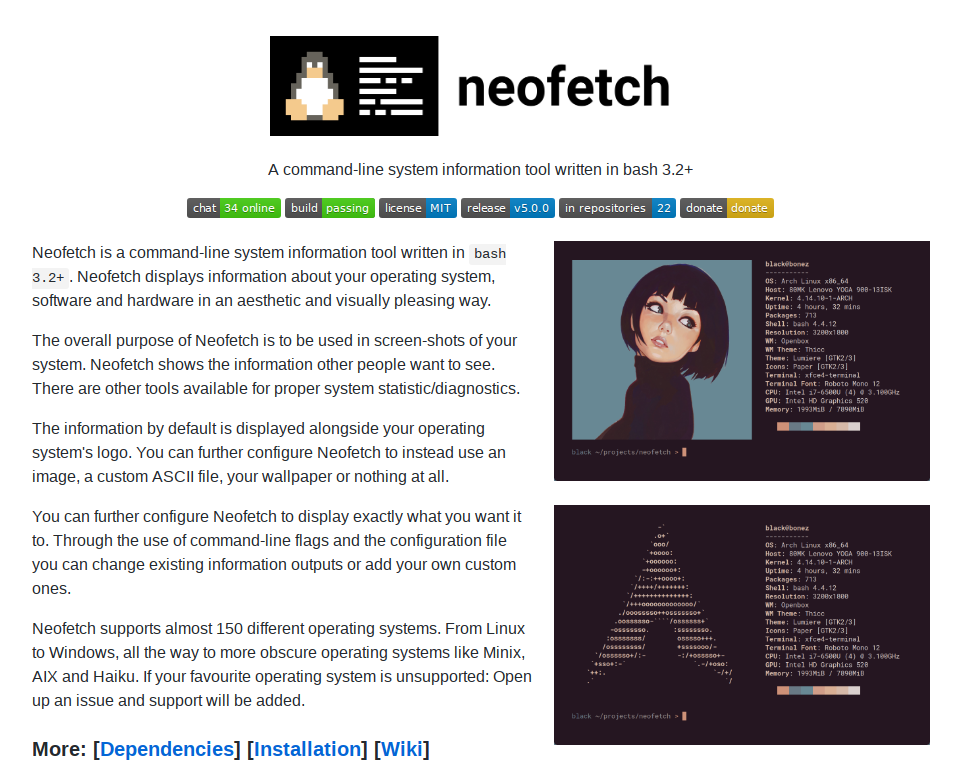

### 前書き

本記事は、システム情報表示ツール"[neofetch](https://github.com/dylanaraps/neofetch)"のコードリーディング結果を記載しています。  
リーディング動機は、**「neofetchは、システム情報をどこから集めているか」**が気になったからです。neofetchは約2600Step程度の小規模なBash scriptであるため、関数レベルで解説します。



POINT

基本的に、neofetchはゴリ押しな作り

### neofetchとは

| 項目 | 説明 |
| --- | --- |
| 機能 | システム情報(OS/Kernel/CPU/Memoryなど)をOSロゴと共に表示する。 |
| Version | 5.0.0(2018年9月時点。本記事ではDebian9 package版であるVer2.0.2を解説) |
| 開発者 | [Dylan Araps](https://github.com/dylanaraps) |
| ライセンス | [MIT](https://github.com/dylanaraps/neofetch/blob/master/LICENSE.md) |
| Download | [https://github.com/dylanaraps/neofetch](https://github.com/dylanaraps/neofetch) |
| 紹介記事(日本語) | [システム情報を表示する便利なコマンド「neofetch](https://news.mynavi.jp/article/20180622-651666/) |

### neofetchのコード規模

本記事で確認するneofetch(Ver2.0.2)のコード規模は、以下の通り([clocコマンド](http://cloc.sourceforge.net/)を使用)。

| Language | ファイル数 | 空白 | コメント | コード行数 |
| --- | --- | --- | --- | --- |
| Bourne Again Shell | 3 | 718 | 773 | **2625** |
| Markdown | 5 | 61 | 0 | 83 |
| make | 2 | 6 | 0 | 22 |
| YAML | 1 | 3 | 0 | 10 |
| 合計 | 11 | 788 | 773 | 2740 |

### インストール方法およびソースコード取得方法

以下の手順は、Debian9を前提としています。別環境の導入手順は、[別サイト](https://orebibou.com/2016/12/%E4%BD%BF%E7%94%A8%E3%81%97%E3%81%A6%E3%81%84%E3%82%8Bos%E3%81%AE%E3%83%AD%E3%82%B4%E3%81%A8%E3%82%B7%E3%82%B9%E3%83%86%E3%83%A0%E6%83%85%E5%A0%B1%E3%82%92%E8%A1%A8%E7%A4%BA%E3%81%99%E3%82%8B%E3%80%8E/)を参照してください(Debian系/RHEL系/Macに関して、記載があります)。

```
$ sudo apt install neofetch  (注釈)：インストール
$ neofetch　　　　　　　　　　　(注釈)：実行
       _,met$$$$$gg.          nao@debian 
    ,g$$$$$$$$$$$$$$$P.       ---------- 
  ,g$$P"     """Y$$.".        OS: Debian GNU/Linux 9.5 (stretch) x86_64 
 ,$$P'              `$$$.     Kernel: 4.9.0-8-amd64 
',$$P       ,ggs.     `$$b:   Uptime: 1 day, 7 hours, 54 minutes 
`d$$'     ,$P"'   .    $$$    Packages: 2209 
 $$P      d$'     ,    $$P    Shell: bash 4.4.12 
 $$:      $$.   - ,d$$'    Resolution: 1920x1080 
 $$;      Y$b._   _,d$P'      DE: Cinnamon 3.2.7 
 Y$$.    `.`"Y$$$$P"'         WM: Mutter (Muffin) 
 `$$b      "-.__              WM Theme: Cinnamon (Albatross) 
  `Y$$                        Theme: BlackMATE [GTK2/3] 
   `Y$$.                      Icons: Gnome [GTK2/3] 
     `$$b.                    Terminal: gnome-terminal 
       `Y$$b.                 CPU: Intel i3-6100U (4) @ 2.3GHz 
          `"Y$b._             GPU: Intel Integrated Graphics 
              `"""            Memory: 2720MB / 32069MB 

                              ████████████████████████ 

$ apt source neofetch　　　　　(注釈)：ソースコードの取得
$ cd neofetch-2.0.2/
$ ls　　　　　　　　　　　　　　　(注釈)：ls結果の"neofetch"がリーディング対象のBash script
CHANGELOG.md  Makefile   ascii   debian    neofetch.1
LICENSE.md    README.md  config  neofetch
```

### neofetchの実装に関する説明範囲

説明範囲は、neofetchのmain関数内に存在する関数(例：cache\_uname)とします。

```
 main() {
 cache_uname                                                                                                                                                              
      get_os                                                                                                                                                                   
      get_default_config 2>/dev/null                                                                                                                                           
      get_args "$@"                                                                                                                                                            
      old_flags                                                                                                                                                                
      get_distro                                                                                                                                                               
      get_bold                                                                                                                                                                 
      get_distro_colors                                                                                                                                                                                                                                                                                                                                                                                          
      (省略)                                                                                                                                                                      
      get_image_backend                                                                                                                                                        
      (省略)      

      # Print the info                                                                                                                                                         
      old_functions                                                                                                                                                            
      get_cache_dir                                                                                                                                                            
      print_info 2>/dev/null

      (省略)                                                                                                                                                                    

      return 0                                                                                                                                                                 
  }                                                                                                                                                                            

  main "$@"   
```

### ヘッダ：Shebangおよびデバッグ用の記述

```
  #!/usr/bin/env bash 
  # set -x  
```

まず、1行目のShebang(#!)は、Shebangの後に記述されているコマンドを実行するという意味です。今回は`#!/usr/bin/env bash`であるため、環境変数(PATH)に存在するbashを実行します。この記述の場合、bashが"/bin/bash"に存在しない環境でも、Scriptが動作する可能性が高いです。

1行目を"#!/bin/sh"と記述している場合、shは他のshellへのシンボリックリンクである事が殆どなので、dashやfishを実行する可能性があります。その場合、Script内のBash固有の文法が実行できず、エラーになります。

次に、2行目のコメント`set -x`は、デバッグ情報を出力します(なので、デバッグ時はコメントを外す)。具体的には、Script内で処理された内容(変数代入、コマンド実行、関数実行など)を表示します。同じ動作をさせるために、`bash -x`というオプションがありますが、`#!/usr/bin/env bash -x`という記載はできません。この記載の場合、インタプリタに引数を渡せないからです。

ちなみに、デバッグを有効化する(2行目のコメントを外す)と、以下のように出力されます。

```
$ ./neofetch 
+ bash_version=4
+ sys_locale=ja_JP.utf8
+ XDG_CONFIG_HOME=/home/nao/.config
+ export LC_ALL=C
+ LC_ALL=C
+ export LANG=C
+ LANG=C
+ shopt -s nocasematch
+ reset='\033[0m'
+ main
+ cache_uname
+ uname=($(uname -srm))
++ uname -srm
+ kernel_name=Linux
+ kernel_version=4.9.0-8-amd64
+ machine_arch=x86_64

(省略)
```

### cache\_uname()：OSのKenel/Arch情報を取得

cache\_uname()は、[unameコマンド](https://eng-entrance.com/linux-command-uname)を用いて、Linux KernelバージョンとCPU Architectureを取得します。以下が実装の全体です。

```
  cache_uname() {                                                                                                                                                              
      # Cache the output of uname so we don't                                                                                                                                  
      # have to spawn it multiple times.                                                                                                                                       
      uname=($(uname -srm))                                                                                                                                                    

      kernel_name="${uname[0]}"   
      kernel_version="${uname[1]}"                                                    
      machine_arch="${uname[2]}"  
  }      
```

unameコマンドのオプションは、  
　・s：カーネル名の表示  
　・r：カーネルリリースバージョンの表示  
　・m：PCのハードウェア名を表示  
であるため、私の環境では以下の情報が出力されます。

```
$ uname -srm
Linux 4.9.0-8-amd64 x86_64
```

後は、配列変数unameから順番に要素を取り出して、別変数で保持しているだけです。

### get\_os()：KernelからOS名の決定

前述のcache\_uname()で取得したカーネル情報から、OS名を決定します。以下が実装の全体です。基本的には、文字列分岐なので、実装で説明する部分はないです。

```
  get_os() {                                                                                                                                                                   
      # $kernel_name is set in a function called cache_uname and is                                                                                                            
      # just the output of 'uname -s'.                                                                                                                                         
      case "$kernel_name" in                                                                                                                                                   
          "Linux")   os="Linux" ;;                                                                                                                                             
          "Darwin")  os="$(sw_vers -productName)" ;;                                                                                                                           
          *"BSD" | "DragonFly" | "Bitrig") os="BSD" ;;                                                                                                                         
          "CYGWIN"*) os="Windows" ;;                                                                                                                                           
          "SunOS") os="Solaris" ;;                                                                                                                                             
          "Haiku") os="Haiku" ;;                                                                                                                                               
          "GNU"*) os="GNU" ;;                                                                                                                                                  
          *) printf "%s\n" "Unknown OS detected: $kernel_name"; exit 1 ;;                                                                                                      
      esac                                                                                                                                                                     
  }    
```

[Darwin](https://ja.wikipedia.org/wiki/Darwin_\(%E3%82%AA%E3%83%9A%E3%83%AC%E3%83%BC%E3%83%86%E3%82%A3%E3%83%B3%E3%82%B0%E3%82%B7%E3%82%B9%E3%83%86%E3%83%A0\))はOS XかiOSの事であり、`sw_vers -productName`を実行すると"Mac OS X"/"iPhone OS"と表示されます。[CYGWIN](https://ja.wikipedia.org/wiki/Cygwin)は、Windows環境で仕方なくUNIXっぽい事をする際に用います。最新版のneofetchでは、[MINIX](https://ja.wikipedia.org/wiki/MINIX)/[AIX](https://ja.wikipedia.org/wiki/AIX)/[IRIX](https://ja.wikipedia.org/wiki/IRIX)/[FreeMiNT](https://freemint.github.io/)も判別します。

私がneofetchの実装を見て存在を認識したOSは、[Haiku](https://ja.wikipedia.org/wiki/Haiku_\(%E3%82%AA%E3%83%9A%E3%83%AC%E3%83%BC%E3%83%86%E3%82%A3%E3%83%B3%E3%82%B0%E3%82%B7%E3%82%B9%E3%83%86%E3%83%A0\))/AIX/IRIXあたり。

\[the\_ad id="598"\]

### get\_default\_config()：neofetchの設定ファイルの読込

neofetchのconfigファイルを探し、その内容を[sourceコマンド](http://www.atmarkit.co.jp/ait/articles/1712/21/news015.html)で読み込みます。このconfigファイルは、システム情報の出力順番などを実装したBash scriptです。[公式情報](https://github.com/dylanaraps/neofetch/wiki/Customizing-Info)では、このファイルをベースに、ユーザが出力形式をカスタマイズする事を目的としているようです。

```
 get_default_config() {                                                                                                                                                       
      if [[ -f "/usr/share/neofetch/config" ]]; then                                                                                                                           
          default_config="/usr/share/neofetch/config"                                                                                                                          

      elif [[ -f "/usr/local/share/neofetch/config" ]]; then                                                                                                                   
          default_config="/usr/local/share/neofetch/config"                                                                                                                    

      elif [[ -f "/data/data/com.termux/files/usr/share/neofetch/config" ]]; then                                                                                              
          default_config="/data/data/com.termux/files/usr/share/neofetch/config"                                                                                               

      else                                                                                                                                                                     
          get_script_dir                                                                                                                                                       
          default_config="${script_dir}/config/config"                                                                                                                         
          travis_config="${script_dir}/config/travis"                                                                                                                          
      fi                                                                                                                                                                       

      if source "$default_config"; then                                                                                                                                        
          err "Config: Sourced default config. ($default_config)"                                                                                                              
      else                                                                                                                                                                     
          err "Config: Default config not found, continuing..."                                                                                                                
      fi                                                                                                                                                                       
  }  
```

このconfigファイルは、インストール方法によって、格納場所が異なります。私の環境では、"/usr/share/neofetch/config"に存在しました(aptパッケージマネージャでのインストール)。

### get\_args()：引数の取得

まず、neofetchの書式は、以下の通りです。ロングオプション(--option)を書き、その後にオプション引数を書く形式です。各オプションの説明は、総数が60個以上あったため、省略します。

```
USAGE: neofetch --option "value" --option "value"   
```

基本的には、オプションを有効にした場合、出力される情報が細かくなります。  
なお、各オプションのデフォルト設定値は、デフォルトconfigファイルに記載されています。

```
  #Example:　shell_pathオプションの有効・無効時
  # on:  '/bin/bash'
  # off: 'bash'
```

get\_args()の実装(抜粋)は、以下の通りです。  
処理内容は、  
　1. カスタムしたconfigファイルを使用するかを判定(最初のcase文からwhile文の前まで)  
　2. オプション解析(while文の中身)

```
  get_args() {                                                                                                                                                                 
      # Check the commandline flags early for '--config none/off'                                                                                                              
      case "$@" in                                                                                                                                                             
          *"--config off"* | *'--config "off"'* | *"--config 'off'"* | \                                                                                                       
          *"--config none"* | *'--config "none"'* | *"--config 'none'"*)                                                                                                       
              config="off"                                                                                                                                                     
          ;;                                                                                                                                                                   

          *"--config -"*) ;;                                                                                                                                                   
          *"--config"*) config="off" ;;                                                                                                                                        
      esac                                                                                                                                                                     

      [[ "${config:-on}" == "on" ]] && get_user_config 2>/dev/null                                                                                                             

      while [[ "$1" ]]; do                                                                                                                                                     
          case "$1" in                                                                                                                                                         
              # Info                                                                                                                                                           
              "--os_arch") os_arch="$2" ;;                                                                                                                                     
              "--cpu_cores") cpu_cores="$2" ;;                                                                                                                                 
              "--cpu_speed") cpu_speed="$2" ;;       
　　　(省略)
          esac                                                                                                                                                                 

          shift                                                                                                                                                                
      done   
```

### 1\. カスタムしたconfigファイルを使用するかを判定(最初のcase文からwhile文の前まで)

まず、最初のcase文において、関数に渡した全引数($@)をチェックします。本来の意図では、"--config none"のみがconfig無効化を意味しますが、"--config off"や"--config"などの誤った記載を認めるため、このようなcase文になっています。

前述のget\_default\_config()にて、configファイルを読み込んでいます。その場合、変数config=onであるため(configファイルで代入されているため)、`[[ "${config:-on}" == "on" ]] && get_user_config 2>/dev/null`において、関数get\_user\_configが実行されます。

なお、左辺値(${config:-on})の文字抽出が冗長に思えますが、意図が分からず。

関数get\_user\_config(本記事に未掲載)はデフォルトconfigファイルを再び読み込んだ後、"${HOME}/.config/neofetch"以下にコピーします。このタイミングでしたい事は、本当はコピーだけです。しかし、次のオプション解析内でユーザ指定configを読み込む際、同関数を使いまわしたいようです。そのため、無駄ですが、デフォルトconfigファイルを2回読み込んでいるようです。　

### 2\. オプション解析(while文の中身)

1番目の引数が空文字でない限りループを繰り返し、case文でロングオプション毎に処理を分岐させます。分岐後は、オプション引数を別変数に格納するのがメインです(例：os\_arch="$2"の部分)。ループの最後で、[shiftコマンド](https://tech.nikkeibp.co.jp/it/article/COLUMN/20060227/230882/)を用いて、引数を1つずらします。

### old\_flags()：deprecatedしたオプション使用時の警告

既に使用していないオプション設定(フラグ変数)に値が入っている場合、警告を出力します。この関数は、読み込むconfigファイルが古い場合に備えて、存在します。(オプション設定変数の一部は、configファイルに存在)。

```
  old_flags() {                                                                                                                                                                
      [[ -n "$osx_buildversion" ]] && err "Config: \$osx_buildversion is deprecated, use \$distro_shorthand instead."                                                          
      [[ -n "$osx_codename" ]] && err "Config: \$osx_codename is deprecated, use \$distro_shorthand instead."                                                                  
      [[ "$cpu_cores" == "on" ]] && err "Config: \$cpu_cores='on' is deprecated, use \$cpu_cores='logical|physical|off' instead."                                              
      [[ -n "$image" ]] && { err "Config: \$image is deprecated, use \$image_source instead."; image_source="$image"; }                                                        

      # All progress_ variables were changed to bar_                                                                                                                           
      [[ -n "$progress_char" ]] && err "Config: \$progress_char is deprecated, use \$bar_char_elapsed and \$bar_char_total instead."                                           
      [[ -n "$progress_border" ]] && err "Config: \$progress_border is deprecated, use \$bar_border instead."                                                                  
      [[ -n "$progress_length" ]] && err "Config: \$progress_length is deprecated, use \$bar_length instead."                                                                  
      [[ -n "$progress_color_elapsed" ]] && err "Config: \$progress_color_elapsed is deprecated, use \$bar_color_elapsed instead."                                             
      [[ -n "$progress_color_total" ]] && err "Config: \$progress_color_total is deprecated, use \$bar_color_total instead."                                                   
  } 
```

### get\_distro()：ディストリビューション名およびVersionの取得

ディストリビューション(Version)を特定するために、  
　・ 各ディストリビューション固有の設定ファイルを確認  
　・ コマンド実行  
のいずれかを行います。

確認するファイル・実行コマンドは、OS(※)によって異なります。  
※OS = Linux(GNU)、Mac OS X、iOS、BSD、Windows、Solaris、Haiku

```
 get_distro() {                                                                                                                                    
      [[ "$distro" ]] && return                                                                                                                     

      case "$os" in                                                                                                                                 
          "Linux" | "GNU")                                                                                                                          
              if [[ "$(< /proc/version)" =~ "Microsoft" || "$(< /proc/sys/kernel/osrelease)" =~ "Microsoft" ]]; then                                
                  case "$distro_shorthand" in                                                                                                       
                      "on")   distro="$(lsb_release -sir) [Windows 10]" ;;                                                                          
                      "tiny") distro="Windows 10" ;;                                                                                                
                      *)      distro="$(lsb_release -sd) on Windows 10" ;;                                                                          
                  esac                                                                                                                              
                  ascii_distro="Windows 10"                                                                                                         

              elif [[ -f "/etc/GoboLinuxVersion" ]]; then                                                                                           
                  case "$distro_shorthand" in                                                                                                       
                      "on" | "tiny") distro="GoboLinux" ;;                                                                                          
                      *) distro="GoboLinux $(< /etc/GoboLinuxVersion)"                                                                              
                  esac                                                                                                                              

              elif [[ -f "/etc/redstar-release" ]]; then                                                                                            
                  case "$distro_shorthand" in                                                                                                       
                      "on" | "tiny") distro="Red Star OS" ;;                                                                                        
                      *) distro="Red Star OS $(awk -F'[^0-9*]' '$0=$2' /etc/redstar-release)"                                                       
                  esac                                                                                                     

    (省略)

      [[ -z "$distro" ]] && distro="$os (Unknown)"                                                                                                  

      # Get architecture                                                                                                                            
      [[ "$os_arch" == "on" ]] && \                                                                                                                 
          distro+=" ${machine_arch}"                                                                                                                

      [[ "${ascii_distro:-auto}" == "auto" ]] && \                                                                                                  
          ascii_distro="$(trim "$distro")"      
```

各ディストリビューションによって確認するファイル、実行するコマンドは下表の通りです。

| ディストリビューション | ファイル・コマンド |
| --- | --- |
| Microsoft([WSL](https://ja.wikipedia.org/wiki/Windows_Subsystem_for_Linux)) | /proc/version   /proc/sys/kernel/osrelease   lsb\_releaseコマンドでディストリ特定 |
| [Gobo Linux](https://ja.wikipedia.org/wiki/GoboLinux) | /etc/GoboLinuxVersion |
| [Red Star OS](https://ja.wikipedia.org/wiki/Red_Star_OS) | /etc/redstar-release |
| LSB準拠Linux OS | lsb\_releaseコマンドの実行 |
| [GuixSD](https://www.gnu.org/software/guix/about/) | [guixパッケージマネージャ](https://en.wikipedia.org/wiki/GNU_Guix)の存在確認 |
| [CRUX](https://en.wikipedia.org/wiki/CRUX) | cruxコマンドの存在確認 |
| Andloid | /system/app/ディレクトリ   /system/priv-appディレクトリ |
| その他のLinuxディストリビューション | /etc/os-release   /usr/lib/os-release   /etc/_release   /usr/lib/_release |
| Mac OS X | sw\_versコマンドの実行 |
| iPhone OS | sw\_versコマンドの実行 |
| Windows | wmicコマンドの実行 |
| Solaris | /etc/release |
| Haiku | "uname -sv"の実行 |

上の表の方法で特定できなかった場合は、Unknownとなります。また、os\_archオプションが有効の場合、ディストリビューション名にCPU architectureを付与します。最後の変数ascii\_distroは、各ディストリビューションのアスキーアートを取得する際に使用します(後述)。

### get\_bold：太字用のANSIエスケープコードを取得

コード中の"\\033"はESCと同等で、太字指定("ESC\[1m")となります。

```
  get_bold() {                                                                                                                                      
      case "$ascii_bold" in                                                                                                                         
          "on") ascii_bold="\033[1m" ;;                                                                                                             
          "off") ascii_bold="" ;;                                                                                                                   
      esac                                                                                                                                          

      case "$bold" in                                                                                                                               
          "on") bold="\033[1m" ;;                                                                                                                   
          "off") bold="" ;;                                                                                                                         
      esac                                                                                                                                          
  }  
```

### get\_distro\_colors()：ディストリビューション毎の表示色を取得

ディストリビューション毎に、色設定が決め打ちされており、ターミナルに表示する文字色変更はset\_colors()内の[colorコマンド](https://www.adminweb.jp/command/display/index4.html)で行います。

```
  get_distro_colors() {                                                                                                                             
      # This function sets the text colors according                                                                                                
      # to your OS/Distro's logo colors.                                                                                                            
      #                                                                                                                                             
      # $ascii_distro is the same as $distro                                                                                                        
      case "$ascii_distro" in                                                                                                                       
          "Arch"* | "Kogaion"* | "Elementary"* | "GalliumOS"* | "Rosa"* | "OpenWrt"* | "Netrunner"* | "PCLinuxOS"* | "Slackware"* | "KaOS"* | "Kubun  tu"* | "Lubuntu"* | "Xubuntu"* | "OpenIndiana"* | "Fedora"* | "Korora"* | "Sabayon"* | "Frugalware"* | "Exherbo"* | "Scientific"* | "Solus"* | "Ch  aletOS"* | "Apricity"* | "SwagArch"* | "AOSC"* | "Ubuntu-Budgie"*)
              set_colors 4 7 1                                                                                                                      
          ;;                                                                                                                                        

          "RFRemix"*)                                                                                                                               
              set_colors 4 7 1                                                                                                                      
              ascii_distro="Fedora"                                                                                                                 

       (省略)

      # Overwrite distro colors if '$ascii_colors' doesn't                                                                                          
      # equal 'distro'.                                                                                                                             
      if [[ "${ascii_colors[0]}" != "distro" ]]; then                                                                                               
          color_text="off"                                                                                                                          
          set_colors ${ascii_colors[@]}                                                                                                             
      fi                                                                                                                                            
  }                         

  set_colors() {                                                                                                                                    
      c1="$(color "$1")${ascii_bold}"                                                                                                               
      c2="$(color "$2")${ascii_bold}"                                                                                                               
      c3="$(color "$3")${ascii_bold}"                                                                                                               
      c4="$(color "$4")${ascii_bold}"                                                                                                               
      c5="$(color "$5")${ascii_bold}"                                                                                                               
      c6="$(color "$6")${ascii_bold}"                                                                                                               

      [[ "$color_text" != "off" ]] && set_text_colors $@                                                                                            
  }    
```

### get\_image\_backend()：背景画像表示に関する設定

ここでの処理は、w3m-imgおよびImageMagickパッケージの導入が前提となっています。  
w3m-imgは、ターミナル上に画像を表示するコマンドであり、w3m(Terminalブラウザ)の派生物です。ImageMagickは、画像表示や編集用のソフトウェアです。

余談ですが、Terminalに画像を表示させるには、[X Window System](https://ja.wikipedia.org/wiki/X_Window_System)のXlibなどを使用します。  
私は、[Low Level X Window Programming: An Introduction by Examples(書籍)](https://books.telegraph.co.uk/Product/Ross-J-Maloney/Low-Level-X-Window-Programming--An-Introduction-by-Examples/21736663)が欲しいけど、買えてない……

コード全体を示すと長いため、処理の概要だけを以下に示します。  
　1. w3mimgdisplayコマンド(画像表示コマンド)の存在確認  
　2. ImageMagickが提供するconvertコマンド(画像変換コマンド)の存在確認  
　3. デスクトップ環境(例：Cinnamon/MATE)に応じた背景画像(PATH)を取得  
　4. Terminalに画像を表示する際に使用するコマンドの決定(iterm2/tycat/w3mのいずれか)  
　5. 現在のTerminalの縦横を取得  
　6. 画像の縦横を取得  
　7. 画像のサムネイルをconvertコマンドで作成

### old\_functions()：古いconfigファイル上に実装された関数と互換性を取る

neofetchは、一部の関数実装をconfigファイルに分離しています。そのため、古いconfigファイルを読み込んでいる場合、deprecatedな関数が存在する可能性があります。そこで、deprecatedな関数を新しい関数名でWrappingする事により、互換性を保っています。

```
  old_functions() {                                                                                                                                 
      # Deprecated functions                                                                                                                        
      # Neofetch 2.0 changed the names of a few variables.                                                                                          
      # This function adds backwards compatibility for the                                                                                          
      # old variable names.                                                                                                                         
      if type printinfo >/dev/null 2>&1; then                                                                                                       
          print_info() { printinfo ; }                                                                                                              
          get_wmtheme() { get_wm_theme; wmtheme="$wm_theme"; }                                                                                      
          get_termfont() { get_term_font; termfont="$term_font"; }                                                                                  
          get_localip() { get_local_ip; localip="$local_ip"; }                                                                                      
          get_publicip() { get_public_ip; publicip="$public_ip"; }                                                                                  
          get_linebreak() { get_line_break; linebreak="$line_break"; }                                                                              
      fi                                                                                                                                            
  }     
```

### get\_cache\_dir()：キャッシュディレクトリの決定

Macか、それ以外のOSでキャッシュディレクトリを変更します。

```
  get_cache_dir() {                                                                                                                                 
      case "$os" in                                                                                                                                 
          "Mac OS X") cache_dir="/Library/Caches" ;;                                                                                                
          *) cache_dir="/tmp" ;;                                                                                                                    
      esac                                                                                                                                          
  }  
```

### print\_info()：システム情報の表示

システム情報を表示します。print\_info()はconfigファイルに実装されており、print\_info()内のinfo()はneofetch本体に実装があります。info()で重要な部分は、`"get_${2:-$1}" 2>/dev/null`であり、get\_XXX関数を用いて各システム情報(文字列)を取得しています。Mac OSのGPU情報のみ、cache()関数でキャッシュディレクトリに格納します(頻繁にキャッシュ化しない理由は不明)。

```
  print_info() {                                                                                                                              
      info title                                                                                                                              
      info underline                                                                                                                          

      info "OS" distro                                                                                                                        
      info "Model" model                                                                                                                      
      info "Kernel" kernel                                                                                                                    
      info "Uptime" uptime                                                                                                                    
      info "Packages" packages                                                                                                                                                                                                                                                                                                                                        
      (省略)                                                                                                                                                                                                                                                                                                                                                          
      info line_break                                                                                                                         
      info cols                                                                                                                               
      info line_break                                                                                                                         
  }      
```

```
  info() {                                                                                                                                          
      # $1 is the subtitle                                                                                                                          
      subtitle="$1"                                                                                                                                 

      # Use cache if it exists                                                                                                                      
      if [[ -f "${cache_dir}/neofetch/${2}" ]]; then                                                                                                
          source "${cache_dir}/neofetch/${2}"                                                                                                       
      else                                                                                                                                          
          # Call the function.                                                                                                                      
          "get_${2:-$1}" 2>/dev/null                                                                                                                
      fi                                                                                                                                            

      # Update the variable                                                                                                                         
      output="${2:-$1}"                                                                                                                             
      output="$(trim "${!output}")"        
      (省略)
 }   
```

システム情報の取得方法(一部)を下表に示します。

| システム情報 | 参照ファイル・コマンド |
| --- | --- |
| OS | 前述のディストリビューション取得までの流れを参照 |
| Model | \[Linux系\]   getpropコマンド   /sys/devices/virtual/dmi/id/product\_name   /sys/devices/virtual/dmi/id/product\_version   /sys/firmware/devicetree/base/model   /tmp/sysinfo/model      \[Apple/BSD\]   sysctlコマンド      \[Windows\]   wmicコマンド      \[Solaris\]   prtconfコマンド |
| Kernel | unameコマンド |
| Uptime | \[Haiku\]   uptimeコマンド      \[Linux/Windows/GNU\]   /proc/uptime      \[Apple/BSD\]   sysctlコマンド      \[Solaris\]kstatコマンド |
| Packages | 各ディストリビューションのパッケージマネージャ |
| Shell | 環境変数$SHELL |
| Resolution | \[Linux/BSD/Solaris/GNU\]   xrandrコマンド   xdpyinfoコマンド      \[Mac OS X\]   screenresolutionコマンド   system\_profilerコマンド      \[Windows\]   wmicコマンド      \[Haiku\]screenmodeコマンド |
| DE | \[Windows/Mac\]   決め打ち(スクリプト内にハードコーディング)      \[Linux\]   環境変数$XDG\_CURRENT\_DESKTOP |
| WM | \[Mac\]   決め打ち(スクリプト内にハードコーディング)      \[Windows\]   tasklistコマンド      \[その他\]   xpropコマンド |

\[the\_ad id="598"\]

### ディストリビューションアスキーアートの格納先

私の環境では、`/usr/share/neofetch/ascii/distro`以下に存在します。  
知らないディストリビューションが沢山……Kali Linux環境が欲しい。

```
$ cd /usr/share/neofetch/ascii/distro

$ ls
alpine      debian        kaos           oracle      sparky
android     deepin        kde            pacbsd      steamos
antergos    devuan        kogaion        parabola    suse
aosc        dracos        korora         pardus      swagarch
apricity    dragonflybsd  kubuntu        parrot      tails
arch        elementary    linux          pclinuxos   travis
arch_old    exherbo       lmde           peppermint  trisquel
arch_small  fedora        lubuntu        porteus     ubuntu
bitrig      freebsd       mac            puppy       ubuntu-budgie
blag        frugalware    mageia         qubes       ubuntu-gnome
blankon     funtoo        manjaro        raspbian    ubuntu_old
bsd         galliumos     mint           redhat      void
bunsenlabs  gentoo        netbsd         redstar     windows
centos      gentoo_small  netrunner      rosa        windows10
chakra      gnewsense     nixos          sabayon     xubuntu
chaletos    gnu           openbsd        sailfishos  zorin
chapeau     gobolinux     openbsd_small  scientific
chrome      guixsd        openindiana    slackware
crux        haiku         openmandriva   solaris
crux_small  kali          openwrt        solus

$ cat kali     (注釈)：変数c1は色設定。
${c1}..............
            ..,;:ccc,.
          ......''';lxO.
.....''''..........,:ld;
           .';;;:::;,,.x,
      ..'''.            0Xxoc:,.  ...
  ....                ,ONkc;,;cokOdc',.
 .                   OMo           ':${c2}dd${c1}o.
                    dMc               :OO;
                    0M.                 .:o.
                    ;Wd
                     ;XO,
                       ,d0Odlc;,..
                           ..',;:cdOOd::,.
                                    .:d;.':;.
                                       'd,  .'
                                         ;l   ..
                                          .o
                                            c
                                            .'
                                             .
```

### 最後に

読み終わった印象は、

- 予想以上に力技
- Bash以外で実装した方が楽そう(色んな環境で動作させるには、Bashが適切だった？)
- おおよそ実装を理解したので、何らかの形でContributeしたい

ちなみに、公式サイトの出力で表示されている画像の作者は、[Kuvshinov Ilya(twitter)](https://twitter.com/Kuvshinov_Ilya)。中国・韓国の人が書く絵に似ていると思いましたが、まさかのロシア人。私はこの絵の雰囲気が好き。


