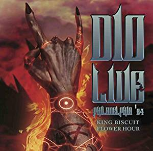

## 収録曲

収録曲

1\. Stand Up And Shout  
2\. One Night In The City  
3\. Don't Talk To Strangers  
4\. Mystery  
5\. Egypt (The Chains Are On)  
6\. Heaven And Hell  
7\. The Last In Line  
8\. Heaven And Hell (Reprise)  
9\. Rainbow In The Dark  
10\. Man On The Silver Mountain > Long Live Rock N Roll  
11\. The Mob Rules  
12\. We Rock

## Ronnie James Dioのキャリア絶頂期Live音源

[Ronnie James Dio](https://ja.wikipedia.org/wiki/%E3%83%AD%E3%83%8B%E3%83%BC%E3%83%BB%E3%82%B8%E3%82%A7%E3%82%A4%E3%83%A0%E3%82%B9%E3%83%BB%E3%83%87%E3%82%A3%E3%82%AA)は、日本国内に限って言えば、[Rainbow](https://ja.wikipedia.org/wiki/%E3%83%AC%E3%82%A4%E3%83%B3%E3%83%9C%E3%83%BC_\(%E3%83%90%E3%83%B3%E3%83%89\))のボーカリストとして知名度があるかもしれません。しかし、そのキャリアの絶頂期は、自身のソロ活動で[Holy Diver(1983)](https://en.wikipedia.org/wiki/Holy_Diver)、[The Last in Line(1984)](https://en.wikipedia.org/wiki/The_Last_in_Line)をリリースした頃ではないでしょうか。この時期は、セットリストにRainbow、[Black Sabbath](https://ja.wikipedia.org/wiki/%E3%83%96%E3%83%A9%E3%83%83%E3%82%AF%E3%83%BB%E3%82%B5%E3%83%90%E3%82%B9)、DIO(ソロ)の楽曲が並び、選曲面でオールタイムベストと言えます。さらに、DIOの歌唱は90年代と比較して力強く(本作時点で42歳)、ギタリストもアグレッシブなソロを華やかに弾きこなす[Vivian Campbell](https://ja.wikipedia.org/wiki/%E3%83%B4%E3%82%A3%E3%83%B4%E3%82%A3%E3%82%A2%E3%83%B3%E3%83%BB%E3%82%AD%E3%83%A3%E3%83%B3%E3%83%99%E3%83%AB)であったため、80年代のLive盤はとても聴き応えがありました。

本作のLive映像が一部ですが、Youtubeにあります。この映像は、"[A Special From The Spectrum Live Concert Performance](https://www.discogs.com/ja/Dio-A-Special-From-The-Spectrum-Live-Concert-Performance/release/5494574)(US限定発売、2005年にWe Rockとして再発)"と思われます。

<iframe width="560" height="315" src="https://www.youtube.com/embed/sH3xtXb8gFw" frameborder="0" allow="accelerometer; autoplay; encrypted-media; gyroscope; picture-in-picture" allowfullscreen="allowfullscreen"></iframe>

本作は、1984年8月25日のPhiladelphia(Spectrum)公演から、"Holy Diver"を除いた全12曲が収録されています。オフィシャル盤として、CDがリリースされた事はないようです(映像作品は、前述の通り存在します)。

ハイライトは、The Last in Lineの盛り上がりをそのまま引き継いで、Heaven and Hell(楽曲の終盤)へと続くメドレーでしょう。音質面でも、同時期のLiveアルバムの中では、頭一つ飛び抜けています。ラジオ用の録音をベースとしているため、音圧がブレたり、聞き取りづらさを感じさせません。

## King Biscuit Flower Hourとは

アルバムジャケットに記載された[King Biscuit Flower Hour](https://en.wikipedia.org/wiki/King_Biscuit_Flower_Hour)を読んで、「DIOがFlower? Dragonじゃなくて?」と不思議に思い、調べました。King Biscuit Flower Hourは、DIOと一切関係がなく、1973〜2005年までに存在したラジオ番組のようです。基本的には、ロックバンドのLive音源を配信していたようで、2019年現在ではラジオ用音源をLive盤(CD)として[AliveTheLive](https://www.interart.co.jp/business/entertainment/alivethelive.html)レーベルが販売しているようです。取り扱っているバンドは、AC/DC、Aerosmith、Bob Dylan、David Bowie、ELP、Judas Priest、Metallicaなど、多岐に渡ります。バンドのオリジナルアルバムを買い集めた後、次に手を出すLive盤の漁り先として、[AliveTheLive](https://www.interart.co.jp/business/entertainment/alivethelive.html)レーベルは良さそうです。

## 1984年以降のDIO

本作に関係のない余談ですが、80年代後半からDIOの人気に陰りがで始めます。まず、3作目の[Sacred Heart](https://en.wikipedia.org/wiki/Sacred_Heart_\(Dio_album\))は1st、2ndと同路線の楽曲が並んだため、若干焼き直し感がでました。その後、Vivian Campbellが給料UPを交渉(DIO以下、他メンバー以上)しましたが、最終的に失敗したため、彼はツアー中に解雇されました。4作目の[Dream Evil](https://en.wikipedia.org/wiki/Dream_Evil_\(album\))は、ギタリストがCraig Goldyに変わった影響で、楽曲に派手さが無くなりました(最大の問題は、キラーチューンの欠如ではないかと思います)。

1885年〜1990年までは、ファンの評価が厳しすぎるだけで、そこまで酷いものではありません。しかし、1990年以降は、DIOが迷走を始めます。この時代はDIOだけでなく、様々なHR/HMバンドが生き残りをかけて、試行錯誤していました。この原因は、[Nirvana](https://ja.wikipedia.org/wiki/%E3%83%8B%E3%83%AB%E3%83%B4%E3%82%A1%E3%83%BC%E3%83%8A_\(%E3%82%A2%E3%83%A1%E3%83%AA%E3%82%AB%E5%90%88%E8%A1%86%E5%9B%BD%E3%81%AE%E3%83%90%E3%83%B3%E3%83%89\))のようなグランジ(新ジャンル)が流行した結果、80年代のHR/HMスタイルは過去の物となったためです。

DIOも時代の流れについていこうと、楽曲をモダン・ヘヴィネス路線に変更しました。しかし、日本のファンは叙情性や大仰・劇的な要素を求めていたために愛想を尽かし、海外のファンはメロディを犠牲にしたヘヴィネスに然程魅力を感じなかったようです。DIOの声も加齢により徐々に勢いを失い始め、残念ながら、1980年代の人気を最後まで取り戻す事は出来ませんでした。

## 好きな一曲

We Rock

Liveの最後にこんな盛り上がる曲をやられたら、アンコールを止められない。

<iframe width="560" height="315" src="https://www.youtube.com/embed/tPV6uholM8s" frameborder="0" allow="accelerometer; autoplay; encrypted-media; gyroscope; picture-in-picture" allowfullscreen="allowfullscreen"></iframe>

<iframe style="width:120px;height:240px;" marginwidth="0" marginheight="0" scrolling="no" frameborder="0" src="//rcm-fe.amazon-adsystem.com/e/cm?lt1=_blank&amp;bc1=000000&amp;IS2=1&amp;bg1=FFFFFF&amp;fc1=000000&amp;lc1=0000FF&amp;t=debimate07-22&amp;language=ja_JP&amp;o=9&amp;p=8&amp;l=as4&amp;m=amazon&amp;f=ifr&amp;ref=as_ss_li_til&amp;asins=B07JGRNXQ4&amp;linkId=c728b189ec6b4ff51bb7ebbc3880880d"></iframe>
