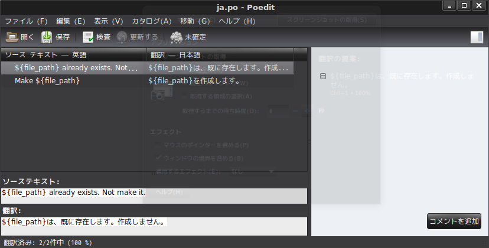

## 前書き

BashによるShell Scriptを国際化(メッセージ翻訳)する方法は、C言語/Python/Rubyなどと同様です。つまり、gettextライブラリを使用し、翻訳対象メッセージの対訳を保存したカタログファイル(.moバイナリ、言語毎に必要)を用意する方法です。本記事では、その使い方を説明します。

しかし、そもそも論として、

「Bashで国際化が必要な規模のScriptを書いてはいけません」

この点に関しては、数々の議論があります。以下に、Google先生の見解を引用します。

> 原文：出典["Shell Style Guide"](https://google.github.io/styleguide/shell.xml)  
> If you are writing a script that is more than 100 lines long, you should probably   
> be writing it in Python instead. Bear in mind that scripts grow. Rewrite your   
> script in another language early to avoid a time-consuming rewrite at a later date.
> 
> 訳  
> **100行以上の長さのスクリプトを書いているならば、おそらくその代わりにPythonで書くべきです。**スクリプトが成長することに注意してください。後の時間のかかる修正を避けるために、別の言語でスクリプトを早く書き直してください。

「Bashは100行以内」と提案されているにも関わらず、本記事の国際化を紹介する背景は、以下の通りです。

国際化を必要とする理由

- (前提)Bashライブラリを作成し、Script作成時の作業負荷を軽減させたい
- ライブラリは国際化されている方が望ましい
- 国際化に関する情報が少ない(=情報共有したい)

「Bashでユーティリティライブラリあるの？」「ライブラリを使うより、自分で書いたほうが早い」と思われる方がいると思います。Bashライブラリの少なさに関しても(正確には定着しない理由に関して)、「[stack overflow "Bash utility script library"](https://stackoverflow.com/questions/11369522/bash-utility-script-library)」で議論されています。ここまでで、何が言いたいかと言えば、**本記事は普通にScriptを書くには必要のない情報**という事です。

## 前準備：Bashライブラリ１点、Shell Script１点

検証用にファイル2点を用意します。

まず、Bashライブラリ(libbash.sh)には、ライブラリ関数"mk\_empty\_file()"を実装します。この関数は、引数で指定されたファイルが存在しない場合はファイル作成およびメッセージを表示し、存在する場合はファイル作成しなかった旨をメッセージで示します。

次に、Shell Script(testshell)では、libbash.shを読み込み、前述のライブラリ関数を使用します。GoogleのShell Scriptコーディングスタイルでは、ライブラリはどの言語向けのものかを知る必要があるため、拡張子(".sh")が必要とされています。しかし、実行ファイルは、実行時にどの言語で書かれているかを知る必要がないため、拡張子(".sh")が必要ないとされています。

```
#!/bin/bash

function mk_empty_file() {
    local file_path="$1"

    if [ -f "${file_path}" ]; then
        echo ""${file_path}" already exists. Not make it."
    else
        echo -n > "${file_path}"
        if [ "$?" = 0 ]; then
            echo "Make "${file_path}""
        fi
    fi
}
```

```
#!/bin/bash
source libbash.sh

# 空ファイルを作成
mk_empty_file empty_test_file
```

作成したShell Scriptに実行権限をつけて、実行した結果が以下の通りです。

```
$ chmod a+x testshell   (注釈) Scriptに実行権限を付与。ライブラリは実行権限が不要

$ ./testshell    
Make empty_test_file

$ ls                    (注釈) 空ファイルの"empty_test_file"の作成を確認
empty_test_file  libbash.sh  testshell

$ ./testshell           (注釈) 同名ファイルがあるため、その旨のメッセージを表示
empty_test_file already exists. Not make it.

```

## 国際化ライブラリの準備

Debian環境では、[gettext-baseパッケージ](https://packages.debian.org/stretch/gettext-base)が国際化用ライブラリを提供します。ライブラリが存在するかを[whichコマンド](https://webkaru.net/linux/which-command/)で確認し、存在しなければ[aptパッケージマネージャ](https://eng-entrance.com/linux-package-apt-2)でインストールしてください。

```
$ which gettext.sh
/usr/bin/gettext.sh      (注釈) このPATHが表示されれば、以下の手順は実行不要。

$ sudo apt install gettext-base

```

## 国際化に必要なメッセージカタログとは

メッセージカタログは、「翻訳対象メッセージ(msgid)」と「そのメッセージ(msgid)に対する翻訳メッセージ」を記載した.moバイナリです。メッセージカタログを作成まで、いくつかの手順を実施します。

1. プログラム内メッセージの中から、翻訳対象メッセージを選択
2. メッセージカタログの基になる.potファイルを作成
3. potファイルから、言語毎に.poファイルを作成(例：日本語向けはja.po)
4. 言語毎の.poファイルをコンパイルし、メッセージカタログ(.mo)に変換

下表に、前述の手順で登場したファイルの役割を説明します。

| **ファイル拡張子** | **役割** |
| --- | --- |
| pot (Potable Object Template)  | 翻訳対象メッセージIDおよびライン番号(メッセージ位置)を記載したファイル |
| po(Portable Object)  | .poファイルを基に、各言語向けに翻訳したファイル。言語ごとに、別ファイルで管理 |
| mo(Machine Object)  | .poファイルをコンパイルしたバイナリファイル  |

\[the\_ad id="598"\]

## メッセージカタログの作成手順

まず、翻訳対象メッセージに対して、"eval\_gettext"関数を付与します。C言語であれば、gettext関数(エイリアス"\_")を付与しますが、それと同様です。注意点としては、国際化用ライブラリとなるgettext.shをShell Script先頭で読み込む必要があります。基本的に、"eval\_gettext"関数の付与は、

```
"$(eval_gettext "ここは翻訳対象メッセージ")"
変数を含む場合は
"$(eval_gettext "ここは翻訳対象メッセージと\$変数")"

```

 の形式で記載します。**注意すべきは、メッセージ内に変数を含む場合、変数の前にバックスラッシュが必要な事**です。この理由は、eval\_gettext関数が、変数値がまだ代入されていない文字列を期待するためです。

次に、カタログファイル名(拡張子".mo"を除く)を環境変数TEXTDOMAINに、メッセージカタログの格納先PATHを環境変数TEXTDOMAINDIRに設定し、[exportコマンド](https://webkaru.net/linux/export-command/)で設定します。

基本的には、環境変数TEXTDOMAINは、翻訳対象ファイル名(今回はライブラリ名)にが好ましいです。環境変数TEXTDOMAINDIRは、メッセージカタログの一般的な格納場所である"/usr/local/share/locale"もしくは"/usr/share/locale"とします。

前述のlibbash.shであれば、以下のように修正します。

```
#!/bin/bash
source gettext.sh
export TEXTDOMAIN=libbash
export TEXTDOMAINDIR=/usr/local/share/locale

function mk_empty_file() {
    local file_path="$1"

    if [ -f "${file_path}" ]; then
        echo "$(eval_gettext "\${file_path} already exists. Not make it.")"
    else
        echo -n > "${file_path}"
        if [ "$?" = 0 ]; then
            echo "$(eval_gettext "Make \${file_path}")"
        fi
    fi
}

```

xgettextコマンドによって、メッセージカタログテンプレートである.potファイルを生成します。「-o」オプションは、生成ファイル名(.pot)の指定です。

```
$ xgettext -o libbash.pot libbash.sh 

```

```
# SOME DESCRIPTIVE TITLE.
# Copyright (C) YEAR THE PACKAGE'S COPYRIGHT HOLDER
# This file is distributed under the same license as the PACKAGE package.
# FIRST AUTHOR <EMAIL@ADDRESS>, YEAR.
#
#, fuzzy
msgid ""
msgstr ""
"Project-Id-Version: PACKAGE VERSION\n"
"Report-Msgid-Bugs-To: \n"
"POT-Creation-Date: 2019-02-03 15:16+0900\n"
"PO-Revision-Date: YEAR-MO-DA HO:MI+ZONE\n"
"Last-Translator: FULL NAME <EMAIL@ADDRESS>\n"
"Language-Team: LANGUAGE <LL@li.org>\n"
"Language: \n"
"MIME-Version: 1.0\n"
"Content-Type: text/plain; charset=CHARSET\n"
"Content-Transfer-Encoding: 8bit\n"

#: libbash.sh:10
#, sh-format
msgid "${file_path} already exists. Not make it."
msgstr ""

#: libbash.sh:14
#, sh-format
msgid "Make ${file_path}"
msgstr ""

```

potファイルをコピーし、各言語のpoファイルを作成します。今回は、日本語向け(ja.po)およびロシア語向け(ru.po)を作成します。この編集では、[poedit](https://poedit.net/)を用います。

[](https://poedit.net/)

poeditは、翻訳対象以外の余計な情報を読まずにすむため、他のエディタ(例：[vim](https://www.vim.org/)/[emacs](https://www.gnu.org/software/emacs/)/[VScode](https://code.visualstudio.com/)/[Atom](https://atom.io/)など)と比べて編集が楽です。特に、文字コードの設定などを自動で実施してくれる点が良いです。

以下に、poファイル作成後にpoeditをインストールし、poファイルを編集するまでの手順を示します。画像は、poeditの編集イメージです。本番運用では、Copyrightや著者情報も付与すべきでしょう。

```
$ cp libbash.pot ja.po
$ cp libbash.pot ru.po

$ sudo apt install poedit

$ poedit ja.po
$ poedit ru.po
```

      　　　　   

```
# SOME DESCRIPTIVE TITLE.
# Copyright (C) YEAR THE PACKAGE'S COPYRIGHT HOLDER
# This file is distributed under the same license as the PACKAGE package.
# FIRST AUTHOR <EMAIL@ADDRESS>, YEAR.
#
msgid ""
msgstr ""
"Project-Id-Version: \n"
"Report-Msgid-Bugs-To: \n"
"POT-Creation-Date: 2019-02-03 15:16+0900\n"
"PO-Revision-Date: 2019-02-03 14:53+0900\n"
"Last-Translator: \n"
"Language-Team: \n"
"Language: ja\n"
"MIME-Version: 1.0\n"
"Content-Type: text/plain; charset=UTF-8\n"
"Content-Transfer-Encoding: 8bit\n"
"X-Generator: Poedit 1.8.11\n"

#: libbash.sh:10
#, sh-format
msgid "${file_path} already exists. Not make it."
msgstr "${file_path}は、既に存在します。作成しません。"

#: libbash.sh:14
#, sh-format
msgid "Make ${file_path}"
msgstr "${file_path}を作成します。"

```

```
cat ru.po
# SOME DESCRIPTIVE TITLE.
# Copyright (C) YEAR THE PACKAGE'S COPYRIGHT HOLDER
# This file is distributed under the same license as the PACKAGE package.
# FIRST AUTHOR <EMAIL@ADDRESS>, YEAR.
#
msgid ""
msgstr ""
"Project-Id-Version: \n"
"Report-Msgid-Bugs-To: \n"
"POT-Creation-Date: 2019-02-03 15:16+0900\n"
"PO-Revision-Date: 2019-02-03 14:54+0900\n"
"Last-Translator: \n"
"Language-Team: \n"
"Language: ru\n"
"MIME-Version: 1.0\n"
"Content-Type: text/plain; charset=UTF-8\n"
"Content-Transfer-Encoding: 8bit\n"
"X-Generator: Poedit 1.8.11\n"

#: libbash.sh:10
#, sh-format
msgid "${file_path} already exists. Not make it."
msgstr "${file_path} уже существует. Операция не может быть совершена."

#: libbash.sh:14
#, sh-format
msgid "Make ${file_path}"
msgstr "Создать ${file_path}"

```

最後に、各言語の.poファイルをコンパイルして、.moファイルを作成します。poeditで.poファイルを編集した場合は、保存時に自動的に作成されます。以下に、ターミナル上でのコンパイル方法を示し、生成物をシステムにインストールします。

```
$ msgfmt -o ja.mo ja.po
$ msgfmt -o ru.mo ru.po

(注釈) 日本語向け、ロシア語向けのカタログファイルでインストール先が異なります。
　　　　また、.moファイル名は環境変数TEXTDOMAINで指定した文字列とします。
$ sudo install -m 0644 ja.mo /usr/local/share/locale/ja/LC_MESSAGES/libbash.mo
$ sudo install -m 0644 ru.mo /usr/local/share/locale/ru/LC_MESSAGES/libbash.mo

```

## 動作確認

ここまでの手順で、国際化に必要な事柄が全て終了しています。以下に、動作確認結果として、出力メッセージが英語・日本語・ロシア語に切り替わったログを示します。なお、ロケールは、コマンド実行時に[環境変数LANG](https://eng-entrance.com/linux-localization-locale)を変更する事によって、設定しました。

```
(注釈) 英語の場合
$ LANG=C ./testshell 
Make empty_test_file
$ LANG=C ./testshell 
empty_test_file already exists. Not make it.

(注釈) 日本語の場合
$ rm empty_test_file 
$ LANG=ja_JP.UTF-8 ./testshell 
empty_test_fileを作成します。
$ LANG=ja_JP.UTF-8 ./testshell 
empty_test_fileは、既に存在します。作成しません。

(注釈) ロシア語の場合
$ rm empty_test_file
$ LANG=ru_RU.UTF-8 ./testshell 
Создать empty_test_file
$ LANG=ru_RU.UTF-8 ./testshell
empty_test_file уже существует. Операция не может быть совершена.

```

余談ですが、"Создать "ではなく、"Создан"が正しいらしい。

## メッセージカタログのアップデート方法

ソースコードを修正した場合、翻訳対象のメッセージ位置(行番号)が変わります。そのため、.potファイルを再作成しなければいけません。しかし、再作成した.potファイルから.poファイルを作成すると、今までに翻訳したメッセージが無くなってしまいます。

この問題を回避するために、poファイルの差分アップデートが用意されています。以下に例を示します。

```
$ xgettext -o libbash.pot libbash.sh  (注釈) libbashは修正が加わったと仮定します。
$ msgmerge -U ja.po libbash.pot
$ msgmerge -U ru.po libbash.pot

```

## 参考

[シェルスクリプト(bash)のメッセージを国際化する 2013年版](http://www.nofuture.tv/diary/20130329.html)

[Advanced Bash-Scripting Guide: Appendix K. Localization](https://www.tldp.org/LDP/abs/html/localization.html)
