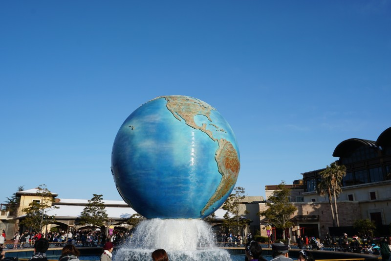
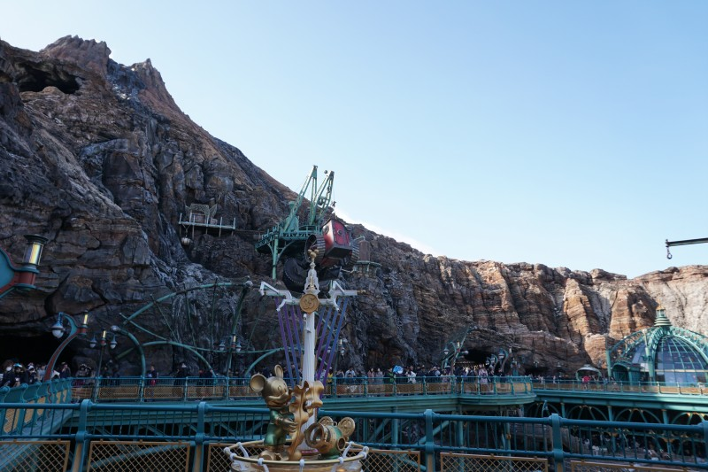
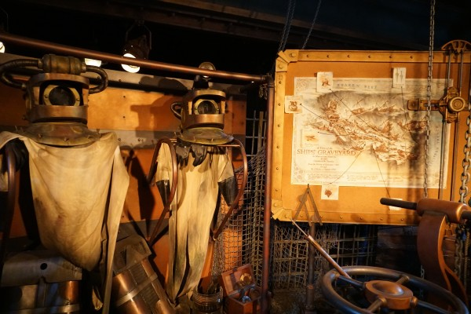
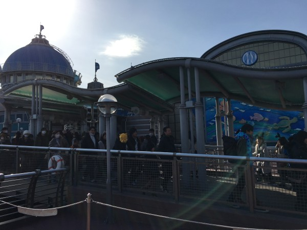

## 思い出のディズニーシーは楽しくなかった

私が最後にディズニーシーで遊んだ年齢は、12歳(2002年)。家族旅行で遊びに行きました。当時はディズニーシーの開園1年後(シーの開園は2001年)ぐらいで、両親としては「ディズニーシー新しくが出来たから、行ってみようか」と考えたのでしょう。

今回の旅行前に、当時の記憶を思い出せる範囲で掘り返してみました。しかし、あまり良い記憶は思い出せません。旅行前に「行きたい！」と自分から喋った記憶も、旅行後に「凄く楽しかった！」と興奮した記憶もありません。記憶の断片にあったのは、

おぼろげな記憶

- [海底2万マイル](https://www.tokyodisneyresort.jp/tds/attraction/detail/224/)に乗った事
- シーは乗り物が少なく、興味を惹かれたアトラクションが無かった事
- 途中で帰りたいと思った事

思い出した限り、子供へのつかみが悪かったディズニーシー。脳内によぎるシーは大人向けという言葉。しかし、今回の再訪（2019年2月10日）で「ディズニーシー（[タワーオブテラー](https://www.tokyodisneyresort.jp/tds/attraction/detail/243/)）面白い！」と実感できました。この思い出を10年後に思い出せるように、記事として残します。長いため、前編・[後編](https://debimate.jp/2019/02/14/%E3%80%90%E5%BE%8C%E7%B7%A8%E3%80%9116%E5%B9%B4%E3%81%B6%E3%82%8A%E3%81%AB%E3%83%87%E3%82%A3%E3%82%BA%E3%83%8B%E3%83%BC%E3%82%B7%E3%83%BC%E3%81%B812%E6%AD%B3%E2%87%9228%E6%AD%B3/)の二つに分けます。

## 今回ディズニーシーへ旅行した理由

私がディズニーシーを再び訪れた理由は、大人になって東京が身近になった事。職場が新潟から栃木になったおかげで、東京までのアクセス時間が2時間半⇒70分まで短縮されました。ここまで短縮されれば、開園時間にシーへ到着でき、閉園間際まで遊べます。関東圏内の人には、理解しづらい変化かもしれませんが、田舎者にとっては大きな変化です。それで、三連休もGETしていたら、行くしかないでしょう。

余談ですが、「**関東在住の人は、勉学・娯楽・天候の面で有利**」という事を肌で感じています。私の地元（新潟）と比較したら、恵まれすぎじゃないかなと。高レベルな勉強会が当たり前のように開催され、公共交通を使って観光名所へ行けたり、極めつけは毎日のように晴天です。遊ぶ場所が何もなく、雨続きの新潟にいた頃を思い出したくない。

## 開園直後に到着。が、雪でアトラクション停止！

朝5時半に起床し、開園直後（8時）にシーへ到着。2018年12月23日にランドで遊んだ際、事前にチケット購入しなかったため、チケット購入に約30分かかるという失敗をしました。今回は、この失敗を踏まえて、**事前にローソンでチケットを買……えませんでした。**

私はディズニーを完全に舐めきっており、「前日でもチケット購入できるでしょう」と考えていました。しかし、現実は非情であり、私は2月10日のチケットを前日の昼に購入できませんでした。ファミマ、セブンでも同様で、☓印がモニタに表示されるだけ。飲み会を優先したツケが跳ね返ってきた形です。

が、幸運な事に、この失敗は当日リカバリーできました。エントランス（正確には入館ゲート）の中央チケット販売がガラガラであったため（誇張なしに誰も並んでいなかったため）、１分でチケットを購入できました。入園後、[USJ](https://www.usj.co.jp/)の地球儀が目の前に現れ、「**お前！[USJ](https://www.usj.co.jp/)に居るんじゃなかったのか！**」と一人で驚いていました。完全な記憶違い。

入園後に最初に目指したのは、[レイジングスピリッツ](https://www.tokyodisneyresort.jp/tds/attraction/detail/242/)のファストパス売り場。しかし、その道中にある[センターオブジアース](https://www.tokyodisneyresort.jp/tds/attraction/detail/223/)で、「前日の雪の影響により、システム点検中です」という声が聞こえました。案の定、レイジングスピリッツも点検中。[インディ・ジョーンズ](https://www.tokyodisneyresort.jp/tds/attraction/detail/222/)はそもそも休止期間中で、[フランダーのフライングフィッシュコースター](https://www.tokyodisneyresort.jp/tds/attraction/detail/237/)も凍結！

このタイミングで、屋外にある目玉アトラクションがほぼ全て停止状態と気づきました。この辺で、一緒に来ていた恋人が「高いお金を払ってきたのに、全然遊べません（涙目）」と愚痴り始めたため、急いで[タワーオブテラー](https://www.tokyodisneyresort.jp/tds/attraction/detail/243/)のファストパスを入手しました。ここまで、8時半から9時半まで止まることなく歩き続け、この段階で体力的にも精神的にも疲労感に満ち溢れた状態。

ちなみに、この前日は猛吹雪で、動画を見る限り、この日に遊びへ行かなくて正解でした。

<iframe width="560" height="315" src="https://www.youtube.com/embed/JrMQKZrBX8U" frameborder="0" allow="accelerometer; autoplay; encrypted-media; gyroscope; picture-in-picture" allowfullscreen="allowfullscreen"></iframe>

## 思い出の海底2万マイルへ

外で遊べないとなったら、もう屋内で遊べる場所と言えば、海底2万マイルしか出てきません。50分待ちであったため、すぐに並び始めました。並んでいる間に、「おっ」と思ったのは、岩場に投げ捨てられたお金でしょう。「どこの観光名所だよ」とか考えていました。

海底2万マイルは、小物の出来がよく、マジマジと見ていられます。逆に、アトラクションに乗ったら、

「ガラスの中に水があって、水中を演出しているのねー」

「レールは下じゃなくて上にあるのか」

「触手に針金みたいなのが付いてて、それが電撃を演出しているのか」

などと考え、全く純粋に楽しめなかった。おとなになるってかなしいことなの…………

## 軽食購入後にスマホのガラスカバーが割れた

10時半過ぎになると、天候も良くなり、全てのアトラクションが動き始めました。レイジングスピリッツのファストパスを取得した後、一緒に来ていた恋人と別行動。私はチキンを買いに、恋人はチュロスと飲み物を買いに行く事にしました。

私が先に買い終わって、ロストリバーデルタから（恋人に何も言わずに）アラビアンコーストへ移動した結果、案の定、恋人とはぐれました。当然、スマホで連絡を取り合うわけですが、恋人は手が塞がっていたため、顔と肩でスマホを挟んで電話を取ったようです。

その結果、恋人はスマホを落とし、ガラスカバーが破損（割れたカバーはディズニーシーのゴミ箱へ）。運良く、落とした[HUAWEI P20 Lite](https://japanese.engadget.com/2018/12/30/3-huawei-p20-lite-2018/)は無事で、自宅にカバーのスペアもあったため、全く問題がありませんでした。

話変わりますが、私もP20 Liteをサブ機で欲しい……（ちなみに恋人のスマホは私が購入）。

\[the\_ad id="598"\]

## 子供向けのアトラクション3連続！

お腹を満たしたら、近くにあった[シンドバッド・ストーリーブック・ヴォヤッジ](https://www.tokyodisneyresort.jp/tds/attraction/detail/235/)へ。シンドバッドは、ディズニーランドにもある「このアトラクションは、ディズニーと関係あるのか？」と思ってしまうタイプ。しかし、ランドと比較して人形の関節数が多く、多彩な動きを披露してくれました。

ここでの個人的なハイライトは、待ち時間中に「アラジンの主人公って誰だっけ？ジャファーでもジニーでもなくて……」と真剣に考えていた愚か者が居た事ですよ。**ええ、私です。**

<iframe width="560" height="315" src="https://www.youtube.com/embed/ICtiNN97kMU" frameborder="0" allow="accelerometer; autoplay; encrypted-media; gyroscope; picture-in-picture" allowfullscreen="allowfullscreen"></iframe>

次に向かったのは、[フランダーのフライングフィッシュコースター](https://www.tokyodisneyresort.jp/tds/attraction/detail/237/)。恐らく、ディズニーシーの中では、最も遅いコースターでしょう。ディズニーランドの[ガジェットのゴーコースター](https://www.tokyodisneyresort.jp/tdl/attraction/detail/179/)と同系統と言えます。以前、ゴーコースターを10分程度で乗れたため、乗るまでに70分かかったフィッシュコースターは期待値を上回ってきませんでした。

このフィッシュコースターの待ち時間中、「コースターが動く音がインダストリアルミュージックみたい」と言いながら、恋人と談笑していました。私の頭の中では、マリリン・マンソンが止まらず。

<iframe width="560" height="315" src="https://www.youtube.com/embed/Ypkv0HeUvTc" frameborder="0" allow="accelerometer; autoplay; encrypted-media; gyroscope; picture-in-picture" allowfullscreen="allowfullscreen"></iframe>

コースターの後は、[ニモ＆フレンズ・シーライダー](https://www.tokyodisneyresort.jp/tds/attraction/detail/247/)。映像に合わせて座席が動くタイプのアトラクション。無駄に設定が凝っていて、潜水艇を乗客毎に縮ませるチヂミニウムで、ゲストはニモ達が居る海底を探索します。上映される作品（今回であればニモ）への愛着度合いで印象が変わりそうでした。

惜しむらくは、ディズニーランドにある[スターツアーズ](https://www.tokyodisneyresort.jp/tdl/attraction/detail/183/)と違って、3D映像じゃない事。3D映画は人気が出ませんでしたけど、短編映像では迫力があって好きなんですよね。長時間は酔うから、敬遠したいけど。

## そして後編へ…

https://debimate.jp/2019/02/14/%E3%80%90%E5%BE%8C%E7%B7%A8%E3%80%9116%E5%B9%B4%E3%81%B6%E3%82%8A%E3%81%AB%E3%83%87%E3%82%A3%E3%82%BA%E3%83%8B%E3%83%BC%E3%82%B7%E3%83%BC%E3%81%B812%E6%AD%B3%E2%87%9228%E6%AD%B3/
