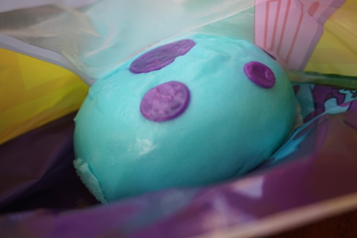
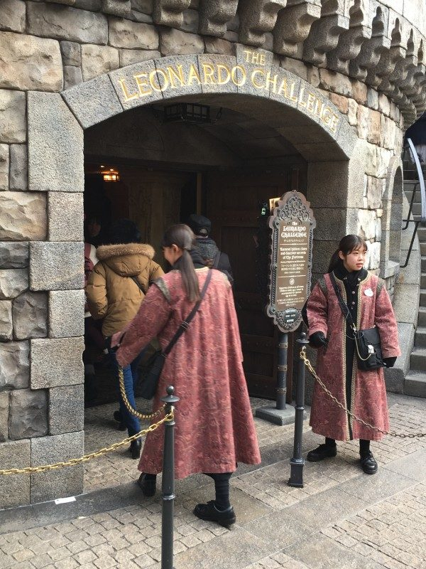
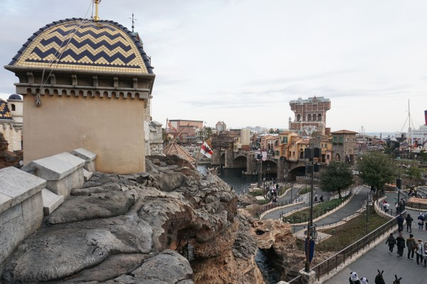
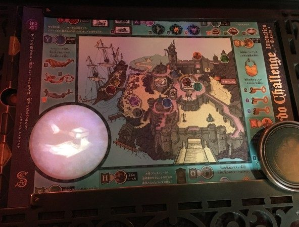
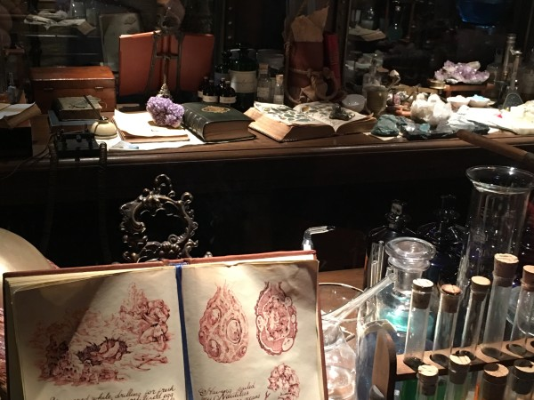

## まずは前編から

- [前編：16年ぶりにディズニーシーへ(12歳⇒28歳)](https://debimate.jp/post/2019-02-12-%E5%89%8D%E7%B7%A816%E5%B9%B4%E3%81%B6%E3%82%8A%E3%81%AB%E3%83%87%E3%82%A3%E3%82%BA%E3%83%8B%E3%83%BC%E3%82%B7%E3%83%BC%E3%81%B812%E6%AD%B328%E6%AD%B3/)

## 実は怖くないらしいレイジング・スピリッツ

子供向けのアトラクションで時間を潰した後、ファストパス時刻が迫った[レイジング・スピリッツ](https://www.tokyodisneyresort.jp/tds/attraction/detail/242/)へ移動。私は、人生初の360度回転するコースターに乗る恐怖から、待ち時間の間、急にお腹が痛くなってきました。「**もし、宙吊りの状態でコースターが緊急停止したら……**」など、余計な事を考えつつ、どのポイントが最も怖いかを目視確認していました。

どの程度怖いかを乗車寸前までグーグル先生で調べたら、[浮遊感が少ないため怖くない](https://castel.jp/p/1849)との記載を見つけました。確かに乗ってしまえば、一番怖いのは、コースターが高所へ移動する際のガタンッギギ……ガタガタンという軋んだ音だったかなと。

しかし、レイジング・スピリッツに関する写真が一枚も残っていないため、乗る前は本当にビビっていたのが、この振り返りで分かりました。

## ラストファストパスの選択

この辺りから疲労が蓄積し始めました。この時、時刻は14:30ぐらいだったため、レイジング・スピリッツの近くで昼食を兼ねた二度目の休憩。買った食事は、食欲が失せそうな青色の肉まん、抹茶ラテ。この青色は、モンスターズインクのキャラ色。モンスターズインクに愛着もないし、そうなると青色はアメリカ人の色彩感覚みたいだし……**ただ、食べれば美味しかった**。特に、抹茶ラテは、この日に食べた物で一番美味しかった。

休憩を挟んだ後、最後のファストパスをどのアトラクションにするかを脳内会議で決めました。[センター・オブ・ジ・アース](https://www.tokyodisneyresort.jp/tds/attraction/detail/223/)は既に取得できない状態。選択肢は、[トイ・ストーリー・マニア](https://www.tokyodisneyresort.jp/tds/attraction/detail/218/)か[タートル・トーク](https://www.tokyodisneyresort.jp/tds/attraction/detail/246/)、[マジックランプシアター](https://www.tokyodisneyresort.jp/tds/attraction/detail/226/)。最有力候補は、トイ・ストーリー・マニア。完全に、作品への思い入れだけで決めました。

しかし、近くにあったアラビアンコーストを通り、ファストパス(19:30〜20:30)の表示を見て、マジックランプを選択しました。もう、シーを端から端まで移動して、ファストパスが取れないのは嫌だったため、「アラジンでいいかー」という消去法です。

完全な後日談ですが、**最終的にマジックランプはYouTubeで鑑賞**しました。

## 予想外に面白かったレオナルドチャレンジ

次に遊んだ[レオナルドチャレンジ](https://www.tokyodisneyresort.jp/tds/attraction/detail/245/)は、地図を頼りに謎解きを進めていく体験型のアトラクション。この周辺は、建物内を自由に散策できるため、子供が楽しそうに遊び回っていました。ちなみに、私たちは「レオナルドチャレンジに行くぞ！」というモチベーションで遊んだ訳ではありません。

選択理由は、タワー・オブ・テラーに行く道すがらに、レオナルドチャレンジがあったためでした。もう少し理由付けしますと、この時はファストパス時刻との調整のため、1時間程度で遊べそうなアトラクションを探していました。そんな中、レオナルドチャレンジは、自分の力で終了時間をコントロールでき、かつ待ち時間が20分と少なく、私の需要と一致していました。

基本的なルールである「地図に書かれた問題を地形から読み解いて、次の問題の回答がある場所へ行く(この手順をn回繰り返し)。最終地点で、地図を置くと終了」を聞いてから、謎解き本番。最終的に30分程度で回答を見つけました。

実は、最後の最後で、地図を読み間違って、全く関係ない場所をゴール地点と勘違いして、「**ゴールはここじゃないよ**」とダンブルドアに優しく指摘されました(これはある意味、敗北ではなかろうか)。

問題を回答している間は、高台から日本とは思えない景色を眺められます。この謎解きは、素早く解こうと思えば、解けます。地図中の「この地点に地図を置け」と書かれている場所へ向かえば終わりです。でも、ディズニーシーに来てまで、そんな効率厨みたいな事をしたい人は居ないでしょう。

 

## 荷物が頭上を超えたタワー・オブ・テラー

ディズニーシーで最も怖いと言われる[タワー・オブ・テラー](https://www.tokyodisneyresort.jp/fantasy/tot2019/)。単純に、上下に動くだけのアトラクションですが、浮遊感が凄まじいという噂は聞いていました。最も楽しみにしていたアトラクションであり、待ち時間中に「お客様の荷物がエレベータ外に出たため〜」というアナウンスが恐怖を煽り立てました。

タワー・オブ・テラーは、[漫画でバックボーンストーリーが補足される](https://www.tokyodisneyresort.jp/fantasy/tot2019/)ほど、キチンと設定が練られています。漫画を読めば(もしくはタワー・オブ・テラーを遊べば)分かりますが、私たちはシリキ・ウトゥンドゥの呪いによって、エレベータの急降下を楽しめる訳です。

エレベータに乗る直前に、私たちはツアーCに割り当てられました。帰宅後に調べた結果、ツアーCは通常設定らしく、落下回数が少ないようです。ツアーBが最も落下回数が多く、7回も落下を楽しめるようです(通常は3回)。

呪われたエレベータに乗った感想は、「もう一度乗りたい！」の一言。浮遊感が心地よい。どのぐらい浮遊するかと言えば、エレベータ降下中に、自分の荷物が空中を浮き、急いで回収しなければならなかったぐらいです。ファストパスが直ぐに発行終了したのも頷けます。あまりに感動して、落下直前に撮影された写真を記念に買ってしまいました。

\[the\_ad id="598"\]

## 最後は、センター・オブ・ジ・アース

[センター・オブ・ジ・アース](https://www.tokyodisneyresort.jp/tds/attraction/detail/223/)は、最後に150分待ちしたアトラクション。ディズニーランドの[スプラッシュ・マウンテン](https://www.tokyodisneyresort.jp/tdl/attraction/detail/162/)と同じく、垂直落下するタイプのコースター。初めて乗るため、こちらも期待値が高かった。

この待ち時間で印象的だったのは、前に居た女の子(中学生？)が「**えっマジで草なんだけど**」と喋っていた事ですね。そうか、草か、時代は変わったな、と。

アトラクション自体は、拍子抜け。まず、落下までが非常にゆっくりしています。また、今回は運が悪く、落下直前に出てくる怪物の地点で、システムエラーによって5分程度待機する事に。後ろに座った女の子がやかましく、「落ちる直前で止まるとかやめてほしいんだけどー」と連呼していたため、「この先で落ちるのか」と心構えができてしまった。

\[the\_ad id="598"\]

## 始めてみた花火

後は帰って寝るだけ。子供の頃は、ディズニーシーの夜景を見た事は無かった。

## 後日談：タートルトークが予想以上に凄い

複数の動画を見てみると、会話には一定のパターンがある事に気づきます。しかし、基本的には、観客の喋りに応じて柔軟にストーリーが展開します。このインタラクティブな仕組みを提供するには、声優が後ろで喋っているとしか思えないのですが……仕組みを知りたい。

<iframe width="560" height="315" src="https://www.youtube.com/embed/BvDclvyBcLg" frameborder="0" allow="accelerometer; autoplay; encrypted-media; gyroscope; picture-in-picture" allowfullscreen></iframe>
