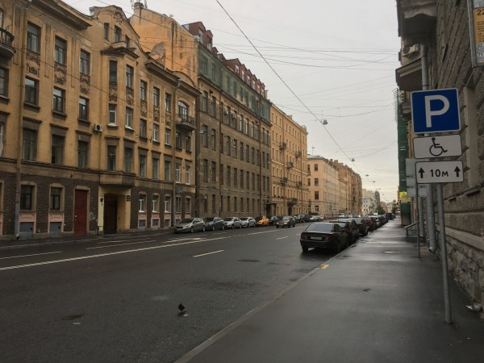

## ロシア人「"Ой!" (オイ！)」私「(´；ω；｀)何？」

ロシアの街を歩くと、「Ой!」という言葉が聞こえてきます。老いも若きも「Ой!」、男性も女性も「Ой!」と話しています。何も知らずに歩いて、それなりの声の大きさで「**Ой!**」と聞こえれば、大抵の日本人はビビると思います。想像してみてください。こんな薄暗い町中で、後ろで「Ой!」と聞こえた時の事を。ほぼ全ての日本人は、「何だ？」と思って、後ろを振り向いてしまうと思います。

## そもそも"Ой!" (オイ！)の意味は？

"Ой"は、日本語では「あっ！」や「しまった！」という意味です。ロシア人は、以下のタイミングに無意識に発しているようです。

タイミング

- 何か忘れた時
- 間違えた時（ミスした時）
- 驚いた時
- 相手のミスを茶化す時（この使い方は日本語と同じ）

ロシアの方が日本語で解説している動画もあります。このYouTuber（ロシア）の方は、"Ой"と言うと日本人が困る事に配慮して、「あらー」と言い換えていると説明されています。

<iframe width="560" height="315" src="https://www.youtube.com/embed/DhFkGaRmvUk" frameborder="0" allow="accelerometer; autoplay; encrypted-media; gyroscope; picture-in-picture" allowfullscreen="allowfullscreen"></iframe>

## 他の日本人による"Ой!" (オイ！)の解説

外部の参考サイトとして、以下を示します。内容を読む限り、やはり日本人は、ロシア人の"Ой"に驚くようです。

- https://gogakumania.com/russian/topics
- https://ruslife.net/russian\_phrases\_of\_exasperation/

## "Ой Ой Ой!"

ロシア人は、一度に複数回"Ой"という事があります。この使い方は、日本語の「おいおい（おやおや）」に似ています。なんかオイオイ歌っている曲もあります。もうここまで来ると、私には分かりません。

<iframe width="560" height="315" src="https://www.youtube.com/embed/nE-NH38dXtU" frameborder="0" allow="accelerometer; autoplay; encrypted-media; gyroscope; picture-in-picture" allowfullscreen="allowfullscreen"></iframe>

## 民謡に含まれる"Ой"

ロシアのコサック民謡の"Ой, то не вечер"（ああ、宵にもなっていないのに）に"Ой"が含まれています。「**だから何だ**」と思われるかもしれません。

ええ、自分の好きなバンドが歌っているので紹介しただけです。

<iframe width="560" height="315" src="https://www.youtube.com/embed/eome4WZLOzI" frameborder="0" allow="accelerometer; autoplay; encrypted-media; gyroscope; picture-in-picture" allowfullscreen="allowfullscreen"></iframe>
