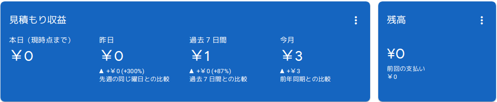

## 厳しいと有名なGoogle AdSense審査

サイトやブログを持っている方は、「**独自ドメインを取得して、広告収入を得る事**」に興味があると思われます。私もその中の一人です。会社の合併によって収入面が不安になり、この考えに辿り着きました。思い立ったら、後は行動するだけです。私はサーバレンタル・ドメイン取得・WordPressによる記事作成まで、一日で済ませました(2018年12月31日の事)。

その次の作業は、[Google AdSence](https://www.google.com/intl/ja_jp/adsense/start/#/?modal_active=none)審査でした。Google AdScenseは、本サイトの左右に貼られている広告を提供します。ユーザが広告を閲覧もしくは押せば、管理者は報酬が貰える仕組みです。広告を貼るだけで収入が得られるのであれば、多くの人が「利用したい」と考えるでしょう。類似の広告に[Amazonアソシエイト](https://affiliate.amazon.co.jp/)がありましたが、こちらはユーザが広告経由で商品を購入しないと報酬が発生しないため、私にとって論外でした。

ここまでの情報では、Google Adscenseのメリットが強調されています。しかし、Google Adscenseのデメリットとして、導入審査が厳しく、広告をサイトに設置するまでの道のりが長い事があげられます。その厳しさのため、多くの方が審査対策の記事を取り上げています。

https://ippecoppe.com/adsense-shinsa-manual/

https://funtre-blog.com/adsense/adsense-check/

https://tabibitojin.com/google-adsense-how-to-pass-it/

## Google AdSence審査 申込み時の本サイト状態

「Google AdSenceは厳しいぞオジサン」が提唱する審査基準は、様々な人の経験から推測された内容です。この基準に従うと、数カ月は審査申込みをしない方が得策という結論になります。しかし、私はサイト開設3日目にGoogle AdSence審査に挑戦しました。理由は、審査が否認されてもデメリットがないため。何度でも再チャレンジできます。この事実(デメリット無し)を知った私には、先人の知恵を活かす気はありませんでした。

審査申込み時時のサイトの状態は、下表の通り、Google AdSence承認の基準値(推測値)以下。しかし、**サイト開設4日目に承認メールが来ました(下図)**。正直、審査が通ると思っていなかったので、そこそこ驚いた記憶があります。

| **項目** | **承認基準値(推測値)** | **承認時の本サイト状態** |
| --- | --- | --- |
| 記事数 | 10〜30ページ | 6ページ |
| 記事の文字数 | 1000〜2000文字 | 平均1800文字 |
| 開設期間 | 数ヶ月以上 | 4日 |
| PV | 100以上(1日) ※無関係という人多数 | 合計10以下 |

## 勝因は、サイトが専門的だった事？

サイト開設4日目までの記事は、かなり専門的(マニアック)です。音楽CDの[ブートレグ(海賊盤)](https://ja.wikipedia.org/wiki/%E3%83%96%E3%83%BC%E3%83%88%E3%83%AC%E3%82%B0)レビューが3件、Raspberry Piというシングルボードコンピュータの[SW](https://ja.wikipedia.org/wiki/%E3%82%BD%E3%83%95%E3%83%88%E3%82%A6%E3%82%A7%E3%82%A2)/[HW](https://ja.wikipedia.org/wiki/%E3%83%8F%E3%83%BC%E3%83%89%E3%82%A6%E3%82%A7%E3%82%A2)周りの記事が2件、ロシア旅行のビザ取得方法が1件と、「**誰が得するのか**」と思ってしまう記事ばかりです。

しかし、この専門性が各種ハンデ(例：記事数の少なさ、サイト開設期間の短さ)を払拭してくれたのではないでしょうか。Google先生が審査内容を発表してくれないため、私も「Google AdSenceは意外と優しいぞオジサン」としてのコメントしかできません。個人的には、文章構成・画像や動画の有効利用・スマホ対応も評価対象だと嬉しい。しかし、そこはGoogle先生のみぞ知る事です。

以下に、当時の記事を掲載順に示します。興味があれば、是非一読ください。

https://debimate.jp/2018/12/31/raspberry-pi3linux-kernel%E3%81%AEboot-sequence-step1%E3%82%A2%E3%83%BC%E3%82%AD%E3%83%86%E3%82%AF%E3%83%81%E3%83%A3%E4%BE%9D%E5%AD%98%E9%83%A8/

https://debimate.jp/2019/01/01/review-%D0%B8%D0%B3%D1%80%D0%B0-%D1%81-%D0%BE%D0%B3%D0%BD%D1%91%D0%BC%D0%B0%D1%80%D0%B8%D1%8F/

https://debimate.jp/2019/01/01/raspberry-pi3-%E5%85%AC%E5%BC%8F%E3%83%84%E3%83%BC%E3%83%AB%E3%81%8A%E3%82%88%E3%81%B3hw%E4%BB%95%E6%A7%98/

https://debimate.jp/2019/01/02/review-seattle-89metallica/

https://debimate.jp/2019/01/03/%E3%80%90%E3%83%AD%E3%82%B7%E3%82%A2%E6%97%85%E8%A1%8C%E3%80%91%E8%A6%B3%E5%85%89%E3%83%93%E3%82%B6%E3%82%92%E7%B0%A1%E5%8D%98%E3%81%AB%E5%8F%96%E5%BE%97%E3%81%99%E3%82%8B%E6%96%B9%E6%B3%95%E3%83%93/

https://debimate.jp/2019/01/04/review-boston-1981rainbow/

## まとめ

GoogleAdSenceに対する見解

- 事実：Google AdSence審査は記事数が少なくても、サイト開設4日後でも通る
- 推測：専門的な内容を書いたサイトは、審査が承認されやすい?
- 希望：文章構成・画像や動画の有効利用・スマホ対応も大事であって欲しい!!

## おまけ：サイト開設2ヶ月後の収益

広告収入でウハウハだと思った？**収益3円**の弱小サイトだよ！

サーバ・ドメイン代を入れたら、**万単位の赤**を出しているよ！

