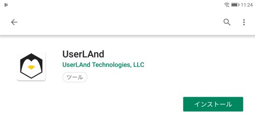
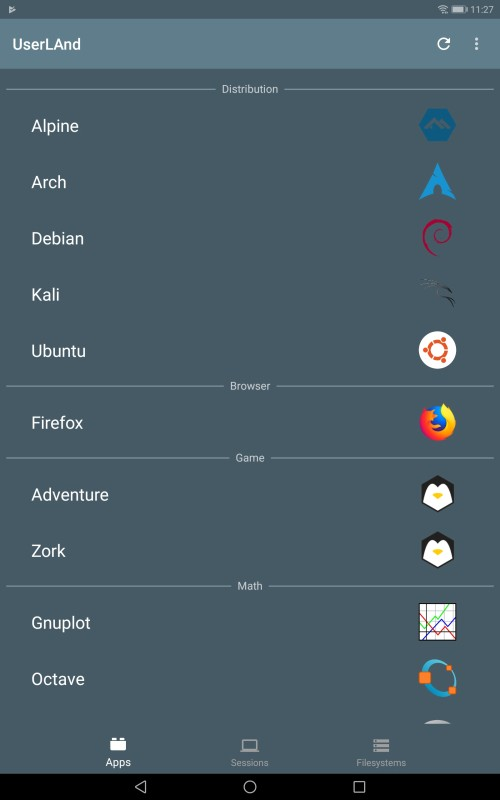
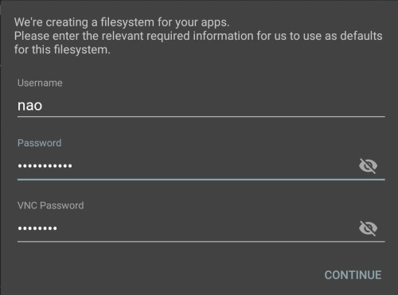
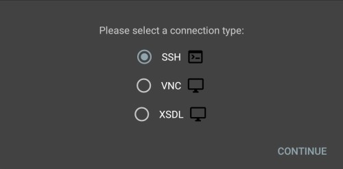
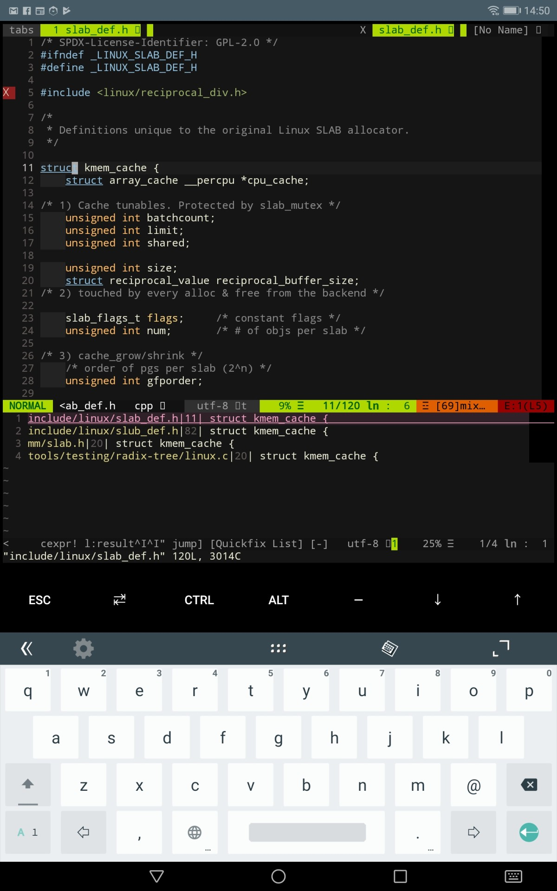

## 前書き

AndroidにLinuxを導入する試みは、以前からありました。この試みは、AndroidのKernel部分が["Linux Kernel"(Linuxと共通)](https://developer.android.com/guide/platform/?hl=ja)ですから、自然な発想と考えられます。過去の例で言えば、「[Ubuntu(Debian)をAndroid端末に導入](http://gihyo.jp/admin/serial/01/ubuntu-recipe/0256)」したケースがあります。しかし、これまでのAndroidのLinux化は、煩雑な手順が必要、かつ失敗した場合に端末が文鎮化してしまうリスクがありました。

この課題を解決したアプリとして、"[UserLAnd](https://userland.tech/)"があります。[](https://userland.tech/)

UserLAndの特徴

- 通常のAndroidアプリと同様に、Install/Uninstall可能
- Android環境でLinuxディストリビューションもしくはLinuxアプリを動作可能
- root権限不要

UserLAndは、AndroidアプリとしてPlayストア経由で配信されています。そのため、**入手および導入作業が簡単です**。複数のディストリビューションをAndroidに導入でき、デスクトップ環境も提供しています。Linuxのログイン画面を出すまでにかかる時間は、5〜10分程度です。

本記事では、UserLAndの導入方法を説明した後、UserLAndの良い点・悪い点を記載します。

## 環境

今回の検証環境はスマホではなく、タブレット端末です。ただし、スマホ([Nexus 5X](https://www.amazon.co.jp/LG-H791-Nexus-5X-CARBON-32GB/dp/B01BR86Z2U))でも動作確認済みです。

|   | [MediaPad M5 10.8【Amazon限定】](https://www.amazon.co.jp/dp/B07JP3L3PC/ref=emc_b_5_t) |
| --- | --- |
| OS | Android 8.0 |
| CPU | HUAWEI Kirin 960s オクタコア   (4 x Cortex-A73@2.1GHz + 4 x Cortex-A53@1.8GHz) |
| メモリ | RAM 4GB / ROM 32GB |
| ディスプレイ | 約10.8インチ / 2560x1600(WQXGA) / 約280ppi |

## UserLAndにLinuxを導入する手順

PlayストアからUserLAndを検索し、Installします。



UserLAndを起動し、実行したいディストリビューションを選択します。今回はDebianを選択しますが、好みで別のディストリビューションを選択しても問題ありません。



OSを選択後、UserLAndからアクセス権限を要求されるため、許可してください。この権限は、UserLAndが以下の手順を実施するために必要です。

1. ディレクトリを作成
2. ディレクトリ内にDebianをInstall
3. proot(疑似root権限)でDebianを実行


Debian環境下で使用するユーザ名・ログインパスワード・VNCパスワードを設定します。



外部端末や他のアプリからの接続方法を選択します。私はデスクトップ環境を使用する予定がないため、SSHとしました。デスクトップ環境を使用する場合は、[XSDLを使用する方法](https://github.com/CypherpunkArmory/UserLAnd/wiki/Getting-Started-in-UserLAnd)が公式サイトに記載されています。



自動的にTerminalが立ち上がった後、ログインします。その後、必要なパッケージをパッケージマネージャでInstallしてください(sudo必須)。私の場合のaptコマンド実行例を残します。


```
$ sudo apt update
$ sudo apt-get dist-upgrade
$ sudo apt install vim-nox screen ssh gdb graphviz doxygen plantuml \
exuberant-ctags git cloc tar make silversearcher-ag curl apt-file \
libncurses5-dev wget build-essential device-tree-compiler \
trace-cmd python3 python3-dev python3-pip
```

\[the\_ad id="598"\]

## UserLAndの良い点

良い点

- 導入にリスクがない事
- 複数のディストリビューションが提供されている事
- 外出中にソースコードが快適に読める事

まず、一点目の導入リスクに関してです。UserLAndの導入には、root化作業が不要なため、ほぼノーリスクと言えます。以前は、AndroidにLinuxを導入するには、root化が必要な事が多かったです。root化作業は、端末のセキュリティを低下させる原因でもありますし、端末を文鎮化させる可能性が少なからずありました。特に、端末は数万円するため、金銭的な面で気軽にroot化を試せませんでした。しかし、UserLAndは、proot(疑似root)によってLinux導入を実現しているため、安全に導入できます。

次に、二点目の複数ディトリビューション提供に関してです。下表に、2019年3月現在で使用可能なディストリビューションを示します。私個人としては、開発環境として使いやすいDebian、セキュリティテストが実施しやすいKali Linuxが対応されている点が素晴らしいです。また、単純に、選択肢を多数用意する姿勢が好ましいと思います(RHEL系が無いけど)。

| **ディストリ** | **説明** |
| --- | --- |
| [Alpine](https://alpinelinux.org/) | BusyBox(coreutilsの代替)およびmusl(glibcの代替)を用いた軽量かつセキュアなOS。パッケージマネージャは、APK。 |
| [Arch](https://www.archlinux.org/) | 軽量かつシンプルなOS。初期状態では最低限の環境しか提供されないため、Linuxをカスタマイズするための知識が必要。パッケージマネージャは、Pacman。 |
| [Debian](https://www.debian.org/index.ja.html) | 安定したパッケージを提供し、プログラマ向けの開発環境構築が簡単なOS。パッケージマネージャは、APT。 |
| [Kali](https://www.kali.org/) | セキュリティ診断ツール(ペネトレーションツール)が多く提供されるOS。Debianベース。パッケージマネージャは、APT。   [便利なチートシートはこちら](https://www.comparitech.com/net-admin/kali-linux-cheat-sheet/) |
| [Ubuntu](https://www.ubuntu.com/) | DebianのUnstable/Testingパッケージから派生したOS。パッケージマネージャは、APT。 |

最後に、外出中にソースコードが快適に読める点です。Androidでソースコードを読む場合、使い慣れないCode Viewerを使用し、タグジャンプもできない等、不満が多々ありました。これらの不満は、UserLAndによって「普段の開発環境(Debian)と同じ状態をAndroidに構築できた」ため、解消されました。私のように、Terminal上でコードを読んでいた人(Vim/Emacsユーザ)は、Androidで快適にコードを読めるのではないでしょうか。



もちろん、「ノートPCの方が良い」「ソフトキーボードが使いづらい」「画面が小さい」等の意見があるでしょう。しかし、私は現在のAndroid(UserLAnd)によるコードリーディング環境に満足しています。今まで出来なかった事ができるようになったのですから。

## UserLAndの悪い点

悪い点

- やや処理速度が遅い

やや処理速度が遅い理由は簡単で、prootを使用しているからです。prootはroot権限を擬似的に提供するため、[ptrace](http://surf.ml.seikei.ac.jp/~nakano/JMwww/html/LDP_man-pages/man2/ptrace.2.html)システムコールを使用します。ptraceは、子プロセスが実行したシステムコールの監視・制御ができます。より具体的には、ファイルアクセス関連システムコールが発生した場合、システムコールをフックし、ファイルアクセス先のPATH名を書き換えています。システムコール単位でフック処理が入るため、処理速度が落ちてしまう点は仕方がありません。

なお、prootは他OSのGuest rootfsを仮想化し、Shell Sessionを起動できます。つまり、UserLAndは、各Linux ディストリビューションをprootによる仮想化rootfsとして用意した後、Shellを起動しています。

##  追記：2年後の2021年、私はAndroidアプリを選択

UserLAnd遅いのよ……

https://debimate.jp/2021/02/20/%e3%80%90android%e3%82%a2%e3%83%97%e3%83%aa%e3%80%91%e3%82%b3%e3%83%bc%e3%83%89%e3%83%aa%e3%83%bc%e3%83%87%e3%82%a3%e3%83%b3%e3%82%b0%e3%81%ab%e4%bd%bf%e3%81%86%e3%82%a2%e3%83%97%e3%83%aa%e3%82%92user/
