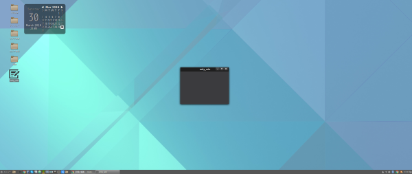

## 前書き

本記事では、既存アプリや自作アプリのショートカットを作成したい場合、デスクトップアイコン(ショートカット)を用意する方法を示します。Linuxは、複数のデスクトップ環境([GNOME](http://www.gnome.gr.jp/)、[MATE](https://mate-desktop.org/)、[KDE](https://jp.kde.org/)など)が存在しますが、手順はX Window System環境であれば同一です。その理由は、デスクトップアイコン(ショートカット)仕様が[freedesktop.org](https://www.freedesktop.org/wiki/)によって(半標準として)定められているためです。

デスクトップアイコンを用意するまでの手順は、以下の通りです。本記事の手順は、CLI(Command Line Interface)を前提としています。ただし、本記事の最後に、GUIでのデスクトップアイコン追加手順も示します。

デスクトップアイコン(ショートカット)の導入手順

- デスクトップアイコンの準備
- デスクトップアイコン経由で実行するアプリの準備
- デスクトップエントリファイルの作成
- デスクトップファイルデータベースを更新

## 検証環境

```
       _,met$$$$$gg.          nao@debian 
    ,g$$$$$$$$$$$$$$$P.       ---------- 
  ,g$$P"     """Y$$.".        OS: Debian GNU/Linux 9.8 (stretch) x86_64 
 ,$$P'              `$$$.     Kernel: 4.9.0-8-amd64 
',$$P       ,ggs.     `$$b:   Uptime: 1 hour, 30 minutes 
`d$$'     ,$P"'   .    $$$    Packages: 2688 
 $$P      d$'     ,    $$P    Shell: bash 4.4.12 
 $$:      $$.   - ,d$$'    Resolution: 2560x1080 
 $$;      Y$b._   _,d$P'      DE: Cinnamon 3.2.7 
 Y$$.    `.`"Y$$$$P"'         WM: Mutter (Muffin) 
 `$$b      "-.__              WM Theme: Cinnamon (Albatross) 
  `Y$$                        Theme: BlackMATE [GTK2/3] 
   `Y$$.                      Icons: Gnome [GTK2/3] 
     `$$b.                    Terminal: gnome-terminal 
       `Y$$b.                 CPU: Intel i3-6100U (4) @ 2.3GHz 
          `"Y$b._             GPU: Intel Integrated Graphics 
              `"""            Memory: 3667MB / 32069MB 

```

本記事の手順に対応しているデスクトップ環境(X Window Systemを利用した環境)は、以下の通りです。

freedesktop.orgに準じたデスクトップ環境

- [GNOME](http://www.gnome.gr.jp/)
- [MATE](http://linuxmint-jp.net/)
- [KDE](https://jp.kde.org/)
- [Cinnamon](http://developer.linuxmint.com/projects/cinnamon-projects.html)
- [Xfce](https://www.xfce.org/)
- [LXDE](https://lxde.org/)

## デスクトップアイコンの準備

デスクトップアイコンは、[freedesktop.orgによって拡張子・サイズの仕様](https://standards.freedesktop.org/icon-theme-spec/latest/ar01s02.html)が定められています。拡張子は、PNG(推奨)、SVG(オプション)、XPM(下位互換、非推奨)のいずれかです。サイズに関しては、推奨フォーマットのPNGのみを以下に一覧を示します。

PNG形式のアイコンサイズ(42x42以下は除外)

- 48x48
- 64x64
- 72x72
- 96x96
- 128x128
- 192x192
- 256x256
- 512x512
- 1024x1024

アイコン画像(.png)の格納先は、以下の二箇所です。$Size部分は、アイコン画像のサイズによってディレクトリ名を変更します。例えば、48x48の場合は$Size=48x48、512x512の場合は$Size=512x512です。

- "/usr/share/icons/hicolor/$Size/apps"以下(全ユーザ向け)
- "/usr/local/share/icons/hicolor/$Size/apps"以下(全ユーザ向け)
- "~/.local/share/icons/hicolor/$Size/apps"以下(個別ユーザ向け)

私の環境(Cinnamon)では、"/usr/share/icons/hicolor/"以下を確認すれば、自分の環境がどのサイズの画像に対応しているかが分かります。

```
$ ls  /usr/share/icons/hicolor/
1024x1024  16x16    20x20  24x24    32x32  40x40  48x48    64x64  8x8    icon-theme.cache  scalable
128x128    192x192  22x22  256x256  36x36  42x42  512x512  72x72  96x96  index.theme       symbolic

```

今回の例では、/usr/share/icons/hicolor/512x512/apps/以下に、以下のアイコン用画像(only\_win.png)を格納します。アイコン用画像は、好きな画像をネットから探してください。


```
$ sudo mkdir -p /usr/share/icons/hicolor/512x512/apps
$ sudo cp only_win.png /usr/local/share/icons/hicolor/512x512/apps

$  ls -al /usr/share/icons/hicolor/512x512/apps/only_win.png
-rw-r--r-- 1 root root 14505  3月 30 17:54 /usr/share/icons/hicolor/512x512/apps/only_win.png

```

## デスクトップアイコン経由で実行するアプリの準備

準備するアプリは、自作アプリだけでなく、パッケージマネージャ経由で入手した既存アプリでも構いません。今回の例では、GTK+ライブラリを用いてウィンドウを表示するだけのアプリを準備します。

準備するアプリのソースコード(main.c)は、以下の通りです。詳細を把握する必要はありませんが、念の為、コメントを付けてあります。

```
#include <gtk/gtk.h>

int main(int argc, char** argv)
{
  GtkWidget *window;
  //GTK+初期化
  gtk_init(&argc,&argv);
  //ウィンドウ作成
  window = gtk_window_new(GTK_WINDOW_TOPLEVEL);
  //ウィンドウサイズ設定
  gtk_widget_set_size_request(window, 300, 200);
  //ウィンドウ破棄時に、プログラムを終了
  g_signal_connect(window, "destroy", G_CALLBACK(gtk_main_quit), NULL);
  //ウィンドウを表示
  gtk_widget_show(window);
  //GTK+メインループ関数
  gtk_main();

  return 0;
}
```

GTK+3ライブラリのインストールを行った後、上記のアプリをGCCでビルドします。ビルド後、アプリを"/usr/local/bin"にインストールします。動作確認として、only\_winアプリを実行すると、ウィンドウが表示されます。

```
$ sudo apt install libgtk-3-dev pkg-config   (注釈)：pkg-configは、GTK+ライブラリのリンクを簡便にするためインストール
$ gcc main.c -o only_win $(pkg-config --cflags --libs gtk+-3.0)

$ ls
main.c  only_win　　　(注釈)：only_winが本記事用のアプリ
$ sudo install only_win /usr/local/bin/
$ ls -al /usr/local/bin/only_win -rwxr-xr-x 1 root staff 8912  3月 28 20:17 /usr/local/bin/only_win

$ /usr/local/bin/only_win  (注釈)：only_winの実行。実行後、以下のウィンドウが表示されます。

```


## デスクトップエントリファイルの作成

デスクトップエントリファイルは、デスクトップアイコン経由で実行するアプリに関する基本情報をまとめています。拡張子は".desktop"であり、格納場所は主に以下の3箇所です。

- "/usr/share/applications"以下(全ユーザ向け)
- "/usr/local/share/applications"以下(全ユーザ向け)
- "~/.local/share/applications"以下(個別ユーザ向け)

今回の例は、"~/.local/share/applications"以下にonly\_win.desktopを作成します。記載内容は以下の通りです。**注意していただきたいのは、#以降のコメントをそのまま記載しているとエラーとなります。**

```
$ touch ~/.local/share/applications/only_win.desktop

```

```
[Desktop Entry]
Type=Application                          # アプリショートカットである事を意味します
Categories=Application;Graphics;          # アプリの分類
Encoding=UTF-8                            # 文字コード
Name=only_win                             # アプリ名
Comment=Display window                    # Toolchip用コメント
Exec=/usr/local/bin/only_win              # アプリ名(実行ファイル名)
Icon=only_win                             # アイコンへのPATH
Terminal=false                            # アプリをTerminalで実行するかどうか

```

デスクトップエントリキーの一部を下表に示します。より詳細な設定も可能ですが、一般的な用途であれば下表のキーを設定すれば充分と思われます。

| **デスクトップエントリキー** | **説明** |
| --- | --- |
| Encoding | デスクトップエントリの文字コード設定 |
| Name | アプリ名やメニュー上の項目名 |
| Version | アプリのVersion |
| Comment | アプリの説明文(Toolchip)  |
| Exec | 実行対象のアプリへのPATH |
| Icon | アイコンのファイル名を指定します。 ファイル名へのPATH、ファイル拡張子は指定しない。ただし、freedesktop.org仕様に則っていないPATHに画像を格納した場合、絶対PATH(拡張子含む)を指定します。  |
| Terminal | Exec キーで指定したコマンドを端末で実行するかどうかを指定する。 true=Terminalを使用、false=Terminalを使用しない。 |
| Type |   項目のタイプを指定します。  - Application: アプリを起動する場合 - Link: ファイル、ディレクトリ、 FTP サイトにリンクする場合   |
| Categories | アプリのカテゴリを指定します。";"区切りで複数個指定できます。カテゴリの一覧を下表に後述します。 |

デスクトップエントリファイルのCategoriesは、以下の項目から任意の個数選択します(";"区切り)。

| Main Category | Description |
| --- | --- |
| AudioVideo | プレゼンテーション・作成・加工を行うマルチメディア用アプリ |
| Audio | オーディオアプリ |
| Video | ビデオアプリ |
| Development | 開発用アプリ |
| Education | 教育用アプリ |
| Game | ゲーム |
| Graphics |   ビューワ・作成・加工を行うグラフィックアプリ   |
| Network | Webブラウザのようなネットワークアプリ |
| Office | オフィス用アプリ |
| Science | 科学で用いるアプリ |
| Settings | 環境設定用アプリ |
| System | ログビューワやネットワークモニタのようなシステムアプリ |
| Utility | 小規模なユーティリティアプリ |

\[the\_ad id="598"\]

## 作成したデスクトップエントリファイルの検証

作成したデスクトップエントリファイルは、desktop-file-validateコマンドで書式が正しいかをチェックできます。書式エラーがある場合は、その箇所が指摘されるため、適宜修正します。

```
(注釈)：desktop-file-validateコマンドは以下のパッケージに存在するため、必要であればインストール。
$ sudo apt install desktop-file-utils

$ desktop-file-validate ~/.local/share/applications/only_win.desktop

```

## デスクトップファイルデータベースを更新

デスクトップファイルデータベースの更新は、"Alt+F2"を同時押しした後、"r"(Enter)をすれば実施されます。この更新作業は、デスクトップエントリファイルを更新した場合、必ず実施しなければいけません。

今回の例では、アプリカテゴリ=グラフィックスとして設定しているため、下画像のようにグラフィックスメニューにデスクトップアイコン(ショートカット)が表示されます。


当然、デスクトップ上にもアイコンを設置できます。設置手順は、デスクトップ環境によって差異がありますが、デスクトップアイコンを右クリックすれば「デスクトップに表示する」旨の選択肢が出ます。設定が終了すれば、下画像のようにデスクトップアイコンが表示されます。


only\_winアイコンをクリックすれば、前述の自作アプリ(Windowのみを表示するアプリ)が起動します。この起動時にアプリケーションの信頼性を問うポップアップが出た場合、「信頼します(実行OK)」を意味する選択肢を選んでください。



## おまけ：GUIでデスクトップアイコンを追加する方法

デスクトップ画面で右クリックすれば、「新しいロンチャ(Launcher)を追加」する旨の選択肢があります。その選択肢を選んだ後、下図のように起動対象のアプリ情報を入力する画面が出てきます。この画面上で必須項目を入力すれば、デスクトップエントリファイルを作成しなくてもデスクトップアイコンを作成できます。


GUIでの設定方法が分からなかった場合、各デスクトップ環境における設定方法は、[外部サイト](http://xmodulo.com/create-desktop-shortcut-launcher-linux.html)に詳しい手順が示されています。
