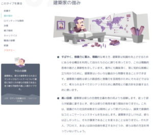

## 前書き：MBTIはあなたの強みを見つける方法

あなたの強みは何でしょうか。エピソードを交えて、1分程度でお聞かせ下さい。

この問いは、就活面接で高確率で聞かれる定番質問です。就活に慣れた学生は、聞かれすぎて、自信満々で回答できるのではないでしょうか。しかし、自己分析していない学生は、

自分の強み？サークルやバイトに明け暮れて、講義は代筆、ろくに研究もしていない。強みなんて無い……

と、途方に暮れてしまうと思います。

そんな悩みを解決できる方法として、本記事では人の性格(特性)を16タイプで分類する[MBTI(Myers–Briggs Type Indicator)](https://ja.wikipedia.org/wiki/MBTI)を紹介します。MBTIは、欧米諸国で一般的な性格分析メソッドで、**Web上で無料診断できるメリット**があります。強みだけではなく、弱み、恋人との関係、キャリアパス、チームビルディングなど、人生の様々な場面で役立ちます。そのため、就活生だけでなく、社会人にも有益です。

本記事では、MBTIに関連する以下の内容を記載します。

本記事で取り扱うMBTI関連の内容

- MBTIとは
- MBTIを試せるサイト
- 例：debimate管理人の診断結果
- 強みを伸ばしたい人へ：ストレングスファインダー

## MBTIとは

MBTI(Myers–Briggs Type Indicator)は、ユング心理学的類型論を拡張して開発された性格分析メソッドです。人の性格(特性)を以下の4指標([16タイプ](https://www.16personalities.com/ja/%E6%80%A7%E6%A0%BC%E3%82%BF%E3%82%A4%E3%83%97))で判断し、分類します。

1. 内向的：I　⇔　外向的：E
2. 感覚的：S　⇔　直観的：N
3. 思考的：T　⇔　感情的：F
4. 判断的態度：J　⇔　知覚的態度：P

MBTIは、[日本人が好む血液型診断](https://spicomi.net/media/articles/472)、[ロシア人が好む星座占い](http://ja.myecom.net/russian/blog/2017/051326/)より、学問として認められています(信憑性があります)。基本的には、就活時に企業の指示で受けさせられる適性検査に似ています。

性格を16通りのいずれかに分類するために、10分程度で100件近い質問を回答する必要があります。質問は、以下の画像のように、「同意する(賛成)、同意しない(反対)、中立」から自分に当てはまる回答を選択します。どちらかと言えば同意する、といった回答方式も可能です。

## MBTIを試せるサイト

"[16 Personalities"](https://www.16personalities.com/ja/%E6%80%A7%E6%A0%BC%E8%A8%BA%E6%96%AD%E3%83%86%E3%82%B9%E3%83%88)が、MBTI診断結果後の情報が豊富です。

MBTI診断後に得られる情報

- 性格の特徴(概要)
- 強み
- 弱み
- ロマンチックな関係
- 友情
- 親子関係
- キャリアパス
- 職場習慣

## 例：debimate管理人の診断結果

診断結果の例ですが、私の場合は「建築家型(INTJ-A / INTJ-T)」と診断されます。以下の引用のような概要に始まり、強みもしっかりと説明されます。

> 生まれつき知識欲が強く、それは若年期に現れ、子どもの頃に、よく「本の虫」と呼ばれています。侮辱としてこう呼ばれているのかもしれませんが、このあだ名が自分にぴったりだと自覚するどころか、それを誇りにさえ感じ、自分が持つ幅広く深い知識体系を大いに楽しんでいます。また、持ち前の知識を喜んで他人と共有する一面もあり、選んだテーマについて熟知しているという自信がありますが、その直感型および計画型の気質により、持論をゴシップのような「つまらない」娯楽のための話題として共有するのではなく、その分野の中で、見事な計画を立てて実際に役立てることを好みます。
> 
> [16 Personalities](https://www.16personalities.com/ja/intj%E5%9E%8B%E3%81%AE%E6%80%A7%E6%A0%BC)

## 強みを伸ばしたい人へ：ストレングスファインダー

私は、プログラマ向けの勉強会にて、ストレングスファインダーという書籍の存在を知りました。その本の中では、強みを伸ばすと**収入**と**生産性**が上がる事が記載されていました。生産性に関しては、以下のような調査もあります。

> 自分の強みを日常的に利用している人は、仕事に積極的に取り組む確率が**6倍**も高いそうです。強みにフォーカスするチームは、**生産性を12.5%高めることができます**。
> 
> [Gallup](https://www.gallupstrengthscenter.com/home/ja-jp)

<iframe style="width:120px;height:240px;" marginwidth="0" marginheight="0" scrolling="no" frameborder="0" src="//rcm-fe.amazon-adsystem.com/e/cm?lt1=_blank&amp;bc1=000000&amp;IS2=1&amp;bg1=FFFFFF&amp;fc1=000000&amp;lc1=0000FF&amp;t=debimate07-22&amp;language=ja_JP&amp;o=9&amp;p=8&amp;l=as4&amp;m=amazon&amp;f=ifr&amp;ref=as_ss_li_til&amp;asins=4532321433&amp;linkId=4afdd6fda21b35b9269abcac56fd28b1"></iframe>

就活生の場合は、自分の強みを把握した後、それらしい学生時代のエピソードを結びつければ、面接対策として充分だと思います。しかし、社会人の場合は自身の強みを伸ばしたり、自身の性格にあったリーダーシップを発揮する事まで取り組めると、よりよい会社生活が送れるかもしれません。
