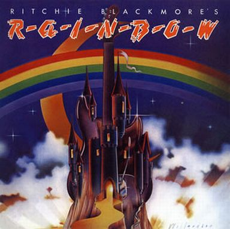

### 収録曲

収録曲

1. Man on the Silver Mountain
2. Self Portrait
3. Black Sheep of the Family
4. Catch the Rainbow
5. Snake Charmer
6. The Temple of the King
7. If You Don't Like Rock 'n' Roll
8. Sixteenth Century Greensleeves
9. Still I'm Sad

\[the\_ad id="598"\]

### 円熟味さえ感じさせるRainbow 1stアルバム

Rockバンドの1st Albumは、「初期衝動」や「荒削りながらも〜」と言った言葉で飾られる機会が多いです。しかし、本作を形容するには、そのような言葉は適切でないでしょう。バンドを率いたRitchie Blackmore(Gt.)は、Deep Purpleでアルバムを9作ほどリリースしていましたし、バックバンドとしてRainbowに吸収されたELF(Deep Purpleの前座バンド、DIOが所属)ですらアルバムを3作リリースしていました。後の作品と比較すると、楽曲一つ一つの方向性はバラバラですが、それぞれの完成度の高さを感じ取れます。

本作の構想は、Ritchieが"Black Sheep of the Family"をDeep Purpleでカバーしようと提案したら、メンバーに拒否された所から始まります。仕方なく、Ritchieは休暇を利用して、ELFと共に"Black Sheep〜"および"Sixteenth Century Greensleeves"(c/w)をシングルとして作成する事になります。シングルの出来栄えが期待以上であったため、Ritchieはアルバムを作成する方針に変更しました。このような背景から、本作は1975年2月20日にレコーディングを開始されましたが、同年の3月14日に完成しています。恐るべく制作スピードであり、意欲的に取り組んだ事が推察できます。

**本作は、キラーチューンが存在しないながらも、ファンに愛された曲が多数収録されています。**Liveでは激しさが増す"Man on the Silver Mountain"、"Sixteenth Century Greensleeves"、"Still I'm Sad"、歴代のボーカリストによって歌い継がれた"Catch the Rainbow"、物憂げで日本人好みな"The Temple of the King"。どの曲も佳曲であり、アルバム単位で本作を好まないファンも、「この曲は好き！」と言える曲があるのではないでしょうか。

### If You Don't Like Rock 'n' Rollから漂うパンク臭

"If You Don't Like Rock 'n' Roll"に対しての感想は、古臭い曲というイメージです。90'sには、この手の楽曲は音楽シーンから姿を消したと思います。少なくとも、90年生まれの私には、初聴時に**「うぇっ」**ときました。正直に言えば、最初は捨て曲扱いでした。

<iframe width="560" height="315" src="https://www.youtube.com/embed/tD8E4-d_6lM" frameborder="0" allow="accelerometer; autoplay; encrypted-media; gyroscope; picture-in-picture" allowfullscreen="allowfullscreen"></iframe>

\[the\_ad id="598"\]

しかし、腰を据えて曲と向き合ってみたら、パンクを感じてきました。ここで感じるパンクとは、「三大パンクバンド(Clash, Damned, Pistols)」や「ロックとの境界が曖昧な90's以降のパンク」**ではなく**、[Hanoi Rocks](https://ja.wikipedia.org/wiki/%E3%83%8F%E3%83%8E%E3%82%A4%E3%83%BB%E3%83%AD%E3%83%83%E3%82%AF%E3%82%B9)です。

最初はDIOのボーカルが骨太すぎて、Hanoiらしさは感じませんでした。しかし、演奏に耳を傾け始めると、キーボードの小気味良い感じと、アップテンポでキャッチャー(ポップ)な曲調は、Hanoi Rocksを感じさせます。ネットでは同じ意見がありませんし、「そもそもパンクらしさの代表がHanoiか」とツッコミどころは多いです。しかし、私は「Hanoiに似てるな、パンクっぽいな」と感じてから、この曲を好きになれました。

<iframe width="560" height="315" src="https://www.youtube.com/embed/JlpC4qgDJuk" frameborder="0" allow="accelerometer; autoplay; encrypted-media; gyroscope; picture-in-picture" allowfullscreen="allowfullscreen"></iframe>

### The Temple of the Kingの音飛びが残念

Remaster版やアルバムボックスセット版は、音飛びが確認されています。私が所持しているCDも音飛びしているため、曲中で「チッ」というノイズ音が聞こえます。CD形態のアルバムは音飛びがあるようです。

<iframe style="width: 120px; height: 240px;" marginwidth="0" marginheight="0" scrolling="no" frameborder="0" src="//rcm-fe.amazon-adsystem.com/e/cm?lt1=_blank&amp;bc1=000000&amp;IS2=1&amp;bg1=FFFFFF&amp;fc1=000000&amp;lc1=0000FF&amp;t=debimate07-22&amp;o=9&amp;p=8&amp;l=as4&amp;m=amazon&amp;f=ifr&amp;ref=as_ss_li_til&amp;asins=B00000IMTE&amp;linkId=791913e7e42d604d62beadf8d48b8ef0"></iframe>

音飛びを嫌う場合は、LP、シングルボックスセット版、YouTubeのいずれかを聞いて下さい。これらには音飛びがありません。

### 好きな一曲

Man on the Silver Mountain

Live版の激しさ、ボーカリスト毎の個性を知った後に聞き直すと、音源版の良さが見えてきます。

<iframe width="560" height="315" src="https://www.youtube.com/embed/p9nfVrusSMg" frameborder="0" allow="accelerometer; autoplay; encrypted-media; gyroscope; picture-in-picture" allowfullscreen="allowfullscreen"></iframe>

### 次作のReview

- [Review: RISING--虹を翔る覇者--(Rainbow)](https://debimate.jp/post/2019-05-19-review-rising-%E8%99%B9%E3%82%92%E7%BF%94%E3%82%8B%E8%A6%87%E8%80%85-rainbow/)
