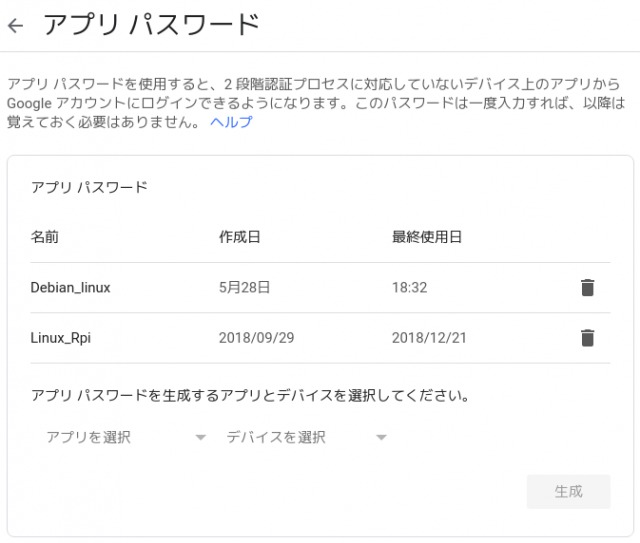
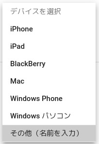
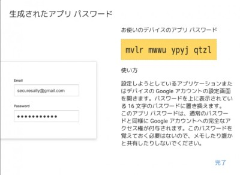

### 前書き

[Neomutt](https://neomutt.org/)は、Command Line Interface(CLI)で使用するメールクライアントです。mutt(1995年に登場したメーラー)をforkしたプロジェクトであり、その上位互換となっています。CLI環境でメールを読む理由は、**動作が快適な事**や**省メモリである事**が挙げられます。

GUI環境のメーラーは、Microsoft Outlook、Thunderbird、Gmailなどがありますが、多機能ゆえに動作が重いです。CLIメーラーは、設定の煩雑さが欠点として残りますが、速度の面では優位に立っています。そのため、大量のメールを読む場合、人によってはCLIの方が便利です。

本記事では、NeomuttでGmailを送受信するための環境構築手順を示します。実施する内容は、以下の通りです。

実施内容

- Gmailアプリパスワードの取得
- neomuttおよび関連パッケージの取得
- GmailアプリパスワードをGPGで暗号化
- Gmailの送受信設定
- メールセキュリティ設定
- メーラー基本設定
- キャッシュ設定
- キーバインディング設定

### 検証環境

```
$ neofetch
       _,met$$$$$gg.          nao@debian 
    ,g$$$$$$$$$$$$$$$P.       ---------- 
  ,g$$P"     """Y$$.".        OS: Debian GNU/Linux 9.9 (stretch) x86_64 
 ,$$P'              `$$$.     Kernel: 4.9.0-9-amd64 
',$$P       ,ggs.     `$$b:   Uptime: 1 day, 21 hours, 22 minutes 
`d$$'     ,$P"'   .    $$$    Packages: 2754 
 $$P      d$'     ,    $$P    Shell: bash 4.4.12 
 $$:      $$.   - ,d$$'    Resolution: 2560x1080 
 $$;      Y$b._   _,d$P'      DE: Cinnamon 3.2.7 
 Y$$.    `.`"Y$$$$P"'         WM: Mutter (Muffin) 
 `$$b      "-.__              WM Theme: Cinnamon (Albatross) 
  `Y$$                        Theme: BlackMATE [GTK2/3] 
   `Y$$.                      Icons: Gnome [GTK2/3] 
     `$$b.                    Terminal: gnome-terminal 
       `Y$$b.                 CPU: Intel i3-6100U (4) @ 2.3GHz 
          `"Y$b._             GPU: Intel Integrated Graphics 
              `"""            Memory: 4168MB / 32069MB 
```

### Gmailアプリパスワードの取得

前提として、Gmailのメールアドレスとパスワードを取得している状態とします。NeomuttがGmailサーバからメールを取得する際、普段使用するパスワードではなく、Neomutt用パスワードが必要になります。

そのため、Neomutt用パスワードをGoogleから取得する手順を示します。まずは、[Googleのアプリ設定ページ(外部)](https://security.google.com/settings/security/apppasswords)に移動し、ログインします。ログイン後、アプリパスワードの画面(下画像)が出てきます。



「アプリパスワードを生成するアプリとデバイスを選択して下さい」という文章の下にあるプルダウンを選択します。「アプリを選択」というプルダウンでは、**メール**を選択します。


「デバイスを選択」というプルダウンでは、**環境に合わせて選択**して下さい。私の環境は、Debianなので、その他を選択しました。



「生成」ボタンを押した後、以下のようにパスワード(下画像の黄色部)が生成されます。このパスワードは一度しか表示できないため、どこかにメモしておいて下さい。なお、私は画像中のパスワードは使用していないため、セキュリティ的な問題はありません。



### Neomuttおよび関連パッケージの取得

NeomuttをDebian9環境にインストールするには、

- [開発元のGitHub](https://github.com/neomutt/neomutt)からソースコードを取得し、ビルド
- Debian10(testing)環境のリポジトリからaptコマンドで取得

の2通りがあります。

ソースコードからのビルドは、やや労力が必要な作業です。Neomuttは、ビルド時依存パッケージが多いです。依存を満たすには、[Debian公式サイトの依存情報](https://packages.debian.org/testing/mail/neomutt)を見ながら、事前にパッケージを多数インストールしなければいけません。

Debian10(testing)環境リポジトリを使用する方法は、ソースビルドより簡単です。aptコマンドで環境構築できるため、本記事ではこちらの方法を採用します。

まず、以下の記事に従い、testingパッケージをインストールできる状態にします。その後は、aptコマンドで「Neomutt」、「HTMLメールを読むためのw3mパッケージ」、「パスワードを暗号化するためのgnupg」をインストールします。

- [Debian: 任意のtesting/unstableパッケージのみをinstallする方法(システム全体はstableを維持)](https://debimate.jp/post/2019-03-09-debian-%E4%BB%BB%E6%84%8F%E3%81%AEtesting-unstable%E3%83%91%E3%83%83%E3%82%B1%E3%83%BC%E3%82%B8%E3%81%AE%E3%81%BF%E3%82%92install%E3%81%99%E3%82%8B%E6%96%B9%E6%B3%95%E3%82%B7%E3%82%B9%E3%83%86/)

```
$ sudo apt update
$ sudo apt upgrade
$ sudo apt install neomutt/testing w3m gnupg 

```

### GmailアプリパスワードをGPGで暗号化

Neomuttの各種設定は、neomuttrcファイルに記載します。この設定には、Gmailアプリパスワードを記載する事も含まれますが、平文でパスワードを残す事はセキュリティにリスクがあります。そのため、パスワードを暗号化します。

まずは、平文でパスワードをpasswdsファイル(ファイル名自由)に記載します。

```
$ mkdir -p ~/.config/neomutt/
$ touch ~/.config/neomutt/passwds     (注釈) このファイルに記載する内容は、以下の通り。

```

```
set imap_pass="Googleアプリで生成したパスワードを記載"
set smtp_pass="Googleアプリで生成したパスワードを記載"
```

GPGで、passwdsファイルを暗号化する前準備として、GPGキーペアを作成します。以下の手順でGPGキーペアを作成する際に、「パスワード(自由)」、「エントロピーの取得(キーボードをタイプ、マウスを動かす、ディスクを動かす)」を要求されます。なお、エントロピーは、偏りのない乱数を生成するために必要な情報です。

GPGキー作成中に表示されるユーザIDは、後ほど使用するため、メモしておいて下さい。

```
$ gpg --gen-key     (注釈) GPGキーペアを作成
gpg (GnuPG) 2.1.18; Copyright (C) 2017 Free Software Foundation, Inc.
This is free software: you are free to change and redistribute it.
There is NO WARRANTY, to the extent permitted by law.

Note: Use "gpg --full-generate-key" for a full featured key generation dialog.

GnuPG needs to construct a user ID to identify your key.

Real name: (★ここに本名を記載)
Email address: (★ここにG-mailアドレスを記載)
You selected this USER-ID:
    "★ここにユーザIDが表示される"

Change (N)ame, (E)mail, or (O)kay/(Q)uit? O
We need to generate a lot of random bytes. It is a good idea to perform
some other action (type on the keyboard, move the mouse, utilize the
disks) during the prime generation; this gives the random number
generator a better chance to gain enough entropy.
gpg: key DF64CD927B2A8918 marked as ultimately trusted
gpg: directory '/home/nao/.gnupg/openpgp-revocs.d' created
gpg: revocation certificate stored as '/home/nao/.gnupg/openpgp-revocs.d/9C4580466284CA6EA8CF4365DF64CD927B2A8918.rev'
public and secret key created and signed.

pub   rsa3072 2019-05-30 [SC] [expires: 2021-05-29]
      9C4580466284CA6EA8CF4365DF64CD927B2A8918
      9C4580466284CA6EA8CF4365DF64CD927B2A8918
uid                       "★ここにユーザIDが表示される"
sub   rsa3072 2019-05-30 [E] [expires: 2021-05-29]

```

最後に、GPGでpasswdsファイルを暗号化し、平文ファイルは削除します。

```
$ gpg -r "ユーザIDを記載" -e ~/.config/neomutt/passwds
gpg: checking the trustdb
gpg: marginals needed: 3  completes needed: 1  trust model: pgp
gpg: depth: 0  valid:   1  signed:   0  trust: 0-, 0q, 0n, 0m, 0f, 1u
gpg: next trustdb check due at 2021-05-29

$ ls ~/.config/neomutt/     (注釈)：passwds.gpgが暗号化されたファイル
neomuttrc  passwds  passwds.gpg

$ shred -u ~/.config/neomutt/passwds (注釈)：平文ファイルを完全に削除

```

\[the\_ad id="598"\]

### Gmailの送受信設定

Gmailの送受信設定をneomuttrcファイル(Neomuttの設定ファイル)に記載します。記載する内容は、ユーザの本名やGmailアドレスによって変わるため、注意が必要です。

```
$ touch ~/.config/neomutt/neomuttrc   (注釈)：記載する内容は以下の通り。

```

```
########################                                                                                        
# メール送信・受信設定 #                                                                                        
########################                                                                                        
source "gpg -d ~/.config/neomutt/passwds.gpg |"  # 暗号化したパスワードを読み込み                                                                 
set realname  = "自分の本名を記載"     # 本名                                                                  
set hostname  = "gmail.com"         # ホスト名                                                              
set from      = "Gmailアドレスを記載" # G-mailのアドレス。送信元。
                                            
# 送信設定(SMTPS=セキュアなメール転送プロトコル)                                                                
set smtp_url  = "smtps://(Gmailアドレスを記載。前後のカッコは消す)@smtp.gmail.com:465/"                                              
set imap_user = "Gmailアドレスを記載"          # 受信設定(IMAP=メールをサーバ管理)                                     
set folder    = "imaps://imap.gmail.com:993" # 受信メールの読み込み先(993番ポート=SSL対応)    

```

### メールセキュリティ設定

メールセキュリティ設定を"~/.config/neomutt/neomuttrc"に記載します。ここでのセキュリティ設定は、以下の2点です。

- 送信メールサーバから受信メールサーバまで通信を暗号化（SSL/TLS暗号化）
- SSLの次世代規格TLSで、サーバ・クライアント間で通信を暗号化

```
########################                                                                                        
#   セキュリティ設定      #                                                                                        
########################                                                                                        
set ssl_starttls      = yes # 受送信メールサーバまでの通信を暗号化                                              
set ssl_force_tls     = yes # SSLを次世代規格のTLSに強制的に変更    

```

### メーラー基本設定

Neomuttのメーラーとしての基本設定を"~/.config/neomutt/neomuttrc"に記載します。「CA証明書(SSLサーバの証明書)を格納するディレクトリ」や「HTMLメールを読むための設定ファイル」は自動生成されないため、事前に作成しておきます。

```
$ mkdir -p ~/.mutt/certificates  (注釈)：CA証明書を格納するディレクトリ

(注釈)：HTMLメールを読むための設定をechoコマンドで、直接ファイルに記載
$ echo "text/html; w3m -I %{charset} -T text/html; copiousoutput;" > ~/.mutt/mailcap

```

```
########################                                                                                        
#   メーラー基本設定      #                                                                                        
########################                                                                                        
set sidebar_visible  = yes                       # サイドバーの表示                                             
set sidebar_format = "%B%?F? [%F]?%* %?N?%N/?%S" # サイドバーの書式                                             
set mail_check_stats                             # 定期的にメールの状態をチェック                               
set sort_aux         = reverse-date              # 日付の降順でメール一覧を表示                                              
set use_from         = yes                       # メールのFromヘッダを自動生成ON                                            
set editor           = "vim"                     # メールを書く時のエディタ                                                  
                                                 # 環境変数EDITORに従う場合、`echo \$EDITOR`と記載                           
set charset          = "utf-8"                   # Terminal(およびメール送信時)で使用する文字コード                          
set assumed_charset  = "utf-8:iso-2022-jp:euc-jp:shift_jis" # 文字コード指定がない場合のため、優先順位を設定    
set mbox_type        = "maildir"                 # mbox=複数のメッセージが連結した形式で保存                                 
                                                 # maildir=mail1通がファイル1個                                              
set spoolfile        = "+INBOX"                  # フィルタされていないメールの受信先                                        
mailboxes            = "+Debian"                                                                                
set certificate_file = "~/.mutt/certificates"    # CAの証明書の格納先(接続先の認証ファイル)                        
set mailcap_path     = "~/.mutt/mailcap"         # mailcapには、w3mを使ってHTMLメールを読む設定を記載              
auto_view text/html                              # HTMLを自動でw3mで開封                                                                    

```

### キャッシュ設定

Neomuttの起動を早めるために、各メールに対するキャッシュ設定を"~/.config/neomutt/neomuttrc"に記載します。キャッシュを格納するディレクトリは、自動生成されないため、予め作成しておきます。

```
$ mkdir -p ~/.mutt/cache/headers　(注釈)：メールヘッダ用のキャッシュディレクトリ
$ mkdir -p ~/.mutt/cache/bodies   (注釈)：メール本文用のキャッシュディレクトリ

```

```
##############################################################                                                  
# キャッシュ設定(キャッシュ先ディレクトリを事前に作成する事) #                                                  
##############################################################                                                  
set header_cache     = "~/.mutt/cache/headers" # headerキャッシュのPATHを指定                                   
set message_cachedir = "~/.mutt/cache/bodies"  # IMAP経由で受信したメッセージのキャッシュPATHを指定   

```

### キーバインディング設定

キーバインディング設定は、ユーザの好みの範疇のため、設定しなくても良いです。

私は、以下のみ"~/.config/neomutt/neomuttrc"に設定しました。

```
#####################################                                                                           
# キーバインディング("\C" = Ctrl)      #                                                                           
#####################################                                                                           
bind index G imap-fetch-mail                  # 新しいメールの取得                                              
bind index,pager \Cp sidebar-prev             # サイドバーで一つ前に移動                                        
bind index,pager \Cn sidebar-next             # サイドバーで次に移動                                            
bind index,pager \Cv sidebar-toggle-visible   # サイドバーを開く、もしくは閉じる  

```

### 最後に

ここまでの設定によって、Gmailの送受信ができるようになってます。より細かい設定は、[Neomutt公式サイトのリファレンス](https://neomutt.org/guide/reference.html)を確認して下さい。
