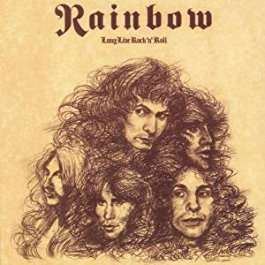

## 収録曲

収録曲

1. Long Live Rock 'n' Roll
2. Lady of the Lake
3. L.A. Connection
4. Gates of Babylon
5. Kill the King
6. The Shed(Subtle)
7. Sensitive to Light
8. Rainbow Eyes

## 前作のReview

https://debimate.jp/2019/05/19/review-rising-%E8%99%B9%E3%82%92%E7%BF%94%E3%82%8B%E8%A6%87%E8%80%85-rainbow/

https://debimate.jp/2019/06/15/review-on-stage-deluxe-edition-rainbow/

## アメリカ市場を意識した結果、大作志向の終焉

本作は、Ritchie Blackmoreがアメリカ市場を意識した結果、過去の二作([銀嶺の覇者](https://debimate.jp/2019/05/19/review-ritchie-blackmores-rainbow-%E9%8A%80%E5%B6%BA%E3%81%AE%E8%A6%87%E8%80%85-rainbow/)、[虹を翔ける覇者](https://debimate.jp/2019/05/19/review-rising-%E8%99%B9%E3%82%92%E7%BF%94%E3%82%8B%E8%A6%87%E8%80%85-rainbow/))より楽曲がコンパクトになっています。ただし、リリース時点(1977年)におけるコンパクトさであり、2019年の視点(約40年越しの視点)で聴けば、前作と大差がない重厚さです。

コンパクトさ(短さ)で言えば、当然、2019年現在の方が極限まで圧縮されています。1980年代に海外で商業ロックが台頭し、90年代後半の日本では"Aメロ-サビ-Aメロ-サビ-ソロ-Bメロ-サビ-サビ"というシンプルな構造の曲が溢れかえり、2010年台には各種ソロまで廃されています。そのような曲に慣れた耳で、Rainbowを聴けば"Kill the King"でさえ「イントロ長い、ソロ長い」になります。

1970年代の大作志向を別の言葉で解釈すると、**「ミュージシャンが実力を誇示するような楽器感の掛け合いパートの有無」**と認識した方が妥当です。つまり、本作が意味する大作志向の終焉とは、Ritchieがスリリングな掛け合いパートを意図的に廃したという事です。より具体的には、[前作](https://debimate.jp/2019/05/19/review-rising-%E8%99%B9%E3%82%92%E7%BF%94%E3%82%8B%E8%A6%87%E8%80%85-rainbow/)の"A Light in the Black(下の動画)"に存在したギターとキーボードの掛け合いは、影を潜めてしまいました。

<iframe width="560" height="315" src="https://www.youtube.com/embed/IQzC-9Izr4Y" frameborder="0" allow="accelerometer; autoplay; encrypted-media; gyroscope; picture-in-picture" allowfullscreen="allowfullscreen"></iframe>

90年代生まれの私の感覚では、Ritchieが時代に即したコマーシャルな楽曲を作曲できた時期は、Joe Lynn Turner後期(1983年)です。本作リリースの6年後です。それまでの間、RItchieは試行錯誤(メンバーの首切り含む)しながら、作曲スキルを磨く事になります。

## 時の試練に耐えた楽曲、破れた楽曲

時の試練を耐えた楽曲の代表格は、"Kill the King"でしょう。個人的な昔話をすると、この曲を初聴した時(2010年ぐらい)、私は約20歳で、80年代のHR/HMを一通り聴き終え、70年代の名盤漁りに足を踏み入れた頃でした。80年代の洋楽は、90年代の邦楽の基盤ですからスンナリと耳に馴染みましたが、70年代の楽曲に対しては音質やリズム感を古臭く感じた記憶があります。

そんな中で聴いた"Kill the King(下の動画は、同曲の原型Ver.)"は、衝撃を受けました。1977年に作曲されたと思えない程、完成されたHR/HMであり、Old School(古典的)と形容する事が正しいのかさえ分かりませんでした。「時の試練に耐えた」ではなく、「時代を飛び越えた」と表現しても良いぐらい、他の曲と時代感が異なります。80年代以降のHR/HMは、重さ、速さ、華麗さ・疾走感(クサさ)を追求してジャンル派生が起こりますが、基本的なメタル様式美を構築した点では"Kill the King"で完成しきっていたのではないでしょうか。

<iframe width="560" height="315" src="https://www.youtube.com/embed/zEaxow3PoO0" frameborder="0" allow="accelerometer; autoplay; encrypted-media; gyroscope; picture-in-picture" allowfullscreen="allowfullscreen"></iframe>

逆に、時の試練に破れた楽曲もあります。完全な主観ですが、繰り返し聴いても以下の2曲は**「古臭い」**という印象が拭えませんでした。Rainbowファンの中でも、あまり話題にならない不人気曲でもあります。

- L.A. Connection
- The Shed(Subtle)

**古臭さの原因は、ブルース要素**でしょう。多かれ少なかれ、60年代から70年代までのロックには、ブルースの匂いがします。ブルースなくしてロックンロールは存在しませんが、ロールを忘れた80年代以降のロックにはブルース要素が無いのが当たり前です。Led Zeppelinのような「ブルースから強い影響を受けています！」というバンド以外にブルース要素があると、「泥臭い→洗練されていない→古臭い」と感じてしまいます。

実際の所、古臭さという観点では、Long Live Rock 'n' Roll、Lady of the Lake 、Sensitive to Light も同じです。しかし、これらの楽曲は、

- Long Live Rock 'n' Roll：歴代ボーカルがLiveで頻繁に披露
- Lady of the Lake：繰り返し聞くと、哀愁感とサビのメロディラインが良い
- Sensitive to Light：曲調が明るいから聴きやすい

と、救いがあります。

## Gate of Babylonへの疑惑

Babylon(バビロン)は、「神の門」に由来を持つ単語で、現在のイラクに位置します。つまり、オリエンタルな曲調は、楽曲名(中近東)の通りという事になります。Ritchieは、イギリス出身にもかかわらず、妖艶な雰囲気を醸し出す曲を見事に書き上げています。

<iframe width="560" height="315" src="https://www.youtube.com/embed/qu8HiZepRWo" frameborder="0" allow="accelerometer; autoplay; encrypted-media; gyroscope; picture-in-picture" allowfullscreen="allowfullscreen"></iframe>

**Gate of Babylonへの疑惑とは、「Ritchie以外の誰かが、楽曲の構築に大きく関わっていそう」という点**です。後年のRitchieは、ここまでのオリエンタル感を主張する曲を作曲出来ていません。Liveでも演奏しない事から、そこまでお気に入りの曲という訳でも無さそうです(DIO曰く、Live演奏自体は数回したらしい)。有り体に言えば、Ritchieがこの曲を書けそうにないと。

この疑惑への回答は、[海外のWiki](https://en.wikipedia.org/wiki/Long_Live_Rock_%27n%27_Roll)に書いてありました。David Stone(Key.)が貢献したようです。

> \[原文\]  
> Although Daisley and Stone are listed on the album credits for their contributions, they joined the band partway through the recording sessions and only appear on three and four songs, respectively. Stone wrote parts of "Gates of Babylon" but was never credited.
> 
> \[和訳\]  
> DaisleyとStoneは、彼らの貢献のためにアルバムクレジットに記載されていますが、彼らはレコーディングセッション途中でバンドに参加しました。彼らは、3曲目("L.A. Connection")と4曲("Gates of Babylon")にしか関わっていません。Stoneは "Gates of Babylon"の一部を作曲していますが、クレジットされていません。

\[the\_ad id="598"\]

さらに、[海外の記事](http://jeffcramer.blogspot.com/2013/05/a-very-candid-conversation-)で、David Stone本人から楽曲への関与が語られています。David Stoneが関連した部分の詳細は海外記事で確認して欲しいですが、最も端的に"Gate of Babylon"について話した箇所がありました。

> \[原文\]  
> DS: Oh yeah, anything to do with keyboards is me and I did some writing on that. They paid me out in cash. I wrote parts of three songs on that album and wrote the majority of “Gates of Babylon.”
> 
> \[和訳\]  
> DS：ええ、キーボードと関係があるのは私だけです。私はいくらか作曲しました。彼らは私に現金で支払いました。私は、そのアルバムの3曲の一部を作曲し、そして"Gates of Babylon"の大部分を作曲しました。

海外記事の中では"Gates of Babylon"の作曲経緯が時系列順に語られており、David Stoneが"Gates of Babylon"を作曲したと見なしてよさそうです。そう考えると、Ritchieがこの曲を演奏しない理由も推測できます。

Ritchie BlackmoreがGates of Babylonを演奏しない理由(推測)

- 作曲者不在：David Stoneは次アルバム("Down to Earth")に不参加
- ポップではない：アメリカ市場を狙う時期に演奏する理由がない
- 他人の曲：2019年現在では他人が作曲した曲を積極的に演奏する理由がない

## 好きな一曲

Rainbow Eyes

"Stairway to Heaven"(Led Zeppelin)と比較されますが、こちらのフルートメインのシンプル構成が好みです。

<iframe width="560" height="315" src="https://www.youtube.com/embed/VaRTocPWbhQ" frameborder="0" allow="accelerometer; autoplay; encrypted-media; gyroscope; picture-in-picture" allowfullscreen="allowfullscreen"></iframe>

<iframe style="width: 120px; height: 240px;" marginwidth="0" marginheight="0" scrolling="no" frameborder="0" src="//rcm-fe.amazon-adsystem.com/e/cm?lt1=_blank&amp;bc1=000000&amp;IS2=1&amp;bg1=FFFFFF&amp;fc1=000000&amp;lc1=0000FF&amp;t=debimate07-22&amp;o=9&amp;p=8&amp;l=as4&amp;m=amazon&amp;f=ifr&amp;ref=as_ss_li_til&amp;asins=B0099ETLPS&amp;linkId=8792de89ed32469671816e6e01b7d5ac"></iframe>
