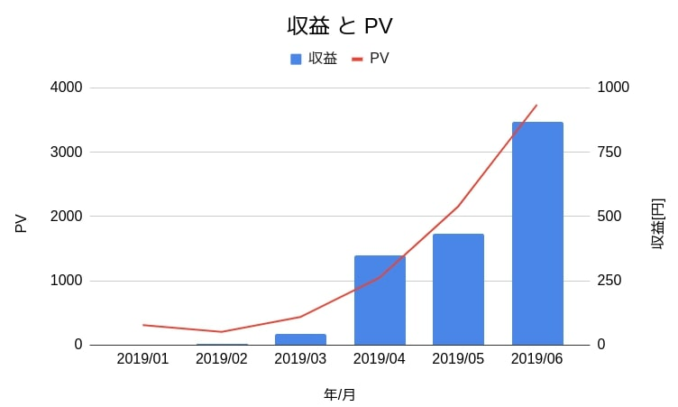

## 前書き：3000PV/月、収益800円/月

サイト開設6ヶ月目で、3000PV/月(PV=Page View、アクセス数)、収益800円/月を達成しました(実際はもう少し多い)。ブログ界隈では、**3000PV/月を超えると脱ビギナー**と見なせるそうです。記事数は、本記事で54本となりました。

収益の面では、予想より好調と考えています。収益源として、[サイト開設4日目からGoogleアドセンスを導入](https://debimate.jp/post/2019-02-28-%E6%8C%AF%E3%82%8A%E8%BF%94%E3%82%8Agoogle-adsense%E3%81%8C%E9%96%8B%E8%A8%AD4%E6%97%A5%E3%81%A7%E6%89%BF%E8%AA%8D%E3%81%95%E3%82%8C%E3%81%9F%E8%A9%B1%E3%81%8A%E3%82%88%E3%81%B3%E3%82%B5/)し、Amazonアソシエイトも導入しました。上図は前者のみの数値ですが、収益はどちらも発生しています(Amazonは約40円)。過去に私が試した[DMM(現FANZA)](https://www.dmm.co.jp/digital/)の広告収入は、約2万クリック(正確には閲覧数)で100円程度の収益でしたから、収益が発生するスピードが早いです(以下の記事に詳細をまとめてあります)。

- [DMM(現FANZA) API・Twitter Botによる自動広告を半年続けた結果、「得た収益」と「二度とやらないと誓った理由」](https://debimate.jp/post/2019-04-20-dmm%E7%8F%BEfanza-apitwitter-bot%E3%81%AB%E3%82%88%E3%82%8B%E8%87%AA%E5%8B%95%E5%BA%83%E5%91%8A%E3%82%92%E5%8D%8A%E5%B9%B4%E7%B6%9A%E3%81%91%E3%81%9F%E7%B5%90%E6%9E%9C/)

アクセス数や収益は右肩上がりですが、これからも上向き続けるとは限りません。一度振り返りをし、次の6ヶ月に向けて新たな対策を実施すべき感じています。そこで本記事では、半年間で実施した事・実施しなかった事を振り返り、現状の問題点(以下3点)とその対策に触れていきます。

サイト運営中に感じた問題点

- 偏った記事人気
- リピーター不足
- 広告クリック率

## 半年間で実施した事

この半年間は、継続して記事を書き続ける事だけを念頭に置きました。アクセス数を増やしたい気持ちがありましたが、記事の絶対数が少なかったため、細かい施策は実施しませんでした。そもそも、プログラミングの勉強結果をアウトプットするためにdebimateを立ち上げています。正直な所、アクセス数や収益の向上に関係する作業 (SEO=Search Engine Optimize、検索エンジン最適化など)は、オマケと考えています。

| **実施項目** | **実施内容** |
| --- | --- |
| 記事作成 | 週2回(平均)ペースで作成 |
| SEO対策 | All In One SEO Pack(plugin)で一度だけ全体設定 |
| モバイル対応 | 現在のテーマが標準でモバイルレイアウトに対応 |
| 表示速度向上 |   「画像サイズ縮小」および「プラグインの選定」のみ対応   |
| SNS対策 | 「記事作成時のTwitter宣伝」および「SNSシェアボタン(AddToAny Share Buttons)」のみ対応 |

## 半年間で実施しなかった事

私が「PV向上のためにすべき」と認識しつつ、様々な理由で実施しなかった施策があります(下表)。

| **非実施項目** | **実施しなかった理由** |
| --- | --- |
| Authorの紹介記事 | 私の紹介より、プログラミング記事数の増加を目指したため |
| Webライティング | サイト開設理由の一つとして「[Qiita(煽りタイトルで中身のないプログラム記事が多いサイト)](https://qiita.com/Nao1215)への投稿に嫌気が差した事」があり、debimateで人を煽る記事を書く事に抵抗があるため |
| 広告位置の最適化 | PV数が少ないため、早急な対応は不要と判断 |
| モバイル表示速度向上 | プラグイン数を減らすには「CSSやPHPの知識」や「記事のリライト」が必須のため |
| 検索キーワード対策 | 検索キーワードに意識を取られ、記事の作成速度が落ちそうだったため |

上表の3項目は、以下の優先順位で2019年12月までに実施しようと考えています。

1. Authorの紹介記事(書きやすいため)
2. 検索キーワード対策(今は記事数の増加より質向上を重要視しているため)
3. モバイルにおける表示速度の向上(長期的に対応予定)

残りの2項目は、対応しません。WEBライティングには良い感情がありませんし、広告位置の最適化は時期焦燥と考えています。広告位置は、1万PV/月を超えれば対応します。

## 問題点1：偏った記事人気

debimateは、以下の3ジャンルがメインのサイトです。

- プログラミングの解説(PVの90%以上)
- HR/HM(音楽)のReview
- ロシアに関する記事

アクセスの大半を締めているプログラミング記事には、流行り廃りがあります。流行っている間はアクセス数が順調に伸びますが、廃ってしまえばアクセスされなくなります。堅調にアクセス数を伸ばしていくためには、全ての記事のアクセス数が均等に伸びる事が望ましいです。

しかし、この考えとは裏腹に、アクセスランキング1位を取り続ける記事があります。

| **記事名** | **全アクセスに対する割合** |
| --- | --- |
| [AndroidにLinux環境を構築する”UserLAnd”がソースリーディング環境(スマホ用)として最適](https://debimate.jp/post/2019-03-16-android%E3%81%ABlinux%E7%92%B0%E5%A2%83%E3%82%92%E6%A7%8B%E7%AF%89%E3%81%99%E3%82%8Buserland%E3%81%8C%E3%82%BD%E3%83%BC%E3%82%B9%E3%83%AA%E3%83%BC%E3%83%87%E3%82%A3%E3%83%B3%E3%82%B0%E7%92%B0/) | 35.6%(PV=約1250) |
| [Linux Kernel: prink(print kernel)によるメッセージ出力](https://debimate.jp/post/2019-02-02-linux-kernel-prinkprint-kernel%E3%81%AB%E3%82%88%E3%82%8B%E3%83%A1%E3%83%83%E3%82%BB%E3%83%BC%E3%82%B8%E5%87%BA%E5%8A%9B/) | 11.0%(PV=約380) |
| [Raspberry Pi3にAndroid7.1.1 + Google Play Storeをインストールする方法](https://debimate.jp/post/2019-01-26-raspberry-pi3%E3%81%ABandroid7-1-1-google-play-store%E3%82%92%E3%82%A4%E3%83%B3%E3%82%B9%E3%83%88%E3%83%BC%E3%83%AB%E3%81%99%E3%82%8B%E6%96%B9%E6%B3%95/) | 10.0%(PV=約350) |
| [Linux Kernel: エラー番号の一覧](https://debimate.jp/post/2019-02-24-linux-kernel-%E3%82%A8%E3%83%A9%E3%83%BC%E7%95%AA%E5%8F%B7%E3%81%AE%E4%B8%80%E8%A6%A7/) | 7.1%(PV=約250) |
| [DMM(現FANZA) API・Twitter Botによる自動広告を半年続けた結果、「得た収益」と「二度とやらないと誓った理由」](https://debimate.jp/post/2019-04-20-dmm%E7%8F%BEfanza-apitwitter-bot%E3%81%AB%E3%82%88%E3%82%8B%E8%87%AA%E5%8B%95%E5%BA%83%E5%91%8A%E3%82%92%E5%8D%8A%E5%B9%B4%E7%B6%9A%E3%81%91%E3%81%9F%E7%B5%90%E6%9E%9C/) | 4.4%(PV=約150) |

トップを独走しているUserLAndの記事は、2018年頃から話題になり始めたアプリを紹介した内容です。アプリが新しいので、検索数が多かった(=debimateにも流入があった)と考えられます。しかし、そろそろ話題性が落ちる頃です。debimateの記事へのアクセスも減るでしょう。アクセス全体の約35%を占める記事が不人気になると、そのダメージも大きいです。

PV数を堅実に伸ばすという意味では、(私の場合)Linux Kernel、Raspberry Piなどの安定した技術・話題を説明した方が良いという結論になります。しかし、PV目当てで記事を書く事は辛いです(そこまで広告収入が欲しいわけではない)。そこで、一ヶ月単位で作成する記事をコントロールします。具体的には、一ヶ月に記事を8本書く事とし、

- Linux Kernelの記事2本(安定したPVのため)
- Raspberry PiやRust/Pythonなどの記事2本(安定したPVのため)
- 新しい技術やアプリの記事2本(技術のキャッチアップおよび突出したPVを得るため)
- HR/HMやロシアの記事2本(趣味)

といった内訳にします。

## リピーター不足

安定したアクセス数を得るには、何度もサイトに訪問してくれるリピーターが重要です。リピーター数が多ければ、見込みPV数も正確に算出できます。

**しかし、debimateはリピーター率が低い(約10%)**

リピーター率が低い理由は、色々考えられます。

- 読者のニーズに答えていない(記事タイトルと中身の不一致など)
- 分かりづらさ(読みにくさ)
- リピートするほどコンテンツ(記事)がない
- サイトが重くて、直ぐ離脱(アクセスしただけで記事が読まれていない)

リピーター不足への対応に関しては、手探りで改善していくしかありません。内容が理解しやすい記事の書き方を勉強した後に、質の高い記事作成を継続しつつ、サイト全体を軽量な仕様に移行していく予定です。

\[the\_ad id="598"\]

## 低い広告クリック率

広告クリック率とPVが安定すると、「PV×広告クリック率×広告単価(平均)=収益」という形で、一ヶ月あたりの収益が概算できます。ちなみに、debimateの広告クリック率は0.2%以下で、一般的なクリック率は1%前後と言われています。

**低い広告クリック率の理由は単純で、読者の大半(90%以上)がプログラマーだから**です。悪質な配置の広告でない限り、プログラマーが広告を踏む(クリックする)事はありえません。プログラマーは、嬉々として毎日PCの前に座る人種であり、広告とサイト内リンクを見間違う事がありません。さらに、ブラウザに広告ブロック用プラグインを導入する事が多いです。

低い広告クリック率に関しては、クリック率が1%程度まで向上すれば嬉しいですが、プログラマー相手には無理でしょう。そのため、ある程度プログラム関係の記事数が増えた後(記事数が100本以上になった後)、HR/HMやロシアに関する記事の広告クリック率を上げるつもりです。

## まとめ：今後の目標と対策

目標は、「2019年12月末時点で1万PV/月の達成(収益1000円程度)」とします。目標達成の施策は、以下の通りです。

2019年7月〜12月で実施する項目(施策)

- Authorの紹介記事の作成
- 記事の質向上（検索キーワード対策、読みやすさ対策など）
- モバイルにおける表示速度の向上
- 一ヶ月に作成する記事ジャンルのコントロール(内訳は記事中に記載)

## 記事総数100本を超えた時のPV／収益はコチラ

[【記事総数100本】1万PV/月に到達せず、収益が1000〜3000円/月とフラつく。その原因は？【技術ブログだから】](https://debimate.jp/post/2020-05-01-%E8%A8%98%E4%BA%8B%E7%B7%8F%E6%95%B0100%E6%9C%AC1%E4%B8%87pv-%E6%9C%88%E3%81%AB%E5%88%B0%E9%81%94%E3%81%9B%E3%81%9A%E5%8F%8E%E7%9B%8A%E3%81%8C10003000%E5%86%86/)
