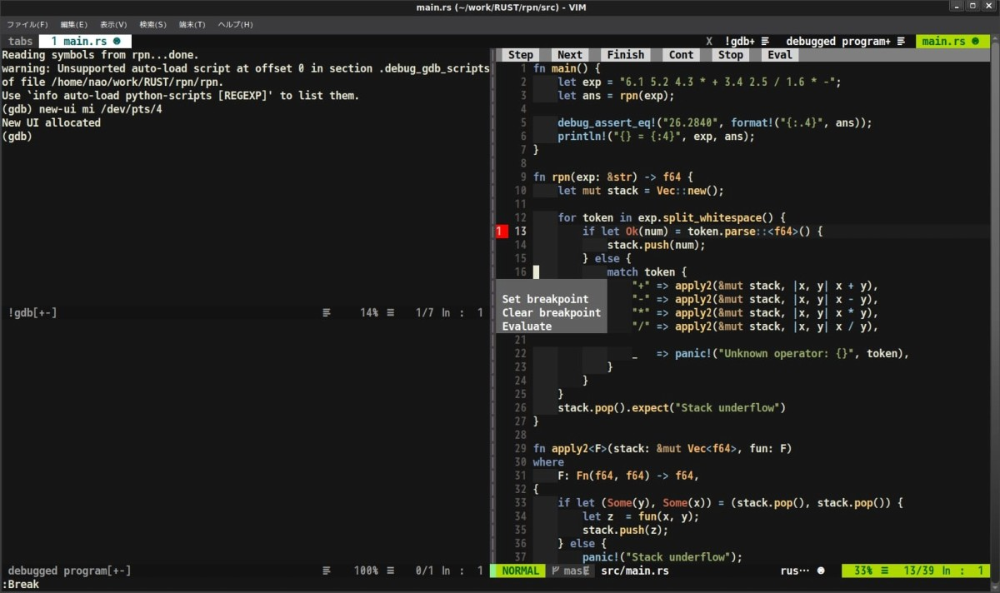

## 前書き

GDBをリッチなText User interface環境で実行するツールは、以前から複数ありました。例えば、

- [CGDB](https://cgdb.github.io/)：ViライクなキーバインドのGDBフロントエンド
- [GDB TUI mode](http://www.gnu.org/software/gdb/)：EmacsライクなキーバインドのGDB標準のTUI環境(オプションtui)
- [NeoDebug](https://github.com/cpiger/NeoDebug)：Vim用GDBフロントエンドプラグイン。Vim標準(Termdebug)より高機能

などがあります。

上記のツールの(個人的な)デメリットは、

- CGDBは便利だが、Vim(+plugin)環境を完全に再現できない事
- GDB TUI modeは、OS標準GDBがサポートしていない可能性ある事
- NeoDebugは、本記事で紹介するVim標準機能より遥かに高機能だが、バグがある事。また、情報が少ない事

と、何点か挙げられました。

本記事で紹介するVim標準機能(termdebug)は、上記のデメリットがありません。普段使用しているVim(+plugin)の環境上でGDBを操作でき、操作に関する情報量も多いです。Breakpointをマウス操作で貼れます。

termdebugは使い勝手が良いため、本記事では導入方法と使い方について説明します。

## 検証環境

```
       _,met$$$$$gg.          nao@debian 
    ,g$$$$$$$$$$$$$$$P.       ---------- 
  ,g$$P"     """Y$$.".        OS: Debian GNU/Linux 10 (buster) x86_64 
 ,$$P'              `$$$.     Kernel: 4.19.0-6-amd64 
',$$P       ,ggs.     `$$b:   Uptime: 4 hours, 8 minutes 
`d$$'     ,$P"'   .    $$$    Packages: 2474 (dpkg) 
 $$P      d$'     ,    $$P    Shell: fish 3.0.2 
 $$:      $$.   - ,d$$'    Resolution: 2560x1080 
 $$;      Y$b._   _,d$P'      DE: Cinnamon 3.8.8 
 Y$$.    `.`"Y$$$$P"'         WM: Mutter (Muffin) 
 `$$b      "-.__              WM Theme: cinnamon (Albatross) 
  `Y$$                        Theme: BlackMATE [GTK2/3] 
   `Y$$.                      Icons: gnome [GTK2/3] 
     `$$b.                    Terminal: gnome-terminal 
       `Y$$b.                 CPU: Intel i3-6100U (4) @ 2.300GHz 
          `"Y$b._             GPU: Intel HD Graphics 520 
              `"""            Memory: 3840MiB / 32060MiB 

```

## Termdebug導入前の事前確認

Termdebugは、Vim8.1.x環境でterminal機能が無ければ、使用できません。バージョン確認およびterminal機能の有効・無効確認は、以下の手順で実施します。

```
$ vim --version                           
VIM - Vi IMproved 8.1 (2018 May 18, compiled Jun 15 2019 16:41:15)
(省略)

$ vim
(注釈)：Vimの画面上で以下を入力。
:echo has('terminal')

(注釈)：出力が1であればterminal機能が有効、0ならば無効
```

仮に、Terminal機能がなかった場合は、vimを一度削除し、vim-noxパッケージを入れるか(Debian限定)、Vimの上流からのバックポートパッケージを利用して下さい(Debian, Ubuntu限定)。手順を以下に示します。

vim-noxを利用する場合

```
$ sudo apt remove vim
$ sudo apt update
$ sudo apt install vim-nox

```

最新版(上流)のVimを利用する場合

```
$ sudo add-apt-repository ppa:jonathonf/vim   (注釈)：最新のVimを使用できるよう、リポジトリ追加
$ sudo apt update
$ sudo apt install vim

```

## Termdebugを利用するための設定

Termdebugを利用するには、"~/.vimrc"ファイルに以下の3行を追加するだけです。

```
" termdebugプラグイン読み込み
packadd termdebug

" Vimの全モードでマウス操作を有効化
set mouse=a

" GDBデバッグ時のWindow横幅サイズ指定
let g:termdebug_wide = 160

```

## Termdebugの使い方

Vimを起動した後、":Termdebug <デバッグ対象バイナリへのPATH>"でGDBとソースコードが同時に表示できます。":Termdebug"部分をgdbコマンドに置き換えると、分かりやすいと思われます。

例えば、rpnバイナリをGDBデバッグする場合は、":Termdebug rpn"とVim上で入力します。以下に起動後のイメージを示します。



上記のVim画像の右側がソースコード画面、左上がGDB画面、左下がプログラムのI/O画面です。GDB画面に移動(例："Ctrl-w w")すれば、GDBを操作できます。GDBを終了させれば、画面はソースコードのみ表示された状態に戻り、Window横幅も元の設定に戻ります。

ソースコード画面上部には、Step、Next、Finish、Cont、Stop、Evalと書かれたボタンがあり、このボタンをマウスで押下してGDBを操作します。ソースコードの任意の行で右クリックすれば、Breakpointの追加・削除、式の評価ができます。

Vim画面(Vimコマンド)でGDBを操作する場合は、下表のコマンドを使用します。より詳細な情報は、[Vim公式日本語HP](https://vim-jp.org/vimdoc-ja/usr_05.html)を確認して下さい。

| **コマンド** | **説明** |
| --- | --- |
| :Run \[args\] | \[args\] または以前の引数でプログラムを実行 |
| :Break | 現在の行にBreakpointを設定 |
| :Clear | 現在の行のBreakpointを削除 |
| :Step | gdbのstepコマンドを実効 |
| :Over | gdbのnextコマンドを実効 |
| :Finish | gdbのfinishコマンドを実効 |
| :Continue | gdbのcontinuコマンドを実効 |
| :Stop | プログラムの中断 |
| :Evaluate | カーソルの下の式を評価 |
| :Evaluate {expr} | {expr}を評価 |
| :Gdb | gdb画面に移動 |
| :Program | デバッグ中のプログラムI/O画面に移動 |
| :Source | ソースコード画面に移動 |
