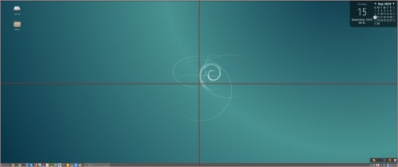
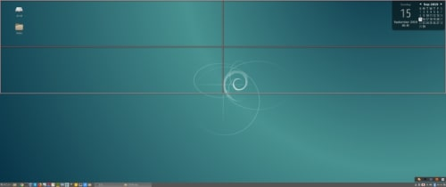
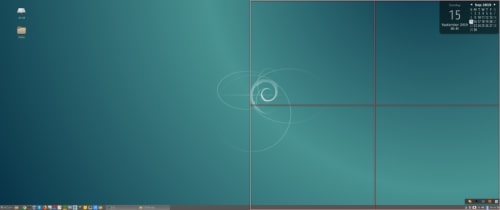

### 前書き

Linuxエンジニアの中には、マウスを嫌う人が居ます。なるべくキーボードで操作を完結させる事を美徳と考える人(変人)です。しかし、マウスを完全に排除したくても、マウス(マウスポインタ)で無ければ操作できないタイミングがあります。

そんなケースに備えて、本記事ではマウスポインタをキーボードで操作可能な[keynav](https://www.semicomplete.com/projects/keynav/)を紹介します。

### 検証環境

```
       _,met$$$$$gg.          nao@debian 
    ,g$$$$$$$$$$$$$$$P.       ---------- 
  ,g$$P"     """Y$$.".        OS: Debian GNU/Linux 10 (buster) x86_64 
 ,$$P'              `$$$.     Kernel: 4.19.0-6-amd64 
',$$P       ,ggs.     `$$b:   Uptime: 46 minutes 
`d$$'     ,$P"'   .    $$$    Packages: 2476 (dpkg) 
 $$P      d$'     ,    $$P    Shell: fish 3.0.2 
 $$:      $$.   - ,d$$'    Resolution: 2560x1080 
 $$;      Y$b._   _,d$P'      DE: Cinnamon 3.8.8 
 Y$$.    `.`"Y$$$$P"'         WM: Mutter (Muffin) 
 `$$b      "-.__              WM Theme: cinnamon (Albatross) 
  `Y$$                        Theme: BlackMATE [GTK2/3] 
   `Y$$.                      Icons: gnome [GTK2/3] 
     `$$b.                    Terminal: gnome-terminal 
       `Y$$b.                 CPU: Intel i3-6100U (4) @ 2.300GHz 
          `"Y$b._             GPU: Intel HD Graphics 520 
              `"""            Memory: 2974MiB / 32060MiB 
```

### keynavのインストール

keynavはパッケージマネージャ経由で取得できます。X11(Unixグラフィック環境)に依存しているため、iOS/Android環境では動きません。

```
$ sudo apt update
$ sudo apt install keynav 
```

### keynavの起動

Terminalで"keynav"を実行すれば、起動できます。しかし、普通に起動するとTerminalを占有するため、バックグラウンドプロセスとして起動した方が良いです。

```
$ keynav &       (注釈)："&"=バックグラウンド実効

```

keynavを起動してから、"Ctrl + ;"でマウスポインタを操作するモードに移行し、ESCキーでマウスポインタ操作モードから抜けます。マウスポインタを操作するモードに入ると、下図のように赤い十字線が画面に表示されます。



なお、画面の比率が標準でない理由は、私の使用しているモニタがウルトラワイド(比率21:9)だからです。

### keynavの操作方法

keynavは、

- 赤十字線の中心＝マウスポインタ
- 赤十字線の領域を縮小可能(例：領域の左側だけ残して縮小)
- 赤十字線の全体を移動可能(マウスポインタを動かすイメージ)

といった特徴を持ちます。

| **キー操作** | **説明** |
| --- | --- |
| Ctrl + ; | マウスポインタ操作モードに移行(画面上に赤十字線を表示) |
| ESC | マウスポインタ操作モードを終了 |
| h | 赤十字線領域の左側だけ残して、領域を縮小 |
| j | 赤十字線領域の下側だけ残して、領域を縮小 |
| k | 赤十字線領域の上側だけ残して、領域を縮小 |
| l | 赤十字線領域の右側だけ残して、領域を縮小 |
| Shift + h | 赤十字線領域を左へ移動 |
| Shift + j | 赤十字線領域を下へ移動 |
| Shift + k | 赤十字線領域を上へ移動 |
| Shift + l | 赤十字線領域を右へ移動 |
| ; | 赤十字線領域の中心にマウスポインタを移動 |
| Space | 赤十字線領域の中心にマウスポインタを移動し、左クリック |
| 2 | (左)ダブルクリック |
| 3 | (右)ダブルクリック |

h：領域の左側だけを残して、領域縮小する例


j：領域の下側だけを残して、領域縮小する例


\[the\_ad id="598"\]

k：領域の上側だけを残して、領域縮小する例



l：領域の右側だけを残して、領域縮小する例



\[the\_ad id="598"\]

### keynavのキーバインド設定変更

keynavのキーバインド設定は、"$HOME/.config/keynav/keynavrc"ファイルに記載されています。私の環境では存在しなかったため、[公式サイト](_wp_link_placeholder)からコピーしました。以下にkeynavrcの一部を示します。

```
ctrl+semicolon start
Escape end
(省略)

space warp,click 1,end

(省略)

```

書式は、"キー　keynavで定義された動作"です。一つのキーで複数の操作をする場合は、","(カンマ区切り)で後続の動作を記載します。また、"0 sh "vim",end"のように記載すれば、キーボードランチャーとして使用できます。
