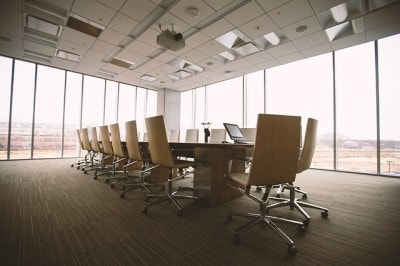

### 前書き

私は、組み込みエンジニアとして中小企業で3年程度働いた後、大企業(大手メーカ)で2年間仕事する機会を得ました。この記事を執筆段階では、1年半しか大企業での働き方を経験していませんが、大企業のメリット・デメリットが徐々に見えてきました。

大企業は、30代で給料が1000万を超えるキャリアが用意されています。土曜・日曜・祝日は休みですし、有給も取れます。福利厚生のサポートも中小企業より手厚いです。出来ない社員は寝るかネットしていれば、お金を貰えます(生活残業のため、残業時間に寝ている人もいます)。

安定を選択して、就活時に大企業のみを対象とする学生が多い理由も理解できます。しかし、大企業で働いて分かるデメリットも多いため、本記事では私が感じた大企業の嫌な点を説明します。

大企業のデメリット

- 残業が多い（残業平均値が当てにならない）
- 社会で生き残るためのスキルアップがしづらい
- 仕事の仕方が変(無駄な会議、ハンコ文化、長い承認フロー)

### 1ヶ月の残業時間＝残業上限(45hか80h)

私が所属していた大企業では、基本的に残業禁止(特に事務職)であり、公開されている残業時間(平均)は10時間強でした。残業する開発職にも、定時退社日が存在します。公開された残業時間だけ見れば、「残業少ない。ホワイトじゃん」と勘違いするかもしれません。

しかし、公開された残業時間は平均なので、部署ごとに差があります。大企業は部署単位でカラーが異なるため、部署によっては忙しい可能性があります。私が所属していた部門は、稼ぎ頭であるため、仕事量が多いです。どこまでも仕事が膨張していきます。

たちの悪い事に、失敗一つ一つに対して意味のないルールを作り上げ、それを遵守しようとして生産性が落ちます。残業しても仕事が終わらず、サブロク協定の規制時間(45h)に必ず達します。ちなみに、稼働10日で45hを使い切る事もありました。当然、残業の上限突破(=80h限界に変更)しても、確実に使い切ります。残業代が出る事が救いです。

サビ残も1時間(1日あたり)程度は存在します、月の稼働が20日ならば、"8h\*20(通常の稼働) + 80h(残業) + 1h\*20(サビ残)=260h"は最大で働きます。これぐらい働くと、

- 帰宅後は、夕食・入浴・睡眠のみ
- 土曜日は休日だが、疲労で動けない
- 突発的に身体が不調(眼痛、腹痛、吐き気)をきたす

事があります。

### 社会で生き残るためのスキルが得にくい

私は、2019年時点で29歳です。この年代の人は(恐らく)、日本(国)の未来に期待していませんし、大企業の終身雇用も期待していません。2018年には東芝、NEC、2019年には富士通、パイオニアが早期退職を募っています。今の50〜60代が人生を何とか逃げ切り、就職氷河期以降は将来に不安を抱えながら働かなければなりません。

つまり、別会社で必要とされる人材(スキルがある人)にならなければ、40歳以降で首を切られるケースなどに対応できません。50歳ぐらいの事務職のように、難しい漢字や言葉を使って自分を大きく見せるしかない生き方では、将来が不安です。しかし、スキル向上したくても、大企業で働いていると、

- 開発に関係ない書類仕事が多い
- 内製ツールにばかり詳しくなる(汎用的な知識が身につかない)
- 普段遣いのツールや言語が古く、時代の流れについていけない
- 残業で疲弊し、自己啓発時間が取れない

と、スキルを磨けません。他の大企業から退職した方の退職エントリにも目を通しましたが、「大企業で働き続け、自身が社会(ベンチャーや世界的企業)の流行について行けなくなる事」が退職理由として挙がりやすいように感じました。

残念ながら、大企業に居続ける選択を取る場合は睡眠時間を削って学習し、スキルを磨く場合は安定を捨ててベンチャーやより良い企業に行くしかないです。どちらにせよ、リスクがあります。

### 生産性を度外視した仕事の仕方

日本は労働時間の割に、生産性が低いと言われます。「生産性の定義」によって、その意味合いが当然変化しますが、大企業に無駄な仕事が多い事は事実です。例えば、

- 無駄な会議
- ハンコ文化
- 長い承認フロー

は確実に生産性を下げています。

まず、大企業で働いて驚くのは、会議の多さです。定時内が会議で埋まる事があります。さぞ重要な内容を話すのかと思えば、「仕事が忙しくて、進捗がないね」「この日までには仕上げよう！」などのメールで済みそうな会話で終わる場合があります。召集される人数も多い傾向がありました。「関係者2〜3人の自席で話して、残りの人は要らないのでは？」と感じた事が多々ありました。無関係なオジサンは、直ぐに寝ちゃうし。

次は、ハンコ(実印)文化です。偉い人の印に頭を垂れる形でハンコを押す風習こそ無かったですが、バグ修正にハンコが要りました。バグ内容の説明文が不適切な場合や単純な日本語の書き方が駄目な場合、リジェクトされます(承認印が貰えない)。承認者(偉い人)が多忙なため、承認印を貰うタイミングが限られており、「電子化すれば楽なのに」と今でも思います。

最後に、長い承認フローです。顔も拝んだことがない上位職の方々から、承認を貰う必要があります。基本的には、直属の上司より上は、待っていれば自然に承認が貰えますが、待ち時間がひたすら長い。稼働日換算で10日〜20日(1ヶ月)かかります。承認フローの途中で、些細な誤記によってリジェクトされた場合は、頭の中で「もう一回遊べるドン！(最初から承認を貰い直すため)」というフレーズが鳴り響きます。しかも、一度ミスったため、チェックがより厳しくなって、遅くなるというオマケ付きで。

### 最後に

大企業のデメリットばかりに注目しましたが、メリットも多いです。大企業は、土曜・日曜・祝日が休みで、残業代が支払われ、コンプライアンスもしっかりしています。より多くを求めてしまうのは、私が開発職だからかもしれません。

また、大企業の中でも業種によっては、素晴らしい環境があるかもしれません。本記事の情報は、メーカ系企業に就活・転職する場合の参考程度として下さい。
