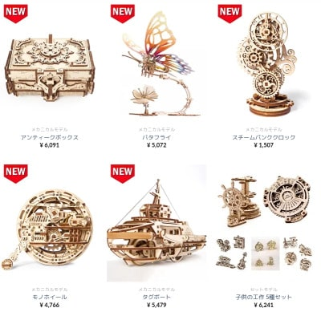
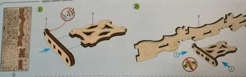
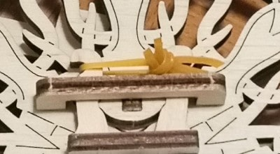

### Ugearsとは

[Ugears](https://ugearsmodels.jp/)は、機械装置にインスパイアを受けたオブジェを木材で組み立てられるように設計されたメカニカルキットです。組み立てに使うのは、木材、ゴム、ロウ（ロウソク）、紙やすりだけであり、接着剤を使用しません。多種多様なキットが用意されており、それらの全てが精巧に駆動します。

製品のラインナップは、鉄道や車、TRPG用のキットなど、男性が好みそうなオブジェが多いです。女性向けの製品が無い訳ではなく、下図の蝶やアンティークボックスなど、見た目が美しい製品も多数存在します。金額は製品サイズと精巧さによって異なり、おおむね約5000円程度という感覚です。

初期のUgearsは、ウクライナの会社がKickstarter（クラウドファンディング）で資金調達をしていたため、入手難易度がそこそこ高かったです。2020年現在は、Ugears開発会社の経営が軌道に乗ったので、AmazonやEショップなどで気軽に手に入れる事が可能になりました。書店やオモチャ屋でも類似商品を見かけますが、そちらはUgearsではなく中国の別会社である事が多く、作りがやや粗雑なようです。

---

### 親切な説明で組み立てが容易

Ugearsの組み立て方は、説明書もしくは説明動画を見ながら、木のプレートから部品を取り外し、ハメ込み作業を行うだけです。説明書は日本語に翻訳されていません。しかし、下図のように使用するパーツ番号やハメ込み位置が丁寧にビジュアライズされているため、組み立てで迷う事は少ないでしょう。

パーツプレートやパーツにも採番されており、組み立てに必要なパーツを見失いません。これらのパーツは手で取り外せるため、カッターも不要です。

購入した商品ごとの組み立て動画が用意されており、説明書を読んで迷ってしまった場合は、補足資料として動画を確認すると良いでしょう。私が購入したCard Holderの場合は、以下の動画（50分）が用意されていました。

<iframe width="560" height="315" src="https://www.youtube.com/embed/ImxBZDetwlU" frameborder="0" allow="accelerometer; autoplay; encrypted-media; gyroscope; picture-in-picture" allowfullscreen="allowfullscreen"></iframe>

---

### Card Holderの場合、所要時間は3時間

嫁からCard Holderのキットをクリスマスプレゼントとして貰ったので、実際に組み立ててみました。余談ですが、嫁には[アンティークボックス](https://www.amazon.co.jp/Ugears-Antique-%E3%82%A2%E3%83%B3%E3%83%86%E3%82%A3%E3%83%BC%E3%82%AF%E3%83%9C%E3%83%83%E3%82%AF%E3%82%B9-%E3%83%96%E3%83%AD%E3%83%83%E3%82%AF-%E3%81%8A%E3%82%82%E3%81%A1%E3%82%83/dp/B07Y9CYVJV/ref=as_li_ss_tl?__mk_ja_JP=%E3%82%AB%E3%82%BF%E3%82%AB%E3%83%8A&keywords=%E3%82%A2%E3%83%B3%E3%83%86%E3%82%A3%E3%83%BC%E3%82%AF%E3%83%9C%E3%83%83%E3%82%AF%E3%82%B9+Ugears&qid=1578109447&sr=8-1&linkCode=ll1&tag=debimate07-22&linkId=ebba61d5c05b79be705eea4509d4ffba&language=ja_JP)を買いました。途中で休憩を入れたとしても、Card Holder（パーツ数は約80個）は3時間程度で終わりました。

https://twitter.com/ARC\_AED/status/1213092645322420225

https://twitter.com/ARC\_AED/status/1213141819896160256

組み立てのコツは、全ての木材ハメ込み部分にロウを塗りたくり、滑りを良くする事です。説明書上は、可動部だけロウを塗れば良いと記載されています。しかし、木材のハメ込みは力がいりますし、ロウは沢山使っても余ります。作業を楽にするために、ロウを有効活用しましょう。

\[the\_ad id="598"\]

---

### 不安材料はゴムが切れる事だけ

Ugearsの組み立て中は楽しいし、組み立て後は可動部を見ているだけでウットリしてしまいます。しかし、不安になるのは、要所要所で使用しているゴムが切れてしまわないかという事です。使用しているゴムは下図に示すように、一般的な輪ゴムより少し丈夫そうかな、といった代物です。経年劣化でボロボロになれば、いずれは切れるでしょう。

ゴムの役割は単純な滑り止めとしての場合もありますし、駆動に関わる場合もあります。後者の場合はゴムが切れてしまうと、当然駆動しなくなってしまいます。ゴムが切れた場合は市販の輪ゴムで代用する事になると思いますが、実際に試していないので、本当に代用できるかだけが不安です。
