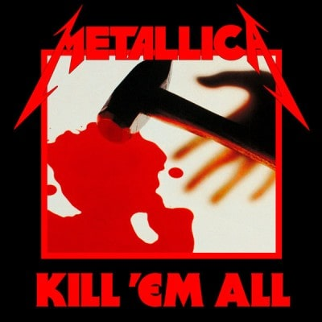

### 収録曲

収録曲

1. Hit the Lights
2. The Four Horsemen
3. Motorbreath
4. Jump in the Fire
5. (Anesthesia)Pulling Teeth
6. Whiplash
7. Phantom Lord
8. No Remorse
9. Seek & Destroy
10. Metal Militia

### Kill'Em AllはThrash Metalの原点

Kill'em AllはMetallicaの1st Albumであり、1983年〜1990年に一大ムーブメントとなったThrash Metal（音楽ジャンル）の方向性を示しました。圧倒的なスピード感で、湿り気や泥臭さを排除した無機質なリフを弾き倒すスタイルは、過去のバンドに見られないものでした（同時期にThrash Metalバンドは複数いましたが、作品のリリースが早かったのはMetallica）。

私が本作と出会ったのは2009年（大学１年生の頃）であり、人生初のメタル音楽でした。しかし、**「音質ショボ！（2009年は音圧が高い音楽で溢れていたため）」と驚いた記憶があります。**本作のリリース当初（1983年時点）も、類を見ない音楽性だったためか、レビューや世間的な評価は芳しく無かったようです。本作は、一聴して良さが分かりづらい作品なのかも知れません。

とは言え、本作は後続作品の評判に引きづられてチャートに顔を出す作品でもありますし、本作をMetallicaの最高傑作とするファンもいます。Liveで演奏される曲も多いことから、**Kill'Em Allは「****間違いなく名盤」**と言えるでしょう。ここまでの演奏力とスピード感を兼ね揃えた作品は、滅多にありません（あれば、私[@ARC\_AED](https://twitter.com/ARC_AED)に教えてください!! ）

Metallica（特に、ドラマーのLars Ulrich）は、様々なバンド（下記）から影響を受けています。先人の音楽性を吸収しつつ、Metallica独自の解釈で、スピード感と若さ溢れる本作を産み出したと言えます。

Metallicaが影響を受けたジャンル（バンド）

- 印象的なリフを特徴とした NWOBHM（Iron Maiden、Tygers of Pan Tang、Diamond Head、etc）
- スピード感のあるPunk（Ramones、Motörhead、etc）
- 伝統的なHR（Deep Purple、Rainbow、Queen、etc）

ちなみに、Larsから言及される機会が多いバンドはDiamond Head。Diamond HeadのメンバーとLarsが同居していた過去があったり、Metallicaの手持ち曲数が少ない時にDiamond Headの曲を頻繁に演奏していたので、Diamond HeadはLarsのお気に入りバンドとみなして間違いないでしょう。彼らについて語る時のLarsは、ただのファン。

### Kill'Em AllはDave Mustaineの影響が色濃く残る

悪く言えば、Kill'Em Allは愚直に疾走するスタイルであり、直近のアルバムである2nd〜4th Albumと比較してもその違いは顕著です。Cliff Burton（ベーシスト）が"Ride the Lightning"（2nd）と"Master of Puppets"（3rd）で持ち込んだ叙情性も、本作では見られません。「Thrash Metalは、知的ではない」と世間的な評価を受けていた事を気にして、Larsが意図的に複雑度を上げた"... And Justice For All"（4th）とも異なり、プログレッシブな要素が少なめです。

音楽性で言えば、Megadethの1st Albumである**"Killing Is My Business... And Business Is Good!"** が最も似ています。こちらもMetallica以上に複雑なリフで弾き倒すスタイルですが、メンバーがジャズ畑のためか、リズム感がMetallicaと異なります。

<iframe style="width: 120px; height: 240px;" marginwidth="0" marginheight="0" scrolling="no" frameborder="0" src="//rcm-fe.amazon-adsystem.com/e/cm?lt1=_blank&amp;bc1=000000&amp;IS2=1&amp;bg1=FFFFFF&amp;fc1=000000&amp;lc1=0000FF&amp;t=debimate07-22&amp;language=ja_JP&amp;o=9&amp;p=8&amp;l=as4&amp;m=amazon&amp;f=ifr&amp;ref=as_ss_li_til&amp;asins=B07BZ5HSWH&amp;linkId=2e0ba55a8e4e0075ebcc32d0d2475984"></iframe>

そもそも、Megadethは、素行の悪さでMetallicaを追い出されたDave Mustaine（ギター）が立ち上げたバンドです。Mustaineは、本作の4曲（"The Four Horsemen"、"Jump in the Fire"、"Phantom Lord"、"Metal Militia"）に作曲面で大きく寄与しているため、Megadeth／Metallicaの1st Albumが似通っているのも当然の結果かも知れません。

MustaineはMetallica脱退時、自身が作曲した４曲をAlbumに収録しない事を望みました。しかし、Metallica側はリリースを強行し、30年以上が経過した後でもクレジット問題が話題に上る（Musutaine本人の口からも言及される）ようになりました。このような背景もあって、Kill'Em ALL収録曲の約半分がMustaineの手による曲ですから、サウンド（特にリフ）からMustaineの顔がチラつくのも無理がないと言えます。

ここで気になるのは、Mustaineは上記４曲の中で、１曲（"The Four Horsemen" ≒ "Mechanix：Megadeth 1st Albumの曲"）だけしかMegadethの1stに収録しなかった事でしょう。他の３曲はリフこそ転用されましたが、まるごと採用された曲はありませんでした。曲に対する思い入れの差や完成度の違いなど、思う所があったのでしょうか。

ちなみに、"Mechanix"の方が"The Four Horsemen"よりシンプルな理由は、Mustaineの"Mechanix"を原曲として、LarsとCliffが中間部に"Sweet Home Alabama"（Lynyrd Skynyrdの曲）の一部を借用して、Jamesが不適切な歌詞をリライトしたのが"The Four Horsemen"だから。

<iframe width="560" height="315" src="https://www.youtube.com/embed/C4nCy5CITc8" frameborder="0" allow="accelerometer; autoplay; encrypted-media; gyroscope; picture-in-picture" allowfullscreen="allowfullscreen"></iframe>

<iframe width="560" height="315" src="https://www.youtube.com/embed/O5mMjlPn0Jg" frameborder="0" allow="accelerometer; autoplay; encrypted-media; gyroscope; picture-in-picture" allowfullscreen="allowfullscreen"></iframe>

### Kill'Em All以前のJames Hetfieldは声が甲高い

Kill'Em Allの収録曲はLive定番曲が多いため、現在のJames Hetfield（ボーカル）が出す野太い声に聞き慣れている方が多いかも知れません。本作におけるJames Hetfieldは、歌唱スタイルがまだ大成しきっておらず、幼さの残る甲高い声で歌い上げています。

下の動画は、Kill'em Allリリース前のデモテープ "No Life 'till Leather"の音源ですが、ハイトーンボーカルを目指していたのかと思う程、高い声で歌っています。ちなみに、デモテープ時のギタリストはMustaine。

<iframe width="560" height="315" src="https://www.youtube.com/embed/a2KjOYx8BTs" frameborder="0" allow="accelerometer; autoplay; encrypted-media; gyroscope; picture-in-picture" allowfullscreen="allowfullscreen"></iframe>

\[the\_ad id="598"\]

### 本作の仮タイトル：Metal Up Your Ass

本作のタイトルは"Metal Up Your Ass"というダサい名前になる予定でしたが、末尾に下品な言葉が含まれていたため、レコード会社が難色を示したそうです。その結果、別タイトルを考え出す必要性が出たわけですが、レコード会社への怒りが止まらなかったCliffが叫んだ言葉（”Kill'Em All”）が採用された経緯があります。

別に"Metal Up Your Ass"自体が黒歴史ワードとなったかと言えば、そうでもなく。JamesがLiveで"Kill'Em Allは、Metal Up Your Assになるはずだったんだ!!"と叫んだり（Cliff'Em Allで確認可能）、関連グッズとしてTシャツが販売されたりしています。Metallica当人たちにとっては、真面目に考えたタイトル案だったのでしょう。ダサいけど。

<iframe style="width: 120px; height: 240px;" marginwidth="0" marginheight="0" scrolling="no" frameborder="0" src="//rcm-fe.amazon-adsystem.com/e/cm?lt1=_blank&amp;bc1=000000&amp;IS2=1&amp;bg1=FFFFFF&amp;fc1=000000&amp;lc1=0000FF&amp;t=debimate07-22&amp;language=ja_JP&amp;o=9&amp;p=8&amp;l=as4&amp;m=amazon&amp;f=ifr&amp;ref=as_ss_li_til&amp;asins=B01N6HPLQS&amp;linkId=763ca338f350d1f1096050f11228956f"></iframe>

### 好きな一曲

Metal Militia

初めて聴いた時から、疾走感と耳にへばり付くリフが最高！下の動画は、2011年のMetallica30周年記念コンサートで、Dave Mustaineと一緒に演奏したMetal Militia。遠い昔に別れを告げたハズの曲でも、華麗に弾き倒すMustaineの凄さ。

<iframe width="560" height="315" src="https://www.youtube.com/embed/fd8iru7X6J8" frameborder="0" allow="accelerometer; autoplay; encrypted-media; gyroscope; picture-in-picture" allowfullscreen="allowfullscreen"></iframe>

<iframe style="width: 120px; height: 240px;" marginwidth="0" marginheight="0" scrolling="no" frameborder="0" src="//rcm-fe.amazon-adsystem.com/e/cm?lt1=_blank&amp;bc1=000000&amp;IS2=1&amp;bg1=FFFFFF&amp;fc1=000000&amp;lc1=0000FF&amp;t=debimate07-22&amp;language=ja_JP&amp;o=9&amp;p=8&amp;l=as4&amp;m=amazon&amp;f=ifr&amp;ref=as_ss_li_til&amp;asins=B079PDJRZ9&amp;linkId=5abf01a53cbfa7ef406268a015c2275b"></iframe>
