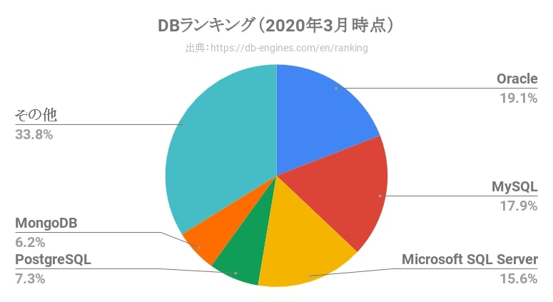

## 前書き

[PostgreSQL](https://www.postgresql.jp/)は、オープンソースのオブジェクト関係リレーショナルデータベース関係システム（ORDBMS）です。2020年時点のシェアランキングは、４位です。やや人気のないDBと言えるでしょう。



シェア１位のOracle DatabaseおよびMicrosoft SQL Serverは、有償です（Microsoft SQL Severは無償版も存在）。そのため、PostgreSQLは同じくオープンソースであるMySQL（シェア２位）と比較される機会が多いです。PostgreSQLは高機能・堅牢な設計、MySQLは速度に重きを置いた設計であり、用途に応じて使い分けられるようです。

最近、私は仕事でPostgreSQLを使用し始めたので、本記事ではDebian 10(buster)にPostgreSQLをインストールし、DBを作成する方法を紹介します。

本記事で紹介する内容

- PostgreSQLのインストール
- PostgreSQL環境設定ファイルの置き場（PATH）
- PostgreSQL DB情報の置き場（PATH）
- 外部ホストからの接続禁止設定
- postgresユーザのパスワード設定
- DB操作用ユーザを追加
- postgresユーザ以外がpostgresユーザとしてDBに接続する方法
- 新規DB作成

## 検証環境

```
       _,met$$$$$gg.          nao@debian 
    ,g$$$$$$$$$$$$$$$P.       ---------- 
  ,g$$P"     """Y$$.".        OS: Debian GNU/Linux 10 (buster) x86_64 
 ,$$P'              `$$$.     Kernel: 4.19.67 
',$$P       ,ggs.     `$$b:   Uptime: 2 days, 7 hours, 16 mins 
`d$$'     ,$P"'   .    $$$    Packages: 3786 (dpkg) 
 $$P      d$'     ,    $$P    Shell: fish 3.0.2 
 $$:      $$.   - ,d$$'    Resolution: 2560x1080 
 $$;      Y$b._   _,d$P'      DE: Cinnamon 3.8.8 
 Y$$.    `.`"Y$$$$P"'         WM: Mutter (Muffin) 
 `$$b      "-.__              WM Theme: (Albatross) 
  `Y$$                        Theme: Blackbird [GTK2/3] 
   `Y$$.                      Icons: hicolor [GTK2/3] 
     `$$b.                    Terminal: gnome-terminal 
       `Y$$b.                 CPU: AMD Ryzen 7 3800X 8- (16) @ 3.900GHz 
          `"Y$b._             GPU: NVIDIA NVIDIA Corporation TU107 
              `"""            Memory: 7598MiB / 64404MiB 
```

## PostgreSQLのインストール

PostgreSQLのインストールには、二通りの方法があります。

1. PostgreSQL公式サイトからパッケージを取得
2. Debian公式リポジトリからパッケージを取得

どちらの方法も、aptパッケージマネージャを使用します。最新版のPostgreSQLを使用したい方は、上記1.の手順を実行し、より簡単な方法を選ぶ場合は上記2.の手順を実行してください。どちらか一方の手順だけ実行すればよいです。

本記事の検証では、Debian公式リポジトリのパッケージを利用しました。

PostgreSQL公式サイトからパッケージを取得する場合（[公式手順のリンク](https://www.postgresql.org/download/linux/debian/)）

まず、PostgreSQL公式リポジトリからパッケージを取得できるよう、aptパッケージマネージャの設定ファイルを編集（追加）します。管理者権限で、/etc/apt/sources.list.d/pgdg.listを作成します。

```
$ sudo vim /etc/apt/sources.list.d/pgdg.list

（注釈）：pgdg.listを開いた後、以下の文字列を挿入し、保存。
deb http://apt.postgresql.org/pub/repos/apt/ buster-pgdg main

```

次に、PostgreSQL公式サイトの認証鍵を取得し、パッケージ情報をアップデートします。

```
$ wget --quiet -O - https://www.postgresql.org/media/keys/ACCC4CF8.asc | sudo apt-key add -
$ sudo apt update
$ sudo apt upgrade

```

最後に、PostgreSQLをインストールします。

```
$ sudo apt install postgresql-11

```

Debian公式サイトからパッケージを取得する場合

特に準備は、不要です。aptパッケージマネージャからPostgreSQLを取得します。

```
$ sudo apt update
$ sudo apt upgrade
$ sudo apt install postgresql-11

```

Debian公式レポジトリには、PostgreSQLに関するサードパーティのアドオンを含むパッケージが存在します。その一例を下表に示します。

| **パッケージ名** | **パッケージ内容の説明** |
| --- | --- |
| postgresql-client-11 | クライアントライブラリおよびクライアントバイナリ |
| postgresql-11 | データベースサーバーのコア機能 |
| postgresql-contrib-9.x |   追加機能提供モジュール（Ver. 10以降のpostgresql-xxパッケージの一部）   |
| libpq-dev | フロントエンド開発向けのC言語ライブラリ（ヘッダ含む） |
| postgresql-server-dev-11 | バックエンド開発向けのC言語ライブラリ（ヘッダ含む） |
| pgadmin4 | pgAdmin4（GUIによる管理ツール）のユーティリティ |

## PostgreSQL環境設定ファイルの置き場（PATH）

PostgreSQL設定ファイルの置き場は、LinuxディストリビューションやWindows環境で異なります。Debian環境では、/etc/postgresql/11/main環境設定ファイルが存在します。

```
/etc/postgresql/11/main               (注釈) "11"はPostgreSQLのバージョンによって変化
├── conf.d
├── environment
├── pg_ctl.conf
├── pg_hba.conf
├── pg_ident.conf
├── postgresql.conf
└── start.conf

```

## PostgreSQL DB情報の置き場（PATH）

PostgreSQLで作成したDB情報は、/var/lib/postgresql/11/mainに存在します。手動でDBを停止させる場合などに、前述のPATHを把握しておく必要があるため、記載しておきます。

## 外部ホストからの接続禁止設定

セキュリティ対策のため、外部ホストからPostgreSQL（DB）にアクセスできないように設定します。/etc/postgresql/11/main/postgresql.confを編集し、以下の状態に変更します。

```
[修正前]
listen_addresses = '*' 

[修正後]
listen_addresses = 'localhost' 

```

## postgresユーザのパスワード設定

PostgreSQLをaptコマンドでインストール後、postgresユーザが自動で追加されます。このpostgresユーザに対して、「OS向けパスワード設定」および「DB向けパスワード設定」を行います。

```
[OS向けパスワード設定]
$ sudo passwd postgres

[DB向けパスワード設定]
$ su - postgres       (注釈)：postgresユーザとしてログイン
$ psql                (注釈)：psql実行後、DB操作用のターミナルに移行

postgres=# ALTER USER postgres with encrypted password '任意のパスワード';

```

## DB操作用ユーザを追加

postgresユーザでDBを操作する事もできますが、OS管理ユーザ（普段使用しているユーザ）でDBを操作したい場合もあります。そのため、OS管理ユーザと同名ユーザをDBに対して追加します。

```
$ su - postgres              (注釈)：postgresユーザとしてログイン

$ createuser --pwprompt --interactive 任意のユーザ名
新しいロールのためのパスワード: 任意のパスワード
もう一度入力してください:
新しいロールをスーパーユーザにしますか? (y/n)y

```

postgresユーザでDB用ユーザを作成しなかった場合、管理者権限を付与できません。

\[the\_ad id="598"\]

## postgresユーザ以外がpostgresユーザとしてDBに接続する方法

PostgreSQLでは、postgresユーザ以外がpostgresユーザとしてDBに接続できます（例：naoユーザで、'psql -U postgres'をTerminalで入力）。しかし、Peer認証として「 DB 所有者がShellを実行している OS 管理ユーザ名と一致するか」をチェックされます。その結果、

psql: FATAL: ユーザ "postgres" で対向(peer)認証に失敗しました

psql: FATAL: password authentication failed for user "postgres"

といったエラーメッセージが表示されます。

PEER認証によるエラーの回避策は、/etc/postgresql/11/main/pg\_hba.confを編集し、認証時にMD5を用いる設定に変更する事です。MD5暗号化（ハッシュ化）は、postgresユーザのパスワード変更時にencrypted オプションをつける事で実施済みです。そのため、pg\_hba.confを以下のように編集し、PostgreSQLを再起動すればMD認証が使用できます。

```
$ sudo vim /etc/postgresql/11/main/pg_hba.conf

(注釈) 以下のようにpg_hba.confを編集。
[修正前]
local   all   postgres   peer

[修正後]
local   all   postgres   md5

(注釈) postgreSQLを再起動
$ sudo systemctl restart postgresql 

```

## 新規DB作成

新規DB作成のため、psqlコマンドでPostgreSQLに接続し、CREATE文を実行します。

```
$ psql -U postgres
postgres=# CREATE DATABASE 任意のDB名
postgres=# \q         (注釈)：psqlの終了

```

DBが作成されているかの確認は、psql -lで確認できます。

```
$ psql -l
                                         データベース一覧
   名前    |  所有者  | エンコーディング |  照合順序   | Ctype(変換演算子) |     アクセス権限      
-----------+----------+------------------+-------------+-------------------+-----------------------
 postgres  | postgres | UTF8             | ja_JP.UTF-8 | ja_JP.UTF-8       | 
 template0 | postgres | UTF8             | ja_JP.UTF-8 | ja_JP.UTF-8       | =c/postgres          +
           |          |                  |             |                   | postgres=CTc/postgres
 template1 | postgres | UTF8             | ja_JP.UTF-8 | ja_JP.UTF-8       | =c/postgres          +
           |          |                  |             |                   | postgres=CTc/postgres
 test      | postgres | UTF8             | ja_JP.UTF-8 | ja_JP.UTF-8       | 
 testdb    | postgres | UTF8             | ja_JP.UTF-8 | ja_JP.UTF-8       | 

```
