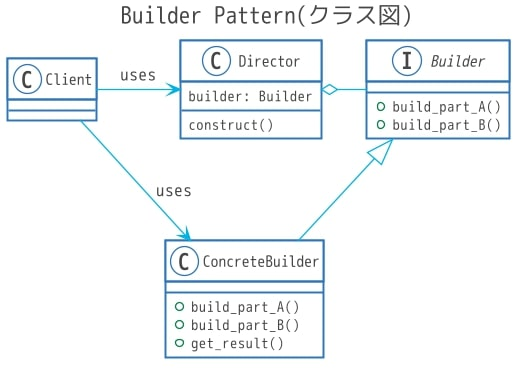
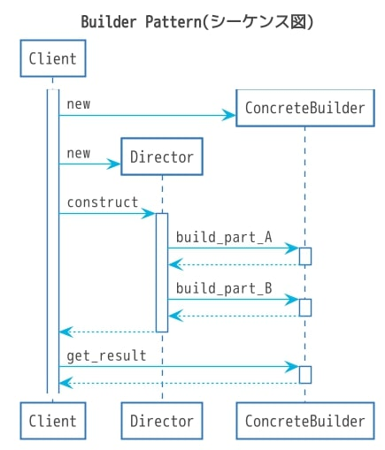

##  前書き：Builderパターンとは

Builderパターンは、GoF（Gang of Four）デザインパターンの一つであり、複雑な構造を持つインスタンス生成を容易にするための手法です。

ここでの複雑な構造とは、コンストラクタの初期化引数が多いケース（例：必須の引数2個、オプション引数5個）を考えてください。何も考えずに実装すると、「引数2個+オプション引数1個の場合のコンストラクタ」を作って、「必須引数2個+オプション引数2個の場合のコンストラクタ」を作って……と、延々と頭の悪いを実装をするハメになります。

また、コンストラクタを使用する際に、引数の順番を間違える等のコーディングミスをしてしまう可能性があります。

このようなコンストラクタの初期化引数が多いケースには、Builderパターンを適用します。Builderパターンは、リファクタリングにおける「メソッドの引き上げ（共通化している部分を別クラスに集約する）」に近く、

- InterfaceをもつBuilderクラス
- BuilderクラスのInterfaceを実装するConcreateBuilderクラス
- BuilderクラスのInterfaceでインスタンスを操作するDirectorクラス

が登場します。

必須パラメータに対してのみ設定を行うBuilderコンストラクタを呼び出し、ConcreateBuiderでオプションパラメータへの設定を行うイメージです。文字だけでは分かりづらいと思うので、本記事ではクラス図、シーケンス図、実装の順で紹介します。

## Builderパターン：クラス図



Builderパターンにおいて、正式にはClientクラスは登場しません。

BuilderクラスのInterfaceであるbuild\_XXX相当のメソッド数は、当然クラスの設計に合わせて増加・減少します。名称も、このクラス図に合わせる必要はありません。

Interfaceを実装しているConcreteBuilderは結果を返すメソッド（get\_result）を持っており、返す内容は自由です。自身（self／this）、数値、文字列でも何でも良いです。

## Builderパターン：シーケンス図



## Builderパターン：Rubyによる実装例

Rubyはinterfaceが無いので、雰囲気を伝えるための実装となります。（本当はJavaで実装するのが適切ですが、Javaをササッと書けないのでRubyにしました）

以下の実装例では、オプション引数（パラメータ）として、copyright、msgを用意しました。

ConcreteBuiderクラス相当として「HTMLを生成するHtmlBuilderクラス」「Bashスクリプトを生成するBashBuilderクラス」の二つを用意しています。HtmlBuilderクラスはcopyrightを操作し、BashBuilderクラスはmsgを操作します。

**Builder相当の実装**

```
class Builder
  attr_accessor :header, :body, :footer, :copyright, :msg
  def initialize()
    @header    = "" 
    @body      = ""
    @footer    = ""
    @copyright = ""   # オプション
    @msg       = ""   # オプション
  end

  def make_header()
    printf("") # interfaceメソッドのつもり
  end

  def make_body()
    printf("") # interfaceメソッドのつもり
  end

  def make_footer()
    printf("") # interfaceメソッドのつもり
  end
end
```

**ConcreteBuilder相当の実装**

以下の実装では、オプション引数に対してbuild()メソッドで操作しています。より多くのオプションパラメータを操作する場合は、パラメータの数だけsetterメソッドを用意した方が便利です。

```
# HTMLBuilderクラス：ConcreteBuider相当
class HtmlBuilder < Builder
  def build(copyright)
    @copyright = copyright
    return self
  end

  def make_header()
    @header =<<~_EOS_
             <!DOCTYPE html>
            <html>
            <head><title>Test Code</title></head>
            _EOS_
  end

  def make_body()
    @body = "Html Body"
  end

  def make_footer()
    @footer = "<footer><p>" + copyright + "</p></footer>"
  end

  def get_result
    puts(header)
    puts(body)
    puts(footer)
  end
end

# BashBuilderクラス：ConcreteBuider相当
class BashBuilder < Builder
  def build(msg)
    @msg = msg
    return self
  end

  def make_header()
    @header = "#!/bin/bash"
  end

  def make_body()
    @body = "echo " + msg
  end

  def make_footer()
    @footer = "exit 0"
  end

  def get_result
    puts(header)
    puts(body)
    puts(footer)
  end
end

```

**Director相当の実装**

```
class Director
  attr_accessor :builder

  def initialize(builder)
    @builder = builder
  end

  def construct()
    builder.make_header()
    builder.make_body()
    builder.make_footer()
  end
end

```

**Client相当の実装**

```
puts("HTML Builderを使用したケース")
html_dir = Director.new(HtmlBuilder.new.build('Copyright© 2020 Debimate All Rights Reserved.'))
html_dir.construct()
html_dir.builder.get_result()

puts("-----------------------------------------")
puts("Bash Builderを使用したケース")
bash_dir = Director.new(BashBuilder.new.build("Bash Body"))
bash_dir.construct()
bash_dir.builder.get_result()

```

\[the\_ad id="598"\]

## Builderパターン：実装例の実行結果 

```
HTML Builderを使用したケース
<!DOCTYPE html>
<html>
<head><title>Test Code</title></head>
<body>Html Body</body></html>
<footer>Copyright© 2020 Debimate All Rights Reserved.</footer>
-----------------------------------------
Bash Builderを使用したケース
#!/bin/bash
echo Bash Body
exit 0

```

## 他のデザインパターンに関して

GoFデザインパターン（23種類）に関しては、以下の記事でまとめてあります。

https://debimate.jp/2021/01/07/%e3%80%90%e3%82%aa%e3%83%96%e3%82%b8%e3%82%a7%e3%82%af%e3%83%88%e6%8c%87%e5%90%91%e3%80%91%e5%85%a823%e7%a8%ae%e9%a1%9e%e3%81%aegof%e3%83%87%e3%82%b6%e3%82%a4%e3%83%b3%e3%83%91%e3%82%bf%e3%83%bc/
