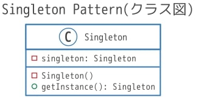

### 前書き：Singletonパターンは奥が深い

Singletonパターンは、GoF（Gang of Four）デザインパターンの一つであり、あるクラスのインスタンスが一つしかない状態を保証する方法です。「インスタンスが一つしか無い」という前提を生み出す事で、複数のインスタンスを用いる事によるバグの発生リスクを無くせます（正しく実装できていれば）。

Singletonパターンに則ったクラスである条件は、以下の３点です。

- publicのコンストラクタを持たず、privateのコンストラクタを持つ。
- private変数として、自身のクラスインスタンスを持つ。
- public関数として、自身のクラスインスタンスを返すgetterメソッドを持つ。



Singletonは作り方のシンプルさと裏腹に、使い方を誤ったケースが多いデザインパターンです。そのため、本記事では「Singletonが適さないケース」、「Singletonが適したケース」、「Singletonが適したクラス（機能）例」、「Singeltonの実装例（Ruby、Java）」を説明します。

### Singletonパターンが適さないケース

| **No.** | **適さないケース** | **理由** |
| --- | --- | --- |
| 1 | 多くの状態（filed、メンバ変数）を持つ | 状態はグローバル変数と同一なので、その数は0に近い方が良い |
| 2 | 単体テストの実行順に制約を生む場合 | 単体テストの作成および実行を困難にしてしまう |
| 3 | マルチスレッド環境に導入する場合 | Singeltonへのアクセス管理（ロック）にコストが発生してしまう |
| 4 | 常に決まった値を渡す（or 出力） | クラスメソッド（static関数）に置き換えた方が良い |

### Singletonパターンが適したケース

[IBMが定義するSingletonパターンが適したケース](https://www.ibm.com/developerworks/jp/webservices/library/co-single.html#d)は、以下の3項目を全て満たした場合です。正直、私は下記の引用説明ではピンとこなかったので、Singletonを使ったクラス例を調べました（後述しています）。

> すべてのアプリケーションは、まったく同一の方法でこのクラスを使用するか? (「まったく」がキーワード)  
> すべてのアプリケーションは、常にこのクラスの1つのインスタンスのみを必要とするか? (「常に 」と「1つの」がキーワード)  
> このクラスのクライアントは、自分自身がその一部に含まれているアプリケーションを意識しないべきか?

### Singletonパターンが適したクラス例

以下に、Singletonパターンで設計した方が良い可能性のあるクラス（機能）を示します。

- ロギング
- キャッシュ管理
- スレッドプール管理
- データベース接続ドライバ
- ソケット制御ドライバ

上記のクラス（機能）を踏まえると、リソース管理にSingletonパターンが適していると考えられます。リソースに対して複数のインスタンスが管理を行えば、状態管理で不整合が生じる可能性があります。この不整合を防止するために、Singletonを用いるのは自然な事だと思います。

### Singletonパターンの実装例（Ruby）

Singletonパターンを実装するには、[singletonモジュール](https://docs.ruby-lang.org/ja/latest/class/Singleton.html)をClassにMix-inします。singletonモジュールによって、new()メソッドはprivateメソッドとなり、Singleton化されたクラス外部からnew()をコールすれば**"private method \`new' called for SingletonClass:Class (NoMethodError)"**とエラーが発生します**。**

以下に、実装例（singleton.rb）を示します。インスタンスが生成されるタイミングは、初めてinstance()メソッドをコールした時になります。

```
#!/usr/bin/env ruby
require 'singleton'

class SingletonClass
  include Singleton    # newメソッドがprivate扱いになる
  attr_accessor :count

  def initialize
    @count = 0
  end

  def increment
    @count = count + 1
  end
end

s1 = SingletonClass.instance
puts("s1_instance カウント：" + s1.count.to_s())
puts("s1_instance カウント：" + s1.increment.to_s())
puts("s1_instance カウント：" + s1.increment.to_s())

# 新しくインスタンスを取得してもinitialize()は実行されず、
# 前の値が引き継がれている。
s2 = SingletonClass.instance
puts("s2_instance カウント：" + s2.count.to_s() + "← 前の値が引き継がれている")

# インスタンスが複製されていないことの確認
if( s1 == s2 )
  puts("s1_instanceとs2_instanceは同一です。")
end

```

実行例は、以下の通りです。

```
$ ./singleton.rb
s1_instance カウント：0
s1_instance カウント：1
s1_instance カウント：2
s2_instance カウント：2← 前の値が引き継がれている
s1_instanceとs2_instanceは同一です。

```

\[the\_ad id="598"\]

### Singletonパターンの実装例（JavaでEnumを用いた場合）

Enumを利用する理由は、Javaの言語仕様上、Enumがグローバルに唯一のインスタンスとなる事が保証されるためです。Enumは、厳密なSingletonであり、スレッドセーフかつabstractな実装もできます。最も大きなデメリットは、Java言語仕様を知らない人が見ると、不思議なコードと感じてしまう事でしょう。

を踏まえると以下、実装例（Singleton.java、main.java）です。

```
public enum Singleton {
	INSTANCE;

	private int count = -1;

	public static Singleton getInstance() {
		/* コンストラクタ相当の処理。 一度しか通らない事を想定している */
		if (INSTANCE.count == -1) {
			INSTANCE.count = 0;
		}
		return INSTANCE;
	}

	public void increment() {
		INSTANCE.count++;
	}

	public int getCount() {
		return INSTANCE.count;
	}
}

```

```
public class Main {
	public static void main(String[] args) {
		Singleton s1 = Singleton.getInstance();
		System.out.printf("s1_instance カウント：%d\n", s1.getCount());
		s1.increment();
		System.out.printf("s1_instance カウント：%d\n", s1.getCount());
		s1.increment();
		System.out.printf("s1_instance カウント：%d\n", s1.getCount());

		Singleton s2 = Singleton.getInstance();
		System.out.printf("s2_instance カウント：%d ← 前の値が引き継がれている\n", s1.getCount());

		/* インスタンスが複製されていないことの確認 */
		if (s1 == s2) {
			System.out.println("s1_instanceとs2_instanceは同一です。");
		}
	}
}

```

実行例は、以下の通りです。

```
s1_instance カウント：0
s1_instance カウント：1
s1_instance カウント：2
s2_instance カウント：2 ← 前の値が引き継がれている
s1_instanceとs2_instanceは同一です。

```

### 他のデザインパターンに関して

GoFデザインパターン（23種類）に関しては、以下の記事でまとめてあります。

- [【オブジェクト指向】全23種類のGoFデザインパターンに関する説明と参考書籍](https://debimate.jp/post/2021-01-07-%E3%82%AA%E3%83%96%E3%82%B8%E3%82%A7%E3%82%AF%E3%83%88%E6%8C%87%E5%90%91%E5%85%A823%E7%A8%AE%E9%A1%9E%E3%81%AEgof%E3%83%87%E3%82%B6%E3%82%A4%E3%83%B3%E3%83%91%E3%82%BF%E3%83%BC/)
