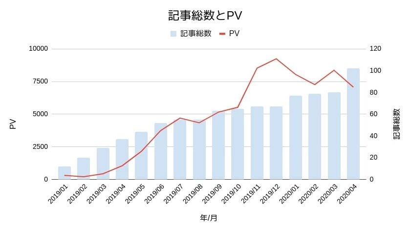
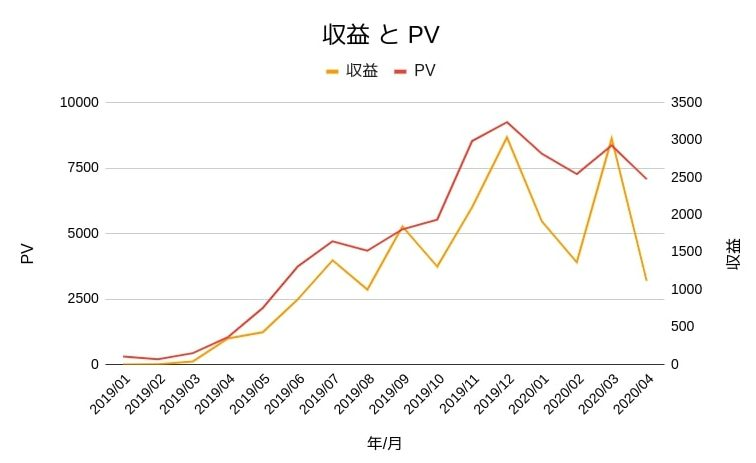
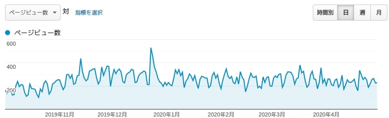

### 前書き：記事100本書けば1万PV/月？違うよ

Debimate（本サイト）は、2020年4月に記事総数が100本に達しました。

本記事では、ブロガーがよく行う収益報告と振り返りを行います。

本記事で紹介する内容

- 記事総数100本達成するまでのPV、収益
- 前回の収益報告時に決めた目標の達成度
- 技術ブログは平日に人が集まる
- 今後の進め方（Webサービスを作成）

### 記事総数100本達成するまでのPV、収益

ブログ界隈では「記事総数=100本」は一つの目安です。

そこまで記事総数があるブログは1万PV/月を超える場合や、収益が1万円を超える場合（3万/PVに達する場合）があります。※PV=Page View、閲覧数

では、**私はどうかと言えばPVも収益もガッタガタ**です。

**記事総数とPVに関する考察**

PVが低い理由は、「本サイトが人を選ぶ技術ブログである事（プログラマしか流入しない事）」かつ「集客記事の作成をしていない事」でしょう。

技術ブログで集客するには、「① 流行りのWeb技術記事」や「② 初心者向け記事」を量産する必要があります。本サイトは①、②の記事が少ないです。しかし、①や②の記事を書く企業（not 個人）がいるため、同じ領域で勝負する気が起きません。

ちなみに、記事総数の停滞期間は、2019年7月から仕事が忙しかったから（年間残業が630時間だったから）。2020年4月に記事22本を書いた理由は、新型コロナウィルスの影響でテレワークが始まり、通勤時間がなくなったからです。

収益とPVに関する考察

PVと収益は、相関があります。

「収益=PV×クリック率×単価」なので、ある程度推測もできます。アドセンスクリック単価が平均30円で、"PV - 収益"の関係はおおよそ下表の通りになると思われます。

| **PV** | **収益の目安（Google AdSenseのみ）** |
| --- | --- |
| 〜2999 | 数百円 |
| 1万 |   数千円〜1万円   |
| 3万 | 1万円〜5万円 |
| 10万 | 3万円〜10万円（10万PVならば、もっと高い金額も可能） |

### 前回の収益報告時に決めた目標の達成度

[サイト開設から6ヶ月目の記事](https://debimate.jp/post/2019-06-29-%E3%82%B5%E3%82%A4%E3%83%88%E9%96%8B%E8%A8%AD6%E3%83%B6%E6%9C%88%E7%9B%AE%E8%A8%98%E4%BA%8B%E6%95%B054%E6%9C%AC3000pv-%E6%9C%88%E5%8F%8E%E7%9B%8A800%E5%86%86-%E6%9C%88/)で「2019年12月末時点で1万PV/月の達成(収益1000円程度)」を目標としています。

PV目標は未達成ですが、収益目標は達成しています。

サイト開設から6ヶ月目に考えた施策面（以下の引用）でも、記事ジャンルコントロール以外は実施済みです。ただし、PVに効いていないので、△とした「記事の質向上」が大事なんですね。この事実は、他のブロガーさんが語っている通りしょう。

◯：Author紹介記事の作成

△：記事の質向上（検索キーワード対策、読みやすさ対策など）

◯：モバイルにおける表示速度の向上

☓：一ヶ月に作成する記事ジャンルのコントロール(内訳は記事中に記載)

（○：対応、△：もう一歩、☓：未対応）

サイトの速度面も、もう少し頑張れよ、という気もしましたが……（以下の画像は[PageSpeed Insights](https://developers.google.com/speed/pagespeed/insights/?hl=JA)の結果で、100に近い方が速い）。これ以上はWordPressテーマやプラグインを修正する必要があり、私のHTML／CSS／PHPスキルだと厳しい。悲しい。

### 技術ブログは平日に人が集まる

技術ブログに訪れる人は、「仕事の課題を解決するためにGoogle検索」して、技術ブログにたどり着きます。

残念ながら、休日にまでプログラミングして技術ブログを読み漁る人は、稀です。以下のGoogleアナリティクスの結果からも、休日におけるユーザ訪問数の少なさが読み取れます。

技術ブログの良い所はSEOに影響されない所ですが、「土日の訪問者が少ない」、「ユーザがPCに強いので広告クリックしない」等のデメリットもあり、これらを踏まえてサイト運営しないと心がやられます。

\[the\_ad id="598"\]

### 今後の進め方（Webサービスを作成）

ブログは、放置し続けても収益を生み出す資産ではない点に厳しさがあります。

まず、収益をUPさせるには、「高単価アフィリエイト"専用"の記事（書きたくない記事）」を書き、ユーザ流入を増やす集客記事も書かなければいけません。

しかし、定期的にGoogle SEOアップデートの波がやってきます。上位のGoogle検索順位を維持するためには、新しいSEOに対応した形に記事をリライトしなければなりません。

このような作業が楽しい人は、ブログで頑張ってください、という印象です。私には、上記を考えながらブログ運用するのは楽しくなさそうに見えます。

そのため、副収入を楽しく得るという観点では、私は以下を試みる予定です。

2020年12月までの試み

- Debimate（本サイト）は現状維持：本業（プログラマ）のスキル向上のため
- Webサービスを構築：収益構造を予め設計した上で、放置可能な資産とするため
- SNS運用：上記Webサービス完成後にSNSでの集客を開始

Webサービスは、技術的に容易かつ情報量の多いRuby on Railsを使用して、コスプレサイトをお試しで作る予定です。
