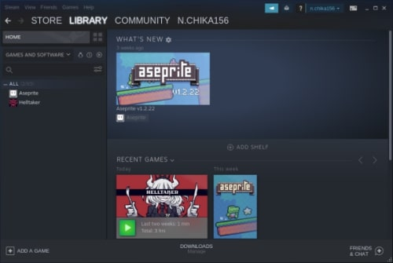

## 前書き：Steam公式はLinuxをサポート済み

Steamは、PCゲームの購入ができるプラットフォームであり、2012年からLinux環境でも動作します。[Debian公式サイトにSteamの導入方法を紹介した記事](https://wiki.debian.org/Steam)がありますが、グラフィックボードがNVIDIA環境の場合は追加手順が必要です。

本記事では、追加手順を含めて、Steamのインストール方法を紹介します。

## 検証環境

```
       _,met$$$$$gg.          nao@debian 
    ,g$$$$$$$$$$$$$$$P.       ---------- 
  ,g$$P"     """Y$$.".        OS: Debian GNU/Linux 10 (buster) x86_64 
 ,$$P'              `$$$.     Kernel: 4.19.67 
',$$P       ,ggs.     `$$b:   Uptime: 21 mins 
`d$$'     ,$P"'   .    $$$    Packages: 4320 (dpkg), 13 (flatpak) 
 $$P      d$'     ,    $$P    Shell: fish 3.0.2 
 $$:      $$.   - ,d$$'    Resolution: 2560x1080 
 $$;      Y$b._   _,d$P'      DE: Pantheon 
 Y$$.    `.`"Y$$$$P"'         WM: Mutter(Gala) 
 `$$b      "-.__              Theme: elementary [GTK3] 
  `Y$$                        Icons: Suru++20 [GTK3] 
   `Y$$.                      Terminal: io.elementary.t 
     `$$b.                    CPU: AMD Ryzen 7 3800X 8- (16) @ 3.900GHz 
       `Y$$b.                 GPU: NVIDIA NVIDIA Corporation TU107 
          `"Y$b._             Memory: 3640MiB / 64404MiB 
              `"""
```

\[the\_ad id="598"\]

## Steamパッケージのインストール前準備

この前準備では、以下の2点を行います。

1. non-freeパッケージをインストール可能な状態へ変更
2. i386（32bit）パッケージがインストール可能な状態へ変更

SteamパッケージはDebian公式リポジトリに存在しますが、non-freeパッケージ（再配布条件などに制約があるパッケージ）です。デフォルト状態のDebianでは、Steamパッケージをインストールできません。

そこで、/etc/apt/sources.listにを編集し、non-freeパッケージをインストール対象とします。

```
$ sudo vi /etc/apt/sources.list            (注釈)：vi部分は別のエディタでも大丈夫

```

```
# sources.listに以下の一行を追加。
deb http://deb.debian.org/debian/ buster main non-free contrib

```

次に、i386（32bit）パッケージをインストールできる状態にします。

前提情報ですが、Steamは32Bitライブラリに依存しています。Debianは、64Bit環境であっても[Multiarch](https://wiki.debian.org/Multiarch/HOWTO)と呼ばれる仕組みで、複数のCPUアーキテクチャ（例：32Bitと64Bitのアーキテクチャ）向けのソフトウェアをインストールできます。

Multiarchを利用する場合、以下のコマンドによって64Bit環境でi386パッケージを取得できる状態にします。

```
$ sudo dpkg --add-architecture i386
$ sudo apt update

```

以上で、前準備は終了です。

## Steamパッケージ／Vulkan Driverインストール

SteamパッケージとVulkan（グラフィックAPI）をインストールします。

```
$ sudo apt install steam
$ sudo apt install mesa-vulkan-drivers libglx-mesa0:i386 mesa-vulkan-drivers:i386 libgl1-mesa-dri:i386

```

\[the\_ad id="598"\]

## glXChooseVisual failedエラー回避用にライブラリをインストール

ここまでの手順を終えた後にSteamを起動すると、以下のエラーポップ（glXChooseVisual failedエラー）が表示される場合があります。


上記エラーを回避するため、NVIDIAのOpenGLライブラリ（グラフィックAPI）を追加でインストールします。

```
$ sudo apt install libgl1-nvidia-glvnd-glx:i386

```

なお、PCゲームをプレイする場合はNVIDIAを使う方が多いと思いますが、グラフィックボードはAMDやIntelも存在します。AMD／Intel環境の方は、glXChooseVisual failedエラーを上記の手順で解決できないため、ご注意ください。

## Steamの起動

ここまでの手順で、Steamが起動できる筈です。

ターミナルで"steam"と入力するか、デスクトップ環境のアプリケーションからSteamアイコンを探して起動しましょう。

```
$ steam

```



Debian環境で[Helltaker](https://store.steampowered.com/app/1289310/Helltaker/)と[Aseprite](https://store.steampowered.com/app/431730/Aseprite/?l=japanese)が動作する所までは、確認済みです。
