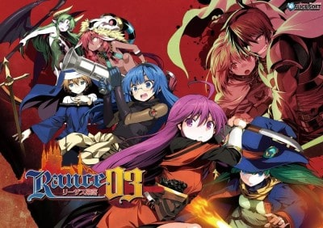
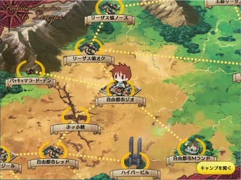
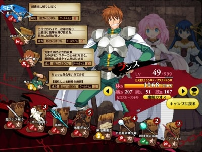
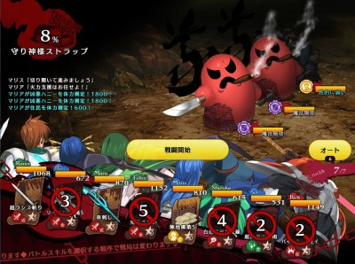

## ランス03は、ランス3のリメイク作品（24年ぶり）

ランス03（2015）は、1991年に発売されたランス3のリメイク作品です。

ランスシリーズは、02→01→03の順でリメイクされ続けており、03の段階でシステム面が一通りブラッシュアップされた印象です。絵柄を比較しただけで時代の流れを感じてしまう。

　

ランス5Dから〜Ⅹまでの原画は織音氏ですが、リメイク版01〜03は魚介氏。サブ原画時代と比較すると、絵柄が魅力的になっており、老若男女の描き分けもできる絵師なので、大満足。ちょい役のネカイ・シスとか、かなり好み（オリジナル版にいないキャラなので、弱く設定されていたのが残念）。

ランス03は、ランスシリーズで初めてキャラボイスが導入された作品であり、プレイ前は「長年培ってきた脳内音声とイメージが違ったら、どうしよう」と一抹の不安がありましたが、プレイし始めれば不安は吹っ飛びました。問題なし。ピッタリ。見当かなみの声優さん、数々の叫び声お疲れ様でした。

## シンプルな移動形式。だが、それがいい

移動のシステムはオリジナル版から変更されており、現代的な仕様かつ簡素となっています。街から街への移動は、街のアイコンを選択するだけでランスが移動し始めて、直ぐ到着します。

ソシャゲ時代は、RPGにおける探索と移動の重要度が減ったと言われますが、本作も同様な気がします。街から街への移動ではエンカウント率も低めで、ユーザーのストレスになりません。

ただ、ストーリー進行の特定タイミングでのみ登場する「幸福キャンキャン（街移動でのみエンカウントかつ低エンカ）」が、欠けスターという才能限界（レベル上限値）を上げるアイテムを確定ドロップするので、ストーリー中盤まではマップを彷徨う亡霊と化すかもしれません。

ダンジョン内の移動はカードを選択する方式で、カードに敵やアイテムが描かれているので、計画的に経路を選択できます。「簡単にマップ全てを探索できる点」や「アイテムの取りこぼしが発生しづらい点」が好ましいです。

闘神都市3やランスクエストのように、PS2レベルの3Dグラフィックで面倒な探索をするよりは、ランス03の移動形式の方が圧倒的に楽。マウスをカチカチする不便さもありますが、3D探索と比べるとストレスがない気がします。

3D化するのであれば、オープンワールドでPS4レベルのグラフィックじゃないと、私は探索に楽しみを見いだせないかも。

## 戦闘は現行のシステムでは高い完成度。ただ食傷気味

戦闘システムはランス01からの発展形であり、単純なコマンド選択式バトル（ドラクエ方式）より戦略性があります。

各キャラは4個のスキルを持っており、その中から戦闘で使用するスキルを事前登録するシステムです。戦闘で使用できるスキル数は、全キャラ合計で8個です。つまり、キャラ一人からスキル一つだけを登録したとしても、最初から戦闘に参加できるキャラは最大8名。キャラ総数は22人なのに…。

強いスキルは使用した後に数ターン使用不可状態（クールタイム）となるため、全体攻撃かつ高威力のスキルばかりで構成してしまうと、何も出来ないターンが発生します。

戦闘に参加できるキャラは戦闘前にスキルを登録したキャラのみなので、一人のキャラでスキル枠を埋めてしまうと戦闘参加人数が減り、パーティ全体の総HPが下がる事になります。さらに、スキル枠を多く埋めているキャラは、敵からボコられやすいというオマケ付き。

ランス01は類似のシステムでしたが、戦闘参加者はランスとシィルのみでした。そのため、戦略的な行為と言っても、

- 敵が高火力の攻撃をする前に殴り倒す
- 敵が防御している時に、高火力の攻撃をしない
- 敵が高火力の攻撃をする前に回復、敵の攻撃タイミングでは防御する

ぐらいしかありませんでした。

ランス03はキャラ人数が増えたので敵の行動も多彩になり、戦略性も増した印象。例えば、ザコ戦は全体攻撃持ちかつクールタイム回復を持つキャラで固める一方で、ボス戦は防御と回復が強いキャラを導入するなど、戦闘前から考える事が多いです。

ただ、「ランス03の戦闘は、絶賛するぐらい素晴らしいか」と問われると、回答はNOとなります。

2DゲームでRPGを楽しく遊ぶためには良いシステムと思いましたが、次回作も同じだと「またコレか…」と感じてしまうかも知れません。「マウスでスキルをカチカチ選択する部分（面倒）」や「オート戦闘の使いづらさ」がストレスだっただけかも知れませんが。

改善して欲しい点は、前述のオート戦闘とハッスルシステム（戦闘不能者が出たら、控えからキャラが登場するシステム）でしょうか。オート戦闘は単純に遅い。ハッスルシステムは控えキャラの選択も出来ない上にスキルも選択できないので、自由度が低く感じました。

戦闘不能者が出てた後に、意図的に弱くデザインされているイェリコが登場して、次ターンに消えていくのを見るとイラッとしてしまう（そもそも、戦闘不能者を出すのが悪いのかも知れません）。

## ストーリーは、ランスシリーズの始まりを感じさせる

ランスシリーズと言えば、「国家間のイザコザ」「魔人による人類の危機」「ランスのワガママ」がストーリーの中核にあり、ランス03はその始まりを感じさせる作品でした。世界観を知るには、丁度よい。

> ランス03は、ヘルマンがリーザスに攻め込み、パットン君そんなキャラだっけ？な展開を眺めつつ、通常の攻撃が効かない魔人の設定が初お披露目になり、ゆくまちくるまちで女の子と楽しんでから、対魔人武器のカオスと共に復活した魔王を倒す。

非常に分かりやすいランスの世界観です。

ランスのコミカルな面と魔人たちが魅せる暗い面の両方が展開されます。熱い展開（ヘルマンのトーマ戦や魔王復活など）やギャグ（ランス全般やヘルマンのチョビハゲ兄貴など）の配合割合が素晴らしい。

ランスだけ才能限界が無かったりする面もストーリーに効果的に組み込まれていますし、ランスのシィルへの不器用な愛情も垣間見れてお腹が一杯でございます、はい。

ただ、鬼畜王以降の魔人設定に合わせてストーリー改変が入っていたり、新キャラが追加されたり、オリジナル版と比較してランスが丸い性格になっている点が気になってしまう方もいるかも知れません。

でも、そのような方々はリアルタイムでランスシリーズを遊んでいた人だけじゃないでしょうか（推定年齢50歳前後）。若い人たちは気にならないと思います。

## 個人的な残念ポイント

個人的な残念ポイント（人によってはマイナスではない）

- **中盤までの欠けスター数（終盤は手に入りやすい）**
    - 少し足りなかった
    - リア、かなみ、マリア、ミリ、スー、セル、メナドの誰かが才能限界を直ぐに迎えてしまう
    - 弱めのキャラ（ユランなど）を運用できるのは終盤に限られる印象（もしくは二週目）
- **やりこみ要素（最強武器☆6の取得）が楽しくない**
    - TOWER（ダンジョン）で稀に宝箱から取得できるが、高難易度かつランダムドロップ
    - TOWERで欠けスターも手に入るため、やり込み=レベル上げ
    - やりこみの結果は、ラスボスかハニーキングにぶつけるしか無い
    - おまけイベント（会話）があれば印象が違ったかも知れない
- **好きなキャラのシーン数が少ない**
    - ミリとネカイの事（逆にかなみ多くね？これが人気か…）
    - 街にいる女性キャラとのシーンがあるのは凄いが、愛着がある主要キャラのシーンが減らされた感
    - シーン割合はアリスソフトも判断が難しいと思うので、「少なかった、残念」ぐらいのニュアンス。
- **ランス04がリリースされない（ランス03と無関係）**
    - はよ……はよ出してください。
