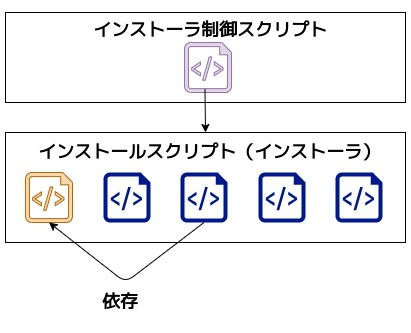
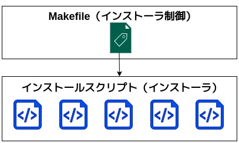

## 前書き：環境構築は面倒だから、楽をしたい

開発環境の構築は、その規模の大小に関わらず、面倒な作業です。

環境構築の面倒な部分

- 忘れてしまった環境構築手順を思い出す事
- 設定ファイルの修正（数が多いと特に面倒）
- パッケージマネージャが使えない場合、アプリの手動ビルド＆インストール
- 依存関係が自動解決できない場合、依存関係を調査
- 構築を複数回繰り返す事（自宅／会社PCへの対応あるいは環境を壊した時）

環境構築は、プログラミングをする前段階の作業ですので、ここで消耗したくありません。

そこで、本記事ではMakefileとシェルスクリプトを併用する形で、環境構築を自動化する方法を説明します（何故、Makefileを使うのかという理由も含めて説明します）。

\# 余談ですが、世の中には「何でもかんでもMakefileで解決する方法」を嫌いな人も居るので、本記事の内容をチームに展開する際は気をつけてください。

## シェルスクリプトのみのキツイ点

環境構築を自動化しようと考えた場合、多くの人がBash等でシェルスクリプトを作成すると思います。シェルスクリプトのみで環境構築を管理する場合は、インストールしたいアプリ数が増えてくると、以下の問題が見え隠れしてきます。

**インストーラを単一スクリプトにすると、スクリプトが手に追えないサイズ（負債）に変化**


前提として、複数アプリのインストーラを単一スクリプトで作成した場合、「一部のアプリのみインストール」がしづらくなります。オプションでインストール対象アプリを切り分ける事もできますが、その処理を追加する分だけスクリプトが肥大化します。

サイズが1000Stepに達する辺りで、楽をするためのスクリプトが管理しづらい負債（もしくは自分しか管理できないスクリプト）へと変わっている事に気づく筈です。Google先生が薦めるシェルスクリプトサイズは100Stepなので、その10倍もある状態はヨシッ！と言えないでしょう。

**インストーラを複数のスクリプトにすると、一括インストールがしづらく**



スクリプトの肥大化を防ぐために、アプリ単位でインストールスクリプトを作成したとしましょう。この場合、任意のアプリインストールは楽になりますが、全てのアプリを一括インストールしづらくなります。

そこで、少し考えた私は一括インストールを容易にするため、各インストーラを制御するスクリプトを作成しました。すると、どうでしょう。「インストーラ同士の依存関係を制御する処理（※1）」や「オプションによるインストーラ呼び出し処理」を書き始めた辺りで、同じ過ち（=インストーラ制御スクリプトの肥大化）を犯している事に気づきます。

※1 例えば、RubyとRuby on Railsのインストーラがあった場合、RoRより先にRubyをインストールします。RoRインストーラにRubyインストール処理を書いても良いのですが、Rubyインストーラとコードが重複するため、好ましくないです。

まとめると、シェルスクリプトのみで環境構築を行う場合、以下の点が問題になります。

シェルスクリプトのみの環境構築でキツイ点

- 単一スクリプトで複数アプリのインストーラを作成した場合、管理しづらい
- インストーラスクリプトを分割すると、一括インストールがしづらい
- インストーラスクリプト間の依存関係解決がしづらい

## 解決策：Makefileでインストーラスクリプトを制御



Makefile（makeコマンド）は、C／C++で頻繁に用いられるツールであり、コンパイル／依存関係の管理／インストールを簡単にしてくれます。

Makefileの書式は、以下の通りです。

```
# Makefileの書式
ターゲット名:依存するファイル（依存するターゲット）
	処理

```

上記の書式において、

- **ターゲット** ＝ インストールしたいアプリ名
- **依存するファイル（依存するターゲット**）＝ 依存するアプリ名
- **処理** ＝ インストーラスクリプトの呼び出し

とすれば、インストーラ間の依存関係を解決できます。また、全てのアプリをインストールする場合は、allターゲット（依存関係 = 全てのインストール対象アプリに依存）を作成すれば良いです。

以下、実装例です。

```
# allターゲットを作成する場合は、以下のように記載する。
# all: python3 neovim terminal kernel fish tmux sdkman java

#  パッケージアップグレード。ほぼ全てのターゲットに対する前処理。
apt:
	@cd installers && ./apt_upgrade

python3: apt ## Python3および関連ライブラリをインストールする。
	@cd installers && ./python3_installer

neovim: apt ## neovimおよびvim設定ファイルをインストールする。
	@cd installers && ./neovim_installer

terminal: apt neovim tmux ## CLIツールをインストールする。
	@cd installers && ./terminal_tool_installer

kernel: apt terminal ## Linux Kernel開発ツールをインストールする。
	@cd installers && ./kernel_tool_installer

fish: apt  ## fish shellおよびfisherプラグインマネージャをインストールする。
	@cd installers && ./fish_installer

tmux: apt ## tmuxおよびtmux設定ファイルをインストールする。
	@cd installers && ./tmux_installer

sdkman: apt ## SDKMAN（Java等のJVM環境設定ツール）をインストールする。
	@cd installers && ./sdkman_installer

java: apt sdkman ## JavaおよびJava関連ツール(Gradleなど)をインストールする。
	@cd installers && ./java_installer

# makeコマンド実行時に引数を指定しなかった場合はhelpを実行する。
.DEFAULT_GOAL := help
# 予約語句
.PHONY: help apt python3 neovim kernel terminal fish tmux sdkman java

help:  ## 本Makefileの使い方を表示する。
	@echo "本Makefileは、Debian(Linux)の開発環境をセットアップします。"
	@echo "セットアップしたいツールに応じて、以下のターゲットを選択してください。"
	@echo "[e.g.] $ sudo make neovim"
	@echo ""
	@grep -E '^[0-9a-zA-Z_-]+[[:blank:]]*:.*?## .*$$' $(MAKEFILE_LIST) | sort \
	| awk 'BEGIN {FS = ":.*?## "}; {printf "\033[1;32m%-15s\033[0m %s\n", $$1, $$2}'

```

基本的には、各ターゲットはinstallersディレクトリに移動した後、指定のインストーラスクリプトを実行するような作りです。依存対象がある場合は、依存しているターゲット処理を先に行います。

例えば、"$ make java"と実行した場合、apt／sdkmanターゲットの処理を行った後にjavaインストールが始まります。

また、.DEFAULT\_GOALをhelpターゲットとする事によって、makeコマンドを引数なしで実行した場合はインストール対象を促すhelpメッセージを表示します。以下、helpの出力例です。

```
$ make
本Makefileは、Debian(Linux)の開発環境をセットアップします。
セットアップしたいツールに応じて、以下のターゲットを選択してください。
[e.g.] sudo make neovim

fish            fish shellおよびfisherプラグインマネージャをインストールする。
help            本Makefileの使い方を表示する。
java            JavaおよびJava関連ツール(Gradleなど)をインストールする。
kernel          Linux Kernel開発ツールをインストールする。
neovim          neovimおよびvim設定ファイルをインストールする。
python3         Python3および関連ライブラリをインストールする。
sdkman          SDKMAN（Java等のJVM環境設定ツール）をインストールする。
terminal        CLIツールをインストールする。
tmux            tmuxおよびtmux設定ファイルをインストールする。

```

## helpターゲットの処理：Makefileの自己文書化

Makefileのhelpターゲットに書かれた処理について、どのような処理を実行しているかを不思議に感じた人が居るかも知れません。

```
help:  ## 本Makefileの使い方を表示する。
	@echo "本Makefileは、Debian(Linux)の開発環境をセットアップします。"
	@echo "セットアップしたいツールに応じて、以下のターゲットを選択してください。"
	@echo "[e.g.] $ sudo make neovim"
	@echo ""
	@grep -E '^[0-9a-zA-Z_-]+[[:blank:]]*:.*?## .*$$' $(MAKEFILE_LIST) | sort \
	| awk 'BEGIN {FS = ":.*?## "}; {printf "\033[1;32m%-15s\033[0m %s\n", $$1, $$2}'

```

上記の処理は、Makefileを自己文書化するための記述です。自己文書化=helpメッセージというニュアンスであり、[2016年にPOSTDの記事](https://postd.cc/auto-documented-makefile/)で紹介された内容を拝借しました。

自己文書化を行う処理は、最終行（grepコマンドを実行する行）です。この行は、「ターゲット名」と「ターゲットと同じ行に書かれ、かつ"##"から始まるコメント」を抽出します。そして、ターゲット名でソートを行い、色付きで抽出行を出力します。

正規表現やawk、printfに関する詳細な説明が必要な場合は、[外部サイト](https://differentialengine.wordpress.com/2016/04/04/how-self-documented-makefile-works/)に説明があります。

## 最後に

Makefileとシェルスクリプトを組み合わせて環境構築する方法は、修正箇所が少なく、汎用性も高いです。Makefileに馴染みがない方には取っ付きづらいかも知れませんが、C／C++を嗜む方には受け入れて貰える方法だと考えています。
