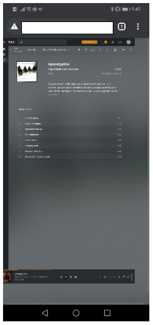
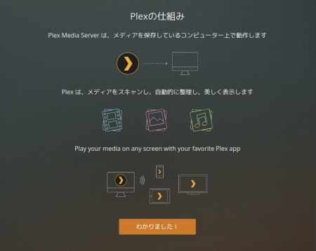

### 前書き：メディアサーバの候補はどれか

撮りためた写真や動画、購入した音楽などが増えてくると、ローカルで管理するよりもメディアサーバで管理した方が家族にも共有しやすくて便利です。

Raspbery Piをメディアサーバとして運用する事を考え、使いやすそうなアプリを探した結果、[Plex](https://www.plex.tv/ja/)、[Kodi](https://kodi.tv/)、[Emby](https://emby.media/)の3種類が候補に上がりました。


| **サーバ** | **インストール** | **リモートアクセス** | **拡張性** | **モバイルアプリ** | **ブラウザ** | **ログイン** |
| :-- | :-- | :-- | :-- | :-- | :-- | :-- |
| [Plex](https://www.plex.tv/ja/) | ◯ | ◯ | ◯ | △(実用には課金必須) | ◯ | 必要 |
| [Kodi](https://kodi.tv/) | ◎ | ◯ | ◎ | ◯ | ◯ | 不要 |
| [Emby](https://emby.media/) | △(最も面倒) | ◯ | ◯ | ◯ | ◯ | 必要 |

最終的にPlexを選択した訳ですが、必要最低限の機能は上記3種類に備わっている印象でした。では、何故KodiとEmbyを選択しなかったのかと気になる方もいらっしゃるでしょう。

そこで、本記事ではPlexの選択理由を説明した後、Plexのインストール手順を示します。

### メディアサーバの選択理由（消去法）

Kodiを選ばなかった理由

事前に断っておきますと、Kodiは悪くない選択肢です。

何と言っても拡張性が高いです。インストール形態が多いだけでなく、アドオンを導入すれば外観／インターフェース／各種ストリーミングサービス（例：YoutubeやAmzon Prime）に関するカスタマイズが可能です。非公式なアドオンを利用すれば、ポルノもアンダーグラウンドな内容が提供されています。

ただし、「Linuxにありがちなマニア向け（パワーユーザ向け）アプリ」という印象で、自由度が高い分だけ設定が煩雑で面倒です。大学生の時であれば、一生懸命カスタマイズして楽しんだのでしょうが、今の私には高機能過ぎました。機能は、ローカルファイルのストリーミングだけで充分。

あと、日本語化の設定後に文字が豆腐（"□"）に置き換わった瞬間、「あっ、使うの止めよう」と見切りをつけました。

Embyを選ばなかった理由

Embyを候補から外した理由の中で、比重を占めたのはインストール方法です。

インストール方法には、「Docker（Docker Compose）を利用した方法」か「wgetで取得したdpkgを用いる方法」がありますが、そのどちらも2020年のRaspberry Piでは面倒です。

2020年のRaspberry Piはarm 32bit / 64bitの切り替え過渡期であり、Docker／野良パッケージのインストールで失敗する確率が高い印象があります。エラー内容を読み解いて一つ一つ対応していく労力を割くほど、他と比べてEmbyが魅力的なアプリかと言われれば、そうではありません。

また、Embyは日本語の情報が少なくて、出来る事／出来ない事を調べるにも少し労力が必要でした。PlexやKodiと比較して、トラブルシューティングにも時間がかかりそうなので、有力な選択肢ではなくなりました。

Plexを選んだ理由

Plexを選んだ理由は、「インストールが容易な事」と「各種設定が楽だった事」です。

インストールではエラーが発生しませんし、Plexは一部有料アプリでもあるのでフレンドリーUIで設定が簡単です。Linuxアプリにありがちな「アプリ起動後に使い方を表示しない」なんて事もありません。

ただし、Plexにもイマイチな点もあります。

Plexのイマイチな点

- ログインが必須（Googleアカウント等でログイン可能）
- Plexモバイルアプリを用いたストリーミングが有料
- モバイルブラウザ向けに最適化されていない

PCからPlexメディアサーバにアクセスする分は不便がありませんが、モバイル端末（スマホやタブレット）からアクセスするには若干難があります。

Plexモバイルアプリは、課金しなければストリーミングが利用できない仕様です。ブラウザ経由でPlexメディアサーバにアクセスできますが、UIがモバイル向けに最適化されておらず、操作しづらい。

どのぐらい酷いかと言えば、下の画像ぐらいレイアウトが壊れていて、各種ボタンが押しづらく、ボタン押下後にStart／Stopが点滅して挙動不審になったりします。



許容できない方にはキツイかも知れませんが、私はPCをメインで使用しますし、「モバイルからもストリーミング出来ればいいや」ぐらいの考えなので、許容しています。

### Plexインストール環境

Raspberry Pi4(64bit)のメモリ2GBを使用しました。

```
       _,met$$$$$gg.          yulia@anthrax 
    ,g$$$$$$$$$$$$$$$P.       ------------- 
  ,g$$P"     """Y$$.".        OS: Debian GNU/Linux 10 (buster) aarch64 
 ,$$P'              `$$$.     Host: Raspberry Pi 4 Model B Rev 1.2 
',$$P       ,ggs.     `$$b:   Kernel: 5.4.42-v8+ 
`d$$'     ,$P"'   .    $$$    Uptime: 15 hours, 16 mins 
 $$P      d$'     ,    $$P    Packages: 1460 (dpkg) 
 $$:      $$.   - ,d$$'    Shell: bash 5.0.3 
 $$;      Y$b._   _,d$P'      Terminal: /dev/pts/0 
 Y$$.    `.`"Y$$$$P"'         CPU: (4) @ 1.500GHz 
 `$$b      "-.__              Memory: 585MiB / 1853MiB 
  `Y$$
   `Y$$.                                              
     `$$b.
       `Y$$b.
          `"Y$b._
              `"""
```

### Plexインストール手順　

Plexインストール前に、Raspberry Piにインストール済みパッケージを最新の内容に更新します。

```
$ sudo apt update
$ sudo apt upgrade

```

Plexは、Raspberry Pi（正確にはDebian）の公式リポジトリにパッケージが存在しません。そのため、Plexが提供するリポジトリからパッケージをインストールします。Plexリポジトリにアクセスするには、以下の対応が必要です。

- aptパッケージマネージャの対応プロトコルにhttpsを追加
- aptパッケージマネージャが管理する公開鍵リストにPlexリポジトリ公開鍵を追加
- aptパッケージマネージャのパッケージ取得先にPlexリポジトリ追加

```
(注釈) aptパッケージマネージャの対応プロトコルにhttpsを追加
$ sudo apt install apt-transport-https

(注釈) Plex公開鍵を追加
$ curl https://downloads.plex.tv/plex-keys/PlexSign.key | sudo apt-key add -

(注釈) パッケージ取得先にPlexリポジトリを追加
$ echo deb https://downloads.plex.tv/repo/deb public main | sudo tee /etc/apt/sources.list.d/plexmediaserver.list

(注釈) Plexリポジトリを追加したため、パッケージ一覧を更新
$ sudo apt update

```

最後にPlexメディアサーバをインストールします。

```
$ sudo apt install plexmediaserver

```

以上で、Plexメディアサーバのインストールは終了です。

### Plexメディアサーバへのアクセス

Plexメディアサーバにアクセスするには、ブラウザから

(Raspberry PiのIPアドレス):32400/web/

を指定してアクセスします。

Raspberry PiのIPアドレスは"$ hostname -I"や"$ ip a"で確認できます。Raspberry PiのIPアドレスが固定されていない（起動の度に変わってしまう）場合は、Plexメディアサーバにアクセスしづらくなるため、以下の記事を参考にIPアドレスを固定した方が好ましいです。

- [Raspberry Piに固定IPを割り当てる方法](https://debimate.jp/post/2019-03-24-raspberry-pi3%E3%82%92%E5%9B%BA%E5%AE%9Aip%E5%8C%96%E3%81%99%E3%82%8B%E6%96%B9%E6%B3%95/)

Plexメディアサーバにアクセスすると、以下の画面が表示されます。ここまでくれば、後はガイドに従ってセットアップすれば設定が完了します。



Plexメディアサーバのトップ画面に辿り着いた後、多くの人が行うと思われる設定項目へのパスは、以下の通りです。

- ライブラリ（写真や動画など）追加：\[設定\]>\[管理\]>\[ライブラリーを追加\]
- 言語の変更：\[設定\]>\[PLEX WEB\]>\[言語\]
- リモートアクセス（ポート番号など）の変更：\[設定\]>\[設定\]>\[リモートアクセス\]
- DLNA（自宅以外からのアクセス権限）の変更：\[設定\]>\[設定\]>\[DLNA\]

### Raspberry Piにファイルを送りたい場合

Raspberry PiをPlexメディアサーバ化した後、動画や画像などをRaspberry Piに追加する機会があると思います。その際に、「Raspberry PiにGUIログインして、USBメモリ経由でファイルをコピーして……」という形で作業すると面倒です。

このような場合に備えて、Raspberry Piにsamba（ファイルサーバ）を導入して、Windows／Mac／Linux／iPhone／AndroidからRaspberry Piにファイルを送れるようにした方が便利です。

以下の記事で、Raspberry Piにsambaをインストールする手順を記載しています。必要であれば、ご確認ください。

- [Raspberry Pi3をsambaファイルサーバ化し、Linux/Mac/Winでファイル共有(外付けSSDを使用)](https://debimate.jp/post/2019-03-24-raspberry-pi3%E3%82%92%E3%83%95%E3%82%A1%E3%82%A4%E3%83%AB%E3%82%B5%E3%83%BC%E3%83%90samba%E5%8C%96%E3%81%97linux-mac-win%E3%81%A7%E3%83%95%E3%82%A1%E3%82%A4%E3%83%AB%E5%85%B1%E6%9C%89/)

「Sambaで公開しているディレクトリ」と「Plexメディアサーバのライブラリディレクトリ」を一致させれば、簡単にライブラリを更新できます。
