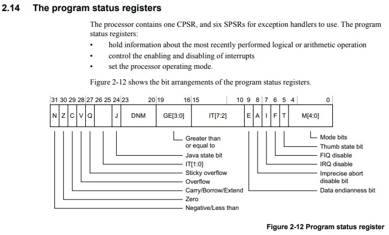

### 前書き：XINUソースコードから学ぶアセンブラ実装

本記事では、ARM Cortex-A8における

1. コンテキストスイッチ
2. 割り込み処理
3. Halt（システム停止）

に関して、XINUソースコードのアセンブラ実装を例として紹介します。

なお、[XINU (Xinu Is Not Unix )](https://ja.wikipedia.org/wiki/Xinu)とは、パデュー大学のダグラス・カマーが教育目的で開発した Real Time OS であり、ARM Cortex-A8が搭載された[BeagleBone Black（シングルボードコンピュータ）](https://www.rs-online.com/designspark/picavrno-1)上で動作します。

### ARMレジスタに関する基礎知識 

ARM Cortex-A8に関する情報は、以下の記事でまとめてあります。必要であれば、ご参照ください。

- [Cortex-A8 (ARMv7-A, e.x. BeagleBone Black）のレジスタ情報／アセンブラ命令／インラインアセンブラの書き方](https://debimate.jp/post/2020-11-21-cortex-a8-armv7-a-e-x-beaglebone-black%E3%81%AE%E3%83%AC%E3%82%B8%E3%82%B9%E3%82%BF%E6%83%85%E5%A0%B1%E3%82%A2%E3%82%BB%E3%83%B3%E3%83%96%E3%83%A9%E5%91%BD%E4%BB%A4/)

### コンテキストスイッチ

コンテキストスイッチは、プロセスが持つレジスタやスタック情報を保存／復元する操作を意味します。

コンテキストスイッチの例として、プロセスAとプロセスBを管理するOSがプロセスAからプロセスBにCPU実行権を渡す際に、プロセスAが使用していたレジスタとスタック情報を保存し、プロセスBが使用していたレジスタとスタック情報を復元するような場合があります。

コンテキストスイッチを使用しなければ、CPU実行権限を別プロセスに渡す度に、実行状態にあったプロセス（CPU実行権限を失う側）の情報が消えてしまいます。

コンテキストスイッチを行う関数ctsw()を以下に示します。C 言語からは、ctxsw(&old\_sp, &new\_sp)という形式で使用します。引数は、どちらもスタックポインタです。

- old\_sp：現在CPU実行権限を持つプロセスのカレントスタックポインタ
- new\_sp：次にCPU実行権限を持つプロセスのスタックポインタ

```
    .text
    .globl  ctxsw
ctxsw:
    push    {r0-r11, lr}    /* r0〜r11およびlrをメモリに保存する */
    push    {lr}            /* リターンアドレスを保存する        */
    mrs r2, cpsr            /* cpsrコプロセッサからステータスを取得する */
    push    {r2}            /* ステータスをメモリに保存する */
    str sp, [r0]            /* カレントプロセスのスタックポインタをメモリに保存する。*/
    ldr sp, [r1]            /* 新しいプロセスのスタックポインタをメモリから読み込む   */
    pop {r0}                /* 引数としてステータスをメモリから取得する */
    bl  restore             /* restore命令を呼び出し、リストアを行う */
    pop {lr}                /* リターンアドレスを取得する */
    pop {r0-r12}            /* 汎用レジスタをリストアする */
    mov pc, r12             /* 新しいプロセスに戻る   */
```

### 割り込み操作

XINU（Kenel）では、システムコールやデバイス操作を行う際、システムリソース状態が不正状態にならないように（複数のプロセスが同時にリソースアクセスしないように）、

1. 割り込みを禁止
2. システムコール（デバイス操作など）の実処理
3. 割り込み許可／禁止に関する状態の復元

を行います。

ハードウェアを意識しないアプリケーション開発者は、「割り込みを操作するenable()／disable()相当のメソッドを使い分ければ良いのかな」と考えてしまうかもしれません。実際には、割り込み禁止disable()の実行時に「割り込みマスクビット（cpsr）」を取得し、システムコール実処理の後に割り込み状態（cpsr）をrestore()します。

以上を踏まえて、割り込み処理の実装内容を紹介します。

割り込みの許可 

C言語からは、enable()という形式で使用します。

```
enable:
    cpsie   i       /* 割り込みを許可する */
    mov pc, lr      /* enableを呼び出す前のアドレスに戻る */

```

割り込みの禁止 

C言語からは、disable()という形式で使用します。返り値として、割り込みマスクビット（cpsr）が戻ります。

```
disable:
    mrs r0, cpsr    /* CPSRレジスタの内容をr0にコピー */
    cpsid   i       /* 割り込み禁止状態に遷移         */
    mov pc, lr      /* diableを呼び出す前のアドレスに戻る */

```

割り込みマスク値の復元 

C言語からは、restore(mask)という形式で使用します。引数maskには、割り込みマスク値（割り込み禁止 disable()などで取得していた割り込みマスク値）を指定します。

restore()のアセンブラコード中に登場する直値 0x01F00220 は、2 進数で表すと

- 0x01F00220 = 0b00000001111100000000001000100000

となります。この値は、ビット値の抽出（AND 演算）で用います。

```
restore:
    push    {r1, r2}    /* r1, r2をスタックに保存する(リストア中にr1, r2を使用するため) */
    mrs r1, cpsr　　　　/* cpsrの内容をr1をコピーする */
    ldr r2, =0x01F00220
    and r1, r1, r2      /* cpsr(r1)とr2(0x01F00220)の論理積で、関係するフラグをr1に抽出する */
    bic r0, r0, r2      /* r2を反転したBit値で、割り込みマスク値(引数)の無関係なBitをクリア */
    orr r1, r1, r0      /* cpsr(コピー)と割り込みマスク(引数)の論理和を取る */
    msr cpsr_cfsx, r1   /* 割り込みマスク適用済みのcpsrをリストア */
    pop {r1, r2}        /* r1, r2をスタックから復元する */
    mov pc, lr          /* restore()の呼び出し元に戻る */

```

[Cortex-A8テクニカルリファレンスマニュアル](https://developer.arm.com/documentation/ddi0344/k/)から、cpsrレジスタの内容を引用します。



### Halt（システム停止）

Haltでは、同じ分岐先へのジャンプを繰り返す事によって、システムを無限ループ状態（停止状態）とします。初めてみた時、「システム停止は、単なる無限ループなのか」と驚きました。

```
halt:
pause:
    cpsid   i      /* IRQ割り込みを禁止する */
dloop:  b   dloop  /* Deadループ（同じ分岐先dloopラベルへのジャンプを繰り返すため）*/

```
