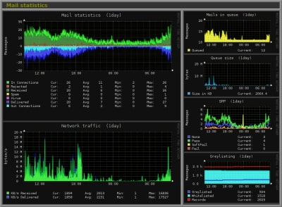
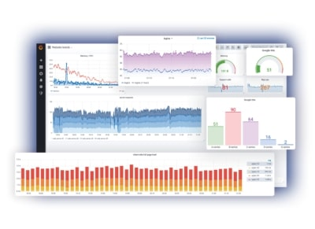
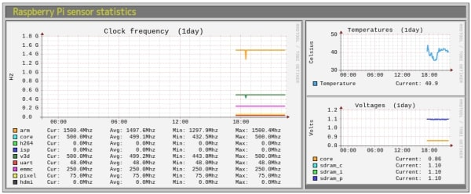

## 前書き：ラズパイサーバが停止するので監視したい

[Raspberry Pi4にPLEXマルチメディアサーバを導入](https://debimate.jp/post/2020-10-31-%E7%92%B0%E5%A2%83%E6%A7%8B%E7%AF%89raspberry-pi%E3%81%ABplex-media-server%E3%82%92%E3%82%A4%E3%83%B3%E3%82%B9%E3%83%88%E3%83%BC%E3%83%ABkodiemby%E3%81%A8%E3%81%AE/)して、約一ヶ月ほど運用した結果、2〜3日の稼働でシステム停止してしまう問題に遭遇しています。

この問題の対症療法として、[Watch Dog Timerとheartbeatを用いてシステム停止時に自動再起動を行う対応](https://debimate.jp/post/2020-11-28-watchdogtimerraspberry-pi4%E3%82%B5%E3%83%BC%E3%83%90%E3%81%8C%E3%83%95%E3%83%AA%E3%83%BC%E3%82%BA%E5%81%9C%E6%AD%A2%E3%81%97%E3%81%9F%E5%A0%B4%E5%90%88%E3%81%AB%E8%87%AA%E5%8B%95/)を実施しました。

今回はシステムが停止する原因を探るため、Raspberry Pi4にMonitorixをインストールして、システムリソースの変化をモニタリングできるようにします。そこで、本記事では「Monitorixのインストール方法」と「Raspberry Pi向けの設定」に関して説明します。

## Monitorixとは

Monitorixは、軽量なシステムリソースモニタリングツールであり、Webブラウザ経由でリソースの使用状況を表したグラフを確認できます。Perlスクリプトで実装されており、Monitorixが生成するリソース監視ログ（rrdバイナリ）をrrdtoolでグラフ化（画像化）するという仕組みのようです。

[公式サイト](https://www.monitorix.org/)に、

> Take control over your small server
> 
> "We absolutely like Monitorix for its user friendliness and lightweight. They are a must-try for those who are looking for a free and easy-to-use system monitoring tool." - Jerry [HostScore.net](https://hostscore.net/)

と書かれている通り、小規模なシステム用かつ使いやすい（分かりやすい）ツールです。

Monitorixのメリットは導入の楽さであり、デメリットはグラフの地味さ。

Monitorixはaptパッケージマネージャーでインストールできますが、他のツール（例：netdataやgrafana）はインストール方法がやや煩雑です。例えば、Dockerをインストールした後に、モニタリングする内容を選別するためにDashboardをカスタマイズする必要があります。

インストール方法の簡便さと引き換えに、Monitorixはモニタリング結果の表示画面が古臭いです。他のツールはモダンな見た目をしていますが、Monitorixは一昔前のWebサイトのような色使いをしています。THE・原色といった感じ。

以下に、サンプル画像を示します。

Monitorixの画面



[netdata](https://github.com/netdata/netdata)の画面


[grafana](https://grafana.com/)の画面



私のように「何をモニタリングすれば良いか決めていない」「監視に手間を掛けたくない」という方はMonitorixを選択し、「いやいや、見た目大事っしょ」という方は他のツールを選択すれば良いと思います。

## 検証環境

Raspberry Pi4（RAM8GB）、Raspberry Pi OS環境で検証します。

```
       _,met$$$$$gg.          lemmy@motorhead 
    ,g$$$$$$$$$$$$$$$P.       --------------- 
  ,g$$P"     """Y$$.".        OS: Debian GNU/Linux 10 (buster) aarch64 
 ,$$P'              `$$$.     Host: Raspberry Pi 4 Model B Rev 1.4 
',$$P       ,ggs.     `$$b:   Kernel: 5.4.72-v8+ 
`d$$'     ,$P"'   .    $$$    Uptime: 4 hours, 8 mins 
 $$P      d$'     ,    $$P    Packages: 1472 (dpkg) 
 $$:      $$.   - ,d$$'    Shell: bash 5.0.3 
 $$;      Y$b._   _,d$P'      Terminal: /dev/pts/1 
 Y$$.    `.`"Y$$$$P"'         CPU: (4) @ 1.500GHz 
 `$$b      "-.__              Memory: 494MiB / 7814MiB 
  `Y$$
   `Y$$.                                              
     `$$b.
       `Y$$b.
          `"Y$b._
```

## Monitorixのインストール

2020年11月現在、aptパッケージマネージャーでmonitorix-3.10.1がインストールできます。

```
$ sudo apt install monitorix

```

## Raspberry Piの固定IP化

Monitorixのモニタリング結果は、IPアドレス指定で確認する事になるため、DHCPで動的にIPアドレスが変わると運用しづらいです。そのため、以下の記事を参考にしてRaspberry Pi4を固定IP化します。

- [Raspberry Piに固定IPを割り当てる方法](https://debimate.jp/post/2019-03-24-raspberry-pi3%E3%82%92%E5%9B%BA%E5%AE%9Aip%E5%8C%96%E3%81%99%E3%82%8B%E6%96%B9%E6%B3%95/)

## Raspberry Pi4 CPU／温度／電圧モニタリング有効化

Monitorixの設定ファイル/etc/monitorix/monitorix.confを編集して、Raspberry Pi4のCPU使用率、温度、電圧のモニタリング（センサ情報のモニタリング）を無効から有効に変更します。

まずは、Raspberry Piセンサログ情報のグラフ化フラグをYes（有効）に変更します。

```
(注釈) vim以外のエディタを使用しても問題ありません。
$ sudo vim /etc/monitorix/monitorix.conf

(注釈)以下、/etc/monitorix/monitorix.confに設定する内容
<graph_enable>
： ※ 省略
	icecast		= n
	raspberrypi	= y     ※ nからyに変更
	phpapc		= n
： ※ 省略
</graph_enable>

```

次に、バグ対応を実施します。MonitorixはvcgencmdコマンドでRaspberry Pi4のセンサ情報を取得していますが、vcgencmdコマンドのインストールPATHを間違えています。間違えた状態では、グラフが作成できません。

以下、修正手順です。

```
(注釈)vcgencmdコマンドの正しいインストールPATHを確認
$ which vcgencmd
/usr/bin/vcgencmd

$ sudo vim /etc/monitorix/monitorix.conf

(注釈) 以下、/etc/monitorix/monitorix.confの内容
--------------------(修正前 ↓)-----------------------------
<raspberrypi>
	cmd = /opt/vc/bin/vcgencmd
	clocks = arm, core, h264, isp, v3d, uart, emmc, pixel, hdmi
	volts = core, sdram_c, sdram_i, sdram_p
	rigid = 0, 0, 0
	limit = 100, 100, 100
</raspberrypi>
--------------------(修正前 ↑)-----------------------------

--------------------(修正後 ↓)-----------------------------
<raspberrypi>
	cmd =/usr/bin/vcgencmd                     ※ ここのPATHを変更
	clocks = arm, core, h264, isp, v3d, uart, emmc, pixel, hdmi
	volts = core, sdram_c, sdram_i, sdram_p
	rigid = 0, 0, 0
	limit = 100, 100, 100
</raspberrypi>
--------------------(修正後 ↑)-----------------------------

```

## monitorix.confの修正頻度が高そうなパラメータ

下表に、Monitorix設定ファイル/etc/monitorix/monitorix.confのパラメータの中から、修正する可能性が高そうなものをピックアップして紹介します。下表に登場しないパラメータは、[公式ドキュメント](https://www.monitorix.org/documentation.html)で確認してください。

| **パラメータ名** | **役割** |
| --- | --- |
| title | Webブラウザでモニタリング結果確認時、Webブラウザのタブに表示されるタイトル |
| hostname | サーバのhostname |
| theme\_color | モニタリング結果を白背景(white)で表示するか、黒背景(black)で表示するか |
| refresh\_rate | Webブラウザに表示するモニタリング結果のリフレッシュレート（\[s\]単位）   リフレッシュ間隔を早めると、画面がカクついた印象を受ける |
| max\_historic\_years | モニタリング結果の保存期間（年単位、上限値なし）   調子に乗って50年と設定したらメモリの半分を食い尽くしたので注意 |
| port(httpd\_builtin) | モニタリング結果を表示する際に使用するポート番号（デフォルト8080番） |

ポート番号に関しては、既に8080番を他のサービスが使用している場合、別の値に変更が必要です。

## モニタリング結果の確認

Monitorixの設定変更を行ったため、まずはsystemdを用いてMonitorixを再起動します。デフォルトでMonitorixは有効化されていると思いますが、有効化（enable）してから再起動（restart）します。

```
$ sudo systemctl enable monitorix
$ sudo systemctl restart monitorix

```

次に、Webブラウザに"http://(ラズベリーパイのIPアドレス):8080/index.html"を入力して、モニタリング結果画面を確認します。ポート番号の設定を変更している場合は、8080の部分を適宜変更してください。

Monitorixが正しく動作している場合は、以下の画面がWebブラウザに表示されます。


Dailyのモニタリング結果（一部）は、以下のように表示されます。下図は抜粋であり、実際にはファイルシステム使用率やネットワーク統計情報なども出力されています。


Raspberry Pi4のCPU使用率、温度、電圧のモニタリング結果は、以下の通りです。大きいファンを使用、かつ全く負荷がかかっていない環境のため、温度が40℃ぐらいしかありません（下図の右上）。


