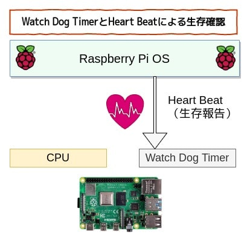

## 前書き：ラズパイサーバがよく止まる

ラズパイに[PLEXマルチメディアサーバ](https://debimate.jp/post/2020-10-31-%E7%92%B0%E5%A2%83%E6%A7%8B%E7%AF%89raspberry-pi%E3%81%ABplex-media-server%E3%82%92%E3%82%A4%E3%83%B3%E3%82%B9%E3%83%88%E3%83%BC%E3%83%ABkodiemby%E3%81%A8%E3%81%AE/)を導入して、約一ヶ月ほど運用した結果、2〜3日の稼働でシステム停止してしまう問題に遭遇しています。半日で停止する事もありました。

<blockquote class="twitter-tweet"><p dir="ltr" lang="ja">Plexメディアサーバー用に、<br>・ラズパイ4（8GB）<br>・HDD 1TB<br>・SSD 128GB（Boot用）<br>・microSDは無し<br>の環境を作成中。<br><br>このケースはmicroSDカード差込口を逆方向まで持ってくる基板が付いてきたけど、それを経由するとmicroSDの読み込みでエラーが頻出する。<br>なのでSSDブートに切り替え中。 <a href="https://t.co/uvqZR5Gz0s">pic.twitter.com/uvqZR5Gz0s</a></p>— Nao03 (@ARC_AED) <a href="https://twitter.com/ARC_AED/status/1324705933365305344?ref_src=twsrc%5Etfw">November 6, 2020</a></blockquote>

<script async src="https://platform.twitter.com/widgets.js" charset="utf-8"></script>

<blockquote class="twitter-tweet"><p dir="ltr" lang="ja">ラズパイサーバ、そんなに負荷が無いのに1日あたり2回ダンマリ状態になったので（落ちたので）、モニタリングしないと駄目かなー。<br><br>落ちる前に悲鳴を上げてくれれば原因が分かりやすいけど、ダンマリされると/var/logを漁らなきゃ原因調査できない。</p>— Nao03 (@ARC_AED) <a href="https://twitter.com/ARC_AED/status/1325058658783227907?ref_src=twsrc%5Etfw">November 7, 2020</a></blockquote>

原因調査を試みましたが、本業がインフラ屋ではないため（言い訳）、残念ながら原因特定できませんでした。

そこで代替案として、Watch Dog TimerとHeartbeatを利用して、ラズパイサーバ停止時に自動再起動するように設定変更しました。本記事では、その設定変更方法について説明します。

## 本記事の実施内容（+ WDT／Heartbeat説明）



Watch Dog Timer（以下、WDT）は、プログラムが異常動作していないかを監視するハードウェアです。システム起動時からカウンタを動かし、信号を受け取るとカウンタクリアします。

Heartbeatはシステムが正常に動作している事を一定周期で知らせる信号であり、WDTはHeartbeat信号を受信するとカウンタをクリアします。

Raspberry Pi 4サーバが何らかの異常で停止した場合、Heartbeat信号をWDTに送信できなくなります。WDTは、任意の時間（例：5\[s\]）でカウンタリセットできなかった場合、WDT割り込みを発生させて任意の動作を行います。

下図のように、本記事で紹介する設定では、WDT割り込み時はCPUにリセット命令を出します。


以上を踏まえ、本記事では以下の対応を行います。

本記事での対応内容

- WDTの有効化
- Heartbeat待ち時間の設定
- Heartbeat間隔の設定

## 検証環境

Raspberry Pi4（RAM8GB）、Raspberry Pi OS環境で検証します。

```
       _,met$$$$$gg.          lemmy@motorhead 
    ,g$$$$$$$$$$$$$$$P.       --------------- 
  ,g$$P"     """Y$$.".        OS: Debian GNU/Linux 10 (buster) aarch64 
 ,$$P'              `$$$.     Host: Raspberry Pi 4 Model B Rev 1.4 
',$$P       ,ggs.     `$$b:   Kernel: 5.4.72-v8+ 
`d$$'     ,$P"'   .    $$$    Uptime: 2 hours, 17 mins 
 $$P      d$'     ,    $$P    Packages: 1424 (dpkg) 
 $$:      $$.   - ,d$$'    Shell: bash 5.0.3 
 $$;      Y$b._   _,d$P'      Terminal: /dev/pts/0 
 Y$$.    `.`"Y$$$$P"'         CPU: (4) @ 1.500GHz 
 `$$b      "-.__              Memory: 398MiB / 7814MiB 
  `Y$$
   `Y$$.                                              
     `$$b.
       `Y$$b.
          `"Y$b._
              `"""
```

## WDTの有効化

Raspberry Piは一般的なPCと異なり、BIOSがありません（今どきのPCもBIOSが無い気もしますが）。

そのため、OS起動時に実施する処理（例：ハードウェアの有効化）の設定情報は/boot/config.txtで管理しています（[公式サイトの説明はこちら](https://www.raspberrypi.org/documentation/configuration/config-txt/)）。

WDTを有効化する場合、/boot/config.txtに以下の一行を追加します。

```
(注釈)：vim以外のエディタを使用しても問題ありません。
$ sudo vim /boot/config.txt

(注釈)：以下、/boot/config.txtに追記する設定
dtparam=watchdog=on

```

追記行のdtparamは、デバイスツリーパラメータを意味します。

プログラマ向けの解説をすると、Raspberry Piが用いるLinux Kernelでは、ハードウェア固有の情報（例：アドレス情報）がLinux Kernelソースコード中ではなく、デバイスツリーソース（.dts）と呼ばれる外部ファイルに集約されています。

デバイスツリーソースを使用するには、デバイスツリーコンパイラ（dtc）を用いてデバイスツリーブロブ（.dtb）に変換しなければいけません。ハードウェア有効／無効に関しての設定を変更する度にデバイスツリーをコンパイルする作業が発生するのは、現実的ではありません。

この面倒な作業を簡略化する方法として、Linux Kernelがデバイスツリーに関する処理（=ハードウェア初期化）を実施する際、デバイスツリーパラメータを渡せます。このパラメータによって、動的にデバイスツリー設定を変更できます。

今回の例では、デバイスツリーパラメータ（dtparam）に"watchdog=on"を渡す事によって、デバイスツリーを書き換える事なく、Raspberry Pi起動時にWDTを有効化しています。

## Heartbeat待ち時間の設定

WDTが、システムからのHeartbeatを何秒以内に受信するかを設定します。今回の例では、5秒以内とします。5秒経過しても、Heartbeatを受信できなかった場合は、リセットが実行されます。

この手順では、/etc/modprobe.d/bcm2835-wdt.confを新規作成し、Heartbeatに関する設定を追記します。

```
(注釈)：vim以外のエディタを使用しても問題ありません。
$ sudo vim /etc/modprobe.d/bcm2835-wdt.conf

(注釈)：以下、/etc/modprobe.d/bcm2835-wdt.confに追記する設定
options bcm2835_wdt heartbeat=5 nowayout=0

```

bcm2835\_wdtは、[Linux Kernelが提供するKernel Module（デバイスドライバ）](https://github.com/torvalds/linux/blob/master/drivers/watchdog/bcm2835_wdt.c)の名前です（bcm2835は、Raspberry Piが採用しているBroadcomチップの名前）

このモジュールのソースコード（以下）を確認すれば分かりますが、bcm2835\_wdtはモジュールパラメータとして"heartbeat"と"nowayout"を持っています。これらのパラメータをbcm2835-wdt.confで設定しています。

```
module_param(heartbeat, uint, 0);
MODULE_PARM_DESC(heartbeat, "Initial watchdog heartbeat in seconds");

module_param(nowayout, bool, 0);
MODULE_PARM_DESC(nowayout, "Watchdog cannot be stopped once started (default="
				__MODULE_STRING(WATCHDOG_NOWAYOUT) ")");

```

| **パラメータ** | **役割** |
| --- | --- |
| heartbeat | 秒単位の初期Watch Dog heartbeat（タイムアウトするまでの時間） |
| nowayout | 一度起動した後に、Watch Dogを停止可能かどうかのフラグ |

## Heartbeat間隔の設定

Heartbeatは、systemd（Raspberry Pi4のシステム管理デーモン）に実施させます。

systemdの設定ファイル/etc/systemd/system.confを以下のように変更し、systemdに5秒間隔でHeartbeatを実施させます。WDT側の待ち時間が5秒であるため、実際はもっと早い間隔でHeartbeatした方が好ましいです。

```
(注釈)：vim以外のエディタを使用しても問題ありません。
$ sudo vim /etc/systemd/system.conf

(注釈)：以下、/etc/systemd/system.confの修正箇所
RuntimeWatchdogSec=5

```

## 再起動

新しい設定を反映させるために再起動します。

```
$ sudo reboot

```

## 動作確認

まずは、ウォッチドッグタイマ有効化の確認を行います。dmesgコマンドで起動時ログを確認し、"bcm2835-wdt"が見つかればWDTが有効化されています。

```
$ dmesg | grep  bcm2835-wdt
[    1.111948] bcm2835-wdt bcm2835-wdt: Broadcom BCM2835 watchdog timer

```

次に、systemdがheartbeatの設定を行っているかどうかを確認します。

```
$ dmesg | grep systemd | grep watchdog
[    3.042473] systemd[1]: Hardware watchdog 'Broadcom BCM2835 Watchdog timer', version 0
[    3.042509] systemd[1]: Set hardware watchdog to 5s.

```

最後に、システムを意図的に落として、自動再起動できるかを確認します。皆さん、フォーク爆弾（プロセスの無限複製）によるリソース枯渇でシステムを落とすようなので、私も同じように落としました（初めて試しました）。

```
$ :(){ :|:& };:
-bash: fork: retry: Resource temporarily unavailable
-bash: fork: Resource temporarily unavailable
-bash: fork: Resource temporarily unavailable
: 以下続く

```

フォーク爆弾の後で（実行から数分後）、自動で再起動すれば設定が正しく反映されています。

フォーク爆弾を実行してもsystemdがheartbeatを送り続けられる余裕がある場合、なかなかシステムが再起動しないかもしれません。

## システムを落とす別の方法

私の環境では、Raspberry Pi4がフォーク爆弾で落ちるまでに時間がかかったので、他の方法を紹介します。以下の手順では、強制的にKernelパニックを発生し、即座に再起動します。

```
(注釈) rootが存在する場合
#  echo c > /proc/sysrq-trigger
-------------------------------------------------------------------------------------

(注釈)rootが存在しない場合
$  sudo vim /proc/sysrq-trigger

(注釈) /proc/sysrq-triggerに以下を追記して保存
c

```
