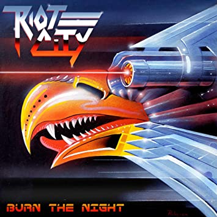
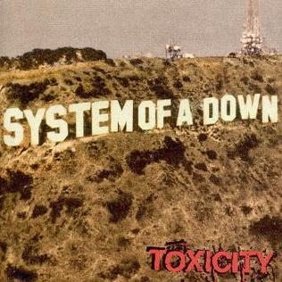
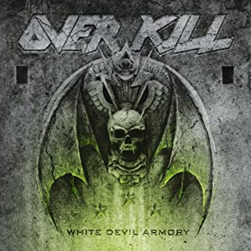
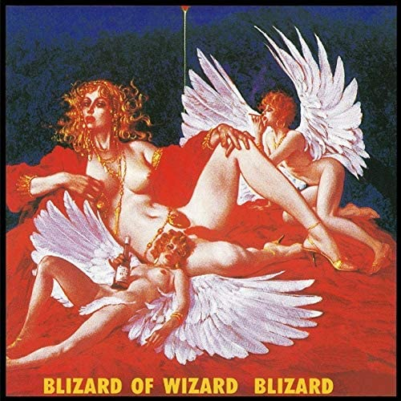

## 前書き：30歳、メタラー歴10年

10代はV系で音楽の良さに目覚め、20代はメタルに傾倒し、30歳で90年代の懐メロを楽しむようになり始めたオッサン。

本記事では、そんな私が2020年に聴いて「**いいね！**」となったバンド４組について、紹介したいと思います。あくまでも2020年に聴いたバンドであり、2020年デビューではありませんので、ご注意ください。

事前に私の好みの傾向を話しておくと、V系はL'Arc／DIR／清春／the GazettE、メタルはNWOBHM／スラッシュ／パワーメタル（クサメタル）、70年代のプログレやRanibow／Queen／Led Zeppelin辺りを聴きます。ジャズやクラシックも聴きますが、頻度は低いです。

## Riot City（2019年デビュー）

本記事で紹介するバンドの中で最も若手であり、2011年にカナダで結成、2019年にデビューアルバム（**全曲必聴！**）をリリースしたRiot City。

その音は紛れもなく正統派HR/HM。90年代のメタル衰退期、00年代に細分化された（マニアックになった）メタルシーンを経由して、2020年に原点回帰とも言える音像を見せつけてくれました。（ここでの原点とは80年代のNWOBHMを指し、「なに、メタルの始祖であるBlack Sabbathに近い音だって？」みたいなクソリプは勘弁してください）

金属的なハイトーンの質感はJudas PriestやRiotに近く、耳に心地よく残ります。適度なスピード感や曲のヘヴィネス具合が現代的な水準でありつつ、正統派らしさを強く感じさせるのはハイトーンボーカルのおかげでしょう。歌メロやギターソロも高水準。

<iframe width="560" height="315" src="https://www.youtube.com/embed/Je_f3dgxq4o" frameborder="0" allow="accelerometer; autoplay; clipboard-write; encrypted-media; gyroscope; picture-in-picture" allowfullscreen="allowfullscreen"></iframe>

## System Of A Down（1998年デビュー）

先日、[メタルバンドとして初めてYouTubeで楽曲（"Chop Suey!"）が10億回再生された](http://amass.jp/141893/)System Of A Down。メッチャクチャ有名どころにも関わらず、今までガン無視しておりました。恥ずべき所でございます、ええ、Prison Songでドハマりしました。

SOADは「メタルかどうか」と問われるほど、楽曲がポップ。

ギタリストがビートルズから影響を受けていると公言しており、楽曲も音の密度（正確にはギターの密度）がそこまで高くありません。しかし、目まぐるしく変わる展開、それを支える確かな演奏力、耳に残るツインボーカル、コンパクトにまとめられた楽曲を聴けば、正直メタルかどうかは些細な問題に感じられます。

[Metallicaのラーズ・ウルリッヒもお気に入りのアルバムとしてSOADのToxicity（毒性）を選出](http://metallica.livedoor.biz/archives/52048835.html)しており、00年代を代表するバンドと表現されても不思議でありません。

SOADは親しみやすい。メタル初心者にもオススメしたい。一緒に「_われぺちゃぱい!ぴざぴざぱ～い!_」とか「_出そうだ〜出そうだ〜_」と口ずさもう。「_じゃんぷ！ぼんごぼんごぼんごぼんごぼんごぼんごぼんご！_」、ああ中毒。

<iframe width="560" height="315" src="https://www.youtube.com/embed/5vBGOrI6yBk" frameborder="0" allow="accelerometer; autoplay; clipboard-write; encrypted-media; gyroscope; picture-in-picture" allowfullscreen="allowfullscreen"></iframe>

## Overkill（1984年デビュー）

スラッシュ・メタル界では大ベテランバンドのOverkill。BIG4（Metallica／Megadeth／Slayer／Anthrax）、Testament、Exodusと嗜んできたにも関わらず、スルーしていました！実は8年ぐらい前に"Bring Me The Night"を聴いて、その実力は知っていたものの、CD購入まで至っていませんでした。

で、YouTubeのオススメ動画で出会った"Armorist"を聴き、その高純度スラッシュメタルな音に痺れ、彼らのCDを大人買いしました。紛れもないスラッシュメタルで脳汁アドレナリンどっぱどっぱ。Mortorheadからの影響が垣間見えるのも個人的にはポイント高い。

スラッシュメタルとは言い難い作品をリリースするBIG4（Slayerを除く）と比較して、自分たちの得意分野（スラッシュ）を理解した作品を作り続けるOverkillのスタンスには、好感が持てます。別にBIG4が悪い訳ではないですが、Overkill、Testament、Exodusあたりのベテランスラッシュ勢は期待を裏切らない作品を安定リリースしてくれる貴重な存在。

新しいスラッシュメタルバンドを探すより、まずは古参バンド（Overkill）を楽しみたい。

<iframe width="560" height="315" src="https://www.youtube.com/embed/c_c3GBrWsao" frameborder="0" allow="accelerometer; autoplay; clipboard-write; encrypted-media; gyroscope; picture-in-picture" allowfullscreen="allowfullscreen"></iframe>

## BLIZARD（1984年デビュー）

本記事で紹介するバンドの中で唯一のジャパメタ、BLIZARD。

やや線の細いハイトーンボーカルですが、それが反って哀愁を感じさせ、魅力の一つとなっています。80年代でジャパメタかつハイトーンと言えばLOUDNESSを彷彿とさせますが、歌謡曲寄りのメロディラインはANTHEMと類似しているかも知れません。

私の中では、BLIZARDの楽曲は90年代J-ROCKの延長線上にあり（順序が逆ですが）、「ハードになりきれていない音」、「日本語歌詞」、「分かりやすいサビ」が胸に刺さります。80年代リアルタイム勢は、その表現だと褒めていないだろ、と感じるかも知れません。が、ここまで日本人に分かりやすいメタルはナカナカ無いですよ、と褒めているつもりです。

DEAD ENDと同様、BLIZARDはあと5年ぐらいデビューが遅ければ、もう少し一般的な知名度が高かったのではないかと思います。小野正利（Galneryus）もファンらしく、思い返せばBLIZARDのボーカルと声質が似通っていて、何となく納得してしまう。

物凄くハマった訳ではありませんが、高頻度で口ずさみましたね。

<iframe width="560" height="315" src="https://www.youtube.com/embed/_SoS9CzjF5A" frameborder="0" allow="accelerometer; autoplay; clipboard-write; encrypted-media; gyroscope; picture-in-picture" allowfullscreen="allowfullscreen"></iframe>

## 選外：陰陽座

聴けばハマりそうなんだけど、バジリスクの曲しか知らないからCD購入していません。MetallicaのBatteryに似ていると名高い悪路王が気になっていますが、YouTubeで試し聴きできない……

## そして2021年へ

https://debimate.jp/2022/01/08/%e3%80%90hr-hm%e3%80%912021%e5%b9%b4%e3%81%ab%e8%81%b4%e3%81%84%e3%81%a6%e3%83%8f%e3%83%9e%e3%81%a3%e3%81%9f%e3%82%a2%e3%83%ab%e3%83%90%e3%83%a09%e9%81%b82%e3%80%90%e3%83%97%e3%83%ad%e3%82%b0/
